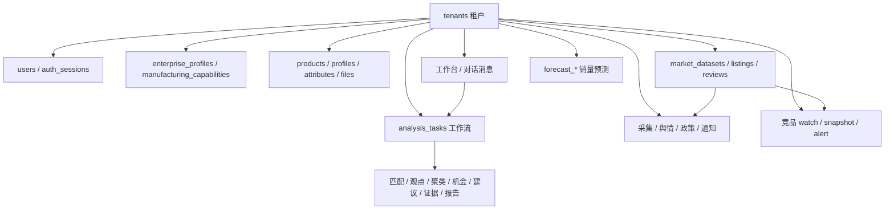
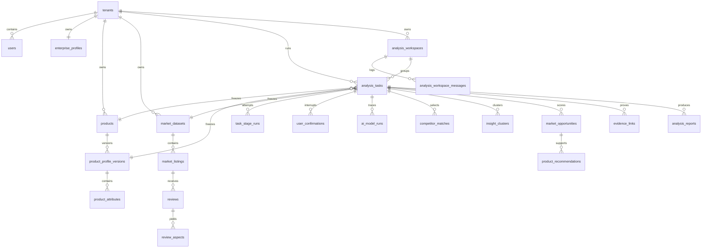
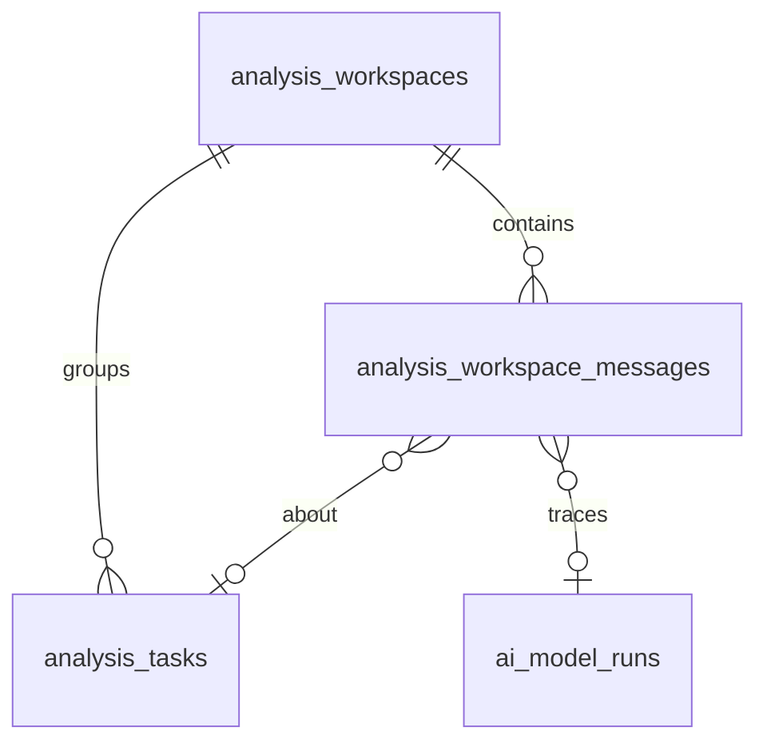

# FurniScope 数据库设计（现行）

本文描述当前仓库实际落地的数据层，不是历史 V2 规划。口径以可执行 SQL 为准；本文只解释边界、关系、存什么、以及和页面怎么对上。

| 项 | 值 |
|---|---|
| 引擎 | PostgreSQL 16+ |
| 业务 Schema | `furniscope` |
| 扩展 | `pgcrypto`（UUID） |
| 基线 DDL | `furniscope_postgresql_v3.sql` |
| 增量迁移 | `migrations/v3_*.sql` |
| 设计原稿（V3 基线） | `Docs/项目设计文档/03_FurniScope_PostgreSQL数据库设计V3.md` |
| 初始化说明 | `Docs/项目设计文档/03_FurniScope_PostgreSQL数据库初始化说明V3.md` |

Docker 空库：`docker-compose.yml` 把基线挂成 `/docker-entrypoint-initdb.d/001-schema.sql`，并把 `migrations/` 挂到同级目录，供基线末尾 `\ir` 引用。数据卷一旦建过，改 SQL **不会**自动重跑，需要新库或手工迁移。

---

## 1. 设计原则

1. **`tenants` 是隔离边界。** 业务表带 `tenant_id`，服务层查询必须注入租户；外键防止跨租户误关联。生产可再开 RLS，当前依赖应用层强制。
2. **角色只有两种。** `users.role_code` ∈ `user` / `admin`。多 Agent 是内部能力，不是权限主体。
3. **对内 BIGINT IDENTITY，对外 UUID。** API 用 `task_uuid`、`report_uuid`、`session_uuid` 等；Checkpoint 用业务字符串 `checkpoint_id`。
4. **时间一律 `TIMESTAMPTZ`。** 金额 `NUMERIC`；置信度 `NUMERIC(5,4)` 左右；可变结构用 `JSONB`，并有 `jsonb_typeof` CHECK。排序、过滤、关联字段保持普通列，不塞进大 JSON。
5. **库内存业务对象，不存危险物：**
   - 文件字节（只存 `file_assets` 元数据与对象存储 key）
   - API Key、模型密钥、Refresh Token 明文（哈希或环境变量名）
   - 预测模型权重二进制（只记 URI + checksum）
   - 模型 system prompt、整份任务结果 JSON（问询时临时拼进请求，不入库）

不属于现行核心库：Listing 生成流水、报告文件导出、多人评审、动态 RBAC、产品运营事件。这些在 V2 退役后进 `furniscope_archive`（仅 V2→V3 迁移脚本创建）。

---

## 2. 库外存储

| 组件 | 职责 |
|---|---|
| 对象存储 / `DEMO_STORAGE_ROOT` | 产品图、规格书、数据集文件；库中只有 `storage_key` |
| Redis | 分析 / 预测任务队列，不是主数据 |
| LangGraph Checkpointer | 同一套 Postgres 上的官方恢复表；与 `workflow_checkpoints` **不得互相替代** |
| 前端 localStorage（偏好） | 侧栏折叠、工作流分栏宽度、记住邮箱等 UI 状态；**不是**工作台主数据 |

---

## 3. 初始化与迁移

### 3.1 空库（Docker / `\ir`）

`furniscope_postgresql_v3.sql` 建 35 张 V3 核心表后，显式引入：

| 顺序 | 文件 | 作用 |
|---|---|---|
| 1 | `migrations/v3_forecast_integration.sql` | 销量预测 8 张表 |
| 2 | `migrations/v3_5_admin_control_center.sql` | `tenants.entitlements` |
| 3 | `migrations/v3_6_registration_applications.sql` | 公开注册申请 |
| 4 | `migrations/v3_7_authorized_market_signals.sql` | 采集源、舆情、政策 |
| 5 | `migrations/v3_8_alert_notifications.sql` | 通知通道与投递 |
| 6 | `migrations/v3_9_active_web_collection.sql` | 采集源类型扩到 Amazon/网页评论 |
| 7 | `migrations/v3_10_analysis_workspaces.sql` | 工作台容器 + 对话消息 |
| 8 | `migrations/v3_11_forecast_sku_aliases.sql` | 产品 SKU ↔ 预测训练 SKU 映射 |

空库跑完后业务表约 **54** 张（35 核心 + 8 预测 + 1 注册 + 5 信号 + 2 通知 + 2 工作台对话 + 1 预测 SKU 映射）。

### 3.2 已有库增量（需手工或运维执行）

下列文件 **不在** 基线 `\ir` 里，给升级旧库用。其中 **竞品动态三张表只在这里**：

| 文件 | 作用 |
|---|---|
| `v3_4_competitor_tracking.sql` | `competitor_watch_targets` / `competitor_listing_snapshots` / `competitor_change_alerts` |
| `v3_11_watch_compare_selected.sql` | 竞品库 `compare_selected`（应用启动时 `ensure_schema` 也会补） |
| `v3_10_analysis_workspaces.sql` | 已有库补工作台与消息表（空库已由基线 `\ir`） |
| `v3_11_forecast_sku_aliases.sql` | 产品 SKU ↔ 训练历史映射，并丢掉未映射的预测目录 SKU |
| `v3_1_tenant_forecast.sql` | 已有预测库补租户字段（与 integration 重叠，`IF NOT EXISTS`） |
| `v3_2_forecast_append.sql` | 训练任务幂等与追加训练 |
| `v3_3_enterprise_fit_v2.sql` | 企业画像快照、机会拟合置信度（基线已含同名字段） |
| `v3_3_market_dataset_preview.sql` | `reviews.reviewer_location` / `sentiment`（基线已含） |
| `v3_runtime_alignment.sql` | `products` / `market_datasets.deleted_at` 软删 |
| `v3_api_contract_alignment.sql` / `v3_analysis_task_api_alignment.sql` | V2 升级库字段对齐 |
| `v3_evidence_trigger_schema_fix.sql` | 证据 Span 触发器限定 `furniscope.reviews` |
| `v2_1_to_v3.sql` | 历史 V2.1 整库迁移 |

演示环境若已有数据卷且从未执行 `v3_4`，竞品监控接口会缺表。新功能上线前应对现网执行一次该脚本。

---

## 4. 模块关系

分析主链路实体关系：

一次分析任务**冻结**四样输入：产品当前画像版本、市场数据集、目标国家/平台、当时的企业画像 JSON 快照。跑完后结果挂在同一 `analysis_tasks.id`（结果表外键名多为 `analysis_job_id`）。

---

## 5. 表清单（按模块）

### 5.1 账号与企业

| 表 | 存什么 | 关键约束 |
|---|---|---|
| `tenants` | 企业：`tenant_code`、名称、行业、时区、默认币种、状态、保留天数、`entitlements` | `tenant_code` 唯一；状态 `trial/active/suspended/closed` |
| `users` | 登录邮箱、密码哈希、姓名、部门、职位、`role_code`、状态 | email 全局唯一且小写；角色仅 user/admin |
| `auth_sessions` | Refresh Token SHA-256、token 家族、过期、撤销 | 明文 token 不落库；哈希唯一 |
| `api_idempotency_records` | 写接口幂等：路由、Key、请求哈希、脱敏 Envelope | `(tenant, route, key)` 唯一；不含 Token/文件/评论全文 |
| `enterprise_profiles` | 业务模式、品类、出口市场、渠道、产能备注、`constraints`、完整度 | 每租户一行 |
| `manufacturing_capabilities` | 材质/工艺/认证等能力，可用性、区间、证据文件、置信度 | `(tenant, type, code)` 唯一 |
| `registration_applications` | 公开注册：企业名、联系人、邮箱、密码哈希、建议租户码、审批状态 | pending 邮箱部分唯一 |

页面：登录注册、设置里的企业画像、平台后台开通租户。

### 5.2 产品中心

| 表 | 存什么 | 关键约束 |
|---|---|---|
| `products` | 本企业 SKU、名称、品类、生命周期、分析状态、主图、当前画像版本、`deleted_at` | `(tenant, sku)` 唯一 |
| `file_assets` | 文件名、MIME、字节数、SHA256、扫描/解析状态、`storage_key` | 不存文件内容；`storage_key` 唯一 |
| `product_parse_jobs` | 规格书/图片异步解析：进度、成功失败文件数、幂等键 | `(tenant, idempotency_key)` 唯一 |
| `product_parse_job_files` | 任务-文件级结果与轻量 `output_ref` | `(job, file)` 唯一 |
| `product_profile_versions` | 不可变画像版本、完整度、冲突数、来源摘要、确认人 | `(product, version_no)` 唯一 |
| `product_attributes` | 属性码、JSONB 值、单位、来源、置信度、确认状态 | `(profile_version, attribute_code)` 唯一 |

`lifecycle_status`：`concept/sample/active/discontinued`。  
`analysis_status`：`draft/profile_pending/ready/archived`。  
属性来源：`confirmed_structured/user_input/document/image/inferred`。

### 5.3 市场数据集（分析原料）

| 表 | 存什么 | 关键约束 |
|---|---|---|
| `market_datasets` | 一套获授权数据：平台、国家、品类、时间范围、来源类型、字段映射、质量分、listing/评论计数、`deleted_at` | `(tenant, name, version_no)` 唯一 |
| `market_listings` | 商品快照：平台 listing ID、标题、价格、评分、卖点、图片 URL、`normalized_attributes` | `(dataset, platform_listing_id, captured_at)` 唯一 |
| `reviews` | 评论原文（不可被翻译覆盖）、译文、评分、地点、情感、有效性、`content_hash` | 平台评论 ID 与内容哈希在 dataset 内唯一 |

`source_type`：`enterprise_export/licensed_provider/public_authorized`。库约束仍保留历史值 `demo_synthetic`，产品路径不再写入。HeFeng 现网市场包按企业授权数据处理；listing 的 `platform_listing_id`（如 `SYN-HF-*`）是授权数据包内的商品键，**不是**「这是合成演示」的含义。本企业 SKU 在 `products.sku`。

### 5.4 AI 工作台、工作日记、决策报告

三层对象不要混：

| 对象 | 粒度 | 库表 |
|---|---|---|
| 工作台（对话容器） | 同一产品/目标下的长期会话 | `analysis_workspaces` |
| 对话记录 | 工作台里按序的每一轮话 | `analysis_workspace_messages` |
| 一次分析运行 | 冻结输入后跑完的工作流 | `analysis_tasks` |
| 工作日记一行 | 展示用聚合，不是表 | 按 `workspace_uuid` 合并任务；打开工作台再拉消息 |

工作日记**不存对话正文**，只列工作台/任务摘要。对话属于工作台，一次运行可以在对话里被启动或被追问，但消息不跟着单次 `analysis_tasks` 复制一份。

#### 5.4.1 现行实现

工作台与对话走 PostgreSQL：`analysis_workspaces` / `analysis_workspace_messages`。API：

| 方法 | 路径 | 作用 |
|---|---|---|
| `POST` | `/api/v1/analysis-workspaces` | 按 `(tenant, workspace_uuid)` 创建或更新工作台 |
| `GET` | `/api/v1/analysis-workspaces` | 工作日记 / 工作台列表（含最近任务摘要与分析次数） |
| `GET` | `/api/v1/analysis-workspaces/{uuid}/messages` | 按 `seq_no` 拉对话 |
| `POST` | `/api/v1/analysis-workspaces/{uuid}/messages` | 追加一轮；`client_message_id` 幂等 |
| `POST` | `/api/v1/analysis-workspaces/{uuid}:archive` | 工作台 `archived`，并按原规则归档其任务/报告 |

同一产品、同一来源只保留一个 `active` 工作台：每次「运行」写入一条 `analysis_tasks`，对话继续追加到同一 `analysis_workspace_messages`。未点运行的草稿只留在浏览器，不落库；点运行时若该产品已有工作台，任务挂到已有 UUID，不新开列表行。浏览器 `furniscope-plane-chats-v2` / `furniscope-plane-workspaces` 只作离线缓存，换机器以库为准。

`POST /api/v1/analysis-tasks/{task_uuid}/chat`（API-INS-07）仍只当场拼上下文返回答案；前端把可见问答再写入 `analysis_workspace_messages`（`message_kind=task_chat`）。

仍留在 localStorage、**不入库**的只有 UI 偏好：分栏宽度、侧栏折叠、登录邮箱、未接入路由的向导草稿。

#### 5.4.2 库表设计（`v3_10`）

关联约定：`analysis_tasks.analysis_config.workspace_uuid` = `analysis_workspaces.workspace_uuid`。任务表暂不改为物理外键，避免历史行没有 workspace 时无法插入；新运行必须写入该键。

| 表 | 存什么 | 关键约束 |
|---|---|---|
| `analysis_workspaces` | 工作台 UUID、名称、来源、状态、最近绑定产品/任务、创建人 | `(tenant, workspace_uuid)` 唯一；`active/archived` |
| `analysis_workspace_messages` | 一轮对话：角色、类型、正文、序号、可选任务/模型运行、证据引用 | `(workspace, seq_no)` 唯一；正文 1–20000 字 |

`role`：`user` / `assistant` / `system`（仅持久化用户可见的系统提示，例如工作台开场白；**禁止**把带完整任务 JSON 的模型 system prompt 写入 `content`）。

`message_kind`：

| 值 | 含义 | 前端来源 |
|---|---|---|
| `greeting` | 工作台开场白 | `planeGreeting` |
| `text` | 普通用户输入或助手说明 | 输入框、载入产品确认 |
| `run_event` | 启动/完成一次分析的状态句 | 「已运行至某节点」 |
| `task_chat` | 基于已完成任务的证据问询 | API-INS-07 的 `answer` |
| `error` | 失败提示 | 接口错误文案 |

`evidence_refs`：问询接口返回的记录 ID 数组，便于回点节点证据。  
`metadata`：对象，只放轻量字段（如目标节点码、`execution_target`），禁止塞 `result` 全量投影。  
`client_message_id`：租户内唯一，用于前端重试去重。  
`analysis_task_id`：本轮启动的运行，或问询所针对的运行；开场白为空。

删除工作日记：把 `analysis_workspaces.status` 置为 `archived`（保留消息便于审计）。任务与报告仍按原规则 `cancelled` / `superseded`。仅在租户要求彻底清除时再 `DELETE` 工作台行，消息才因 `ON DELETE CASCADE` 物理删除。

应用层：列表与对话按工作台 UUID 读写；消息按 `seq_no` 增量追加，不要每轮整表覆盖。`client_message_id` 用于前端重试去重。

#### 5.4.3 分析运行与报告（已有表）

| 表 | 存什么 | 关键约束 |
|---|---|---|
| `analysis_tasks` | 任务 UUID、名称、类型、冻结的产品/画像/数据集、目标市场、内外阶段、进度、`analysis_config`、企业快照、版本束、幂等键 | `(tenant, idempotency_key)` 唯一 |
| `task_stage_runs` | 内部节点每一次尝试的输入/输出引用 | `(task, stage, attempt)` 唯一 |
| `workflow_checkpoints` | 业务安全投影：轻量 ID/版本/哈希，不含评论全文 | `(task, checkpoint_version)` 唯一 |
| `workflow_partial_failures` | 部分失败单元、影响、是否可重试 | 打开状态可查 |
| `user_confirmations` | 事实冲突/样本不足/低置信/高风险：选项、证据、回答 | 每任务最多一条 pending |
| `workflow_control_events` | 恢复 / 自动重试 / 安全停止 outbox | 租户内幂等唯一 |
| `ai_model_runs` | 实际模型、Prompt 版本、输入哈希、token、时延、成本、Schema 是否通过 | 无密钥 |
| `competitor_matches` | 本次分析选出的可比 listing 及六维分数 | `(task, listing, set_version)` 唯一 |
| `review_aspects` | 评论抽取的方面、情感、原文 Span、模型运行 | Span 必须等于 `reviews.content_original` 子串（触发器） |
| `insight_clusters` / `cluster_members` | 需求聚类及成员 | task+cluster_code 唯一 |
| `market_metrics` / `price_bands` | 确定性市场指标与价格带 | 价格带 `(task, band_code)` 唯一 |
| `market_opportunities` | 机会描述与六维分、企业拟合、建议等级 | `(task, opportunity_code)` 唯一 |
| `product_recommendations` | 改款/定位等工程建议 | 必须挂机会与证据聚类 |
| `evidence_links` | 结论 ↔ 证据多态引用 | 同任务 claim+evidence 唯一 |
| `analysis_reports` | 在线报告：摘要、决策、总分、范围/产品/企业快照、`sections` | `(task, report_version)` 唯一；在线查看，无导出工作流 |
| `audit_logs` | 动作、对象、脱敏前后快照、request_id | 禁止完整评论与密钥 |

用户可见五阶段（`external_stage`）：

`understanding_product` → `researching_market` → `evaluating_opportunity` → `generating_recommendation` → `completed`

`internal_stage` 才是 LangGraph 细节点（产品解析、竞品过滤、评论抽取、评分、出报告等）。  
任务状态：`draft/queued/running/waiting_human/partial_succeeded/succeeded/failed/cancelled`。  
`analysis_config` 常用键：`source`（如 `node_workflow_canvas`）、`workspace_uuid`（指向 `analysis_workspaces`）。

`competitor_type`：`direct/benchmark/substitute/excluded`。  
机会 `recommendation_level`：`prioritize_validate/collect_more_data/capability_gap/limited_opportunity`。

### 5.5 市场洞察（采集、舆情、政策、通知）

| 表 | 存什么 |
|---|---|
| `authorized_collect_sources` | 采集源 URL、类型、平台、国家、品类、调度分钟、是否启用、授权说明、`auth_token_env` |
| `authorized_collect_runs` | 单次拉取：抓取/插入/告警条数、错误摘要 |
| `sentiment_events` | 舆情原文、正负中、评分、ASIN、内容哈希 |
| `policy_sources` / `policy_alerts` | 官方 RSS/JSON 源与命中预警 |
| `notification_channels` / `notification_events` | Webhook/钉钉等通道与投递状态 |

采集 `source_kind`：`authorized_market_json`、`authorized_review_stream`、`amazon_product_page`、`amazon_review_page`、`web_review_page`。  
密钥只记环境变量名，不进单元格。

### 5.6 竞品动态（`v3_4`）

| 表 | 存什么 |
|---|---|
| `competitor_watch_targets` | 租户竞品库：外部 ASIN（平台+国家+ASIN 唯一），`compare_selected` 表示当前是否参与对比 |
| `competitor_listing_snapshots` | 每次价格、评分、标题、促销、指纹、原始 payload |
| `competitor_change_alerts` | 变价/改标题等，含前后 JSON、是否已读 |

监控对象应是**外部市场商品**，不应把本企业 `products.sku`（如 `SYN-HF-*`）写成 watch。应用层会识别并拒绝/归档。

竞品库与市场数据集是两层：`market_listings` 是导入的原料目录；只有加入 `competitor_watch_targets` 的条目才出现在「竞品库」。勾选对比写 `compare_selected`，从列表删除则把 watch 置为 `archived`。

### 5.7 销量预测

| 表 | 存什么 |
|---|---|
| `forecast_models` | 模型编码、版本、引擎、`state_uri`、checksum、指标、共享或租户私有 |
| `tenant_data_sources` | 销售历史等源：类型、连接方式、`secret_ref`、授权说明、安全配置 JSON |
| `tenant_sku_catalog` | 预测用 SKU×站点：只保留已映射到当前产品中心的 SKU，`attributes.source_sku` 指向训练历史 |
| `forecast_sku_aliases` | 产品 SKU → 训练历史 SKU；引擎里多出来的 SKU 不入库 |
| `forecast_model_deployments` | 租户场景（如 `sales_forecast`）当前启用模型 |
| `forecast_training_runs` | 追加训练任务、指标、产物模型 |
| `forecast_jobs` | 一次预测请求：粒度日/周、horizon、SKU 列表、站点、幂等 |
| `forecast_runs` | 该 job 的一次执行 |
| `forecast_results` | SKU×站点×时间桶的预测值与 A–D 可靠性 |

模型文件在磁盘/对象存储，库只做版本账本。

### 5.8 平台配置

| 表 | 存什么 |
|---|---|
| `prompt_templates` | 版本化 Prompt 与输出 Schema；状态 draft/testing/active/retired |
| `model_route_configs` | 任务类型主备模型、超时、重试、并发、`compute_config`；同一 `task_type` 仅一条 active |

`ai_model_runs.task_type`：`vision_extract/text_extract/translate/embed/rerank/reason/report`。

---

## 6. JSONB 契约（常用）

| 字段 | 形态 | 条目要点 |
|---|---|---|
| `tenants.entitlements` | array | 产品能力码，如 `sales_forecast` |
| `enterprise_profiles.constraints` | array | constraint_type / operator / value / hardness / sensitivity_level |
| `market_datasets.field_mapping` | array | source_field / target_entity / target_field / mapping_status |
| `market_listings.normalized_attributes` | object，属性码为 key | value / unit / source_locator / confidence |
| `analysis_tasks.analysis_config` | object | `source`、`workspace_uuid` 等 |
| `analysis_workspace_messages.evidence_refs` | array | 问询引用的结果记录 ID |
| `analysis_workspace_messages.metadata` | object | 节点码等轻量上下文，禁止任务结果全量 JSON |
| `analysis_tasks.enterprise_profile_snapshot` | object | 创建任务时的企业画像 + 能力列表 |
| `model_route_configs.compute_config` | object | quota_unit / quota_total / warning_threshold / hard_limit |
| `market_opportunities.manufacturing_fit` | array | requirement / capability / fit_status / fit_score / evidence_refs |
| `analysis_reports.sections` | 非空 array | section_code / title / sort_order / content |

---

## 7. 一致性与安全

- **证据 Span：** 触发器保证 `review_aspects.evidence_quote` = `reviews.content_original[start:end]`；原文不被译文或模型输出覆盖。
- **幂等：** 分析任务、解析任务、阶段运行、确认、控制事件、预测 job/训练 各有租户级幂等键。
- **恢复：** 确认只能挂 `is_safe_resume=true` 的业务 Checkpoint；回答写入 `workflow_control_events`，由 Worker/Supervisor 投递 resume。
- **部分失败：** 不整任务回滚；报告必须降置信度并写入 `partial_failures_snapshot`。
- **模型追溯：** 每次调用记模型 ID、Prompt 版本、输入哈希、token、成本、重试、Schema。
- **软删：** `products.deleted_at`、`market_datasets.deleted_at`；列表默认排除。
- **工作台对话：** 消息挂 `analysis_workspaces`，不按单次任务复制；问询上下文在请求期组装，不把 system 大包写入消息表。
- **归档工作日记：** 报告 `status=superseded` 且无 draft 报告时，任务列表不再展示；工作台 `status=archived`。

---

## 8. 页面 ↔ 存储

| 页面 | 主要表 |
|---|---|
| 登录 / 注册 | `users`、`auth_sessions`、`registration_applications` |
| 首页任务列表 | `analysis_tasks` + 当前 draft `analysis_reports` |
| AI 工作台 / 工作日记 | `analysis_workspaces` + `analysis_workspace_messages`；运行摘要来自按 `workspace_uuid` 合并的 `analysis_tasks` |
| 决策报告 | `analysis_reports` + 机会 / 建议 / `evidence_links` |
| 产品中心 | `products`、画像版本、属性、`file_assets` |
| 市场数据中心 | `market_datasets` → `market_listings` / `reviews` |
| 竞品动态 | `v3_4` 三张表；匹配时读 `market_listings`，排除本企业 `products` |
| 主动采集 / 评论舆情 | `authorized_collect_*`、`sentiment_events` |
| 政策预警 | `policy_sources`、`policy_alerts` |
| 通知 | `notification_*` |
| 销量预测 | `forecast_*`、`tenant_sku_catalog` |
| 设置 / 管理后台 | 企业画像、能力、`prompt_templates`、`model_route_configs`、`tenants.entitlements` |

---

## 9. 与 V3 设计文档的差异

`Docs/项目设计文档/03_FurniScope_PostgreSQL数据库设计V3.md` 记录 2026-08-09 基线（35 表）。现行系统在其上叠加了预测、注册、市场信号、通知，以及需单独执行的竞品监控。字段以仓库 SQL 为准，不以该文档的 35 表统计为上限。

V2.1 合并进 V3 的去向见原设计文档第 8 节（constraints、field_mapping、sections 等）。不要再按 V2 的 `roles` / `competitor_listings` 表名写新代码。

---

## 10. 改库时注意

1. 改表先改 `furniscope_postgresql_v3.sql` 或新增 `migrations/v3_N_*.sql`，并决定是否加入基线 `\ir`（空库要有的必须 `\ir`）。
2. 已有 Docker 卷不会重跑 init；本地验证可 `docker compose down -v`（会清空数据）或对运行中库 `psql` 执行迁移。
3. 禁止把密钥、密码明文、完整评论批量写进 `audit_logs` 快照。
4. 新业务表必须带 `tenant_id` 及指向 `tenants` 的外键。
5. 完整列类型、默认值、CHECK、索引以 SQL 注释为准，避免文档与 DDL 双口径。
