# FurniScope 系统使用说明书

> 项目：FurniScope——跨境家具超级 AI 员工  
> 适用版本：赛事演示版  
> 更新日期：2026 年 9 月 15 日  
> 公网体验：<http://1.15.68.127:42817>  
> 本地默认：<http://127.0.0.1:8083>（局域网演示也可能是内网 IP 的同一端口）  
> 演示视频：[assets/demo/FurniScope-产品演示.mp4](../../assets/demo/FurniScope-产品演示.mp4)

本文按**真实页面**说明：每页一张运行截图，并写清这个页面能做什么。截图来自 HeFeng 演示租户，不含 API 密钥。建议窗口宽度 1280px 以上。

**体验账号（HeFeng）**

| 项目 | 内容 |
|---|---|
| 企业邮箱 | `hefeng@furniscope.local` |
| 密码 | `hefeng123456` |

登录页必须填完整企业邮箱。演示视频与代码同仓，GitHub 请用原始文件地址打开（文件页无法预览）：<https://github.com/qzh666qbb/Furniscope/raw/main/assets/demo/FurniScope-产品演示.mp4>。

企业用户走左侧六块导航：**首页 → 产品中心 → AI 工作台 → 销量预测 → 市场洞察 → 决策报告**。平台管理员走独立入口，看不到企业工作台。

---

## 1. 企业用户登录

打开系统后首先进入本页。公网请访问 <http://1.15.68.127:42817>。填写**企业邮箱** `hefeng@furniscope.local` 和**密码** `hefeng123456` 后点「登录」。可勾选「记住我」（只记住邮箱，不保存密码）。

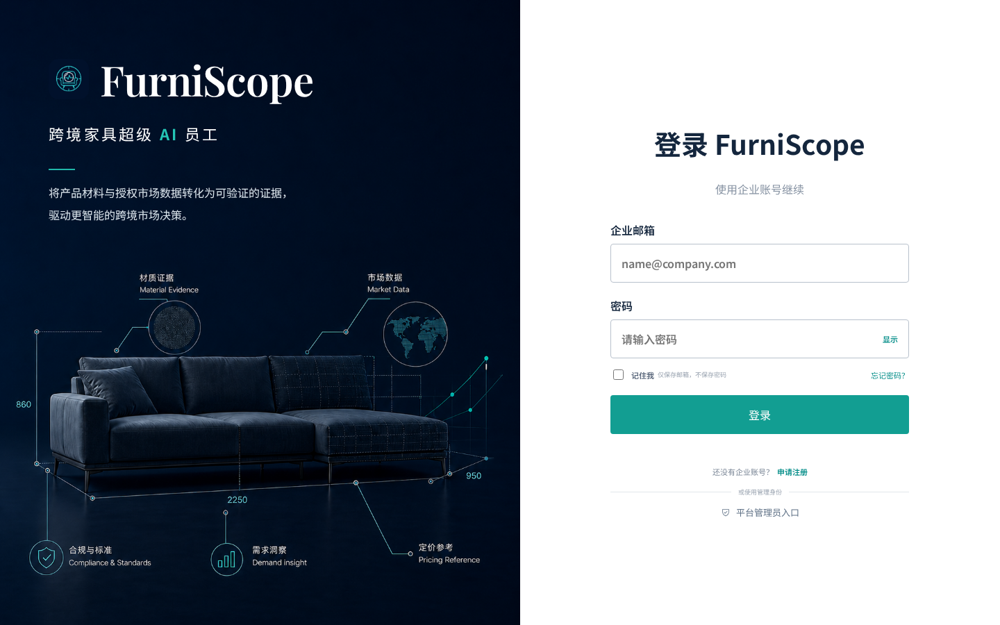

**本页功能**

- 企业账号登录，进入工作台。
- 「显示」可临时查看密码，不会写入浏览器持久存储。
- 「忘记密码」进入重置页：输入企业邮箱后会显示一次性校验码，再设置至少 12 位的新密码。演示环境校验码显示在页面上，不会发邮件。平台管理员也可在控制中心为企业账号重置密码。
- 「申请注册」跳到企业开户申请。
- 底部「平台管理员入口」跳到管理员登录；管理员账号不能从本页登录。

---

## 2. 申请企业账号

从登录页点「申请注册」进入。填写企业名称、联系人、工作邮箱、密码（至少 12 位）并同意条款后提交。

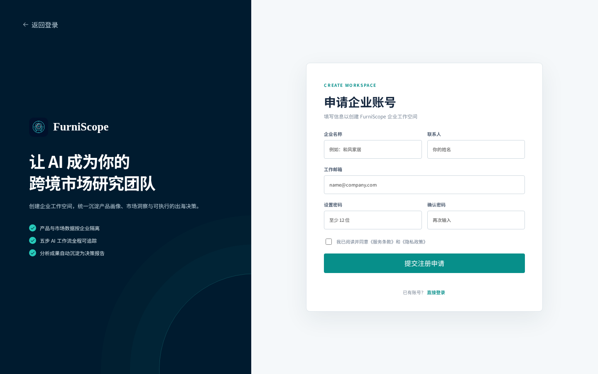

**本页功能**

- 提交后账号处于**待审批**，不能马上登录。
- 平台管理员在后台通过后，用同一邮箱从登录页进入。
- 「返回登录」回到上一页；已有账号可直接登录。

---

## 3. 平台管理员登录

地址为 `#admin-login`，或从登录页底部进入。界面与企业登录分开，避免角色混用。

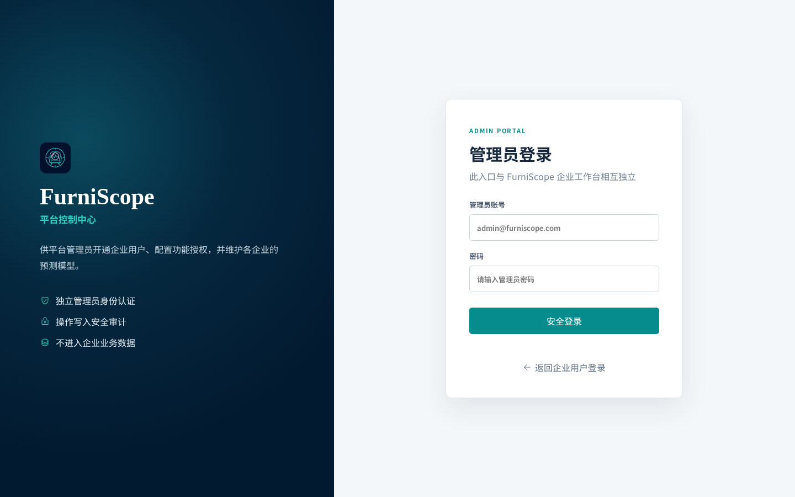

**本页功能**

- 仅 `admin` 角色可登录。
- 登录后进入「平台控制中心」，用于开通企业、审批注册、查看预测模型。
- 管理员不会进入产品分析、报告或市场洞察。

---

## 4. 首页

登录后的默认页。用来看企业当前进度，并从最近任务/报告跳进具体工作。

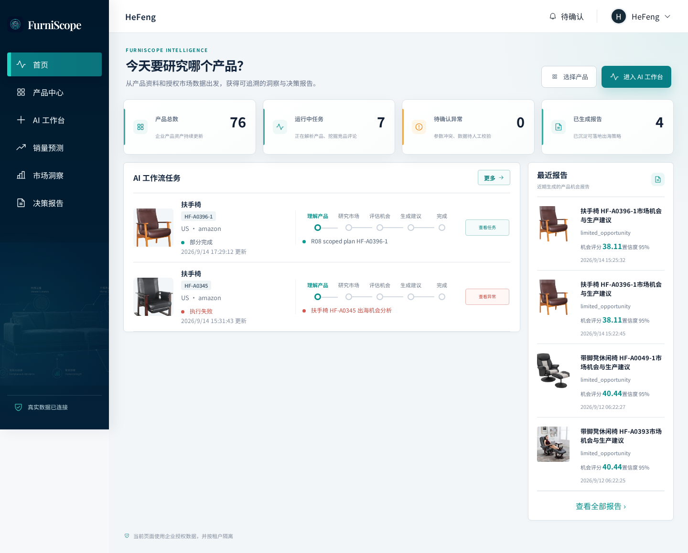

**本页功能**

- 顶部四张卡片：产品总数、运行中任务、待确认异常、已生成报告。点击可跳到对应模块。
- 「选择产品」进入产品中心；「进入 AI 工作台」开始分析。
- **AI 工作任务**：最近分析的进度条（理解产品 → 研究市场 → 评估机会 → 生成建议 → 完成）。可点「查看任务」或「查看异常」。
- **最近报告**：已完成决策报告的机会分、置信度和结论标签。
- 右上角「待确认」铃铛：有人工确认事项时会提示。
- 左侧导航在所有企业页面保持一致，可随时切换模块。

---

## 5. 产品中心

管理本企业 SKU 档案：搜索、筛选、新建、批量导入，以及从档案发起分析或预测。

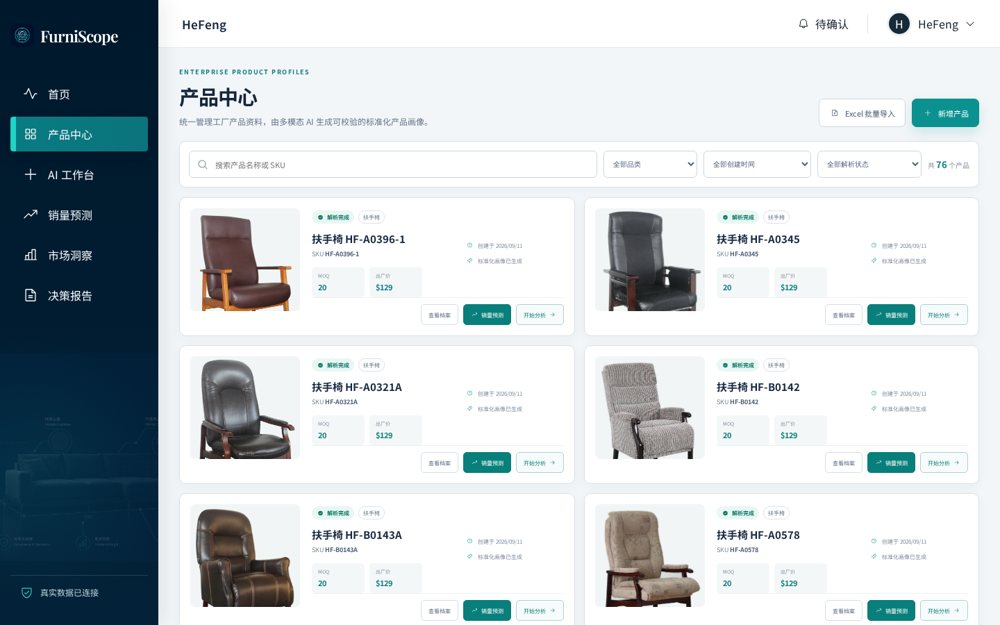

**本页功能**

- 按名称 / SKU 搜索；按品类、创建时间、解析状态筛选。
- 每张卡片展示产品图、解析状态、品类、SKU、MOQ、出厂价。
- 「查看档案」打开右侧/抽屉详情。
- 「销量预测」把该 SKU 带入预测页。
- 「开始分析」要求画像已确认且无冲突；否则会提示先确认或先处理冲突。
- 「新增产品」「Excel 批量导入」打开对应表单。

### 5.1 新增产品

点「新增产品」后的表单。可只建档案，也可同时上传 PDF / Excel / 图片做解析。

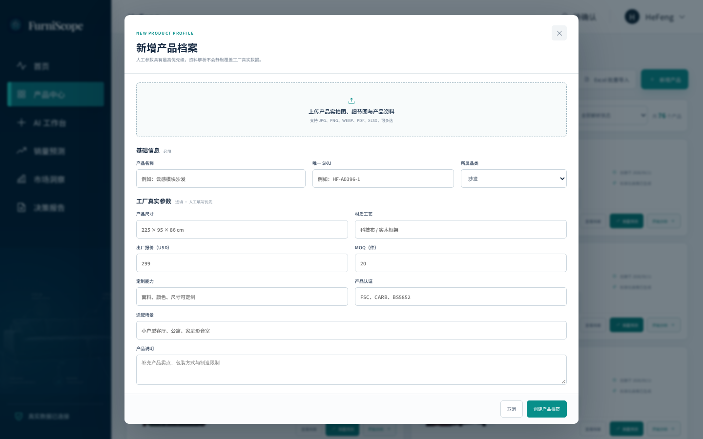

**本页功能**

- 必填 SKU、名称、品类；可选尺寸、材质、MOQ、成本等工厂参数。
- 人工填写的字段优先级最高，后续资料解析不会静默覆盖。
- 上传资料后点「创建并解析资料」；未上传则只创建空档案。
- 「取消」关闭，不保存。

### 5.2 产品档案

从列表点「查看档案」，或打开 `#products?product=产品ID`。

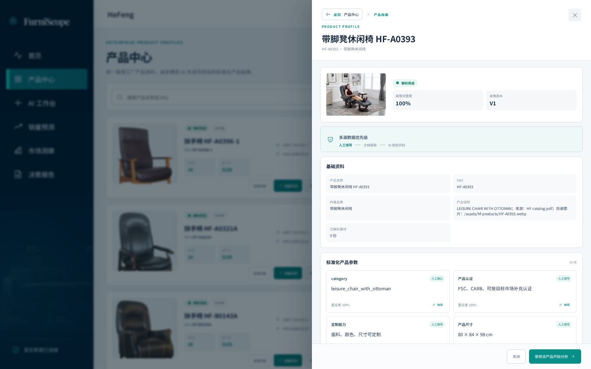

**本页功能**

- 查看标准化画像：尺寸、材质、结构、颜色、认证、出厂价、映射销量等。
- 每条属性带来源、置信度和确认状态。
- 有冲突时按「人工填写 ＞ 文档提取 ＞ AI 识别」处理，可直接改正字段。
- 「使用该产品开始分析」跳到 AI 工作台并带上该产品。
- 「关闭」回到产品列表。

---

## 6. AI 工作台（入口）

分析任务的首页：看工作台数量、运行中任务，并从工作日记进入已有会话。

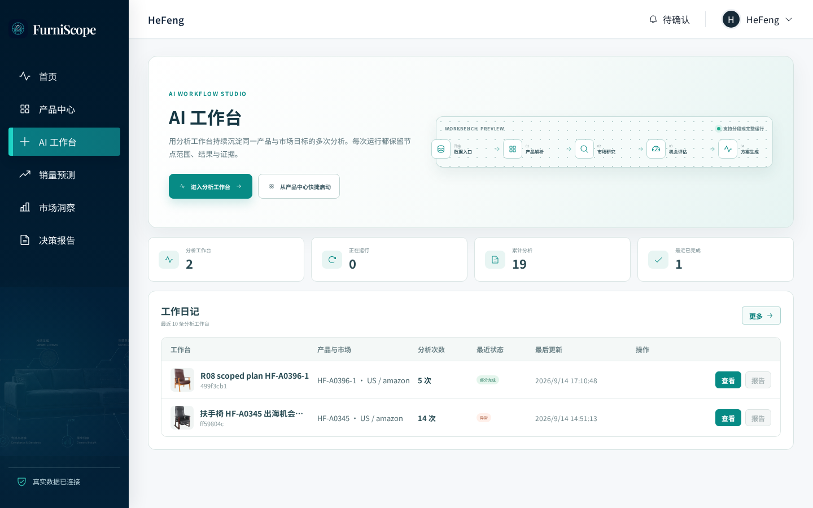

**本页功能**

- 「进入分析工作台」打开新建/选择弹窗。
- 「从产品中心快捷启动」回到产品列表再选 SKU。
- 指标：工作台数、正在运行、累计分析、最近已完成。
- **工作日记**：最近 10 条工作台；「更多」打开完整日记页。
- 右侧预览五段流程：数据入口 → 产品解析 → 市场研究 → 机会评估 → 方案 / 报告。

### 6.1 新建分析工作台

点「进入分析工作台」后的弹窗。

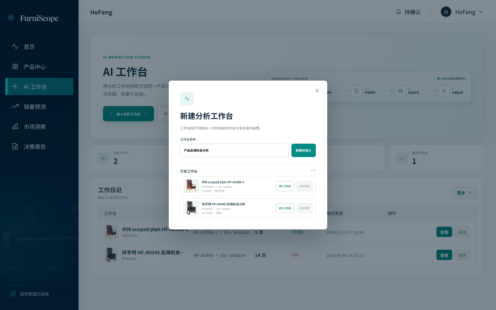

**本页功能**

- 填写工作台名称后「新建并进入」。
- 下方列出已有工作台：进入会话，或打开最近报告。
- 同一工作台可对同一产品多次运行，对话和节点结果会留下来。

---

## 7. 分析工作台（对话 + 节点画布）

真正跑市场分析的页面。左侧工作台列表，中间对话，中间偏右是节点画布，最右侧是节点详情或报告预览。

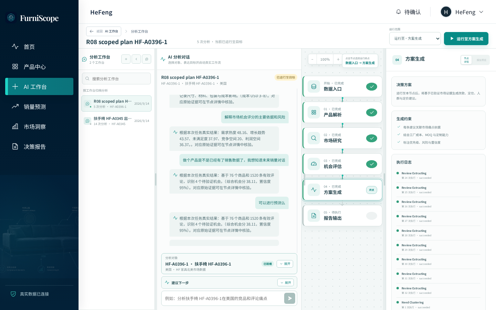

**本页功能**

- **对话**：用自然语言提问（竞品、价格带、评论痛点等）。系统会创建真实分析任务，不编造价格和评论数。
- **分析对象**：可折叠。产品、市场数据都可以先不填，之后再补或在对话里说 SKU。
- **建议下一步**：默认收起，展开后可点追问。问「未来销量」时会引导到销量预测页，不会用机会分冒充销量。
- **运行范围**：可只跑到产品 / 市场 / 评分 / 方案 / 完整报告。点「运行至…」启动 Worker。
- **节点画布**：点节点只切换右侧详情和运行终点；上游没跑完时下游保持待执行。
- 需要人工确认时（冲突、样本不足、低置信度），在对话或详情里选择选项后任务继续。
- 长任务由 Redis Worker 执行，刷新页面不会丢；可从工作日记回来。

---

## 8. 工作日记

从 AI 工作台「更多」或首页任务列表进入，查看全部分析工作台。

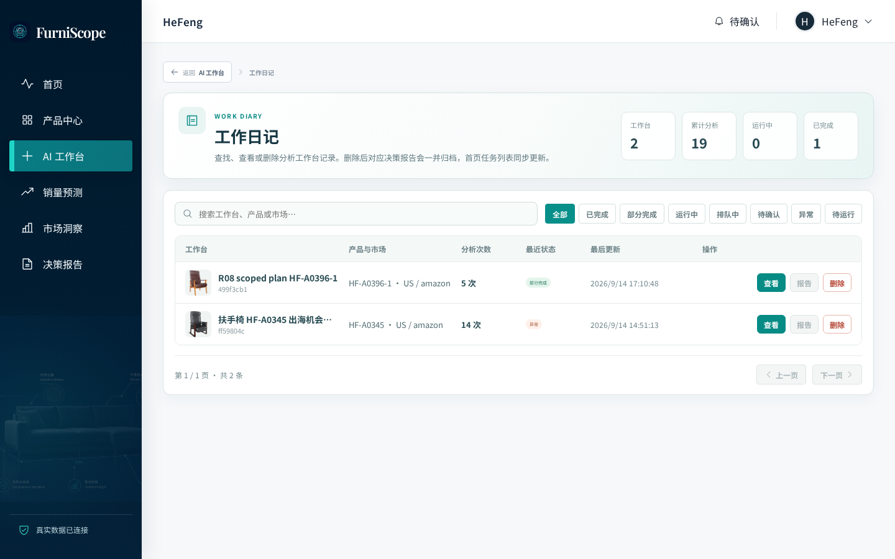

**本页功能**

- 按名称搜索，按状态筛选。
- 每条显示产品、市场、分析次数、最近状态。
- 可进入对应工作台，或打开已生成的报告。
- 分页浏览历史记录。

---

## 9. 销量预测

按产品中心 SKU 和站点输出销量区间、安全库存建议。市场洞察里的机会分**不能**代替本页。

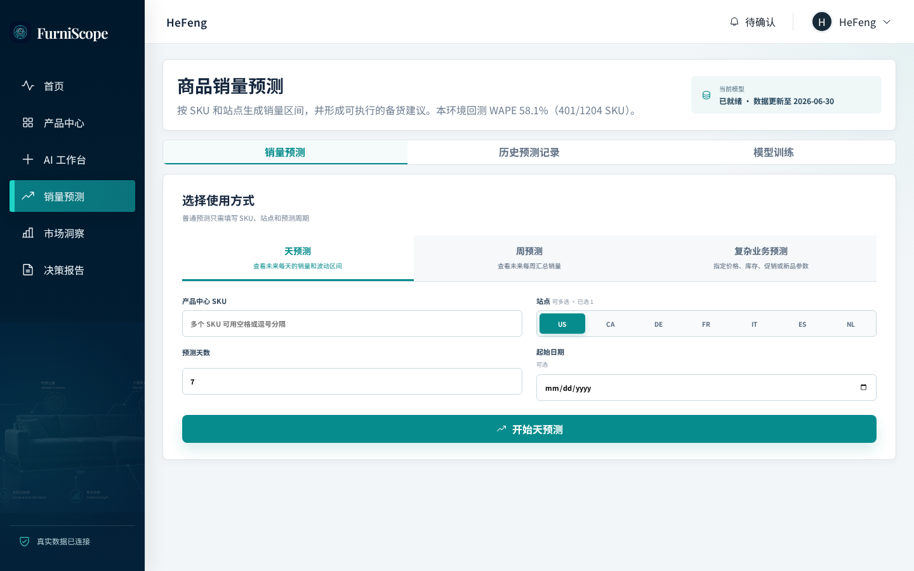

**本页功能**

- 右上角显示模型是否就绪、数据截止日期；现网会展示本环境回测 WAPE。
- 三种方式：天预测、周预测、复杂业务预测（价格、库存、促销、新品基准销量或参考 SKU）。
- 填写 SKU（可多选）、站点（可多选）、周期、可选起始日期后点「开始预测」。
- 已映射训练历史的 SKU 可直接预测；冷启动必须走复杂业务并填基准或参考 SKU。
- 也可从产品中心「销量预测」带入 SKU。

### 9.1 历史预测记录

同一页的第二个标签。浏览已跑过的预测任务，查看结果或导出。

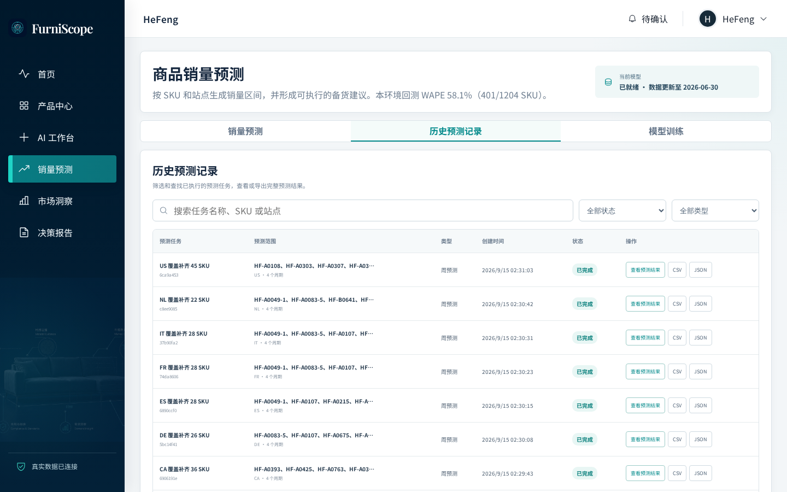

**本页功能**

- 按任务名、SKU、站点搜索；按状态、天/周类型筛选。
- 「查看预测结果」打开区间和可靠度。
- 导出 CSV / JSON。
- 分页翻看历史任务。

### 9.2 模型训练

同一页的第三个标签。用企业订单（可选库存）追加训练并发布新版本。

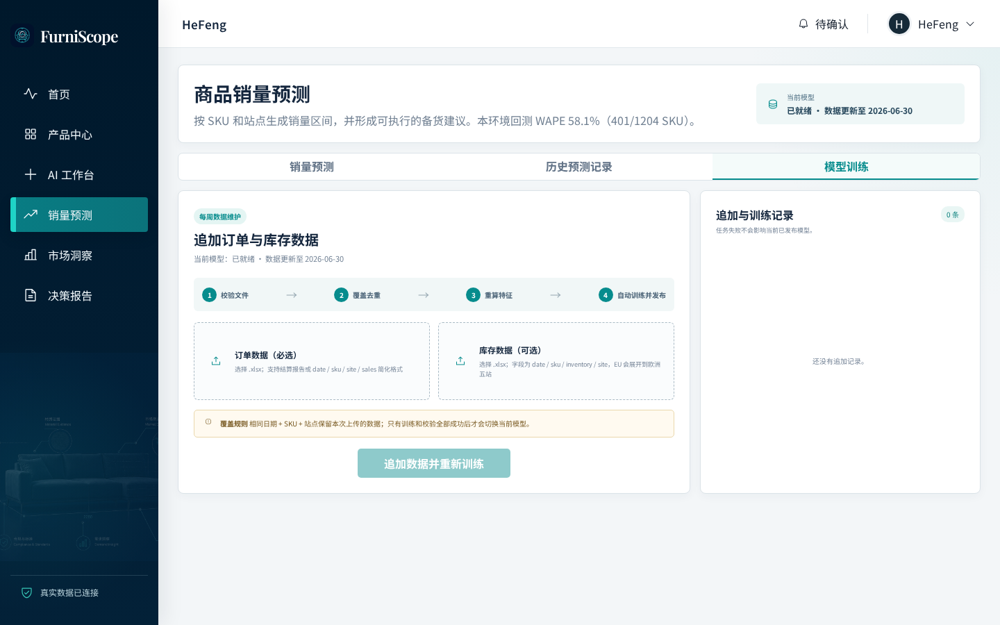

**本页功能**

- 上传订单 Excel，可选库存文件。
- 相同日期、SKU、站点以本次上传为准，追加后会重训并发布。
- 右侧列出训练历史：成功则显示覆盖行数和数据截止日期；失败显示原因。

---

## 10. 市场洞察

授权市场数据的总入口：看规模、导入数据集，并进入竞品监测或评论舆情。

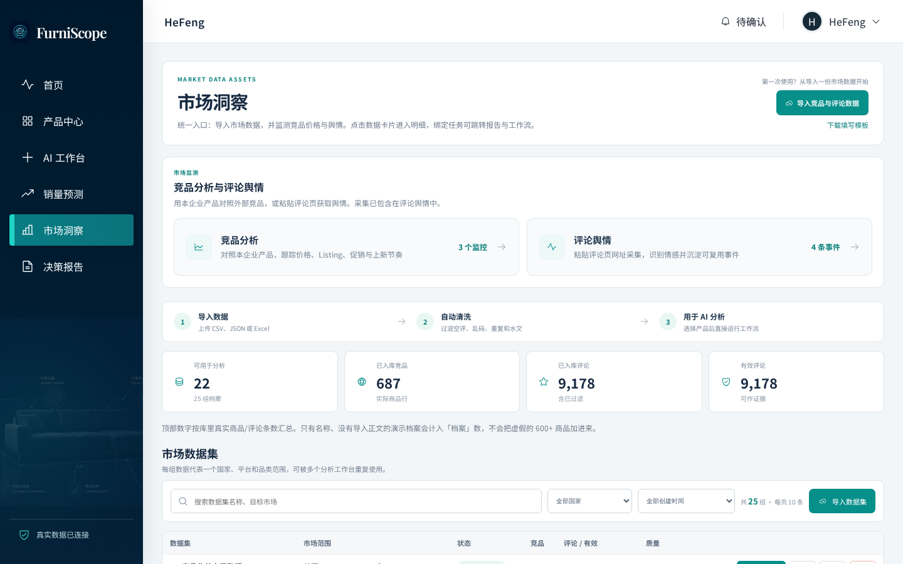

**本页功能**

- 汇总：可用于分析的数据集数、已入库竞品、已入库评论、有效评论（以库内真实行为准）。
- 「导入竞品与评论数据」打开导入表单；「下载填写模板」拿 Excel/CSV 模板。
- 「竞品分析」进入价格 / Listing 监测。
- 「评论舆情」进入评论浏览与网页补采。
- 数据集列表可搜索、按国家/时间筛选；点「详情」看商品和评论；可绑定后跳转分析。

### 10.1 导入数据集

点「导入竞品与评论数据」后的表单。

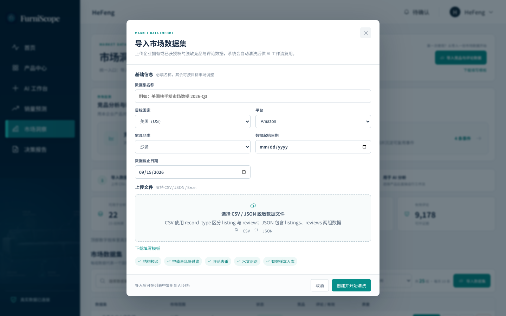

**本页功能**

- 填写名称、平台、目标市场、品类、来源类型、授权引用、数据日期。
- 上传企业授权 JSON / CSV / Excel（需含商品与评论，且有稳定平台 ID）。
- 提交后自动清洗（空评、乱码、重复、水文）；状态变为「可用于分析」才能绑到 AI 工作台。
- 重新上传会覆盖旧竞品和评论。
- 只允许企业拥有或已获授权的脱敏数据，不要上传未授权抓取结果。

### 10.2 数据集详情

从列表点「详情」，例如 HeFeng 北美市场包。

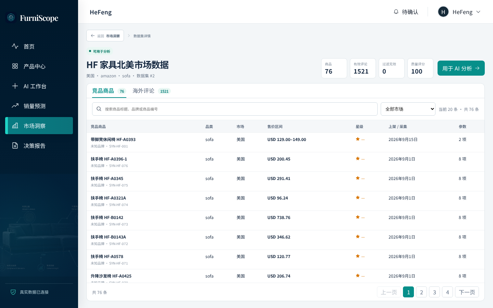

**本页功能**

- 查看该数据集的商品列表和评论列表（可切换）。
- 评论可看有效 / 已过滤及过滤原因。
- 按市场、情感、关键词筛选。
- 可从这里启动「用该数据做市场分析」。

---

## 11. 竞品分析

从市场洞察点「竞品分析」进入。用**本企业产品**对照外部 Listing，不要把外部编号（如 `SYN-HF-*`）当成自家 SKU。

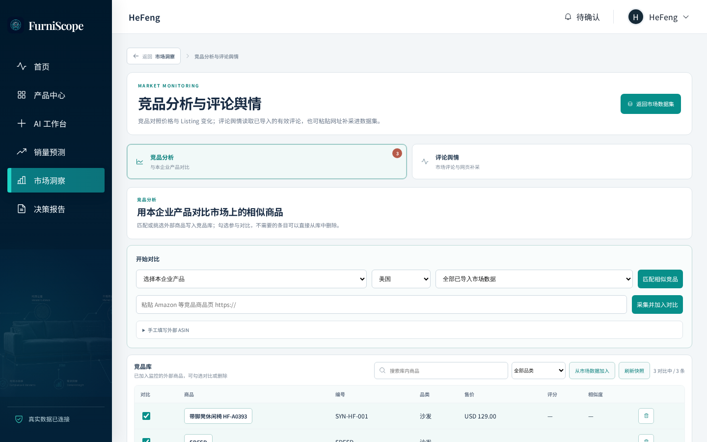

**本页功能**

- 选择本企业产品后：「匹配相似竞品」「从市场数据加入」或粘贴商品页网址采集。
- 竞品库可勾选参与对比、删除监控（历史快照仍保留）。
- 「立即刷新快照」后看价格趋势和版本对比（标题、售价、促销、主图、卖点）。
- 上方标签可切到「评论舆情」。

---

## 12. 评论舆情

与竞品分析在同一模块的另一个标签。

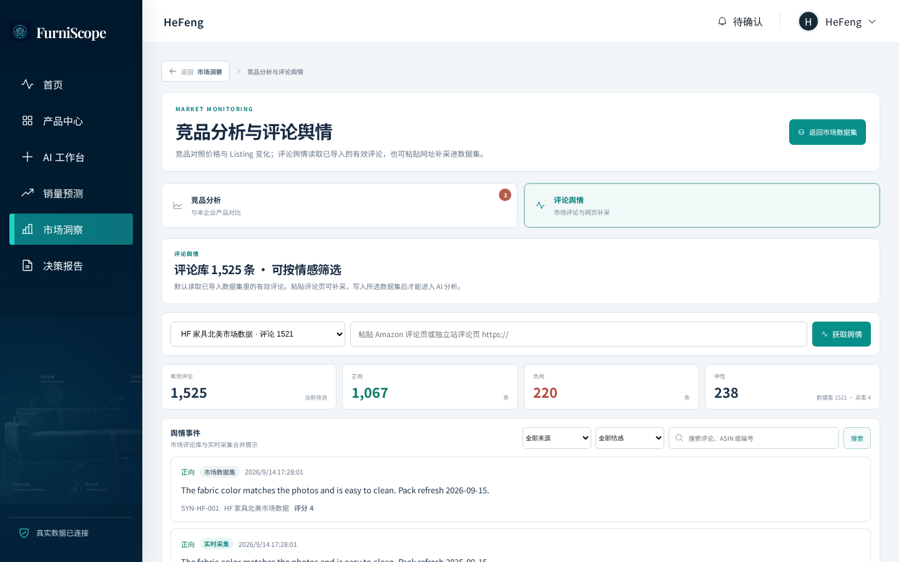

**本页功能**

- 默认读取已导入数据集里的**有效评论**。
- 按来源、情感、关键词筛选。
- 粘贴 Amazon / 独立站评论页网址，「获取舆情」写入所选数据集后才能进 AI 分析。
- 公开页若返回防护页或 0 条，任务记**失败**，不会显示假成功。

更细的逐步验收见 [04_市场洞察四项功能测试指南.md](04_市场洞察四项功能测试指南.md)。

---

## 13. 决策报告（列表）

AI 工作流完成后，报告自动出现在这里。

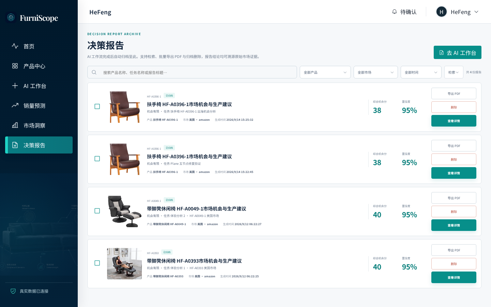

**本页功能**

- 按产品名、任务名、报告标题搜索。
- 按产品、市场、决策标签、时间筛选。
- 打开详情；可勾选后批量导出 PDF 或归档删除。
- 「去 AI 工作台」开始新的分析。

---

## 14. 决策报告（详情）

点开一份已完成报告。左侧是章节目录，右侧是正文。

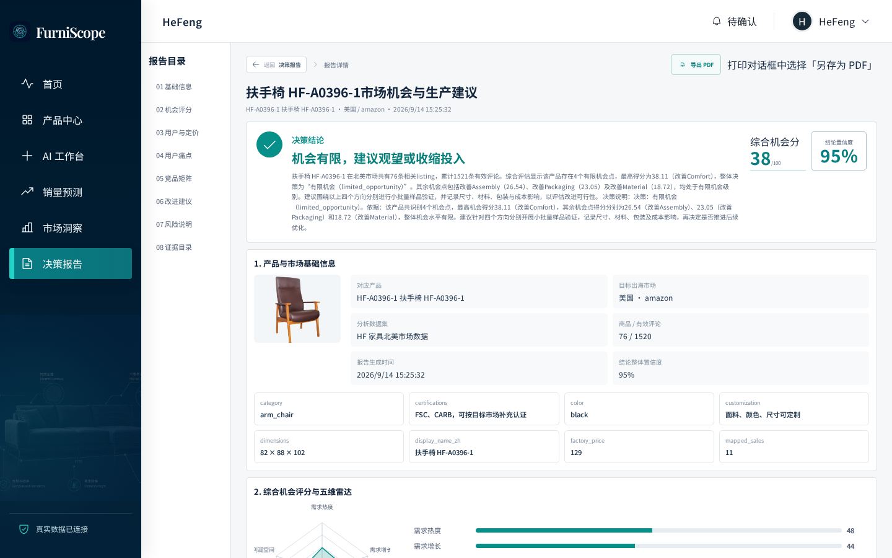

**本页功能**

- 看决策结论、综合机会分、报告置信度、执行摘要。
- 章节包括：基础信息、机会评分、用户与定价、用户痛点、竞品矩阵、改进建议、风险说明、证据目录。
- 数字来自程序计算（商品数、有效评论、五维分）；生成式文字不能覆盖原始证据。
- 「导出 PDF」走浏览器打印对话框，选「另存为 PDF」。
- 可下钻到竞品监测或市场数据集。
- 「返回决策报告」回到列表。

---

## 15. 平台控制中心 · 企业用户

管理员登录后的默认页。与企业工作台完全隔离。

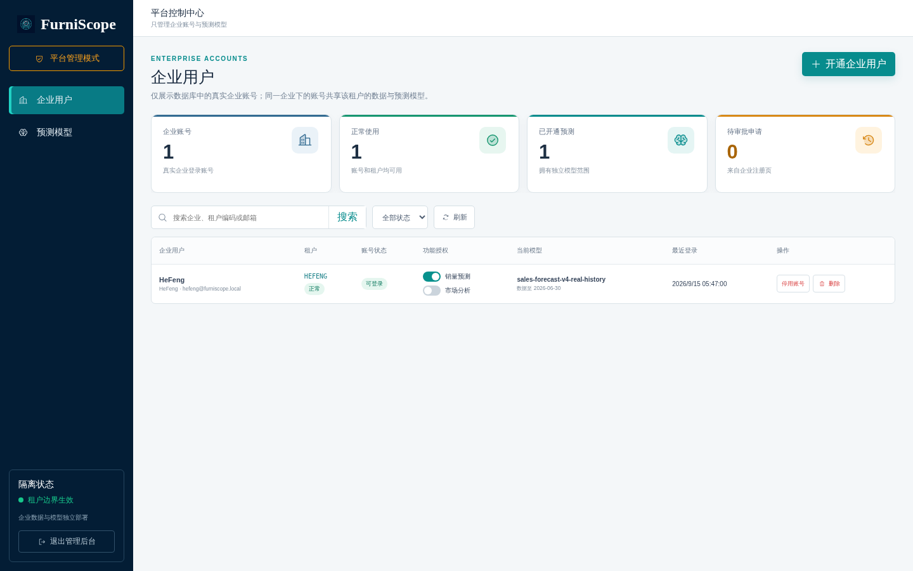

**本页功能**

- 统计：企业账号数、正常使用、已开通预测、待审批申请。
- 「开通企业用户」：同时创建租户和登录账号，设置初始密码和功能授权（销量预测 / 市场分析）。
- 列表中可搜索企业、停用账号、重置密码、删除租户。
- 审批注册申请（通过后申请人用原密码登录）。
- 左下角显示租户隔离状态；「退出管理后台」回到管理员登录。

---

## 16. 平台控制中心 · 预测模型

管理后台左侧第二个导航。

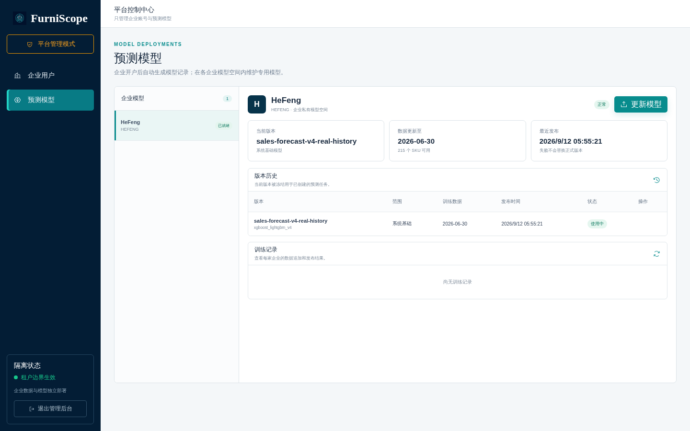

**本页功能**

- 查看当前发布的预测模型版本、数据截止日期、可用 SKU 数。
- 为企业开通或关闭销量预测能力。
- 失败的训练不会替换正在使用的正式版本。

---

## 17. 推荐操作顺序

第一次使用可按这个顺序走一遍，不必每个按钮都点：

1. 登录企业账号（第 1 页）。
2. 在产品中心确认 SKU 画像（第 5 页）。
3. 在市场洞察导入或选用已授权数据集（第 10 页）。
4. 在 AI 工作台提问并运行到报告（第 6–7 页）。
5. 在决策报告里核验证据（第 14 页）。
6. 需要备货数字时，到销量预测选同一 SKU 和站点（第 9 页）。

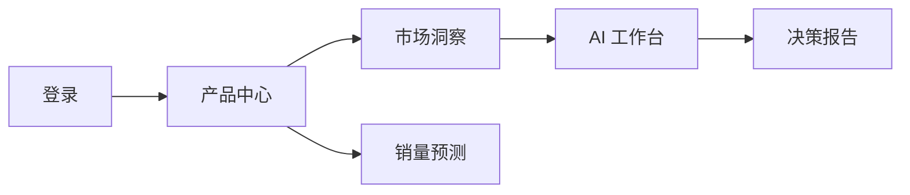
```mermaid
flowchart LR
    A[登录] --> B[产品中心]
    B --> C[市场洞察]
    C --> D[AI 工作台]
    D --> E[决策报告]
    B --> F[销量预测]
```

---

## 18. 启动、健康检查与常见问题

Docker Compose 一键启动（密钥只放本机 `.env`，不要写进本文或截图）：

```bash
cp .env.example .env
docker compose up --build -d
curl --fail http://127.0.0.1:8083/health/ready
```

| 现象 | 处理 |
|---|---|
| 打不开页面 | `docker compose ps`，看 frontend / backend 是否 healthy |
| 登录 401 | 邮箱是否已审批；管理员是否误走了企业登录 |
| 分析一直排队 | Worker 是否在跑；模型额度是否用尽 |
| 预测启动失败 | SKU 是否在训练目录中；冷启动需填基准销量或参考 SKU |
| 采集 0 条仍显示成功 | 当前版本应记失败；若仍成功请带任务 UUID 和 `X-Request-ID` 反馈 |

反馈时提供：页面名称、时间、任务或报告 UUID、响应头 `X-Request-ID`。不要发送密码、Token 或完整客户数据。

FurniScope 是决策支持，不替代开模、认证、备料或下单。所有查询带租户隔离。生产部署见 [FurniScope_生产部署指南.md](../开发文档/FurniScope_生产部署指南.md)。

---

## 19. 相关文档

| 文档 | 内容 |
|---|---|
| [README.md](../../README.md) | 产品定位与快速开始 |
| [04_市场洞察四项功能测试指南.md](04_市场洞察四项功能测试指南.md) | 竞品变更、评论舆情逐步验收 |
| [客户接入指南](../开发文档/FurniScope_客户接入指南.md) | 数据准备与质量要求 |
| [技术架构及调用模型说明.md](../技术架构及调用模型说明.md) | 模型与调用链 |
