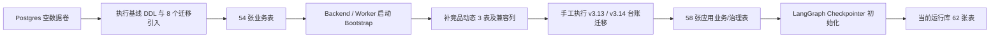
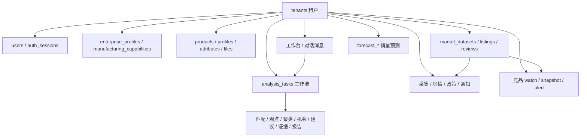
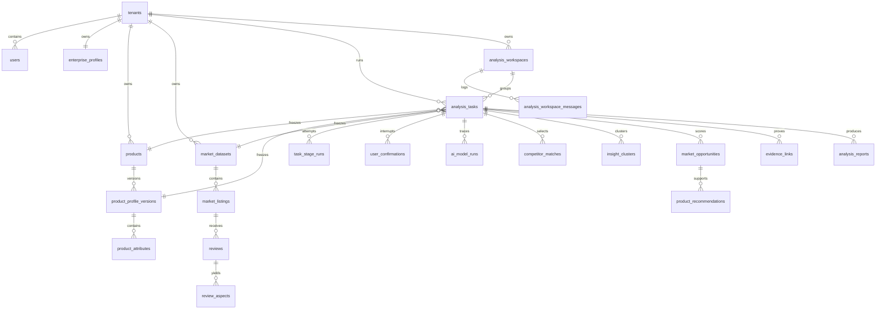
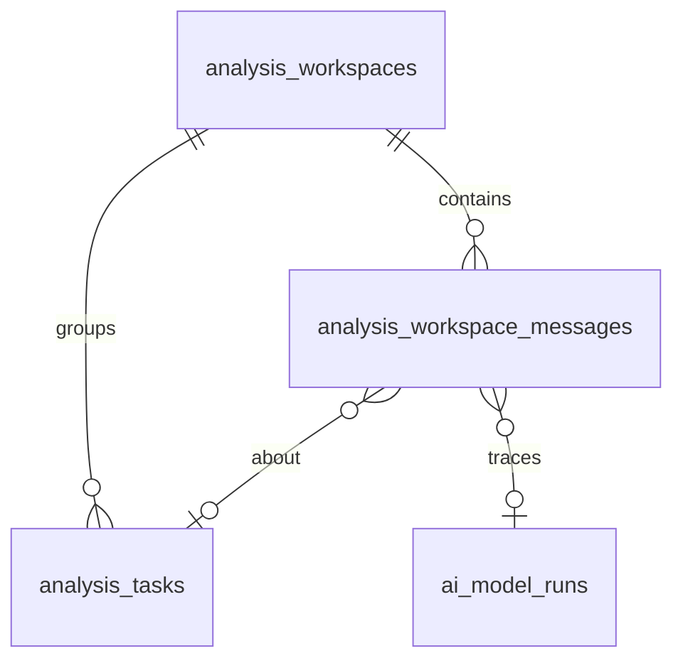

# FurniScope 数据库设计（现行）

本文描述仓库数据层；运行环境是否升级须另行核验。2026-10-08补齐竞品多时点历史、
机会经营实绩字段、常驻Worker维护及WAL/PITR配置，本轮已在本地数据库验证业务闭环；
容器级PITR恢复仍待Docker和目标基础设施验收。总体依据：
[企业决策与数据闭环总体设计](../项目设计文档/15_FurniScope_企业决策与数据闭环总体设计V1.md)。

| 项 | 值 |
|---|---|
| 引擎 | PostgreSQL 16+ |
| 业务 Schema | `furniscope` |
| 扩展 | `pgcrypto`（必需）；`pgvector`（可选，1024维知识向量加速） |
| 基线 DDL | `furniscope_postgresql_v3.sql` |
| 增量迁移 | `migrations/v3_*.sql` |
| 迁移台账 | `furniscope.schema_migrations`（当前仅登记版本，不负责自动执行 SQL） |
| 运行期建表入口 | `backend/furniscope_api/services/schema_bootstrap.py` |
| 设计原稿（V3 基线） | `Docs/项目设计文档/03_FurniScope_PostgreSQL数据库设计V3.md` |
| 初始化说明 | `Docs/项目设计文档/03_FurniScope_PostgreSQL数据库初始化说明V3.md` |
| 本文核对日期 | 2026-10-08（本地v3.37增量）；演示库统计保留2026-09-14历史日期 |

Docker 空库：`docker-compose.yml` 把基线挂成 `/docker-entrypoint-initdb.d/001-schema.sql`，并把 `migrations/` 挂到同级目录，供基线末尾 `\ir` 引用。数据卷一旦建过，改 SQL **不会**自动重跑，需要新库或手工迁移。

---

## 1. 设计原则

1. **`tenants` 是隔离边界。** 应用过滤与数据库RLS共同生效；v3.16增加复合边界，v3.25为租户表启用`FORCE RLS`并拆分数据库职责。普通请求认证后切换为`furniscope_tenant`受限角色，事务结束不残留连接身份。认证、平台调度和LangGraph私有检查点仍属受信服务连接，不声称抵御数据库服务凭据泄露。
2. **角色只有两种。** `users.role_code` ∈ `user` / `admin`。多 Agent 是内部能力，不是权限主体。
3. **对内 BIGINT IDENTITY，对外 UUID。** API 用 `task_uuid`、`report_uuid`、`session_uuid` 等；Checkpoint 用业务字符串 `checkpoint_id`。
4. **事件时点使用 `TIMESTAMPTZ`。** 企业实施与观察起止用`DATE`，不声称能区分同日内顺序。金额 `NUMERIC`；置信度 `NUMERIC(5,4)` 左右；可变结构用 `JSONB`，并有 `jsonb_typeof` CHECK。排序、过滤、关联字段保持普通列，不塞进大 JSON。
5. **库内存业务对象，不存危险物：**
   - 文件字节（只存 `file_assets` 元数据与对象存储 key）
   - API Key、模型密钥、Refresh Token 明文（哈希或环境变量名）
   - 预测模型权重二进制（只记 URI + checksum）
   - 模型 system prompt、整份任务结果 JSON（问询时临时拼进请求，不入库）

不属于现行核心库：Listing 生成流水、报告文件导出、多人评审、动态 RBAC、产品运营事件。这些在 V2 退役后进 `furniscope_archive`（仅 V2→V3 迁移脚本创建）。

---

## 2. 库外存储

| 组件 | 职责 |
|---|---|
| Local/S3兼容对象存储 | 开发默认使用 `DEMO_STORAGE_ROOT`；`STORAGE_BACKEND=s3` 时使用私有S3兼容桶。两种后端均采用租户前缀对象键，库中只存 `storage_key`和SHA；production强制S3、TLS和预创建桶 |
| `forecast-artifacts` 卷 / `forecast_assets` | 预测模型、训练数据与回测产物；数据库只保存 URI、版本与 checksum |
| Redis | 分析、解析、数据集导入、预测、训练、控制事件和采集任务队列；不是主数据 |
| LangGraph Checkpointer | 同一套 Postgres、当前同一 `furniscope` Schema 下的 `checkpoints`、`checkpoint_blobs`、`checkpoint_writes`、`checkpoint_migrations`；与业务表 `workflow_checkpoints` **不得互相替代** |
| 前端 localStorage（偏好） | 侧栏折叠、工作流分栏宽度、记住邮箱等 UI 状态；**不是**工作台主数据 |

---

## 3. 初始化与迁移

### 3.1 空库（Docker / `\ir`）

`furniscope_postgresql_v3.sql` 建 35 张 V3 核心表后，显式引入：

| 顺序 | 文件 | 作用 |
|---|---|---|
| 1 | `migrations/v3_forecast_integration.sql` | 销量预测 8 张表 |
| 2 | `migrations/v3_5_admin_control_center.sql` | `tenants.entitlements` |
| 3 | `migrations/v3_6_registration_applications.sql` | 公开注册申请 |
| 4 | `migrations/v3_7_authorized_market_signals.sql` | 采集源、舆情、政策 |
| 5 | `migrations/v3_8_alert_notifications.sql` | 通知通道与投递 |
| 6 | `migrations/v3_9_active_web_collection.sql` | 采集源类型扩到 Amazon/网页评论 |
| 7 | `migrations/v3_10_analysis_workspaces.sql` | 工作台容器 + 对话消息 |
| 8 | `migrations/v3_11_forecast_sku_aliases.sql` | 产品 SKU ↔ 预测训练 SKU 映射 |
| 9 | `migrations/v3_15_enterprise_data.sql` | 原始/标准数据版本、训练血缘、租户SKU别名 |
| 10 | `migrations/v3_18_customer_memory.sql` | 先建工作区客户记忆表，再纳入统一RLS；登记迁移版本 |
| 11 | `migrations/v3_16_tenant_boundaries.sql` | 引入竞品三表迁移；受限角色、RLS、复合关联、模型owner约束 |
| 12 | `migrations/v3_17_opportunity_policy.sql` | 不可变策略/反馈、市场原分/修正分、任务决策快照 |
| 13 | `migrations/v3_19_training_leases.sql` | 训练执行令牌、尝试次数、心跳和租约 |
| 14 | `migrations/v3_20_forecast_routing.sql` | 部署目录及预测路由不可变快照 |
| 15 | `migrations/v3_21_import_templates.sql` | 不可变导入模板修订、辅助表血缘 |
| 16 | `migrations/v3_22_opportunity_outcomes.sql` | 机会首次完整特征快照、不可变实施及经营观察 |
| 17 | `migrations/v3_23_context_lifecycle.sql` | 原子Turn、Context、Citation和知识库资源 |
| 18 | `migrations/v3_24_memory_agent_governance.sql` | 版本记忆、冲突治理和索引任务 |
| 19 | `migrations/v3_25_database_security_baseline.sql` | 职责角色、FORCE RLS和运行期DDL收敛 |
| 20 | `migrations/v3_26_competitor_watch_product_binding.sql` | 竞品监控产品绑定边界 |
| 21 | `migrations/v3_27_audit_rbac.sql` | 企业RBAC及append-only哈希审计链 |
| 22 | `migrations/v3_28_tenant_deletion_lifecycle.sql` | Legal Hold、保留期、删除请求和证明 |
| 23 | `migrations/v3_29_tenant_cell_routing.sql` | Cell目录、placement、迁移状态和写栅栏 |
| 24 | `migrations/v3_30_tenant_query_optimization.sql` | tenant-first索引、16分区Embedding侧索引和扩展策略 |
| 25 | `migrations/v3_31_controlled_data_query.sql` | 销量/库存事实投影、受控指标与查询审计 |
| 26 | `migrations/v3_32_product_catalog_imports.sql` | SKU比较键、产品组合关系及产品主档导入任务 |
| 27 | `migrations/v3_33_tenant_data_class.sql` | 租户业务/测试/演示数据分类及服务端过滤基线 |
| 28 | `migrations/v3_34_sku_fact_identity.sql` | SKU改名时受控同步产品、目录、销量和库存事实 |
| 29 | `migrations/v3_35_agent_runtime.sql` | AI员工Goal/Plan/Run、工具、审批、制品和事件运行时 |
| 30 | `migrations/v3_36_market_intelligence_governance.sql` | 五项市场决策批次、逐记录血缘、SHA和来源分类 |
| 31 | `migrations/v3_37_operational_outcomes.sql` | 机会结果增加打样、投产、销量和退货实绩；数据库校验整数、上下界与非规划状态 |

旧基线54张统计已被增量替代；现行实际表数需执行第11节核查SQL，以免把治理/框架表混入业务表数量。

现行基线通过v3.16引入竞品三表。Backend/Worker启动仍执行一次兼容检查，并检查全部tenant_id业务表已存在RLS策略；缺少边界迁移时拒绝启动。LangGraph框架表由其自身初始化，不作为用户直接查询表。

### 3.2 已有库增量（需手工或运维执行）

以下为旧库增量文件，部分已被现行基线间接引用：

| 文件 | 作用 |
|---|---|
| `v3_15` → `v3_18` → `v3_16` → `v3_17` → `v3_19` → `v3_20` → `v3_21` → `v3_22` → `v3_23` → `v3_24` → `v3_25` → `v3_26` → `v3_27` → `v3_28` → `v3_29` → `v3_30` → `v3_31` → `v3_32` → `v3_33` → `v3_34` → `v3_35` → `v3_36` → `v3_37`（文件全名见上表） | 现行企业闭环、多租户、市场治理及经营实绩依赖顺序；18先于16使客户记忆表受RLS保护。可重复，脏关联或SKU冲突阻止迁移，不自动删除历史 |
| `v3_4_competitor_tracking.sql` | `competitor_watch_targets` / `competitor_listing_snapshots` / `competitor_change_alerts` |
| `v3_11_watch_compare_selected.sql` | 竞品库 `compare_selected`（应用启动时 `ensure_schema` 也会补） |
| `v3_12_workspace_message_kind_context.sql` | 工作台消息类型增加 `context`，用于产品/市场选择等可见上下文 |
| `v3_13_schema_migrations.sql` | 新建迁移台账，并把截至 v3.13 的既有版本登记为已应用 |
| `v3_14_schema_bootstrap_only.sql` | 登记“运行期 DDL 仅在进程启动执行”的治理版本 |
| `v3_10_analysis_workspaces.sql` | 已有库补工作台与消息表（空库已由基线 `\ir`） |
| `v3_11_forecast_sku_aliases.sql` | 产品 SKU ↔ 训练历史映射，并丢掉未映射的预测目录 SKU |
| `v3_1_tenant_forecast.sql` | 已有预测库补租户字段（与 integration 重叠，`IF NOT EXISTS`） |
| `v3_2_forecast_append.sql` | 训练任务幂等与追加训练 |
| `v3_3_enterprise_fit_v2.sql` | 企业画像快照、机会拟合置信度（基线已含同名字段） |
| `v3_3_market_dataset_preview.sql` | `reviews.reviewer_location` / `sentiment`（基线已含） |
| `v3_runtime_alignment.sql` | `products` / `market_datasets.deleted_at` 软删 |
| `v3_api_contract_alignment.sql` / `v3_analysis_task_api_alignment.sql` | V2 升级库字段对齐 |
| `v3_evidence_trigger_schema_fix.sql` | 证据 Span 触发器限定 `furniscope.reviews` |
| `v2_1_to_v3.sql` | 历史 V2.1 整库迁移 |

`schema_migrations` 目前是**台账，不是迁移执行器**：没有自动扫描、按序执行、失败回滚或 checksum 校验逻辑；`v3_13` 还会批量登记历史版本。因此运维仍需先执行目标 SQL，再确认表、列、约束存在，不能只看台账行。

升级租约、RLS或Cell协议前先停止旧worker，迁移成功并通过启动检查后再启动新进程。
旧进程不能校验执行令牌、Cell placement或新职责。当前任务/机会快照、模板、反馈与
实施事件不可原地改写或删除；数据清理使用归档及停用身份，不通过级联删除历史。
`scripts/verify_enterprise_migrations.py`创建两个全新本地测试库，验证从零安装、旧
基线加存量租户后的升级、重复迁移及启动RLS检查；不会重置已有库。v3.15-v3.30历史
结果见[多租户隔离验收](../../artifacts/tenant-isolation-20261006/)；v3.15-v3.34最终
迁移集合、SHA和fresh/upgrade结果见
[系统复盘整改迁移摘要](../../artifacts/system-review-20261007-fixes/migration-v34/migration-summary.json)。

### 3.3 多租户生产运维

#### 数据库身份

生产必须为以下登录账号设置不同随机口令：`furniscope_app_login`、
`furniscope_admin_login`、`furniscope_worker_login`、`furniscope_langgraph_login`、
`furniscope_backup_login`、`furniscope_monitor_login`。Compose空库由
`scripts/provision_database_roles.sh`创建；已有库应由受控Migrator执行同一脚本。
业务运行账号不得拥有SUPERUSER、BYPASSRLS、CREATEDB或CREATEROLE。

`.env`必须设置全部`POSTGRES_*_PASSWORD`。`docker compose config`在任一职责口令
缺失时失败，这是安全门槛，不应通过共用Owner口令绕过。生产同时设置：

```dotenv
DATABASE_ALLOW_RUNTIME_DDL=false
DATABASE_REQUIRE_RUNTIME_ROLE_SEPARATION=true
DEPLOYMENT_CELL_CODE=cell-local
DEPLOYMENT_REGION=local
```

#### 全库备份与恢复

备份产出custom dump、dump SHA、Manifest及Manifest SHA。Manifest包含迁移集合、
关键行数和每个租户的审计链头：

```bash
POSTGRES_BACKUP_URL='postgresql://furniscope_backup_login@db/furniscope' \
BACKUP_DIRECTORY=/secure/backups \
BACKUP_RETENTION_DAYS=14 \
scripts/backup_postgres.sh
```

恢复目标必须是新建的隔离数据库，且数据库名不能与Manifest源库相同：

```bash
RESTORE_DATABASE_URL='postgresql://migrator@db/furniscope_restore_drill' \
CONFIRM_RESTORE=restore \
scripts/restore_postgres.sh /secure/backups/furniscope-<UTC>.dump
```

脚本恢复前验证dump/Manifest双重SHA和归档目录，恢复后复核迁移集合、关键行数和审计
链头。Compose已配置WAL归档、复制账号、周期`pg_basebackup`、`pg_verifybackup`及
按时间点恢复目录准备脚本；当前机器Docker未运行，因此尚未形成容器级恢复证据。
生产仍必须把WAL连续复制到异地耐久介质，配置跨故障域副本并周期演练；仓库脚本不替代
基础设施级灾备。

#### 单租户备份、恢复与Cell迁移

单租户包包含租户元数据、所有带`tenant_id`父表的NDJSON、私有模型归属记录和对象
SHA。分区子表不会重复导出。导出示例：

```bash
PYTHONPATH=.:backend python scripts/tenant_backup.py export \
  --database-url 'postgresql://migrator@source/furniscope' \
  --tenant-code ACME \
  --object-root /srv/furniscope/objects \
  --output /secure/backups/acme.tar.gz
```

恢复仅允许迁移集合完全相同且`tenants`为空的隔离数据库：

```bash
PYTHONPATH=.:backend python scripts/tenant_backup.py restore \
  --database-url 'postgresql://migrator@target/acme_restore' \
  --package /secure/backups/acme.tar.gz \
  --confirm-tenant-code ACME \
  --object-root /srv/furniscope/objects
```

从共享Cell提升到独立Cell使用`migrate_tenant_cell.py`。工具冻结源placement并等待在途
写入排空，执行校验包导出/恢复，对比父表行数和内容摘要，再切换路由代际。目标数据库
必须为空且已升级到同一迁移集合；`database_secret_ref`只填写密钥引用：

```bash
PYTHONPATH=.:backend python scripts/migrate_tenant_cell.py \
  --source-url 'postgresql://migrator@source/furniscope' \
  --target-url 'postgresql://migrator@target/acme_cell' \
  --tenant-code ACME --confirm-tenant-code ACME \
  --source-cell cell-local --target-cell cell-acme \
  --target-region us-east --target-display-name 'ACME dedicated cell' \
  --target-database-secret-ref secret://postgres/acme-cell \
  --package /secure/backups/acme-cell-move.tar.gz
```

#### 删除、队列与容量

租户删除必须先创建到期请求并通过Legal Hold检查，再由Migrator身份执行：

```bash
PYTHONPATH=.:backend python scripts/process_tenant_deletion.py \
  --database-url 'postgresql://migrator@db/furniscope' \
  --request-uuid '<request-uuid>' --confirm-tenant-code ACME \
  --storage-root /srv/furniscope/objects \
  --output /secure/evidence/acme-deletion.json
```

删除证明记录各表删除数、匿名化保留数、对象处置状态、执行身份和证据哈希。外部对象
存储未配置时只记录`external_deletion_required`，不能宣称已经删除对象。

Redis队列以`WORKER_TENANT_MAX_IN_FLIGHT`、`WORKER_TENANT_QUEUE_LIMIT`和
`WORKER_TENANT_DEFER_MS`限制单租户并发与积压；任务仍受租约、超时、重试上限和死信
治理。共享数据库目前没有按租户硬限制CPU、内存、IO或连接数，持续高负载租户应按
`table_scaling_policies`和监控证据迁往独立Cell。

#### 查询与向量索引

`v3_30`给高频列表/聚合路径增加tenant-first索引，不对FK密集的canonical表原地改成
分区表。`knowledge_chunk_embeddings`是按`tenant_id`做16路Hash分区的可重建侧索引。
有pgvector时使用1024维向量和HNSW；无pgvector、无安装权限或不支持分区HNSW时仍保留
JSONB、PostgreSQL FTS和Python cosine降级。上线前应对实际租户执行`EXPLAIN
(ANALYZE, BUFFERS)`、召回率和p95延迟基准，不能仅凭索引存在判断性能达标。

### 3.4 2026-09-14演示库历史快照（不代表本轮部署）



截至 2026-09-14，当前演示库 `furniscope` Schema 共 **62** 张基础表：

- 54 张基线及基线引入表；
- 3 张竞品动态表；
- 1 张 `schema_migrations`；
- 4 张 LangGraph 官方 Checkpointer 表。

当前库台账记录 22 个版本，最新为 `v3_14_schema_bootstrap_only`。启动 Bootstrap 是旧库兼容保护，不应替代正式迁移：尤其 `CompetitorTrackingService.ensure_schema()` 的兜底建表约束弱于 `v3_4_competitor_tracking.sql`，生产升级应显式执行 `v3_4`。

---

## 4. 模块关系



分析主链路实体关系：



一次分析任务**冻结**四样输入：产品当前画像版本、市场数据集、目标国家/平台、当时的企业画像 JSON 快照。跑完后结果挂在同一 `analysis_tasks.id`（结果表外键名多为 `analysis_job_id`）。

---

## 5. 表清单（按模块）

### 5.1 账号与企业

| 表 | 存什么 | 关键约束 |
|---|---|---|
| `tenants` | 企业：`tenant_code`、名称、行业、时区、默认币种、状态、保留天数、`entitlements` | `tenant_code` 唯一；状态 `trial/active/suspended/closed` |
| `users` | 登录邮箱、密码哈希、姓名、部门、职位、`role_code`、状态 | email 全局唯一且小写；角色仅 user/admin |
| `auth_sessions` | Refresh Token SHA-256、token 家族、过期、撤销 | 明文 token 不落库；哈希唯一 |
| `api_idempotency_records` | 写接口幂等：路由、Key、请求哈希、脱敏 Envelope | `(tenant, route, key)` 唯一；不含 Token/文件/评论全文 |
| `enterprise_profiles` | 业务模式、品类、出口市场、渠道、产能备注、`constraints`、完整度 | 每租户一行 |
| `manufacturing_capabilities` | 材质/工艺/认证等能力，可用性、区间、证据文件、置信度 | `(tenant, type, code)` 唯一 |
| `registration_applications` | 公开注册：企业名、联系人、邮箱、密码哈希、建议租户码、审批状态 | pending 邮箱部分唯一 |

页面：登录注册、AI智能选品中的企业事实、平台后台开通租户。

### 5.2 产品中心

| 表 | 存什么 | 关键约束 |
|---|---|---|
| `products` | 本企业 SKU、名称、品类、生命周期、分析状态、主图、当前画像版本、`deleted_at` | `(tenant, sku)` 唯一 |
| `file_assets` | 文件名、MIME、字节数、SHA256、扫描/解析状态、`storage_key` | 不存文件内容；`storage_key` 唯一 |
| `product_parse_jobs` | 规格书/图片异步解析：进度、成功失败文件数、幂等键 | `(tenant, idempotency_key)` 唯一 |
| `product_parse_job_files` | 任务-文件级结果与轻量 `output_ref` | `(job, file)` 唯一 |
| `product_profile_versions` | 不可变画像版本、完整度、冲突数、来源摘要、确认人 | `(product, version_no)` 唯一 |
| `product_attributes` | 属性码、JSONB 值、单位、来源、置信度、确认状态 | `(profile_version, attribute_code)` 唯一 |

`lifecycle_status`：`concept/sample/active/discontinued`。  
`analysis_status`：`draft/profile_pending/ready/archived`。  
属性来源：`confirmed_structured/user_input/document/image/inferred`。

### 5.3 市场数据集（分析原料）

| 表 | 存什么 | 关键约束 |
|---|---|---|
| `market_datasets` | 一套获授权数据：平台、国家、品类、时间范围、来源类型、字段映射、质量分、listing/评论计数、`deleted_at` | `(tenant, name, version_no)` 唯一 |
| `market_listings` | 商品快照：平台 listing ID、标题、价格、评分、卖点、图片 URL、`normalized_attributes` | `(dataset, platform_listing_id, captured_at)` 唯一 |
| `reviews` | 评论原文（不可被翻译覆盖）、译文、评分、地点、情感、有效性、`content_hash` | 平台评论 ID 与内容哈希在 dataset 内唯一 |

`source_type`：`enterprise_export/licensed_provider/public_authorized`。库约束仍保留历史值 `demo_synthetic`，产品路径不再写入。HeFeng 现网市场包按企业授权数据处理；listing 的 `platform_listing_id`（如 `SYN-HF-*`）是授权数据包内的商品键，**不是**「这是合成演示」的含义。本企业 SKU 在 `products.sku`。

### 5.4 AI 工作台、工作日记、决策报告

三层对象不要混：

| 对象 | 粒度 | 库表 |
|---|---|---|
| 工作台（对话容器） | 同一产品/目标下的长期会话 | `analysis_workspaces` |
| 对话记录 | 工作台里按序的每一轮话 | `analysis_workspace_messages` |
| 一次分析运行 | 冻结输入后跑完的工作流 | `analysis_tasks` |
| 工作日记一行 | 展示用聚合，不是表 | 按 `workspace_uuid` 合并任务；打开工作台再拉消息 |

工作日记**不存对话正文**，只列工作台/任务摘要。对话属于工作台，一次运行可以在对话里被启动或被追问，但消息不跟着单次 `analysis_tasks` 复制一份。

#### 5.4.1 现行实现

工作台与对话走 PostgreSQL：`analysis_workspaces` / `analysis_workspace_messages`。API：

| 方法 | 路径 | 作用 |
|---|---|---|
| `POST` | `/api/v1/analysis-workspaces` | 按 `(tenant, workspace_uuid)` 创建或更新工作台 |
| `GET` | `/api/v1/analysis-workspaces` | 工作日记 / 工作台列表（含最近任务摘要与分析次数） |
| `GET` | `/api/v1/analysis-workspaces/{uuid}/messages` | 按 `seq_no` 拉对话 |
| `POST` | `/api/v1/analysis-workspaces/{uuid}/messages` | 追加一轮；`client_message_id` 幂等 |
| `POST` | `/api/v1/analysis-workspaces/{uuid}:archive` | 工作台 `archived`，并按原规则归档其任务/报告 |

同一产品、同一来源只保留一个 `active` 工作台：每次「运行」写入一条 `analysis_tasks`，对话继续追加到同一 `analysis_workspace_messages`。未点运行的草稿只留在浏览器，不落库；点运行时若该产品已有工作台，任务挂到已有 UUID，不新开列表行。浏览器 `furniscope-plane-chats-v2` / `furniscope-plane-workspaces` 只作离线缓存，换机器以库为准。

`POST /api/v1/analysis-tasks/{task_uuid}/chat`（API-INS-07）仍只当场拼上下文返回答案；前端把可见问答再写入 `analysis_workspace_messages`（`message_kind=task_chat`）。

仍留在 localStorage、**不入库**的只有 UI 偏好：分栏宽度、侧栏折叠、登录邮箱、未接入路由的向导草稿。

#### 5.4.2 库表设计（`v3_10` + `v3_12`）



关联约定：`analysis_tasks.analysis_config.workspace_uuid` = `analysis_workspaces.workspace_uuid`。任务表暂不改为物理外键，避免历史行没有 workspace 时无法插入；新运行必须写入该键。

| 表 | 存什么 | 关键约束 |
|---|---|---|
| `analysis_workspaces` | 工作台 UUID、名称、来源、状态、最近绑定产品/任务、创建人 | `(tenant, workspace_uuid)` 唯一；`active/archived` |
| `analysis_workspace_messages` | 一轮对话：角色、类型、正文、序号、可选任务/模型运行、证据引用 | `(workspace, seq_no)` 唯一；正文 1–20000 字 |

`role`：`user` / `assistant` / `system`（仅持久化用户可见的系统提示，例如工作台开场白；**禁止**把带完整任务 JSON 的模型 system prompt 写入 `content`）。

`message_kind`：

| 值 | 含义 | 前端来源 |
|---|---|---|
| `greeting` | 工作台开场白 | `planeGreeting` |
| `text` | 普通用户输入或助手说明 | 输入框、载入产品确认 |
| `context` | 已选择产品、市场等可见上下文 | 产品载入与运行范围同步 |
| `run_event` | 启动/完成一次分析的状态句 | 「已运行至某节点」 |
| `task_chat` | 基于已完成任务的证据问询 | API-INS-07 的 `answer` |
| `error` | 失败提示 | 接口错误文案 |

`evidence_refs`：问询接口返回的记录 ID 数组，便于回点节点证据。  
`metadata`：对象，只放轻量字段（如目标节点码、`execution_target`），禁止塞 `result` 全量投影。  
`client_message_id`：租户内唯一，用于前端重试去重。  
`analysis_task_id`：本轮启动的运行，或问询所针对的运行；开场白为空。

删除工作日记：把 `analysis_workspaces.status` 置为 `archived`（保留消息便于审计）。任务与报告仍按原规则 `cancelled` / `superseded`。仅在租户要求彻底清除时再 `DELETE` 工作台行，消息才因 `ON DELETE CASCADE` 物理删除。

应用层：列表与对话按工作台 UUID 读写；消息按 `seq_no` 增量追加，不要每轮整表覆盖。`client_message_id` 用于前端重试去重。

#### 5.4.3 分析运行与报告（已有表）

| 表 | 存什么 | 关键约束 |
|---|---|---|
| `analysis_tasks` | 任务 UUID、名称、类型、冻结的产品/画像/数据集、目标市场、内外阶段、进度、`analysis_config`、企业快照、版本束、幂等键 | `(tenant, idempotency_key)` 唯一 |
| `task_stage_runs` | 内部节点每一次尝试的输入/输出引用 | `(task, stage, attempt)` 唯一 |
| `workflow_checkpoints` | 业务安全投影：轻量 ID/版本/哈希，不含评论全文 | `(task, checkpoint_version)` 唯一 |
| `workflow_partial_failures` | 部分失败单元、影响、是否可重试 | 打开状态可查 |
| `user_confirmations` | 事实冲突/样本不足/低置信/高风险：选项、证据、回答 | 每任务最多一条 pending |
| `workflow_control_events` | 恢复 / 自动重试 / 安全停止 outbox | 租户内幂等唯一 |
| `ai_model_runs` | 实际模型、Prompt 版本、输入哈希、token、时延、成本、Schema 是否通过 | 无密钥 |
| `competitor_matches` | 本次分析选出的可比 listing 及六维分数 | `(task, listing, set_version)` 唯一 |
| `review_aspects` | 评论抽取的方面、情感、原文 Span、模型运行 | Span 必须等于 `reviews.content_original` 子串（触发器） |
| `insight_clusters` / `cluster_members` | 需求聚类及成员 | task+cluster_code 唯一 |
| `market_metrics` / `price_bands` | 确定性市场指标与价格带 | 价格带 `(task, band_code)` 唯一 |
| `market_opportunities` | 五维市场分、企业适配、门控与完整`decision_snapshot` | `(task, opportunity_code)` 唯一；新机会特征不可改写或删除，旧机会不回填 |
| `enterprise_opportunity_policies` | 企业目标、权重、适配强度与必要条件 | 租户内不可变版本，任务冻结 |
| `opportunity_feedback_events` | 采纳/拒绝/待验证、原因与评分引用 | 不可变修订、复合租户外键、RLS |
| `opportunity_outcome_events` | 实施进度、日期、目标达成、企业上报财务、销量血缘，以及打样/投产/销量/退货实绩 | 关联采纳事件；不可变修订、复合租户外键、RLS；退货率、净额和ROI由服务端派生，不能把观察结果宣称为因果收益 |
| `product_recommendations` | 改款/定位等工程建议 | 必须挂机会与证据聚类 |
| `evidence_links` | 结论 ↔ 证据多态引用 | 同任务 claim+evidence 唯一 |
| `analysis_reports` | 在线报告：摘要、决策、总分、范围/产品/企业快照、`sections` | `(task, report_version)` 唯一；在线查看，无导出工作流 |
| `audit_logs` | 动作、对象、脱敏前后快照、request_id | 禁止完整评论与密钥 |

用户可见五阶段（`external_stage`）：

`understanding_product` → `researching_market` → `evaluating_opportunity` → `generating_recommendation` → `completed`

`internal_stage` 才是 LangGraph 细节点（产品解析、竞品过滤、评论抽取、评分、出报告等）。  
任务状态：`draft/queued/running/waiting_human/partial_succeeded/succeeded/failed/cancelled`。  
`analysis_config` 常用键：`source`（如 `node_workflow_canvas`）、`workspace_uuid`（指向 `analysis_workspaces`）。

`competitor_type`：`direct/benchmark/substitute/excluded`。  
机会 `recommendation_level`：`prioritize_validate/collect_more_data/capability_gap/limited_opportunity`。

### 5.5 市场洞察（采集、舆情、政策、通知）

| 表 | 存什么 |
|---|---|
| `authorized_collect_sources` | 采集源 URL、类型、平台、国家、品类、调度分钟、是否启用、授权说明、`auth_token_env` |
| `authorized_collect_runs` | 单次拉取：抓取/插入/告警条数、错误摘要 |
| `sentiment_events` | 舆情原文、正负中、评分、ASIN、内容哈希 |
| `policy_sources` / `policy_alerts` | 官方 RSS/JSON 源与命中预警 |
| `notification_channels` / `notification_events` | Webhook/钉钉等通道与投递状态 |

采集 `source_kind`：`authorized_market_json`、`authorized_review_stream`、`amazon_product_page`、`amazon_review_page`、`web_review_page`。  
政策 `source_type`：`official_rss`、`official_json`。通知 `channel_type`：`webhook`、`dingtalk`、`slack`、`email_gateway`、`sms_gateway`。密钥只记环境变量名，不进单元格。

当前运行链路：

1. Worker 启动时及之后每 30 秒扫描一次启用源；到期条件由 `schedule_minutes`、`last_fetched_at`、`last_queued_at` 共同控制。
2. 到期源进入 Redis 队列，执行后更新来源的 `last_status/last_error/last_fetched_at`，市场采集另写 `authorized_collect_runs`。
3. 评论事件按 `(tenant_id, content_hash)` 去重；政策预警同样按内容哈希去重。
4. 竞品或政策告警根据启用渠道生成 `notification_events`；Worker 每 30 秒投递 pending 事件，最多尝试 5 次。

实现边界：零抓取、无可写商品标识或空评论页会记录为`failed`，不会伪装为成功；
运营仍须同时核对`fetched_count/inserted_count`和来源错误。邮件和短信当前是HTTP网关
payload，不是内置SMTP或短信SDK。AI员工运行时默认关闭，Worker不会恢复或消费
`agent_run`；初始化脚本会把全部`agent_triggers`保持为`disabled`。

### 5.6 竞品动态（`v3_4`）

| 表 | 存什么 |
|---|---|
| `competitor_watch_targets` | 租户竞品库：外部 ASIN（平台+国家+ASIN 唯一）；`product_id` 绑定本企业比较对象，`match_score` 记录文本匹配分，`compare_selected` 表示当前是否参与对比 |
| `competitor_listing_snapshots` | 每次价格、评分、标题、促销、指纹、原始 payload |
| `competitor_change_alerts` | 变价/改标题等，含前后 JSON、是否已读 |

监控对象应是**外部市场商品**，不应把本企业 `products.sku`（如 `SYN-HF-*`）写成 watch。应用层会识别并拒绝/归档。

竞品库与市场数据集是两层：`market_listings` 是导入的原料目录；只有加入 `competitor_watch_targets` 的条目才出现在「竞品库」。导入或采集数据集时会生成快照并比较价格、标题、图片、五点描述、促销，变化写入 `competitor_change_alerts`。勾选对比写 `compare_selected`，从列表删除则把 watch 置为 `archived`。

`product_id`、`match_score` 当前由启动 Bootstrap 补列，尚未写回 `v3_4_competitor_tracking.sql`。这意味着仅执行迁移脚本和启动过应用的数据库结构可能不同，后续应把两列及其外键/索引正式固化到迁移。

### 5.7 销量预测

| 表 | 存什么 |
|---|---|
| `forecast_models` | 模型编码、版本、引擎、`state_uri`、checksum、指标、共享或租户私有 |
| `tenant_data_sources` | 销售历史等源：类型、连接方式、`secret_ref`、授权说明、安全配置 JSON |
| `tenant_sku_catalog` | 预测用 SKU×站点：只保留已映射到当前产品中心的 SKU，`attributes.source_sku` 指向训练历史 |
| `forecast_sku_aliases` | 历史全局映射，仅兼容既有资料；企业新训练不读取 |
| `tenant_forecast_sku_aliases` | 带租户、来源上下文的产品SKU与来源SKU映射 |
| `forecast_model_deployments` | 租户场景启用模型，`route_policy.catalog_snapshot`冻结目录 |
| `forecast_training_runs` | 初训/追加/重建、血缘、滚动指标、模型、执行次数/令牌/租约 |
| `forecast_data_versions` | 原文件/标准文件SHA、口径与映射、质量报告、父版本、确认时间、辅助表来源SHA与模板快照；确认后不可原地修改 |
| `forecast_import_templates` | 企业导入模板不可变修订；来源版本和创建人复合租户外键、RLS，禁止UPDATE/DELETE |
| `forecast_jobs` | 预测请求、粒度/范围、幂等，以及入队时冻结的模型和`routing_snapshot` |
| `forecast_runs` | 该 job 的一次执行 |
| `forecast_results` | SKU×站点×时间桶的预测值与 A–D 可靠性 |

模型文件在磁盘/对象存储，库只做版本账本。

`v3_21_import_templates.sql`增加模板表及数据版本的`auxiliary_sources/template_snapshot`，已接根初始化SQL。重复迁移保留模板修订。跨表预检先校验同租户已确认来源，再将UUID和SHA冻结到标准制品；完整差额和订单行转换留在SHA校验的审计文件，数据库质量字段只保留摘要。

### 5.8 平台配置

| 表 | 存什么 |
|---|---|
| `prompt_templates` | 版本化 Prompt 与输出 Schema；状态 draft/testing/active/retired |
| `model_route_configs` | 任务类型主备模型、超时、重试、并发、`compute_config`；同一 `task_type` 仅一条 active |

`ai_model_runs.task_type`：`vision_extract/text_extract/translate/embed/rerank/reason/report`。

### 5.9 Schema 治理与 LangGraph 内部表

| 表 | 所有者 | 作用 |
|---|---|---|
| `schema_migrations` | FurniScope | 记录迁移版本、应用时间、可选 checksum；目前不自动执行迁移 |
| `checkpoints` | LangGraph | 图运行状态快照 |
| `checkpoint_blobs` | LangGraph | Checkpoint 二进制/序列化大字段 |
| `checkpoint_writes` | LangGraph | 节点写入记录 |
| `checkpoint_migrations` | LangGraph | Checkpointer 自身结构版本 |

不要直接用业务代码修改四张 LangGraph 表，也不要把它们加入业务清理脚本。`workflow_checkpoints` 是 FurniScope 的安全、轻量业务投影，用于审批恢复和审计；LangGraph 四表负责框架级恢复，两者需要同时保留。

---

## 6. JSONB 契约（常用）

| 字段 | 形态 | 条目要点 |
|---|---|---|
| `tenants.entitlements` | array | 产品能力码，如 `sales_forecast` |
| `enterprise_profiles.constraints` | array | constraint_type / operator / value / hardness / sensitivity_level |
| `market_datasets.field_mapping` | array | source_field / target_entity / target_field / mapping_status |
| `market_listings.normalized_attributes` | object，属性码为 key | value / unit / source_locator / confidence |
| `analysis_tasks.analysis_config` | object | `source`、`workspace_uuid` 等 |
| `analysis_workspace_messages.evidence_refs` | array | 问询引用的结果记录 ID |
| `analysis_workspace_messages.metadata` | object | 节点码等轻量上下文，禁止任务结果全量 JSON |
| `analysis_tasks.enterprise_profile_snapshot` | object | 创建任务时的企业画像 + 能力列表 |
| `model_route_configs.compute_config` | object | quota_unit / quota_total / warning_threshold / hard_limit |
| `market_opportunities.manufacturing_fit` | array | requirement / capability / fit_status / fit_score / evidence_refs |
| `analysis_reports.sections` | 非空 array | section_code / title / sort_order / content |

---

## 7. 一致性与安全

- **租户隔离：** API从JWT/会话复核身份，业务事务SET LOCAL ROLE/GUC。v3.16复合外键约束业务关联；v3.17策略/反馈同样受保护。迁移账号与服务账号不同时，需显式授予服务账号受限角色成员资格。新tenant表须纳入策略，否则启动检查拒绝。
- **证据 Span：** 触发器保证 `review_aspects.evidence_quote` = `reviews.content_original[start:end]`；原文不被译文或模型输出覆盖。
- **幂等：** 分析任务、解析任务、阶段运行、确认、控制事件、预测 job/训练 各有租户级幂等键。
- **恢复：** 确认只能挂 `is_safe_resume=true` 的业务 Checkpoint；回答写入 `workflow_control_events`，由 Worker/Supervisor 投递 resume。
- **部分失败：** 不整任务回滚；报告必须降置信度并写入 `partial_failures_snapshot`。
- **模型追溯：** 每次调用记模型 ID、Prompt 版本、输入哈希、token、成本、重试、Schema。
- **软删：** `products.deleted_at`、`market_datasets.deleted_at`；列表默认排除。
- **工作台对话：** 消息挂 `analysis_workspaces`，不按单次任务复制；问询上下文在请求期组装，不把 system 大包写入消息表。
- **归档工作日记：** 报告 `status=superseded` 且无 draft 报告时，任务列表不再展示；工作台 `status=archived`。
- **物理删除：** 市场数据集更新会先清理关联证据、评论方面、竞品匹配、评论和 listing，再重建导入结果；普通页面删除使用软删。工作台物理删除前必须先处理 `last_analysis_task_id` 与任务引用，日常流程只做归档。
- **Schema DDL：** Backend和Worker仅在启动时执行Bootstrap；评论预览列也移到启动阶段。普通数据导入/读取不再尝试ALTER TABLE，受限业务角色无需表所有权。

---

## 8. 页面 ↔ 存储

| 页面 | 主要表 |
|---|---|
| 登录 / 注册 | `users`、`auth_sessions`、`registration_applications` |
| 首页任务列表 | `analysis_tasks` + 当前 draft `analysis_reports` |
| AI 工作台 / 工作日记 | `analysis_workspaces` + `analysis_workspace_messages`；运行摘要来自按 `workspace_uuid` 合并的 `analysis_tasks` |
| 决策报告 | `analysis_reports` + 机会 / 建议 / `evidence_links` |
| 产品中心 | `products`、画像版本、属性、`file_assets` |
| 市场数据中心 | `market_datasets` → `market_listings` / `reviews` |
| 竞品动态 | `v3_4` 三张表；匹配时读 `market_listings`，排除本企业 `products` |
| 主动采集 / 评论舆情 | `authorized_collect_*`、`sentiment_events` |
| 政策预警 | `policy_sources`、`policy_alerts` |
| 通知 | `notification_*` |
| 销量预测 | `forecast_*`、`tenant_sku_catalog` |
| 设置 / 管理后台 | 企业画像、能力、`prompt_templates`、`model_route_configs`、`tenants.entitlements` |

---

## 9. 核心数据生命周期

### 9.1 产品资料

`products` → `file_assets` → `product_parse_jobs` / `product_parse_job_files` → 新 `product_profile_versions` → `product_attributes` → 用户确认 → `products.current_profile_version_id`

解析状态：`queued` → `running` → `succeeded` / `partial_succeeded` / `failed`。当前 `PRODUCT_PARSE_MODE=model` 会调用外部模型路由；模型密钥缺失时文件级解析失败，数据库不会凭空补产品属性。

### 9.2 市场数据集

`market_datasets(uploaded)` → Worker 导入与清洗 → `market_listings` / `reviews` → 质量统计写回 → `ready` 或 `rejected`

替换上传沿用同一个数据集 ID，删除旧明细后重建，并令 `version_no + 1`。因此分析任务必须冻结数据集版本和范围快照，不能仅依赖数据集当前计数还原历史结论。

### 9.3 AI 分析

`analysis_workspaces` → `analysis_tasks` → `task_stage_runs` / 两类 Checkpoint → 洞察与证据结果表 → `analysis_reports` → `analysis_workspace_messages`

五个外部阶段只是 UI 投影；每个阶段可对应多个内部节点与多次尝试。查询异常时优先联合检查 `analysis_tasks.failure_*`、`task_stage_runs.error_*`、`workflow_partial_failures` 和 Redis 死信，而不是只看进度百分比。

### 9.4 预测

`tenant_sku_catalog` / `forecast_sku_aliases` → `forecast_model_deployments` → `forecast_jobs` → `forecast_runs` → `forecast_results`

数据训练走`forecast_data_versions`确认 → `forecast_training_runs` → 独立时间留出 → `forecast_models`与部署切换。追加仅合并本企业已确认版本，首次训练不复制共享历史。`rejected/failed`保留旧部署；新模型owner不可变，跨企业私有模型部署被数据库拒绝。等级不能代替留出集指标。

机会链路为不可变策略 → 任务事实 → 首次机会特征 → 处理反馈 → 实施与经营观察。
`v3_37`允许非`planned`修订记录打样、投产、销量和退货数量；服务端从企业上报收入与
费用计算净额和reported ROI，并保留可选销量版本SHA。导出固定截点、按任务完整分组，
保留未标注候选，排除缺历史特征、采纳已更新和回溯实施。企业报告结果不等于因果收益；
数据字段详见[API实现说明](./FurniScope_企业决策与标准数据API实现说明V1.md)。

---

## 10. 当前实现完成度与数据库判定口径

| 能力 | 数据库/服务现状 | 判断可用时至少满足 |
|---|---|---|
| 产品档案 | 表、上传队列、版本和属性证据已实现 | 解析任务成功，画像完整度达标，关键属性已确认 |
| 市场数据集 | CSV/JSON/XLSX 导入、清洗、预览、替换、软删已实现 | `status=ready`，listing/有效评论计数大于 0，质量报告可解释 |
| AI 五节点 | 任务、节点尝试、业务/框架 Checkpoint、证据、报告已实现 | 最终任务成功或明确部分成功，每个已执行节点有 stage run，报告证据可回溯 |
| 工作台对话 | 工作台和消息持久化已实现，`context` 已纳入契约 | API 写入成功，刷新或换浏览器后能从 PostgreSQL 恢复 |
| 主动采集 | 手动拉取和 Worker 30 秒到期扫描均已实现 | 最近 run 不仅 `succeeded`，还应有合理的 fetched/inserted 计数 |
| 竞品动态 | watch、版本化快照、差异告警与通知入队已实现 | 目标为外部商品；当前经营基线每个目标含多个独立时点，新增授权采集仍须由常驻Worker持续追加 |
| 评论舆情 | 事件存储、去重、情感字段已实现 | 来源真实返回评论且 `sentiment_events` 有新增 |
| 政策预警 | 官方 RSS/JSON、关键词命中、已读状态已实现 | 已配置启用源，并产生实际 `policy_alerts`；不能用竞品未读数代替 |
| 外部通知 | 通用 Webhook、钉钉、Slack、邮件/短信网关投递已实现 | 至少一个渠道启用，测试事件达到 `delivered` |
| 销量预测 | 模型、部署、任务、运行、结果、追加训练账本已实现 | SKU 映射完整、部署有效、job 成功且业务指标经过验证 |
| 机会结果回流 | 不可变实施修订、企业财务、打样/投产/销量/退货及销量SHA已实现 | 实绩来源可追溯，销量/退货上下界有效；reported ROI只表示企业上报观察，不作为因果证明 |

---

## 11. 运维核查 SQL

以下均为只读语句：

```sql
SET search_path TO furniscope, public;

-- 当前 FurniScope Schema 表数与清单
SELECT count(*) FROM information_schema.tables
WHERE table_schema = 'furniscope' AND table_type = 'BASE TABLE';

-- 已登记迁移（注意：登记不等于已校验 DDL）
SELECT version, applied_at, checksum
FROM schema_migrations ORDER BY applied_at, version;

-- 未完成或失败的核心异步任务
SELECT task_uuid, status, internal_stage, failure_code, updated_at
FROM analysis_tasks
WHERE status NOT IN ('succeeded', 'partial_succeeded', 'cancelled')
ORDER BY updated_at DESC;

SELECT parse_job_id, status, failure_code, updated_at
FROM product_parse_jobs
WHERE status NOT IN ('succeeded', 'partial_succeeded')
ORDER BY updated_at DESC;

SELECT job_uuid, status, failure_code, updated_at
FROM forecast_jobs
WHERE status NOT IN ('succeeded', 'cancelled')
ORDER BY updated_at DESC;

-- 采集“状态成功但没有数据”的来源
SELECT s.id, s.name, r.status, r.fetched_count, r.inserted_count, r.started_at
FROM authorized_collect_sources s
JOIN LATERAL (
  SELECT * FROM authorized_collect_runs x
  WHERE x.source_id = s.id AND x.tenant_id = s.tenant_id
  ORDER BY x.started_at DESC LIMIT 1
) r ON true
WHERE r.status = 'succeeded' AND r.fetched_count = 0;

-- 待投递或最终失败的通知
SELECT status, count(*) FROM notification_events
GROUP BY status ORDER BY status;
```

---

## 12. 与 V3 设计文档的差异

`Docs/项目设计文档/03_FurniScope_PostgreSQL数据库设计V3.md` 保留2026-08-09基线（35表），并链接企业闭环增量。现行系统已叠加预测、注册、市场信号、通知、竞品监控、标准数据及策略反馈；竞品监控随v3.16纳入从零DDL。字段以仓库SQL为准，不以历史35表统计为上限。

V2.1 合并进 V3 的去向见原设计文档第 8 节（constraints、field_mapping、sections 等）。不要再按 V2 的 `roles` / `competitor_listings` 表名写新代码。

---

## 13. 改库时注意

1. 改表应新增一个单向、可重复执行的 `migrations/v3_N_*.sql`，并决定是否加入基线 `\ir`；空库必需结构必须纳入基线，不能只依赖启动 Bootstrap。
2. 先执行迁移并验证，再写入 `schema_migrations`；不要只登记版本。新迁移应计算并保存 checksum，当前历史空 checksum 后续可补治理。
3. 已有 Docker 卷不会重跑 init。本地若使用 `docker compose down -v` 会清空整个项目数据库，执行前必须确认目标并备份；更推荐创建独立测试库验证基线和迁移。
4. 禁止把密钥、密码明文、完整评论批量写进 `audit_logs` 快照。
5. 新业务表必须带 `tenant_id`；优先使用包含 `tenant_id` 的复合唯一键/外键，降低仅靠应用层过滤的风险。
6. 表、列、约束、索引必须同时在“全新空库”和“已有库升级”两条路径验证，并确认 Backend、Worker 都能启动。
7. 完整列类型、默认值、CHECK、索引以 SQL 注释为准；服务中的 `ensure_schema` 只作兼容保护，不应成为第三套长期结构定义。

## 14. v3.32 产品主档导入升级

`v3_32_product_catalog_imports.sql`必须在 v3.31 后执行。迁移先为`products`增加生成列
`sku_compare_key=upper(btrim(sku))`，再检查同租户大小写碰撞；发现碰撞时整个事务失败，
必须先人工合并或改码，不得删除校验继续升级。

```bash
psql -X -v ON_ERROR_STOP=1 -d <database> \
  -f migrations/v3_32_product_catalog_imports.sql
```

迁移新增：

- `product_groups`、`product_group_members`
- `product_import_jobs`、`product_import_rows`
- `uk_products_tenant_sku_compare`及任务查询索引
- 四表`ENABLE/FORCE RLS`、租户/平台策略、写栅栏、更新时间触发器和最小授权

`product_import_rows(imported_product_id,tenant_id)`使用复合外键；删除产品时只将
`imported_product_id`置空并保留租户列，要求 PostgreSQL 15+，本轮在 PostgreSQL
16.14 验证。迁移事务负责生成列、碰撞检查和唯一索引；Backend 启动同时检查迁移台账
和四张表，只登记版本但未实际建表会拒绝启动。

升级后至少执行：

```sql
SELECT version FROM furniscope.schema_migrations
WHERE version='v3_32_product_catalog_imports';

SELECT to_regclass('furniscope.product_groups'),
       to_regclass('furniscope.product_group_members'),
       to_regclass('furniscope.product_import_jobs'),
       to_regclass('furniscope.product_import_rows');

SELECT tenant_id,sku_compare_key,count(*)
FROM furniscope.products
GROUP BY tenant_id,sku_compare_key HAVING count(*)>1;
```

本轮隔离库完成迁移首跑和重复执行，两次均成功；HTTP 集成测试同时验证 RLS 租户隔离、
事务提交、幂等、审计、错误阻断和 1 万行预检。禁止直接在生产库以“测试”为名执行
导入；应先克隆结构到独立数据库验证，再按备份、迁移、启动检查顺序上线。

## 15. v3.33 租户数据分类升级

`v3_33_tenant_data_class.sql`在v3.32后执行。迁移为`tenants`增加`data_class`，取值仅为
`business/test/demo`，默认`business`。测试和演示租户必须由夹具显式标记；管理员账号
列表和业务KPI由服务端排除非`business`记录，禁止依据租户名称关键词过滤。

```bash
psql -X -v ON_ERROR_STOP=1 -d <database> \
  -f migrations/v3_33_tenant_data_class.sql
```

## 16. v3.34 SKU事实身份升级

`v3_34_sku_fact_identity.sql`在v3.33后执行。迁移安装
`furniscope.rename_tenant_sku_facts(bigint,text,text)`，产品服务在同一事务中调用它，
原子同步`products`、`tenant_sku_catalog`、`tenant_forecast_sku_aliases`、
`sales_facts_daily`和`inventory_facts_daily`。旧SKU保留为追溯别名；目标SKU冲突会
使整个事务失败。

```bash
psql -X -v ON_ERROR_STOP=1 -d <database> \
  -f migrations/v3_34_sku_fact_identity.sql
```

该函数为固定`search_path`的`SECURITY DEFINER`函数，但已撤销`PUBLIC EXECUTE`，仅向
`furniscope_tenant`和`furniscope_platform_admin`授权；函数内部继续核验当前租户或平台
管理员上下文。上线前必须验证：

```sql
SELECT has_function_privilege(
  'public',
  'furniscope.rename_tenant_sku_facts(bigint,text,text)',
  'EXECUTE'
) AS public_can_execute;
```

结果必须为`false`。2026-10-07已在独立fresh和upgrade数据库完成首跑、重复执行、存量
哨兵、启动隔离及SKU事实身份检查，结果见
[`migration-summary.json`](../../artifacts/system-review-20261007-fixes/migration-v34/migration-summary.json)。

## 17. v3.36 市场决策数据治理升级

`v3_36_market_intelligence_governance.sql`在v3.35后执行。迁移新增
`market_intelligence_batches/market_intelligence_lineage`，两表均启用`FORCE RLS`、
平台管理策略和租户迁移写栅栏。批次只能按受控状态机更新，血缘只能追加。

```bash
psql -X -v ON_ERROR_STOP=1 -d <database> \
  -f migrations/v3_36_market_intelligence_governance.sql
```

应用启动要求迁移版本和两张表同时存在。数据包导入、完整导出、介质选择、权限矩阵及
备份恢复要求见
[`19_FurniScope_五项市场决策数据与存储方案V1.md`](../项目设计文档/19_FurniScope_五项市场决策数据与存储方案V1.md)。
