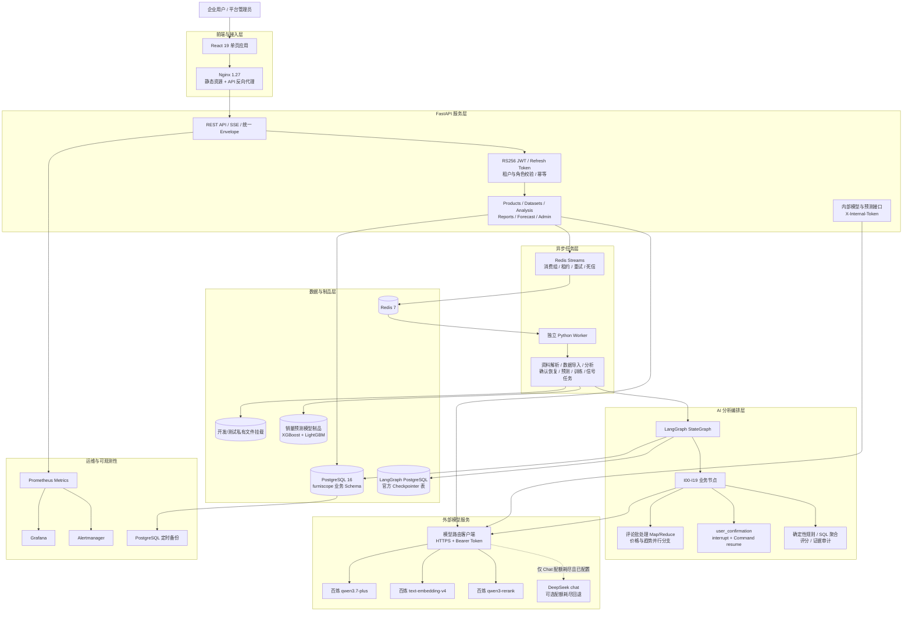
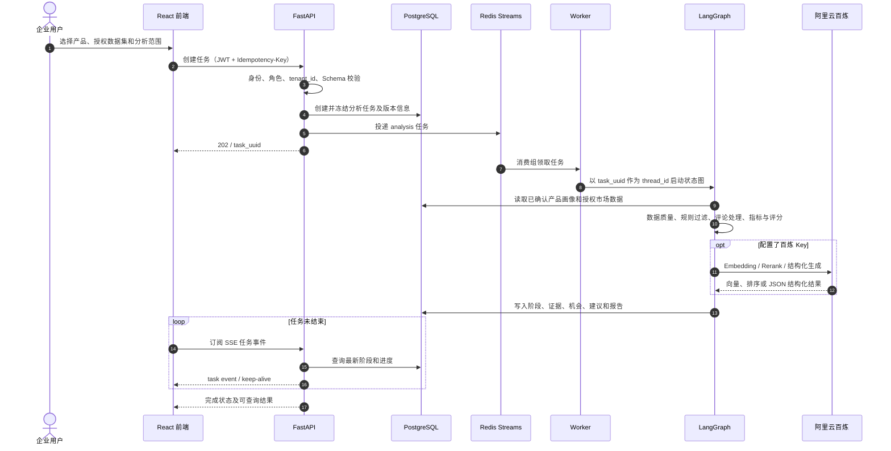
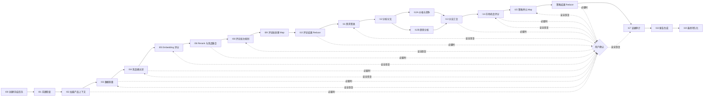

# FurniScope 技术架构及调用模型说明

> 文档用途：项目技术方案、赛事提交材料、系统交付说明。
>
> 核对基线：2026-09-14 当前仓库代码、`.env.example`、`docker-compose.yml` 和数据库 DDL。
>
> 口径说明：本文严格区分“当前已实现”“按配置启用”“开发/演示能力”和“尚未实现”。API Key、数据库密码、JWT 私钥和内部服务 Token 不写入本文。

## 4.1 系统架构图

### 4.1.1 总体架构



图中实线表示当前代码的主调用路径；虚线表示需要显式配置后才启用的可选回退路径。生产环境要求 Redis 队列、真实授权市场数据和外部分析工具模式，代码会拒绝在生产环境启用合成演示分析。

### 4.1.2 端到端业务调用链



如果节点返回事实冲突、数据不足、低置信度或高风险建议，LangGraph 会在安全业务 Checkpoint 已提交后触发 `interrupt`，任务进入 `waiting_human`。用户回答后，系统先在同一事务中保存回答并写入恢复 Outbox，再由 Worker 使用 `Command(resume=...)` 和原 `task_uuid/thread_id` 恢复工作流。

### 4.1.3 Agent 内部流程



内部节点映射为五个用户可见阶段：`understanding_product`、`researching_market`、`evaluating_opportunity`、`generating_recommendation`、`completed`。前端不展示内部 Agent 角色、模型选择细节或推理过程。

### 4.1.4 模块组成与职责

| 层级 | 模块/目录 | 当前职责 | 实现状态 |
|---|---|---|---|
| 前端 | `frontend/src/` | 登录、首页、产品中心、AI 工作台、市场数据集、洞察、报告、销量预测和 Admin | 已实现 |
| 接入 | `frontend/nginx.conf` | 托管 Vite 构建产物，将 `/api/`、`/health/` 反向代理至后端 | 已实现 |
| API | `backend/furniscope_api/app.py` | FastAPI 应用工厂、中间件、路由注册、生命周期和依赖初始化 | 已实现 |
| 认证 | `auth.py`、`security/` | RS256 JWT、Refresh Token 轮换、数据库身份复核、用户/Admin 隔离 | 已实现 |
| 业务层 | `routes/`、`services/`、`repositories/` | 请求契约、事务编排、领域服务、租户范围 SQL | 已实现 |
| 队列 | `job_queue.py` | Redis Streams、消费组、租约接管、去重、重试、死信流 | Redis 模式已实现；本地可用进程内后台任务 |
| Worker | `worker.py` | 执行分析、恢复、解析、导入、预测、训练及授权信号等长任务 | 已实现 |
| Agent | `backend/furniscope_agent/` | LangGraph 图、分段编号节点、工具箱、Checkpoint、人工确认和恢复 | 已实现 |
| 模型适配 | `model_router.py`、`services/model_router_client.py` | Chat、Embedding、Rerank 调用、Schema 校验、重试及回退 | 已实现，按密钥和运行模式启用 |
| 预测 | `backend/furniscope_forecast/`、`forecast_assets/` | 日/周销量预测、模型加载、租户制品、训练与校验 | 已实现 |
| 主数据 | `furniscope_postgresql_v3.sql`、`migrations/` | V3 基线建库及增量升级 | 已实现 |
| 文件 | `services/demo_storage.py` | Local/S3兼容私有对象存储、租户前缀、上传校验与SHA | 已实现；生产强制S3+TLS，真实云桶待环境验收 |
| 运维 | `deploy/monitoring/`、`scripts/` | Prometheus、Grafana、Alertmanager、备份恢复 | 可选 Compose Profile 已实现 |

## 4.2 调用的阿里云百炼模型

### 4.2.1 模型清单

| 模型标识 | 用途 | 实际调用位置 | 调用方式/链接链 | 当前状态 |
|---|---|---|---|---|
| `qwen3.7-plus` | 产品资料结构化抽取、基于任务证据的问答；`token_plan_demo` 模式下生成演示分析报告 | `ParseService`、分析任务 Chat、`TokenPlanDemoToolbox`、内部 `/invoke` | 业务服务/Agent → `ServiceModelRouterClient` 或 `ModelRouterClient` → `POST https://token-plan.cn-beijing.maas.aliyuncs.com/compatible-mode/v1/chat/completions` → 百炼 Token Plan | 默认文本模型，配置 Key 后启用 |
| `text-embedding-v4` | 产品签名与授权市场商品文本向量化，用于竞品语义相似度计算 | Agent I05、内部 `/embeddings` | Agent/内部服务 → `ServiceModelRouterClient.embeddings()` → `POST https://token-plan.cn-beijing.maas.aliyuncs.com/compatible-mode/v1/embeddings` → 百炼 | 已接入；固定 1024 维，向量仅在调用过程内使用 |
| `qwen3-rerank` | 对产品查询与候选商品文本进行相关性重排，输出 0–1 相关性分数 | Agent I06、内部 `/rerank` | Agent/内部服务 → `ServiceModelRouterClient.rerank()` → `POST https://token-plan.cn-beijing.maas.aliyuncs.com/compatible-api/v1/reranks` → 百炼 | 已接入；最终分数写入竞品匹配结果 |

当前仓库默认文本模型是 `qwen3.7-plus`，不是示例中的 `qwen/qwen3.7-max`。模型标识、Base URL 和 Path 均由环境变量提供，可以在部署时替换；业务代码不硬编码 API Key。

`qwen3-vl-plus` 只在旧资料中作为候选出现，当前运行配置和调用代码没有接入视觉模型。图片资料目前走 Pillow + Tesseract OCR；没有可识别文字时明确返回 `IMAGE_VISION_REQUIRED`，不会猜测图片属性。

### 4.2.2 Chat 调用协议

默认请求：

```http
POST /compatible-mode/v1/chat/completions HTTP/1.1
Host: token-plan.cn-beijing.maas.aliyuncs.com
Authorization: Bearer ${ALIYUN_MODEL_ROUTER_API_KEY}
Content-Type: application/json
```

```json
{
  "model": "qwen3.7-plus",
  "messages": [
    {"role": "system", "content": "业务约束与输出规则"},
    {"role": "user", "content": "经过裁剪的业务上下文"}
  ],
  "response_format": {"type": "json_object"}
}
```

处理约束如下：

- 所有外部模型 URL 必须是 HTTPS，认证使用服务端 Bearer Token。
- 文本模型要求 JSON Object 输出；响应从 `choices[0].message.content` 读取。
- 客户端兼容模型偶尔返回的 Markdown JSON Fence，去除 Fence 后再校验。
- 产品资料抽取使用 `ProductDocumentExtraction` Pydantic 模型校验属性、置信度和原文证据。
- 任务问答和内部模型接口还会检查必要字段，格式无效时拒绝作为业务结果。
- 默认单次超时 90 秒，最多重试 2 次，即一次初始请求加两次重试；退避上限 4 秒。
- 进程内共享 `asyncio.Semaphore(4)`，限制通用模型客户端并发请求数。
- Chat 只有在识别为“配额/余额耗尽”且配置了 `DEEPSEEK_API_KEY` 时才切换到 DeepSeek；普通超时、Schema 错误或一般 HTTP 错误不会直接跨供应商切换。
- 任务问答在模型路由不可用时使用本地证据模板回答；不会脱离任务数据生成答案。

### 4.2.3 Embedding 调用协议

```json
{
  "model": "text-embedding-v4",
  "input": ["产品签名", "候选商品文本"],
  "dimensions": 1024,
  "encoding_format": "float"
}
```

- URL：`https://token-plan.cn-beijing.maas.aliyuncs.com/compatible-mode/v1/embeddings`。
- 单批最多 10 条文本；Service 客户端会按 10 条自动分批并保持原输入顺序。
- 必须返回与输入条数一致的 `data[]`，每条向量必须严格为 1024 维。
- Agent 当前在内存中用点积计算产品向量与商品向量的相似度；原始向量不写入 PostgreSQL 或独立向量库。
- 模型不可用时，I05 节点可降级为确定性 Token 相似度，并写入 `I05_DEGRADED` 质量标记。

### 4.2.4 Rerank 调用协议

```json
{
  "model": "qwen3-rerank",
  "query": "产品签名",
  "documents": ["候选商品 1", "候选商品 2"],
  "top_n": 2
}
```

- URL：`https://token-plan.cn-beijing.maas.aliyuncs.com/compatible-api/v1/reranks`。
- 当前接口允许 1–500 个候选文本。
- 响应读取 `results[].index` 和 `results[].relevance_score`，并验证下标范围及 0–1 分数范围。
- Rerank 分数与品类、材质、风格等确定性分项共同形成竞品 `overall_score`，并写入 `competitor_matches.rerank_score`。
- 模型不可用时，I06 节点可降级为本地 Token 相似度排序，并记录降级质量标记。

### 4.2.5 配置项

```dotenv
ALIYUN_MODEL_ROUTER_API_KEY=<仅由环境变量或密钥管理服务注入>

ALIYUN_MODEL_ROUTER_CHAT_BASE_URL=https://token-plan.cn-beijing.maas.aliyuncs.com/compatible-mode/v1
ALIYUN_MODEL_ROUTER_CHAT_PATH=/chat/completions
ALIYUN_MODEL_ROUTER_TEXT_MODEL=qwen3.7-plus

ALIYUN_MODEL_ROUTER_EMBEDDING_BASE_URL=https://token-plan.cn-beijing.maas.aliyuncs.com/compatible-mode/v1
ALIYUN_MODEL_ROUTER_EMBEDDING_PATH=/embeddings
ALIYUN_MODEL_ROUTER_EMBEDDING_MODEL=text-embedding-v4
ALIYUN_MODEL_ROUTER_EMBEDDING_DIMENSIONS=1024

ALIYUN_MODEL_ROUTER_RERANK_BASE_URL=https://token-plan.cn-beijing.maas.aliyuncs.com/compatible-api/v1
ALIYUN_MODEL_ROUTER_RERANK_PATH=/reranks
ALIYUN_MODEL_ROUTER_RERANK_MODEL=qwen3-rerank

ALIYUN_MODEL_ROUTER_TIMEOUT_SECONDS=90
ALIYUN_MODEL_ROUTER_MAX_RETRIES=2
```

### 4.2.6 内部服务接口

这些接口不出现在公开 OpenAPI 中，前端不得直接调用，统一要求 `X-Internal-Token`：

| 接口 | 能力 | 输入限制 | 输出 |
|---|---|---|---|
| `POST /internal/v1/model-router/invoke` | 结构化文本生成 | 1–50 条 Message，可附简单 Required 字段 Schema | `output` JSON 对象 |
| `POST /internal/v1/model-router/embeddings` | 文本向量化 | 1–10 条非空文本，维度固定 1024 | 模型、维度、向量、Token 数和 Provider |
| `POST /internal/v1/model-router/rerank` | 候选重排序 | Query 最长 4000 字符，1–500 条候选 | 排名、原下标、相关性分数和模型 |

### 4.2.7 模型使用边界与审计现状

大模型只用于语义抽取、文本组织、问答、向量和重排，不作为业务事实计算器：

- 价格、评分、评论数量、样本比例和趋势等指标由 SQL 或确定性 Python 代码计算。
- 市场机会分由版本化规则计算，当前可见维度为需求热度、增长趋势、未满足度、竞争空间和利润空间。
- 评论原文保存在 `reviews.content_original`，观点证据必须携带原文区间和摘录。
- 外部真实数据工作流中的评论抽取、聚类、机会评分、策略与报告目前主要由确定性规则完成；百炼 Embedding/Rerank 只参与竞品语义处理。
- `token_plan_demo` 模式只用文本模型生成明确标记为 `synthetic_demo` 的报告，不得宣称为真实市场结论。
- 销量预测数值由 XGBoost + LightGBM 预测引擎产生，大模型不能修改点预测、区间或评估指标。
- `ModelRouterClient` 用于演示报告时会把 Provider、实际模型、输入哈希、Prompt/Schema 版本、Token、耗时、重试和状态写入 `ai_model_runs`。
- 通用 `ServiceModelRouterClient` 当前尚未统一写入 `ai_model_runs`；Embedding、Rerank、产品解析和任务问答的完整调用审计仍需后续收口。现有数据库表与 Prometheus 聚合指标已为统一审计预留。
- 数据库中的 `model_route_configs` 和 `prompt_templates` 已有管理接口和持久化结构，但当前运行时模型客户端仍以环境变量配置为准，尚未从这些表动态解析路由。

## 4.3 技术组件说明

### 4.3.1 前端技术栈

| 组件 | 当前技术 | 说明 |
|---|---|---|
| UI 框架 | React 19.2.0、React DOM 19.2.0 | 函数组件与 Hooks；未引入 Redux 等全局状态框架 |
| 构建工具 | Vite 6.4.3、`@vitejs/plugin-react` 5.0.4 | 开发服务器、生产构建和静态资源打包 |
| 图标 | `@phosphor-icons/react` 2.1.10 | 统一产品图标来源 |
| 页面路由 | 浏览器 Hash Navigation | `location.hash` + `hashchange`；当前未引入 React Router |
| API 通信 | 浏览器 `fetch` 封装 | 统一 JSON Envelope、Bearer Token、401 自动刷新和错误处理 |
| 实时进度 | 认证 SSE | 使用 `fetch` + `ReadableStream` 读取 `/events`，便于携带 Authorization Header；前端支持失败后轮询兜底 |
| 本地状态 | React State、`sessionStorage`、`localStorage` | Token 放 `sessionStorage`；邮箱、界面宽度、草稿等非密钥偏好放 `localStorage` |
| 文件能力 | `read-excel-file` 5.8.8 | 前端 Excel 辅助读取；权威校验和落库仍由后端完成 |
| 测试 | Node Test Runner、Playwright 1.63 | Sites Worker 测试、API 合约及全栈 E2E |
| 生产承载 | Node 22 构建 + Nginx 1.27 | 多阶段镜像；Nginx 托管 `dist/client` 并代理后端 API |

前端主要业务域包括：企业认证、运营首页、产品中心、AI 工作台、市场数据集与评论舆情、竞品跟踪、市场洞察、决策报告、销量预测、工作日记，以及与企业用户界面隔离的平台管理端。

### 4.3.2 后端技术栈

| 组件 | 当前技术 | 说明 |
|---|---|---|
| 运行时 | Python 3.12 | Backend 和 Worker 统一运行版本 |
| Web 框架 | FastAPI 0.141.1、Starlette 1.6、Uvicorn 0.52 | REST、SSE、依赖注入、中间件和生命周期 |
| 契约校验 | Pydantic 2.13、Pydantic Settings 2.15 | 请求/响应 Schema、模型输出 Schema 和环境配置校验 |
| 数据访问 | SQLAlchemy Async 2.0、asyncpg、psycopg 3 | API 用 SQLAlchemy Async；Agent 高并发 SQL 用 asyncpg；LangGraph PostgreSQL Checkpointer 用 psycopg |
| HTTP 客户端 | HTTPX 0.28 | 百炼、DeepSeek 和外部授权信号请求 |
| 认证与密码 | PyJWT、Cryptography、pwdlib/Argon2id | RS256 Access Token、Opaque Refresh Token 哈希存储、密码安全散列 |
| 异步队列 | Redis-py Async + Redis Streams | 任务投递、消费组、超时、租约接管、重试与死信 |
| 文件解析 | PyMuPDF、Pillow、Tesseract OCR、openpyxl | PDF 文本/OCR、图片 OCR、XLSX 单元格读取和签名检查 |
| 数据分析/ML | pandas、NumPy、scikit-learn、XGBoost、LightGBM | 销量数据清洗、特征工程、日/周预测和评估 |
| 可观测性 | JSON Logging、Prometheus Client | Request ID、敏感字段脱敏、HTTP/任务/模型/预测/连接池指标 |

后端采用 `Route → Service → Repository/Runtime` 的分层方式：Route 负责 HTTP 契约和鉴权，Service 负责编排事务与业务规则，Repository/Runtime 负责持久化和模型执行。公开业务 API 主要位于 `/api/v1`，内部服务接口位于 `/internal/v1`。

### 4.3.3 数据库与持久化

#### PostgreSQL 主数据库

当前 Compose 使用 PostgreSQL 16，业务 Schema 为 `furniscope`，仅显式启用 `pgcrypto` 扩展。主要数据域如下：

| 数据域 | 代表性表 | 保存内容 |
|---|---|---|
| 租户与认证 | `tenants`、`users`、`auth_sessions` | 租户、用户、角色、刷新会话和状态 |
| 幂等与审计 | `api_idempotency_records`、`audit_logs` | 写请求回放、防重复提交和管理操作审计 |
| 产品与企业 | `enterprise_profiles`、`products`、`product_profile_versions`、`product_attributes`、`manufacturing_capabilities` | 产品主数据、版本化画像、属性和制造能力 |
| 文件与解析 | `file_assets`、`product_parse_jobs`、`product_parse_job_files` | 文件元数据、对象键、SHA-256 和解析状态 |
| 授权市场数据 | `market_datasets`、`market_listings`、`reviews` | 数据集、商品快照、评论原文与质量状态 |
| Agent 运行 | `analysis_tasks`、`task_stage_runs`、`workflow_checkpoints`、`workflow_control_events`、`user_confirmations` | 任务状态、节点运行、业务 Checkpoint、恢复 Outbox 和人工确认 |
| AI 审计 | `prompt_templates`、`model_route_configs`、`ai_model_runs` | Prompt/路由配置及模型调用记录 |
| 洞察与证据 | `competitor_matches`、`review_aspects`、`insight_clusters`、`market_metrics`、`market_opportunities`、`product_recommendations`、`evidence_links`、`analysis_reports` | 竞品、评论观点、聚类、指标、机会、建议、证据与报告 |
| 销量预测 | `forecast_*` 系列表 | 预测模型、部署、任务、结果、训练运行和 SKU 映射 |

隔离原则：普通业务查询必须包含 `tenant_id`；JWT 中的租户和角色还会与数据库用户、租户状态二次核验。内部记录常用 BIGINT，外部任务、报告和工作流事件使用 UUID。业务写操作广泛使用事务、唯一约束、幂等记录和租户范围检查。

#### LangGraph Checkpointer

系统同时存在两类 Checkpoint，不能混为一谈：

- LangGraph 官方 PostgreSQL Checkpointer：由 `AsyncPostgresSaver` 创建和维护，保存可供状态图恢复的完整内部状态，以 `task_uuid` 作为 `thread_id`。
- `furniscope.workflow_checkpoints`：业务安全投影，只保存 ID、版本、引用、哈希和可恢复标志，不保存文件字节、评论全文或向量。

#### Redis

Redis 7 当前承担任务基础设施职责，不是业务事实库：

- 主 Stream：`furniscope:jobs`；死信 Stream：`furniscope:jobs:dead`。
- 消费组：`furniscope-workers`。
- 通过 `XAUTOCLAIM` 接管超过租约时间的未确认消息。
- 默认 Worker 并发 2、租约 120 秒、最多尝试 3 次、单任务超时 900 秒。
- Job ID 去重键默认保留 7 天；失败达到上限后进入死信流。
- Worker 每 30 秒执行数据库补投、授权信号调度和通知投递维护。
- 最终任务状态和业务结果始终以 PostgreSQL 为准。

#### 文件与模型制品

`create_object_storage()`按配置选择Local或S3兼容后端。Local后端把文件保存在
`DEMO_STORAGE_ROOT`下的租户前缀目录，随机命名并设置`0600`；S3后端通过MinIO客户端
连接私有桶，沿用相同租户前缀、MIME校验和SHA-256契约。数据库只保存`storage_key`、
MIME、大小和SHA。`APP_ENV=production`强制`STORAGE_BACKEND=s3`、TLS、预创建桶，
并拒绝自动建桶。Compose的MinIO Profile仅用于本地兼容性联调；真实云桶、凭据轮换、
版本控制、对象锁和短期签名下载仍须在目标环境验收。

销量预测制品位于受控服务端目录，包含 `daily.pkl`、`weekly.pkl`、日/周模型、编码器、元数据和校验清单。客户端不能传入任意文件系统路径；租户制品必须位于配置的受管根目录并通过归属和路径逃逸检查。

### 4.3.4 向量库与检索方式

当前系统没有部署 Milvus、Elasticsearch/OpenSearch、FAISS 服务或 PostgreSQL `pgvector` 扩展，也没有持久化向量索引。当前语义检索链为：

```text
租户/数据集授权校验
  → 品类与属性确定性过滤
  → text-embedding-v4 生成 1024 维向量
  → Worker 内存中计算相似度
  → qwen3-rerank 对候选文本重排
  → 确定性分项合成 overall_score
  → PostgreSQL 保存竞品类型、分项、rerank_score 和匹配理由
```

因此，`text-embedding-v4` 是向量模型，不等于“系统已经使用向量数据库”。当前方案适合单个授权数据集内的有限候选；若未来数据量需要跨数据集的大规模近似最近邻检索，再引入 `pgvector` 或独立向量服务，并补充租户分区、索引版本、Embedding 版本和重建机制。

### 4.3.5 Agent 框架与工作流

| 能力 | 当前实现 |
|---|---|
| 图框架 | LangGraph 1.2.10 `StateGraph` |
| 状态模型 | `FurniScopeGraphState` TypedDict，只保存控制信息、ID、版本和轻量引用 |
| Checkpoint | `langgraph-checkpoint-postgres` 3.1.2 + 业务安全投影 |
| 并行执行 | 评论批次使用 `Send` 做 Map/Reduce；价格与趋势做并行 Fork/Join；建议按策略单元 Map/Reduce |
| 节点幂等 | `task_stage_runs` 保存输入哈希、尝试次数和结果引用；成功节点可复用 |
| 重试与降级 | 节点有界重试；Embedding、Rerank、聚类、趋势、建议和报告等节点有显式确定性回退 |
| 部分失败 | 非阻断分支可写入 `workflow_partial_failures`，同时下调结论置信度 |
| Human-in-the-loop | 统一 `user_confirmation`、安全 Checkpoint、事务 Outbox、`Command(resume=...)` |
| 范围执行 | `target_node` 可在产品、市场、评分或方案边界停止，不伪造完整报告 |
| 对外投影 | 当前注册 I00–I06、I08–I15、I17–I19 及并行子节点，并映射为五个用户阶段；I07、I16 未注册为运行节点 |

当前有三种分析运行模式：

| 模式 | 工具箱 | 数据与模型行为 | 适用范围 |
|---|---|---|---|
| `demo_only` | `SyntheticFurnitureToolbox` | 使用显式合成数据和确定性演示结果 | 本地演示/测试 |
| `token_plan_demo` | `TokenPlanDemoToolbox` | 演示数据仍标记 `synthetic_demo`，仅报告写作真实调用配置的 Chat 模型 | 赛事 Token Plan 演示 |
| `external` | `ExternalFurnitureToolbox` | 读取已授权数据库数据；Embedding/Rerank 在有 Key 时调用百炼，其余事实与评分走确定性逻辑 | 真实数据分析 |

生产配置会强制 `ANALYSIS_WORKER_MODE=external`、`ANALYSIS_TOOL_MODE=external`、`PRODUCT_PARSE_MODE=model` 和 `JOB_QUEUE_MODE=redis`。

### 4.3.6 数据处理方式

系统总体采用“确定性数据处理 + 可校验的模型语义能力 + 版本化规则评分”的混合方法。

#### A. 产品资料处理

```text
PDF / XLSX / JPG / PNG
  → 文件大小、MIME、扩展名和文件签名检查
  → 私有文件存储 + SHA-256 元数据
  → Redis product_parse 任务
  → PDF 原生文本 / 扫描页 OCR / XLSX 单元格 / 图片 OCR
  → qwen3.7-plus 结构化抽取
  → Pydantic 校验 attribute_code、value、unit、confidence、evidence_text
  → 合并同名属性时保留更高置信度结果
  → 创建待用户确认的产品画像版本
```

PDF 最多 80 页，提取文本最多 120,000 字符。模型只允许从原文抽取，不能猜测；纯视觉图片尚无视觉模型，OCR 为空即失败。

#### B. 市场数据导入与清洗

```text
JSON / CSV / XLSX 授权文件
  → Schema 与必填列检查
  → 商品按 platform_listing_id 取最新快照
  → 评论关联商品、空文本/重复/乱码/Spam 检查
  → 规范化日期、价格、评分、语言和情感字段
  → 写入 market_listings / reviews
  → 生成导入前后数量、过滤原因和质量分
  → 更新数据集为 ready，并生成竞品跟踪快照
```

原始评论保留在 `content_original`。系统不会用翻译文本或模型生成文本覆盖原文；无效评论保留明确原因，供质量统计和审计。

#### C. 市场分析

```text
已确认产品画像 + ready 授权数据集
  → 前置与授权检查
  → 数据质量、样本量和趋势可用性检查
  → 竞品规则过滤、Embedding、Rerank
  → 评论分批抽取观点与原文证据
  → 需求聚类
  → 价格/竞争与趋势并行分析
  → 市场机会评分
  → 产品策略与风险项
  → 证据审计
  → 在线决策报告
```

当前 `external` 工具箱的评论观点抽取使用家具领域关键词 Taxonomy、评分和情感规则，并写入一条可定位原文的 Evidence Span；聚类、价格指标、机会评分、建议和报告也以 SQL/确定性逻辑为主。这样可以保证数值和来源可复核，但应避免对外宣称全部环节都由大模型完成。

#### D. 销量预测

```text
历史订单 / 可选库存工作簿
  → pandas 清洗、字段规范化、订单与 SKU 聚合
  → 日期补齐、价格/折扣/库存等特征工程
  → 日粒度与周粒度训练集
  → XGBoost + LightGBM 0.5/0.5 集成
  → 预测值、区间、可靠性与生产/安全库存建议
  → 任务结果及版本写入 PostgreSQL
```

销量预测与市场机会评分是两个独立的确定性业务域：前者依据订单时间序列，后者依据市场商品与评论证据，不能互相替代。默认模型版本为 `sales-forecast-v4`，日模型约 40 个特征、周模型约 48 个特征；模型制品在加载前进行存在性和指纹校验。

### 4.3.7 安全、可靠性与可观测性

- Access Token 使用 RS256，默认有效期 900 秒；公钥按 `kid` 选择并验证 issuer、audience、时间和完整身份 Claim。
- Refresh Token 为随机不透明 Token，数据库只保存 SHA-256，并在刷新时轮换。
- 密码使用推荐参数的 Argon2id；不存在账号时也执行常量工作量验证，减少时序泄露。
- 前端模型 Key 零接触；外部服务密钥只从环境变量读取，日志会脱敏 Authorization、Token、Key、Prompt 和评论正文等字段。
- 写接口通过 `Idempotency-Key` 和 PostgreSQL 持久化记录防止重复执行；任务队列另有 Job ID 去重。
- 每个请求生成或校验 UUID 格式 `X-Request-ID`，响应回传该 ID，JSON 日志记录路由、状态和耗时。
- `/health/live` 用于存活检查；`/health/ready` 检查数据库及启用后的 Redis，并报告模型路由配置状态。
- `/metrics` 暴露低基数 HTTP 指标，并从 PostgreSQL 汇总任务、模型调用、预测任务和连接池状态。
- Compose 的 `monitoring` Profile 可启动 Prometheus、Grafana、Alertmanager、PostgreSQL/Redis/Node/cAdvisor Exporter。
- Compose 的 `operations` Profile 可执行 PostgreSQL 定时备份；仓库还提供备份恢复校验脚本。

### 4.3.8 部署拓扑

| Compose 服务 | 镜像/运行方式 | 端口或职责 |
|---|---|---|
| `frontend` | Node 22 构建，Nginx 1.27 运行 | 宿主机 `8083` → 容器 `80` |
| `backend` | Python 3.12 + Uvicorn | 容器 `8000`，提供 API/SSE/Health/Metrics |
| `worker` | 同一 Python 应用镜像 | 独立执行 Redis 长任务；容器内 `9108/metrics`，不映射公网 |
| `postgres` | `postgres:16-alpine` | 仅绑定 `127.0.0.1:5432` |
| `redis` | `redis:7-alpine`，AOF 开启 | 仅绑定 `127.0.0.1:6379` |
| `backup` | PostgreSQL 工具镜像 | `operations` Profile |
| `pitr-backup` | PostgreSQL工具镜像 | `disaster-recovery` Profile；复制账号基础备份与校验 |
| `minio` / `minio-init` | S3兼容对象存储 | `object-storage` Profile；仅本地联调 |
| `caddy` | Caddy 2 | `tls` Profile；ACME HTTPS、HSTS与安全响应头 |
| `prometheus` / `grafana` / `alertmanager` / Exporters | 独立监控镜像 | `monitoring` Profile |

### 4.3.9 测试与质量保障

- Python 单元与集成测试使用 Pytest 9.1、Pytest Asyncio 1.4。
- Agent 图测试覆盖状态流转、并行节点、降级、确认和恢复。
- 模型合约测试使用 HTTPX Mock Transport 验证 Chat、Embedding、Rerank 的 URL、请求体、维度、排序及错误路径，不消耗真实模型额度。
- PostgreSQL 集成测试验证租户隔离、认证、持久化幂等、任务和预测写入。
- Playwright 覆盖关键前后端契约、会话过期、任务范围执行、市场洞察和销量预测历史。
- 依赖通过 `requirements.lock` 与 `package-lock.json` 固定；生产镜像使用多阶段前端构建。

### 4.3.10 当前实现边界汇总

| 项目 | 当前结论 |
|---|---|
| 独立向量数据库 | 未使用；向量仅在 Worker 内存中计算，PostgreSQL 保存业务分数和引用 |
| 视觉大模型 | 未接入；当前只有 OCR，纯图片理解会返回明确错误 |
| 生产对象存储 | S3兼容适配器及生产强校验已实现；真实云桶、签名下载和运维策略待目标环境验收 |
| HTTPS | Caddy Profile与安全响应头已配置；真实域名、ACME签发和网关演练待目标环境验收 |
| WAL/PITR | WAL归档、复制角色、周期基础备份、校验和恢复准备脚本已配置；当前机器Docker未运行，尚无恢复演练证据 |
| 生产监控 | API与Worker指标、Prometheus/Grafana/Alertmanager及Exporter已配置；外部告警接收器和容量阈值待生产校准 |
| 模型动态路由 | 管理表与接口已存在，但运行时仍以环境变量为准 |
| 全链路模型审计 | 演示报告调用已落库；通用 Chat/Embedding/Rerank 客户端尚未全部统一落库 |
| 生产异步执行 | 已支持 Redis Streams Worker；生产配置强制使用 Redis |
| 真实数据分析 | `external` 工具箱已实现，并强制要求已确认画像、ready 数据集和授权说明 |
| 合成演示数据 | 仅开发/赛事演示可用，生产环境配置校验会拒绝 |

## 参考实现文件

- [README.md](../README.md)：产品定位、系统架构和启动方式。
- [.env.example](../.env.example)：模型、数据库、队列、认证和预测配置。
- [docker-compose.yml](../docker-compose.yml)：应用、数据、Worker 和运维服务编排。
- [backend/furniscope_api/config.py](../backend/furniscope_api/config.py)：运行模式、模型地址及生产约束。
- [backend/furniscope_api/app.py](../backend/furniscope_api/app.py)：FastAPI 应用和路由装配。
- [backend/furniscope_api/services/model_router_client.py](../backend/furniscope_api/services/model_router_client.py)：通用 Chat、Embedding 和 Rerank 客户端。
- [backend/furniscope_agent/model_router.py](../backend/furniscope_agent/model_router.py)：带模型运行 Trace 的结构化生成客户端。
- [backend/furniscope_agent/graph.py](../backend/furniscope_agent/graph.py)：LangGraph 图、并行分支和恢复入口。
- [backend/furniscope_agent/external_toolbox.py](../backend/furniscope_agent/external_toolbox.py)：真实授权数据分析能力与确定性计算。
- [backend/furniscope_api/worker.py](../backend/furniscope_api/worker.py)：Redis 长任务 Worker。
- [backend/furniscope_api/services/document_parser.py](../backend/furniscope_api/services/document_parser.py)：PDF、XLSX、图片 OCR 与安全解析。
- [backend/furniscope_api/services/forecast_runtime.py](../backend/furniscope_api/services/forecast_runtime.py)：销量预测制品加载和租户隔离。
- [furniscope_postgresql_v3.sql](../furniscope_postgresql_v3.sql)：PostgreSQL V3 建库基线。
