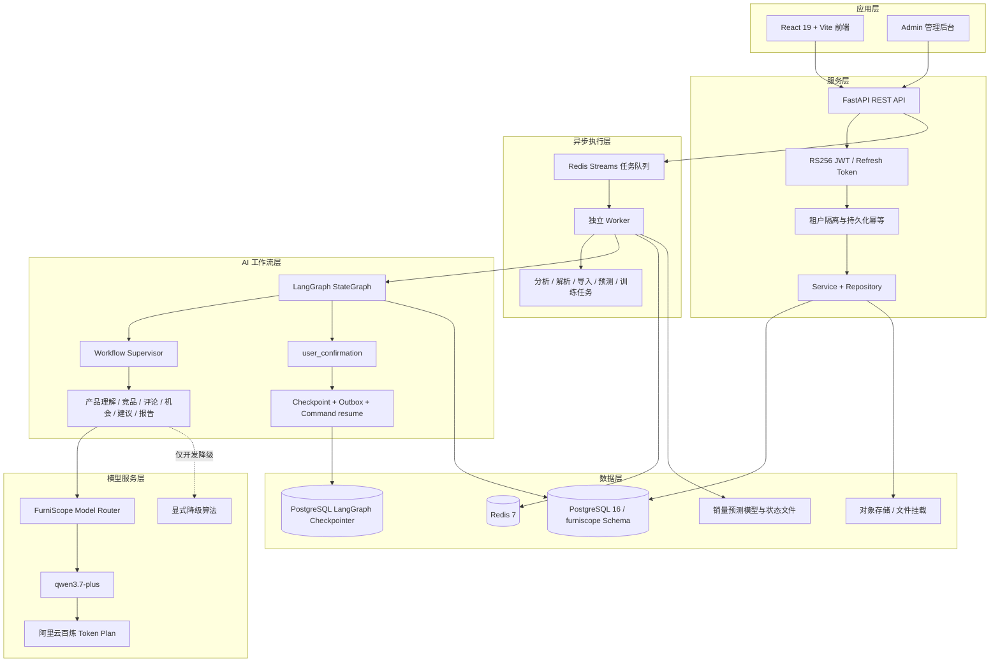

# FurniScope 技术架构及调用模型说明

> 文档用途：用于项目技术方案、赛事材料和系统交付说明。
>
> 口径说明：本文以当前仓库代码和运行配置为准，区分“已实现能力”和“设计/接口预留能力”。API Key、数据库密码和内部服务 Token 不写入本文。

## 4.1 系统架构图

### 4.1.1 总体架构



### 4.1.2 端到端调用链

```text
用户在 React 页面提交产品、企业能力和授权市场数据
  -> FastAPI 校验身份、tenant_id、请求 Schema 和幂等键
  -> PostgreSQL 创建或冻结业务任务
  -> Redis Streams 投递长任务
  -> Worker 获取任务并启动 LangGraph StateGraph
  -> Workflow Supervisor 编排内部能力和确定性计算
  -> 需要语义理解时调用 FurniScope Model Router
  -> Model Router 通过 OpenAI 兼容协议调用阿里云百炼
  -> 模型输出通过 JSON Schema、证据和业务规则校验
  -> 结果、证据、模型运行和阶段状态写回 PostgreSQL
  -> 前端查询五阶段进度并展示市场洞察、建议和在线报告
```

当出现关键事实冲突、数据不足、低置信度或高风险建议时，工作流保存安全 Checkpoint，任务进入 `waiting_human`。用户回答后，Worker 使用服务端生成的 `Command(resume=...)` 从原阶段继续执行。

### 4.1.3 主要模块

| 模块 | 主要职责 |
|---|---|
| `frontend/` | React 页面、登录、产品中心、分析任务、市场洞察、决策报告、销量预测和管理后台 |
| `backend/furniscope_api/` | FastAPI 应用、认证、租户上下文、业务 API、服务层和数据库访问 |
| `backend/furniscope_agent/` | LangGraph 状态图、I00-I19 节点、重试、降级、确认和恢复 |
| `backend/furniscope_forecast/` | 销量预测运行时和预测模型适配 |
| `worker` | 异步执行分析、产品资料解析、市场数据导入、销量预测和训练任务 |
| `furniscope_postgresql_v3.sql` | PostgreSQL V3 从零建库基线 |
| `forecast_assets/` | 预测模型状态、训练数据、模型清单和租户制品 |

## 4.2 调用的阿里云百炼模型

### 4.2.1 模型清单

| 模型标识 | 用途 | 当前状态 |
|---|---|---|
| `qwen3.7-plus` | 产品资料和评论等文本的结构化抽取、复杂推理、工程建议、报告组织；Token Plan Demo 模式下用于生成分析报告 | 当前代码和环境配置中的默认文本模型 |
| 赛事模型目录中的可配置模型 | 主模型失败时的路由切换或降级 | 由 admin/运行配置管理，不在业务代码中硬编码具体备用模型 |
| `text-embedding-v4` | 产品、竞品和评论观点向量化 | 已接入百炼 `/embeddings`，当前固定 1024 维 |
| `qwen3-rerank` | 竞品和证据候选重排序 | 已接入百炼 `/reranks`，返回 0-1 的相关性分数 |

> 说明：`qwen3-vl-plus` 仍属于历史候选；`text-embedding-v4` 和 `qwen3-rerank` 已按照 V3 接口契约接入，但是否可用仍取决于运行环境配置和百炼账号权限。

### 4.2.2 调用方式

当前文本模型调用通过阿里云百炼 Token Plan 提供的 OpenAI 兼容网关完成：

```text
FurniScope Agent / 产品解析服务
  -> ModelRouterClient 或 ServiceModelRouterClient
  -> HTTPS POST
  -> https://token-plan.cn-beijing.maas.aliyuncs.com/compatible-mode/v1/chat/completions
  -> 阿里云百炼 Token Plan
  -> qwen3.7-plus
```

对应环境变量：

```dotenv
ALIYUN_MODEL_ROUTER_API_KEY=<仅注入运行环境，不提交到代码仓库>
ALIYUN_MODEL_ROUTER_CHAT_BASE_URL=https://token-plan.cn-beijing.maas.aliyuncs.com/compatible-mode/v1
ALIYUN_MODEL_ROUTER_CHAT_PATH=/chat/completions
ALIYUN_MODEL_ROUTER_TEXT_MODEL=qwen3.7-plus
ALIYUN_MODEL_ROUTER_TIMEOUT_SECONDS=90
ALIYUN_MODEL_ROUTER_MAX_RETRIES=2
```

### 4.2.3 请求与响应约束

- 使用 HTTPS 和 Bearer API Key。
- 请求使用 OpenAI 兼容的 `messages` 结构。
- 请求要求 JSON 对象输出：`response_format.type=json_object`。
- 返回内容先经过 JSON 解析，再使用 Pydantic/JSON Schema 校验。
- 输出不符合 Schema 时进行有限重试；不能无限重试或直接写入业务结果。
- 429、超时和部分 5xx 错误执行有界指数退避。
- 内容安全拒绝、认证失败和确定性业务错误不进行无限重试。
- 每次调用记录实际模型、任务类型、输入哈希、Prompt 版本、输出 Schema 版本、Token、耗时、重试次数和状态。
- API Key 只存在于环境变量或密钥管理服务，不进入数据库、前端、日志和报告。

### 4.2.4 内部模型接口

后端提供仅供服务间调用的内部接口，前端不可直接访问：

| 接口 | 用途 | 当前实现 |
|---|---|---|
| `POST /internal/v1/model-router/invoke` | 结构化文本生成 | 调用阿里云百炼文本模型 |
| `POST /internal/v1/model-router/embeddings` | 文本向量化 | 调用百炼 `text-embedding-v4`，返回 1024 维向量 |
| `POST /internal/v1/model-router/rerank` | 候选重排序 | 调用百炼 `qwen3-rerank`，返回相关性分数和排名 |

这些接口使用 `X-Internal-Token` 进行服务间鉴权，并由后端统一处理错误映射、Schema 校验和调用限制。

### 4.2.5 模型使用边界

模型只负责语义理解、结构化抽取和自然语言表达，不负责直接生成未经验证的业务事实：

- 价格、评论数量、比例、趋势、评分等市场指标由 SQL 或确定性程序计算。
- 机会评分和企业制造适配由版本化规则计算。
- 评论证据必须引用原文 Span，模型不能改写原始评论作为证据。
- 报告生成只能使用已通过证据审计的结构化结果。
- 预测模型的点预测、区间和评估指标不能由大模型修改。

## 4.3 技术组件说明

### 4.3.1 前端技术栈

| 组件 | 技术/用途 |
|---|---|
| UI 框架 | React 19 |
| 构建工具 | Vite 6 |
| 图标 | Phosphor Icons |
| API 通信 | 浏览器 `fetch` 封装，统一处理 JSON Envelope、JWT 刷新、错误和任务事件 |
| 页面能力 | 登录、产品中心、AI 分析、市场数据集、市场洞察、决策报告、销量预测、企业设置和 Admin |
| 状态与导航 | React 组件状态、Session Storage 会话、Hash 路由式页面切换 |
| 实时/异步反馈 | 分析任务状态查询和事件流能力；长任务由后端 Worker 执行 |
| 测试 | Node Test Runner、Playwright 合约和端到端测试 |

前端不保存模型 Key、数据库凭据或租户控制字段。访问令牌短期有效，过期后通过 Refresh Token 轮换；刷新失败则清理会话。

### 4.3.2 后端技术栈

| 组件 | 技术/用途 |
|---|---|
| Web 框架 | Python 3.12 + FastAPI |
| 数据校验 | Pydantic / Pydantic Settings |
| ORM/数据库访问 | SQLAlchemy Async、asyncpg、psycopg |
| 身份认证 | RS256 JWT、短期 Access Token、轮换 Refresh Token |
| 异步任务 | Redis Streams、消费组、租约、重试和死信流 |
| 文件处理 | 文件签名校验、对象存储/本地挂载、PDF/XLSX/图片解析链路 |
| 日志与可观测性 | Request ID、脱敏日志、Prometheus/Grafana 可选监控 |
| 业务分层 | Routes、Schemas、Services、Repositories、Agent Adapter |
| API 规范 | `/api/v1` 业务接口、统一成功/失败 Envelope、稳定错误码、写接口幂等 |

### 4.3.3 数据库与持久化

#### PostgreSQL

PostgreSQL 16 是系统主数据库，业务 Schema 为 `furniscope`。主要保存：

- 租户、用户、认证会话和审计日志；
- 产品、版本化产品画像、产品属性和制造能力；
- 授权市场数据集、商品快照和评论原文；
- 分析任务、阶段运行、部分失败、确认和恢复事件；
- 竞品匹配、评论观点、需求聚类、市场指标和机会评分；
- 工程建议、证据链接、在线报告和 AI 模型运行记录；
- 预测任务、预测运行和预测结果。

数据库设计强调租户隔离、幂等、版本化和证据可追溯。业务查询必须带 `tenant_id`，内部主键通常使用 BIGINT，对外任务和报告使用 UUID。

#### LangGraph Checkpointer

LangGraph 官方 Checkpointer 使用 PostgreSQL 连接和官方表结构，保存完整 Graph State。业务库中的 `workflow_checkpoints` 只是安全业务投影，二者职责不同：

- 官方 Checkpointer：保存工作流恢复所需的图状态。
- 业务 Checkpoint 投影：保存业务可校验的恢复阶段、哈希和安全标记。

#### Redis

Redis 7 用于：

- Redis Streams 异步任务队列；
- Worker 消费组、租约和任务重投；
- 短期运行状态、限流或缓存；
- 失败任务和死信流处理。

Redis 不是业务事实库，任务最终状态和结果仍以 PostgreSQL 为准。

#### 对象存储

产品图片、PDF、Excel/CSV、导入文件和预测制品使用对象存储或受控文件挂载保存。PostgreSQL 只保存文件元数据、对象键、哈希、解析状态和引用，不直接保存文件字节。

### 4.3.4 向量库与检索方式

当前系统没有单独部署并作为事实依赖的 Milvus、Elasticsearch 或独立向量数据库。向量能力通过百炼模型和可替换的内部接口实现：

1. 先按租户、品类、市场、数据集和产品属性进行确定性过滤。
2. 对候选商品或评论观点生成向量。
3. 执行相似度召回或重排序。
4. 将候选 ID、分数和匹配理由写回 PostgreSQL。
5. 对最终结论保留来源和证据引用。

当前外部分析链的竞品召回使用百炼 `text-embedding-v4`，竞品重排使用百炼 `qwen3-rerank`。百炼不可用时，只有显式配置的开发/降级路径才允许使用本地确定性算法；生产环境不应静默将本地结果标记为百炼结果。

### 4.3.5 Agent 框架与工作流

系统使用 LangGraph `StateGraph` 编排一个对用户统一呈现的“超级 AI 员工”，内部能力不是用户角色。主要机制包括：

- I00-I19 细粒度节点；
- 串行节点、并行 Map/Reduce 和 Join；
- 成功节点结果复用，避免重复调用和重复计费；
- 节点有界重试和规则/算法降级；
- 非阻断分支支持部分成功并降低报告置信度；
- 统一 `user_confirmation` 人工中断；
- PostgreSQL Checkpoint 和事务 Outbox；
- 使用 `Command(resume=...)` 安全恢复；
- 对外只展示五个业务阶段，不暴露内部节点编号和模型切换。

### 4.3.6 数据处理方式

系统采用“确定性数据处理 + 模型语义分析 + 规则评分”的混合方式：

```text
原始产品/市场文件
  -> 文件安全检查和格式解析
  -> 标准化产品画像、市场商品和评论
  -> 数据质量校验、去重、字段映射和授权检查
  -> 竞品硬过滤与语义召回
  -> 评论批量抽取观点、情感、场景和原文证据
  -> 需求聚类、价格/趋势/企业适配分析
  -> 六维机会评分和独立置信度
  -> 工程建议与证据审计
  -> 在线决策报告
```

数据处理原则：

- 只分析用户有权使用的市场数据；
- 未知能力保持 `unknown`，不使用 0 替代；
- 原始评论不可被翻译或生成内容覆盖；
- 大文本、文件字节、向量和评论全文不进入 LangGraph State；
- Agent State 只保存 ID、引用、版本和控制信息；
- 所有模型结果绑定输入哈希、模型、Prompt 和 Schema 版本；
- 数据不足、证据不足或趋势条件不满足时，降低置信度或停止对应结论；
- 市场分析只使用带授权依据的企业数据包；HeFeng 现网数据按已授权市场数据处理。

### 4.3.7 销量预测组件

销量预测是市场洞察中的独立确定性能力，不与六维机会评分合并：

- 运行引擎：`backend/furniscope_forecast/`；
- 默认模型版本：`sales-forecast-v4`；
- 模型和状态文件由服务端配置定位，客户端不能提交模型路径；
- 任务通过 Redis Worker 异步执行；
- 结果包含 SKU、站点、时间粒度、预测周期、预测值、区间、模型版本和数据质量信息；
- 模型制品通过 checksum 校验；
- 大模型只能解释预测结果，不能修改预测数值。

## 参考实现文件

- [README.md](../README.md)：产品定位、架构和启动方式。
- [`.env.example`](../.env.example)：运行配置和百炼模型环境变量。
- [`backend/furniscope_api/config.py`](../backend/furniscope_api/config.py)：FastAPI 运行配置。
- [`backend/furniscope_agent/model_router.py`](../backend/furniscope_agent/model_router.py)：阿里云百炼文本调用、重试和 Schema 校验。
- [`backend/furniscope_api/services/model_router_client.py`](../backend/furniscope_api/services/model_router_client.py)：服务层模型调用、Embedding 和 Rerank 当前实现。
- [`backend/furniscope_agent/graph.py`](../backend/furniscope_agent/graph.py)：LangGraph 图构建和恢复入口。
- [`backend/furniscope_api/worker.py`](../backend/furniscope_api/worker.py)：异步任务 Worker。
- [`docker-compose.yml`](../docker-compose.yml)：PostgreSQL、Redis、Backend、Worker 和 Frontend 服务编排。
