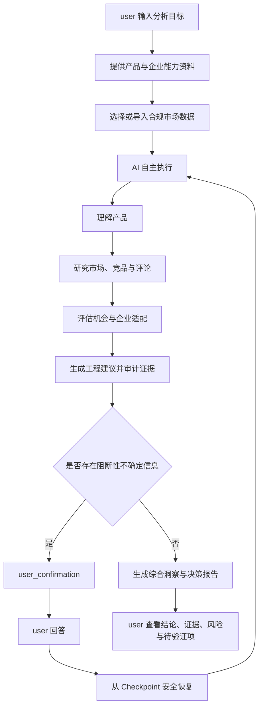

# FurniScope 跨境家具超级 AI 员工

## 产品需求规格说明书（SRS/PRD）V2.0

| 文档项 | 内容 |
|---|---|
| 产品名称 | FurniScope——跨境家具超级 AI 员工 |
| 参赛赛道 | 赛道三：AI 市场洞察 |
| 细分方向 | AI 评论深度挖掘 + AI 智能选品 |
| 目标行业 | 中国跨境家具制造业，P0 聚焦沙发品类 |
| 文档版本 | V2.0 |
| 文档状态 | 简化重构后的产品与开发基线 |
| 编制日期 | 2026-08-09 |
| 上位决策 | 《FurniScope产品简化决策基线V1》 |

> **口径声明：**本文档将 FurniScope 定义为由一个 `user` 直接使用的跨境家具超级 AI 员工。系统内部多个 Agent 是专业能力，不是系统角色。客户问卷中的已确认内容视为初步业务证据；未填写、不确定或由 AI 补充的内容均为待验证项。性能、准确率和业务收益均为目标，不代表已经实现或证明。

---

# 1. 执行摘要

## 1.1 一句话定位

**FurniScope 是由一个用户直接管理的跨境家具超级 AI 员工：用户提供产品、企业能力和目标市场，AI 自主完成市场研究、竞品分析、评论洞察、机会判断、产品建议与证据化报告，只在关键事实冲突、数据不足或高风险建议无法安全判断时请求用户确认。**

## 1.2 核心价值

家具企业不是缺少图片、参数、报价和评论，而是缺少一个能够把这些信息连续转化为产品决策的智能执行主体。FurniScope 将传统产品、市场、数据、工程和报告分析能力封装为一个超级 AI 员工，为 user 完成：

1. 将图片、参数表、PDF 和报价转化为可追溯产品画像；
2. 检查市场数据范围和质量，自主筛选商业上可比的竞品；
3. 从评论中提取需求、痛点、人群、场景和原文证据；
4. 计算价格、竞争、需求缺口、机会分和独立置信度；
5. 将市场问题转化为尺寸、材料、结构、包装和验证建议；
6. 结合企业工艺、成本、MOQ、认证和交付能力判断是否适配；
7. 输出可回溯、可解释、可恢复的在线综合决策报告。

## 1.3 产品边界

FurniScope 不承诺预测爆款，不替代 user 作出打样、开模、认证、备料或备货决定，不自动获取未授权数据，也不是动态 RBAC、跨部门审批或多人报告协作系统。

本版本明确不以 Listing 生成、文件导出、验证任务、多人报告评审和产品运营事件作为核心产品能力或核心 P1 页面。

## 1.4 P0 核心链路

```text
输入目标
→ 提供产品、企业能力与合规市场资料
→ AI 自主理解产品并研究市场
→ AI 评估机会并生成建议
→ 仅在阻断性条件下发起 user_confirmation
→ 从 Checkpoint 安全恢复
→ 输出综合市场洞察与决策报告
→ user 查看结论、证据、风险和待验证项
```

---

# 2. 项目背景与行业判断

## 2.1 行业现状

跨境电商 AI 已从单点文案生成进入平台内嵌阶段。通用 Listing、描述、邮件和客服内容生成已难以形成差异。平台市场机会工具能够解释平台内的搜索、购买、评论和价格信号，但通常不了解某家中国家具工厂的材料、工艺、成本、MOQ、包装、认证和交付边界。

FurniScope 的差异不在于再生成一段市场摘要，而在于把外部市场证据与企业私有制造能力连接起来，回答：

- 这个市场问题是否真实且具有足够证据；
- 哪些商品是真正可比较的竞品；
- 这个机会是否适合当前企业；
- 产品应该如何调整，风险与验证方法是什么。

## 2.2 家具跨境业务特殊性

1. **属性复杂：**座深、座高、海绵密度、面料、框架、模块结构、包装体积和安装方式共同影响体验。
2. **语言不一致：**“坐久了塌”需要映射到回弹、密度、层结构或支撑设计，不能停留在情感标签。
3. **履约约束强：**体积、包装、运费、关税、退换成本和 MOQ 会改变可行价格带。
4. **场景差异明显：**户型、家庭结构、宠物、清洁习惯和审美影响尺寸、面料与颜色偏好。
5. **错误成本高：**建议可能引发打样、开模、认证和备货，因此必须提供证据、置信度、风险和待验证项。

## 2.3 客户初步证据

| 调研发现 | 业务含义 | 产品响应 |
|---|---|---|
| 当前出口最多的产品为沙发 | 应以沙发作为第一品类 | P0 聚焦沙发 |
| 高利润产品通常卖点多、功能多 | 不能只用低价判断机会 | 分析功能价值和利润空间 |
| 低价、易模仿产品竞争激烈 | 降价不是可持续策略 | 分析同质化与差异化空间 |
| 新品开发会查看评论和 Amazon 表现 | 用户已有高频研究行为 | 自动化竞品与评论分析 |
| 出现过审美、价格、功能不匹配 | 决策缺少系统市场证据 | 联合分析场景、价格和功能 |
| 企业拥有图片、CAD、参数、报价等资料 | 具备产品理解基础 | P0 优先接入图片、参数和报价 |
| AI 首要需求是趋势和新品机会 | 市场洞察接近根因 | 聚焦 AI 市场洞察赛道 |

## 2.4 未验证事实

下列事项不得当作事实写入分析结论：品类收入和毛利、增长最快品类、具体 SKU 销量、市场数据授权情况、历史成败产品、卖点优先级，以及具体工艺、认证、MOQ、交期和包装能力。系统遇到相关缺口时应降低置信度，必要时触发 `user_confirmation`。

## 2.5 可积累的产品资产

- 家具品类属性、需求和工艺本体；
- “消费者表达→产品问题假设→工程动作”的映射规则；
- 企业已确认的产品和制造能力画像；
- 版本化的竞品、评论、评分、Prompt、模型和证据数据。

---

# 3. 产品目标、非目标与成功标准

## 3.1 产品目标

| ID | 目标 | 结果定义 |
|---|---|---|
| G1 | 建立统一产品画像 | 分散资料形成可校验、可追溯的标准属性 |
| G2 | 识别海外真实需求 | 评论、竞品和市场数据形成有范围的需求证据 |
| G3 | 转化为产品动作 | 消费表达映射为参数、材料、结构、包装和验证建议 |
| G4 | 联合判断企业适配 | 市场机会与工艺、成本、MOQ、认证和交付共同评估 |
| G5 | 一人完成闭环 | 一个 user 无需角色切换或审批即可完成完整分析 |
| G6 | 输出可信报告 | 结论可下钻、模型可追溯、任务可恢复 |

## 3.2 非目标

- 不保证销量、利润或爆款；
- 不代替 user 执行打样、开模、认证、备货等外部动作；
- 不爬取或接入未授权数据；
- 不自动修改 CAD 或生产图纸；
- 不提供客户名单、CRM、自动开发信、广告投放或自动调价；
- 不构建动态 RBAC、多角色分配和跨部门审批；
- 不在核心产品中提供 Listing 生成、文件导出、验证任务、多人报告评审或产品运营事件。

## 3.3 北极星指标

**有效综合决策报告数：**user 认为证据充分，且至少一项建议值得进入线下验证讨论的在线报告数量。

该指标只记录报告是否具有决策参考价值，不在系统内继续创建验证任务或产品运营事件。

## 3.4 P0 成功标准

| 类别 | 指标 | 目标 | 验证方式 |
|---|---|---:|---|
| 单人闭环 | user 从目标输入到查看报告 | 无角色切换、无审批链 | 端到端测试 |
| 交互 | 启动分析前必需操作 | ≤5 步 | 可用性测试 |
| 业务可用性 | user 对报告评分 | ≥4/5 | 客户盲评 |
| 需求抽取 | 家具需求标签 Macro-F1 | 目标≥0.85 | 锁定测试集 |
| 证据覆盖 | 高优先级结论证据关联率 | 100% | 全量检查 |
| 证据正确性 | 证据支持结论比例 | 目标≥95% | 人工抽检 |
| 性能 | 1,000 条评论完整分析 | 目标≤5分钟 | 固定集压测 |
| 稳定性 | 固定 Demo 链路成功率 | ≥99% | 连续运行30次 |
| 恢复性 | 确认或可重试失败后恢复 | 不重复已完成节点 | 故障注入测试 |

---

# 4. 用户、角色与权限边界

## 4.1 目标用户画像

目标用户是中国跨境家具制造企业中的经营者、产品研发人员、跨境运营人员或外贸业务人员，也包括一人公司和精简团队。上述称谓只描述现实业务背景，不是系统角色或权限枚举。

目标企业通常拥有产品图片、参数或报价，具备 OEM/ODM、打样或产品改造能力，并有权使用指定市场、竞品和评论数据。

## 4.2 唯一系统角色

| 角色 | 定位 | 权限边界 |
|---|---|---|
| `user` | 超级 AI 员工的业务使用者 | 管理本租户企业能力、产品和资料；选择或导入授权市场数据；创建和启动分析；回答 `user_confirmation`；查看竞品、评论、机会、建议、证据和在线报告 |
| `admin` | 平台用户与运行管理员 | 管理 user 账号与状态、模型路由、Prompt、全局运行参数、配额、系统配置、审计与运行诊断；默认不替 user 作产品业务判断 |

## 4.3 权限规则

1. 角色枚举只能为 `user`、`admin`；一个账号只需一个角色。
2. `owner`、`product_rd`、`market_ops`、`sales` 等只能出现在用户画像或业务说明中。
3. 不按岗位分配页面、任务、报告或确认请求。
4. `user` 可完成所有业务操作，但只能访问所属 `tenant_id` 数据。
5. `admin` 的平台权限不等于任意读取租户敏感数据；诊断访问应最小化并审计。
6. 不实现动态权限策略编辑器、部门、工作组、角色继承或审批人配置。

## 4.4 传统岗位与内部 Agent 能力映射

| 传统能力来源 | 内部 Agent 专业能力 | 对 user 的统一输出 |
|---|---|---|
| 产品经理 | 产品理解、需求缺口定义 | 产品画像、产品方向 |
| 研发/工程 | 制造适配、工程建议 | 能力匹配、风险、验证方法 |
| 市场运营 | 竞品、评论、市场研究 | 竞品集合、需求与价格洞察 |
| 外贸业务 | 人群、场景、价值表达理解 | 目标人群、使用场景和关注点 |
| 数据分析 | 指标、聚类、评分、置信度 | 可复算指标与机会分 |
| 报告分析 | 证据审计和报告组织 | 在线综合决策报告 |

这些能力在系统内部协作，对外只呈现为同一个 FurniScope 超级 AI 员工。

---

# 5. user 目标任务与核心场景

## UT-01 判断一款沙发是否值得进入目标市场

- **目标：**在已有产品准备出海时判断目标市场、价格空间、需求匹配和风险。
- **输入：**目标、产品资料、企业能力、候选市场和合规市场数据。
- **结果：**产品画像、竞品、评论需求、价格竞争、机会评分、适配和建议。
- **决策用途：**user 在线下决定是否进一步调研或验证。

## UT-02 从竞品评论中找到产品改进方向

- **目标：**将竞品痛点转化为可讨论的家具工程动作。
- **输入：**评论、当前产品参数和企业能力约束。
- **结果：**需求缺口、证据、根因假设、备选动作、风险和验证方法。
- **决策用途：**user 判断建议是否值得线下工程评估。

## UT-03 识别产品与企业能力的适配程度

- **目标：**避免只看市场热度而忽略制造和利润约束。
- **输入：**机会指标、材料、工艺、成本区间、MOQ、认证、交付和包装能力。
- **结果：**适配项、能力缺口、机会分、置信度和限制条件。
- **决策用途：**user 判断补能力、换方向或继续验证。

## UT-04 追溯 AI 建议为什么成立

- **目标：**在高成本业务决策前复核事实、推断和建议。
- **输入：**报告中的任一结论或建议。
- **结果：**统计口径、竞品样本、评论原文、企业参数、算法和模型版本。
- **决策用途：**user 自主判断是否采用，不形成多人审批链。

---

# 6. 端到端业务流程

## 6.1 主流程



## 6.2 默认自主执行原则

- user 只负责目标、必要资料和阻断性确认；
- AI 自主编排内部 Agent、工具、模型和确定性计算；
- 可由规则、已有数据或安全默认策略处理的情况不得打断 user；
- 竞品确认和专家复核统一为 `user_confirmation`；
- user 确认后从已保存 Checkpoint 恢复，不重新执行已完成且输入未变化的节点。

## 6.3 用户可见五阶段

| 外部阶段枚举 | 用户文案 | 主要工作 | 可能触发确认的原因 |
|---|---|---|---|
| `understanding_product` | 正在理解产品 | 解析资料、建立产品与制造能力上下文 | 关键产品事实冲突或缺失 |
| `researching_market` | 正在研究市场 | 数据质量、竞品筛选、评论抽取、价格和市场统计 | 样本不足或竞品集合重大歧义 |
| `evaluating_opportunity` | 正在评估机会 | 需求聚类、六维评分、置信度和企业适配 | 关键成本或工厂能力事实缺失 |
| `generating_recommendation` | 正在生成建议 | 工程建议、风险、验证方法、证据审计、报告组织 | 高风险建议需要 user 选择 |
| `completed` | 分析完成 | 展示在线综合报告 | 不触发确认 |

外部 API、页面和用户文案不得暴露其他阶段枚举。内部细粒度任务状态、Agent 节点和运行状态可以保留，但必须聚合映射到上述五阶段。

## 6.4 内部任务与异常原则

- 内部保留草稿、排队、运行、等待确认、部分失败、重试、失败和成功等技术状态；最终枚举由 Agent、数据字典和 API 文档统一定义。
- 内部节点状态不得被误写为用户岗位或审批状态。
- 部分数据源或非关键模型失败时保留已完成结果，标记 `partial_failures` 并降低相关结论置信度。
- 阻断性失败写入 Checkpoint；可自动重试错误先按策略重试，耗尽后再给 user 可行动说明。
- 相同幂等键、输入版本和算法版本不得重复创建逻辑相同的任务或报告。

## 6.5 user_confirmation 触发规则

只允许以下三类触发：

1. **输入冲突：**多个高优先级来源给出互斥关键事实，继续执行将显著改变竞品、评分或建议；
2. **数据不足：**缺失信息无法从授权数据、企业资料或安全规则补足，且影响主结论；
3. **高风险建议：**建议可能涉及安全、合规、承重、阻燃、结构、认证、重大成本或不可逆投入，需要 user 明确选择。

确认内容必须包含：一个具体问题、触发原因、推荐选项、备选项、支持证据、各选项影响和恢复位置。不得以“AI 不确定”作为无信息量问题，不得要求 user 审核全部中间步骤。

---

# 7. 功能范围总览

| ID | 功能 | 优先级 | 核心输出 |
|---|---|---|---|
| FR-01 | 身份、租户与平台管理 | P0 | user/admin 边界与租户隔离 |
| FR-02 | 企业能力上下文 | P0 | 制造能力与约束画像 |
| FR-03 | 产品资料与多模态理解 | P0 | 可追溯产品画像 |
| FR-04 | 市场数据与质量检查 | P0 | 固定范围和质量报告 |
| FR-05 | 竞品识别与可比性 | P0 | 分层竞品集合与理由 |
| FR-06 | 家具评论需求洞察 | P0 | 需求观点、聚类与证据 |
| FR-07 | 市场、价格与竞争洞察 | P0 | 价格带、竞争和趋势/快照 |
| FR-08 | 需求缺口与工程建议 | P0 | 问题、根因、动作、风险、验证方法 |
| FR-09 | 企业适配与机会评分 | P0 | 六维分数和独立置信度 |
| FR-10 | 自主任务、确认与恢复 | P0 | 五阶段进度、任务幂等、确认、Checkpoint |
| FR-11 | 综合报告与证据追溯 | P0 | 在线综合决策报告 |
| FR-12 | 模型、Prompt与运行诊断 | P0 管理 | 可配置、可追溯、可诊断运行 |

---

# 8. 详细功能需求

## 8.1 FR-01 身份、租户与平台管理

| 项目 | 规格 |
|---|---|
| 解决问题 | 让 user 完成全部业务操作，同时隔离企业数据；让 admin 管理平台而不进入业务审批链 |
| 使用用户 | `user`、`admin` |
| 用户输入 | 登录凭据；admin 对 user 账号状态和平台配置的合法管理输入 |
| AI/系统行为 | 身份认证；只按 `user/admin` 授权；强制 `tenant_id` 数据范围；记录管理和敏感操作审计 |
| 输出 | 会话身份、角色、租户范围、允许操作；admin 管理结果和诊断信息 |
| 验收条件 | 角色枚举仅两种；user 可完成所有业务功能；跨租户访问被拒绝；admin 操作可审计；不存在动态 RBAC 和岗位权限矩阵 |

## 8.2 FR-02 企业能力上下文

| 项目 | 规格 |
|---|---|
| 解决问题 | 通用市场工具不知道企业能做什么、成本边界和交付限制 |
| 使用用户 | `user` |
| 用户输入 | 主营品类、材料、工艺与设备、定制项、成本区间、MOQ、交期、包装物流、认证和目标市场 |
| AI/系统行为 | 标准化金额、尺寸、周期和 MOQ；区分是/否/未知；记录来源、更新时间和确认状态；检查完整度与有效性 |
| 输出 | 企业能力上下文、缺失项、完整度、适配可用字段和来源 |
| 验收条件 | 未填写不等于不具备；过期成本或认证不得支持高置信度结论；评分使用字段均可追溯 |

业务规则：

- BR-01：未知能力必须表示为未知，不得自动按否或零分处理。
- BR-02：认证文件仅记录元数据和有效期，系统不自动宣称合规。
- BR-03：成本、报价、MOQ 属于敏感数据，按租户隔离并在日志脱敏。

## 8.3 FR-03 产品资料与多模态理解

| 项目 | 规格 |
|---|---|
| 解决问题 | 图片、参数、PDF 和报价无法直接与市场数据比较 |
| 使用用户 | `user` |
| 用户输入 | JPG/PNG/WebP 图片、XLSX/CSV 参数或报价、PDF 产品册、手工补充信息 |
| AI/系统行为 | 文件安全检查；本地解析与多模态抽取；映射沙发 Schema；单位归一；来源优先级、冲突和缺失检测；非阻断字段自主处理 |
| 输出 | 产品画像；字段值、来源、置信度和确认状态；冲突与缺失项 |
| 验收条件 | 支持图片与参数文件组合；冲突不静默覆盖；合法输出“无法判断”；结构化输出通过 JSON Schema；阻断冲突统一触发 `user_confirmation` |

字段来源优先级：

```text
已确认结构化参数
> user 明确输入
> 企业 PDF/产品资料
> 图片可见信息
> 模型推断
```

业务规则：

- BR-04：不得仅凭图片确认真皮、海绵密度、框架材料、承重等隐藏属性。
- BR-05：模型不得用行业常识填充无法判断的产品事实。
- BR-06：每个关键字段必须保留来源和置信度。

## 8.4 FR-04 市场数据与质量检查

| 项目 | 规格 |
|---|---|
| 解决问题 | 没有固定数据范围和质量口径就无法形成可信结论 |
| 使用用户 | `user`；admin 仅诊断导入故障 |
| 用户输入 | 合规 CSV/JSON/XLSX 商品与评论数据；来源、授权方式、市场、平台、品类、时间范围 |
| AI/系统行为 | 字段映射、格式检查、去重、缺失和异常检测、语言识别、评论商品关联检查、可分析范围计算 |
| 输出 | 数据集版本、商品数、评论数、时间与语言分布、完整度、重复率、无效率、可用样本和限制 |
| 验收条件 | 能识别错误字段、异常价格和孤立评论；显示清洗前后变化；报告绑定数据版本；数据不足降低置信度，阻断时触发确认 |

业务规则：

- BR-07：每份数据集必须记录来源和使用权限。
- BR-08：低于阈值的数据只能形成探索性结论，不得标注高置信度。
- BR-09：不可直接获得的销量、搜索量必须标为代理指标。
- BR-10：不自动抓取未授权平台数据。

## 8.5 FR-05 竞品识别与可比性

| 项目 | 规格 |
|---|---|
| 解决问题 | 品类相同不等于商业可比，错误竞品会污染评论、价格和机会判断 |
| 使用用户 | `user` |
| 用户输入 | 产品画像、目标市场、价格带、使用场景和市场数据集 |
| AI/系统行为 | 品类/市场/价格/关键属性硬过滤；向量召回；按品类、功能、风格、价格、材质和场景 rerank；划分直接、标杆和替代竞品；自主确认高置信集合 |
| 输出 | 竞品集合、类型、分项相似度、纳入/排除理由、样本量和版本 |
| 验收条件 | 每个竞品理由可解释；直接与替代竞品不默认混合统计；重大歧义才触发 `user_confirmation`；确认后从 Checkpoint 恢复 |

竞品确认不再是独立审批步骤或固定页面。系统默认自主执行，只有候选集合存在会显著改变结论的歧义时，才通过统一确认协议询问 user。

## 8.6 FR-06 家具评论需求洞察

| 项目 | 规格 |
|---|---|
| 解决问题 | 人工阅读只能得到零散印象，无法稳定识别跨商品需求模式 |
| 使用用户 | `user` |
| 用户输入 | 清洗后的评论文本、评分、时间、商品、市场、语言和可选验证购买标记 |
| AI/系统行为 | 语言检测、去重和过滤；观点拆分；抽取标签、极性、严重程度、人群、场景、产品属性和原文 Span；向量聚类；映射家具本体；程序计算统计指标 |
| 输出 | 购买动机、痛点、场景偏好、人群分布、需求聚类、样本量、比例、原文证据和置信度 |
| 验收条件 | 支持标签/情感/人群/场景/星级/时间筛选；洞察可下钻原文；无证据总结不得进入报告；统计比例有明确分母 |

家具需求本体一级类别至少包括：舒适性、尺寸与空间、材质与触感、结构稳定性、耐用性、安装难度、清洁维护、功能设计、外观审美、包装运输、气味与环保、性价比、售后服务。

业务规则：

- BR-11：一条评论允许多个观点和相反情感，不得只给整条评论单一情感。
- BR-12：比例必须声明分母，如有效评论、负面观点或覆盖商品。
- BR-13：原文与翻译同时保留，翻译不得覆盖原文。
- BR-14：证据必须定位到原始评论 Span，并关联商品、时间和数据版本。

## 8.7 FR-07 市场、价格与竞争洞察

| 项目 | 规格 |
|---|---|
| 解决问题 | 评论热度不能单独说明市场价值、价格空间或竞争门槛 |
| 使用用户 | `user` |
| 用户输入 | 竞品价格、促销、评分、评论数、上架时间、可用排名/销量代理指标及评论洞察 |
| AI/系统行为 | 按价格段统计；计算品牌集中、价格离散、功能同质化和问题解决覆盖率；仅在时间序列充分时计算变化 |
| 输出 | 价格带、卖点渗透、竞争强度、需求—解决方案矩阵和有依据的趋势 |
| 验收条件 | 价格明确币种、税费/促销口径和时间；趋势至少两个时间点；指标可下钻商品或评论；单时点只显示快照 |

所有数值、比例、价格和评分由确定性程序计算，不交由生成模型编造。

## 8.8 FR-08 需求缺口与工程建议

| 项目 | 规格 |
|---|---|
| 解决问题 | “座垫不舒服”等消费表达无法直接指导产品改造 |
| 使用用户 | `user` |
| 用户输入 | 需求聚类、原始证据、人群/场景、当前产品画像、企业能力和家具知识库 |
| AI/系统行为 | 区分用户表达、问题假设和工程动作；检索相关属性/材料/工艺；生成多个可能根因；提出参数、材料、结构、包装或说明备选；补充风险、缺失信息和验证方法 |
| 输出 | 问题、证据、根因假设、备选动作、影响、风险、验证方法和待验证项 |
| 验收条件 | 每项建议具备完整链路；高风险建议触发 `user_confirmation`；建议标记为建议而非指令；保留模型和知识版本 |

示例表达：

```text
用户问题：座垫使用一段时间后下陷
证据：N 条观点、M 个商品、时间范围 T
可能根因：海绵密度/回弹、层结构、支撑结构
备选动作：调整材料或结构，具体参数待线下工程验证
影响：成本、重量、包装或舒适度可能变化
验证方法：小样测试、耐久测试、用户体验对比
```

业务规则：

- BR-15：没有 BOM 或供应商报价时不得生成精确成本增量。
- BR-16：没有工程规范依据时不得生成确定性材料、尺寸或承重参数。
- BR-17：事实、推断、建议和待验证项必须分层。
- BR-18：系统只输出验证方法，不在核心产品中创建或跟踪验证任务。

## 8.9 FR-09 企业适配与机会评分

| 项目 | 规格 |
|---|---|
| 解决问题 | 市场热度不能回答当前企业是否值得投入 |
| 使用用户 | `user` |
| 用户输入 | 需求热度、需求增长、未满足程度、竞争空间、利润假设、企业能力和数据质量 |
| AI/系统行为 | 由程序按版本化规则计算六项分数；未知项降低置信度或使用明确的缺项口径；生成适配项与缺口 |
| 输出 | 基础分、六个分项、独立置信度、适配项、缺口项、权重版本、依据和建议结论 |
| 验收条件 | 同输入同算法版本结果一致；子分可追溯底层指标；高分低置信度不得包装为强推荐；未知不得直接按零分 |

评分结构保持为：

```text
机会基础分 =
20% × 需求热度
+ 15% × 需求增长
+ 20% × 未满足程度
+ 15% × 竞争空间
+ 10% × 利润空间
+ 20% × 企业适配度
```

权重是当前业务假设，必须版本化。机会分表示当前样本中的相对吸引力；置信度表示数据与模型质量对结论的支持程度，两者不得合并。

置信度至少考虑：有效评论数、覆盖商品数、时间覆盖、跨商品一致性、数据源完整度、抽取模型评测表现和企业能力完整度，并由规则计算，不使用大模型主观打分。

## 8.10 FR-10 自主任务、确认与恢复

| 项目 | 规格 |
|---|---|
| 解决问题 | 长任务易失败、重复运行或频繁打断 user，结果无法安全恢复 |
| 使用用户 | `user`；`admin` 查看平台诊断 |
| 用户输入 | 分析目标、输入版本；必要时对 `user_confirmation` 的单次回答 |
| AI/系统行为 | 编排内部 Agent；映射五阶段；持久化 Checkpoint；自动重试；幂等控制；记录部分失败；确认后安全恢复；追踪数据、算法、Prompt 和模型版本 |
| 输出 | 五阶段进度、可行动提示、确认请求、部分失败说明、恢复结果和最终任务状态 |
| 验收条件 | 页面只显示五阶段；相同幂等输入不重复计费/写报告；恢复不重跑无变化节点；部分失败不伪装完整成功；任务可追溯到全部版本 |

系统内部可保留 LangGraph 细粒度节点，但不得要求 user 理解节点编号、专业 Agent 名称或技术异常码。模型、节点或数据失败不能删除已完成中间结果。

## 8.11 FR-11 综合报告与证据追溯

| 项目 | 规格 |
|---|---|
| 解决问题 | AI 长文无法支持高成本产品决策 |
| 使用用户 | `user` |
| 用户输入 | user 选择任务或点击任一结论的“为什么” |
| AI/系统行为 | 使用已验证结构化结果组织报告；审计高优先级结论证据；区分事实、推断、建议和待验证；提供证据下钻 |
| 输出 | 在线综合报告：范围、画像、竞品、评论、价格、需求缺口、适配、机会评分、建议、风险、待验证和证据 |
| 验收条件 | 高优先级建议100%有证据入口；原始数据不被生成模型改写；显示数据、算法、Prompt和模型版本；不提供核心文件导出或多人评审流程 |

证据下钻链路：

```text
产品建议
→ 需求缺口与统计口径
→ 覆盖竞品与价格带
→ 原始评论及翻译
→ 企业能力匹配与缺口
→ 风险和验证方法
```

## 8.12 FR-12 模型、Prompt与运行诊断

| 项目 | 规格 |
|---|---|
| 解决问题 | 模型不可用、Prompt 漂移和运行错误会破坏结果稳定性与可追溯性 |
| 使用用户 | `admin` |
| 用户输入 | 模型路由、Prompt 版本、配额和安全运行配置；诊断查询条件 |
| AI/系统行为 | 校验并版本化配置；记录模型调用、Token、耗时、重试、Schema 错误、成本和故障；支持受控路由切换 |
| 输出 | 配置版本、运行指标、失败诊断和审计记录 |
| 验收条件 | 模型 ID 不硬编码；Prompt 和模型变更可追溯；密钥不出现在前端或日志；admin 不进入 user 业务确认流程 |

---

# 9. AI 与算法规格

## 9.1 内部能力分工

| 能力 | 处理方式 | 原则 |
|---|---|---|
| 产品图片理解 | 视觉语言模型 | 只确认可见属性 |
| PDF/参数结构化 | 本地解析 + 文本模型 + Schema | 来源可追溯 |
| 评论观点抽取 | 轻量文本模型 | 批量结构化输出 |
| 语义聚类 | Embedding + 聚类算法 | 一致、可重复 |
| 竞品与证据重排 | Rerank | 先硬过滤再重排 |
| 价格、比例、趋势、评分 | 确定性程序 | 禁止模型编造数值 |
| 企业适配与工程建议 | RAG + 推理模型 | 受证据和能力约束 |
| 报告表达 | 文本生成模型 | 只使用验证后的结构化事实 |

## 9.2 模型路由

通过阿里云百炼 Model Router 或赛事实际可用能力配置视觉、轻量抽取、复杂推理、报告、Embedding 和 Rerank 模型。具体模型 ID、路由策略和回退顺序属于 admin 配置，不写死在业务逻辑中。所有运行记录必须保留 provider、model、版本、Prompt 版本、Token、耗时、重试和结果 Schema 状态。

## 9.3 家具知识与检索

知识范围包括沙发品类、结构、功能、属性术语，常见材料和工艺影响，尺寸、舒适性、耐用、包装和安装问题，企业产品参数和已确认能力，以及经验证的问题—动作映射。

检索应先按租户、品类、市场和版本过滤，再向量召回和 rerank。企业私有知识不得跨租户召回。

## 9.4 幻觉控制与证据原则

- 模型结构化输出必须通过 JSON Schema；
- 关键结论必须关联 `evidence_id`；
- 证据不足输出 `insufficient_evidence`，并降低置信度；
- 明确区分 observation、inference、recommendation、validation_required；
- 数值、比例、价格、趋势和机会分由程序计算；
- 高风险建议进入 `user_confirmation`；
- Prompt 和模型变更使用固定测试集回归。

---

# 10. 数据与可信 AI 要求

## 10.1 核心业务对象

后续数据设计至少应表达：租户和账号、企业能力上下文、产品及产品画像、市场数据集、竞品商品、评论与观点、需求聚类、市场指标、机会、工程建议、证据、分析任务、Checkpoint、确认请求、模型运行和在线综合报告。

本 PRD 不提前锁定表名、字段名或技术状态枚举；相关定义须由新版 Agent、数据字典和数据库文档在不新增业务概念的前提下完成。

## 10.2 数据分级与安全

| 数据级别 | 示例 | 要求 |
|---|---|---|
| 公开/授权市场数据 | 商品、评论、价格 | 来源、时间、权限和版本可追溯 |
| 企业内部数据 | 产品参数、产品册、能力 | tenant_id 隔离、访问控制 |
| 企业敏感数据 | 成本、报价、MOQ | 加密/脱敏、最小访问、日志不落明文 |
| 客户个人数据 | 联系人、邮件 | P0 不接入 |

## 10.3 数据保留原则

- 原始文件、中间结果、Checkpoint、模型运行和报告分别配置保留周期；
- Demo 数据脱敏，不展示未授权成本、供应商或采购商信息；
- 删除和保留策略由后续数据与安全文档定义，审计日志不得保存敏感正文；
- 私有数据默认不用于公共模型训练。

## 10.4 可复现与追溯

任一报告必须关联当时的产品版本、企业能力版本、数据集版本、本体版本、评分版本、Prompt 版本、模型运行和证据。数据或模型部分失败时，报告必须明确数据范围和失败影响，不得生成伪完整结论。

---

# 11. 信息架构与页面规划

## 11.1 六个业务页面

| 编号 | 页面 | 核心目标 | 合并内容 |
|---|---|---|---|
| S01 | 登录 | user/admin 安全进入系统 | 登录与身份反馈 |
| S02 | AI 工作台 | 查看产品、最近任务、状态和新建入口 | 首页、任务列表、产品入口 |
| S03 | 新建分析 | 一次完成目标、产品资料、企业能力和市场配置 | 上传、产品画像、数据选择/导入 |
| S04 | AI 执行中 | 展示五阶段进度、部分失败和统一确认卡片 | 任务进度、竞品歧义、专家确认、恢复 |
| S05 | 市场洞察 | 用 Tab 展示竞品、评论需求、价格竞争和证据 | 竞品、评论、价格、竞争看板 |
| S06 | 决策报告 | 展示机会、适配、建议、风险、待验证和证据下钻 | 机会报告与建议详情 |

## 11.2 一个 admin 页面

| 编号 | 页面 | 核心目标 |
|---|---|---|
| A01 | 系统管理 | 管理 user、模型路由、Prompt、系统配置、配额、运行诊断和审计 |

## 11.3 页面规则

- 页面按 user 目标组织，不按部门、岗位或 Agent 模块拆分；
- 竞品确认和专家复核不设置独立页面，只在 S04 显示 `user_confirmation`；
- 外部只显示五阶段；内部 Agent 名称和节点编号不作为主界面导航；
- S05/S06 通过 Tab、卡片和证据抽屉承载下钻内容；
- 不设置 Listing、文件导出、验证任务、多人评审和产品事件页面。

---

# 12. 系统边界与技术约束

## 12.1 逻辑边界

```text
React 19 + Vite Web
  → FastAPI/BFF 与业务服务
  → LangGraph 超级 AI 员工编排
  → 产品理解/数据质量/竞品/评论/机会/建议/证据能力
  → Model Router、Embedding、Rerank、确定性计算
  → PostgreSQL/pgvector、Redis、对象存储
  → 合规市场数据和企业资料
```

## 12.2 外部依赖

- 阿里云百炼 Model Router 或赛事提供模型服务；
- 合规的市场、竞品和评论数据；
- PostgreSQL/pgvector、Redis 和对象存储；
- 文件解析与安全检测组件。

外部依赖失败必须进入自动重试、备选模型、部分失败或安全确认路径，不得静默生成结论。

---

# 13. 非功能需求

## 13.1 性能

| ID | 场景 | P0 目标 |
|---|---|---|
| NFR-P01 | 普通页面加载 | P95≤2秒，不含大文件上传 |
| NFR-P02 | 产品画像首次结果 | 单产品目标≤60秒 |
| NFR-P03 | 评论完整处理 | 1,000条目标≤5分钟 |
| NFR-P04 | 任务进度可见 | 运行中轮询建议2秒；等待确认或后台稳定阶段可退避至5秒 |
| NFR-P05 | 已缓存证据下钻 | P95≤1秒 |
| NFR-P06 | user 确认提交 | P95≤2秒返回接受结果，工作流异步恢复 |

## 13.2 容量

- 单租户至少100个产品画像；
- 单数据集至少100个竞品、10,000条评论；
- P0 默认1个企业、沙发品类和1个主市场/平台；
- 同时运行3个分析任务不得破坏幂等、状态和 Checkpoint 一致性。

## 13.3 可用性与恢复

- 内部节点支持受控自动重试；
- 幂等任务不得重复计费或重复写报告；
- 模型失败不删除已完成结果；
- user 确认后从 Checkpoint 恢复；
- 部分失败必须显示影响范围和是否可继续；
- Checkpoint 写入与业务关键结果提交保持一致性；
- 固定 Demo 数据可缓存或预计算，但必须标识演示数据范围。

## 13.4 安全与隐私

- 所有业务数据按 `tenant_id` 强制隔离；
- 只使用 `user/admin` 静态角色边界，不实现动态 RBAC；
- 对象存储使用短效签名 URL；
- API Key 存在服务端环境变量或密钥服务，禁止硬编码；
- 上传执行扩展名、MIME、大小和恶意内容检查；
- 敏感日志脱敏，重要配置与诊断操作审计；
- admin 诊断不得默认暴露租户商业正文。

## 13.5 可观测性

必须记录：内部节点与五阶段耗时、成功/失败/部分失败、Checkpoint、重试次数、模型和 Prompt 版本、Token、Embedding/Rerank 调用、缓存命中、清洗前后样本、Schema 失败率、单任务成本估算、无证据结论拦截和 `user_confirmation` 触发原因。

## 13.6 可用性与无障碍

- 启动主流程必需操作≤5步；
- AI 状态用明确文字和阶段说明，不只显示动画；
- 图表提供数值和文本摘要；
- 不只靠颜色表达机会和状态；
- 错误、部分失败和确认都说明下一步动作；
- user 无需理解 Agent、节点编号或专业岗位分工。

---

# 14. 算力与成本需求

## 14.1 原则

1. 评论批量抽取使用轻量模型；
2. 高性能推理只用于聚合后的需求缺口和工程建议；
3. 文件、图片、评论和向量按内容哈希复用；
4. 先硬过滤，再 Embedding/Rerank，控制候选规模；
5. 报告模型只接收已验证结构化结果；
6. 配额不足属于资源约束：能安全降级则降级，显著影响主结论时才确认；
7. Demo 使用固定数据和缓存中间结果，保留真实运行链路。

## 14.2 单任务规模假设

| 环节 | P0 规模 | 调用方式 | 控制方式 |
|---|---:|---|---|
| 图片理解 | 1—5张 | 视觉模型 | 去重、限分辨率、缓存 |
| 文件结构化 | 1份参数表+可选PDF | 本地解析+轻量模型 | 难映射内容才调用模型 |
| 评论抽取 | 1,000条 | 轻量文本模型 | 分批、Schema、并发上限 |
| 观点向量 | 清洗后观点 | Embedding | 哈希去重、增量计算 |
| 竞品/证据重排 | Top-K候选 | Rerank | 硬过滤缩小K |
| 聚类命名 | 10—30个聚类 | 文本模型 | 只输入聚合摘要 |
| 工程建议 | Top 3—5缺口 | 推理模型 | 只处理高价值节点 |
| 报告组织 | 1份在线报告 | 中/高性能文本模型 | 只用结构化事实 |

## 14.3 成本估算

```text
单任务模型成本 =
Σ（输入Token×输入单价 + 输出Token×输出单价
+ 图片/Embedding/Rerank调用成本）

阶段预算 = 单任务成本 × 任务数 × 安全系数
```

安全系数建议1.5—2.0，用于调试、自动重试和模型回退。价格与额度必须来自 admin 配置，不在 PRD 伪造固定金额。

## 14.4 Demo 基础资源建议

- Web/API：2—4 vCPU、4—8GB内存；
- Worker：4 vCPU、8GB内存，按并发扩展；
- PostgreSQL/pgvector：2—4 vCPU、4—8GB内存；
- Redis：1—2GB内存；
- 对象存储按文件与中间产物计量。

以上是初始假设，必须经批处理压测调整。

---

# 15. 风险与落地约束

| ID | 风险/约束 | 影响 | 处理方式 |
|---|---|---|---|
| RK-01 | 市场数据可用性或授权未确认 | 无法支撑趋势或真实销量 | 数据盘点、合规导入、固定范围、代理指标标识 |
| RK-02 | 评论样本不代表整体市场 | 结论可能过度外推 | 展示平台、品类、时间、样本和置信度 |
| RK-03 | 问卷含未验证内容 | 企业能力可能失真 | 标记未知；阻断时 `user_confirmation` |
| RK-04 | AI 工程建议过度确定 | 可能造成安全或成本风险 | 事实/推断/建议分层，证据门禁，高风险确认 |
| RK-05 | 评分权重缺乏充分校准 | 排序偏差 | 权重版本化，明确是业务假设 |
| RK-06 | 模型超时、限流或额度不足 | 任务中断 | 路由、缓存、重试、部分失败、Checkpoint |
| RK-07 | 竞品不可比 | 污染评论和价格结论 | 硬过滤、rerank、理由解释、重大歧义确认 |
| RK-08 | 产品范围膨胀 | Demo 无法稳定交付 | P0 聚焦沙发、单市场和核心报告 |
| RK-09 | 被误解为平台选品工具复制 | 创新性不足 | 强调企业私有能力、工程转换和证据链 |
| RK-10 | 超级 AI 员工被设计回多人系统 | 增加权限和交互成本 | 禁止传统岗位枚举、审批链和部门页面 |

系统输出只能支持 user 决策，不能将市场样本推断为确定销量，也不能将工程建议描述为生产指令。

---

# 16. 测试与验收

## 16.1 功能验收

- 每项 FR 覆盖正常、异常和边界用例；
- 以一个 `user`、一款沙发、一个市场数据集完成端到端测试；
- 验证 user 无需角色切换、任务转派或审批；
- 验证 admin 能管理配置和诊断，但不进入业务确认；
- 模型超时、Schema 错误、数据不足、部分失败和 Checkpoint 恢复必须有明确反馈。

## 16.2 AI 质量验收

测试集使用真实、合规、分层抽样的沙发评论，覆盖正向、负向、混合情感、多观点、短文本、多语言等情况。主要指标包括需求标签 Macro-F1、观点情感 F1、人群/场景准确率、证据 Span 正确率、聚类纯度、建议—证据一致性、不当确定性陈述率及工程建议风险完整性。

## 16.3 可信与恢复验收

1. 高优先级结论全部有证据；
2. 机会分可复算，置信度独立；
3. 数据、算法、Prompt、模型和证据版本可追溯；
4. 相同幂等输入不重复执行逻辑任务；
5. 故障后保留已完成结果；
6. 确认后从 Checkpoint 恢复；
7. 部分失败报告明确缺失范围，不能伪装完整成功；
8. 跨租户数据不可访问。

## 16.4 产品验收

由未参与 Prompt 调试的 user 使用第二款产品验证：需求是否真实、重要问题是否遗漏、工程建议是否具有讨论价值、证据是否足以复核、相比人工分析节省了哪些工作。产品不要求在系统内完成多人评审或验证任务。

## 16.5 Demo 验收

- 演示账号、模型、Prompt、数据和评分版本锁定；
- 主链路连续执行30次；
- 3—5分钟可展示目标输入、AI五阶段、必要确认、综合报告和证据下钻；
- 准备模型异常与网络异常的可恢复兜底；
- 演示界面不存在 Listing、导出、多人审批或岗位入口。

---

# 17. 迭代范围

## 17.1 P0：完整核心产品

- user/admin 登录和边界；
- 企业能力上下文；
- 沙发图片、参数、报价和可选 PDF；
- 合规市场数据选择或导入与质量检查；
- 产品画像、竞品可比性、评论观点与需求聚类；
- 价格竞争、需求缺口、企业适配、六维机会评分与置信度；
- 工程建议、风险、验证方法和证据链；
- 五阶段自主任务、幂等、部分失败、Checkpoint 和安全恢复；
- `user_confirmation`；
- 在线综合决策报告；
- 6个业务页面和1个admin页面；
- 模型、Prompt、配置和运行诊断。

## 17.2 P0 明确不包含

- 实时全网监控和未授权采集；
- 自动获客、开发信、CRM、广告投放、调价；
- CAD/生产图自动修改；
- 动态 RBAC、团队、部门、岗位任务、审批链；
- Listing 生成、文件导出、验证任务、多人报告评审和产品运营事件。

## 17.3 后续增强方向

在不改变“一名 user + 一个超级 AI 员工”形态的前提下，可后续评估：多产品比较、多市场分析、更多家具品类、授权数据连接器、评分校准和更强诊断能力。这些是候选方向，不在本文新增为已承诺功能。

## 17.4 移出核心产品的能力

Listing 生成、PDF/Excel 文件导出、验证任务跟踪、多人报告评审和产品运营事件，不属于 P0 或核心 P1 页面。未来若另行立项，必须作为核心市场洞察之外的独立扩展重新评估，不得通过旧文档残留自动恢复范围。

---

# 18. 商业价值与赛事适配

## 18.1 商业价值

- 将多个传统岗位的研究能力压缩为一个 user 可直接调用的超级 AI 员工；
- 提高竞品和评论分析覆盖，缩短形成产品假设的时间；
- 用企业私有能力过滤“不适合本工厂”的市场机会；
- 用证据、置信度和风险降低盲目打样与备货风险。

## 18.2 创新性

FurniScope 不与 Amazon 等平台比拼数据规模，而解决制造企业的后半段问题：市场机会是否适合这家工厂，应转化为何种尺寸、材料、结构和包装动作，证据与风险是什么。多 Agent 不是界面上的岗位模拟，而是一个超级 AI 员工内部的能力组织。

## 18.3 可行性

P0 收缩为沙发、单市场、固定合规数据范围和在线报告；大模型承担理解和推理，数值由程序计算；异步工作流、幂等、Checkpoint、缓存和模型路由保证可运行性。

---

# 19. 需求追踪矩阵

| 业务问题 | 对应需求 | 验收证据 |
|---|---|---|
| 一个人难以完成完整市场研究 | FR-03—FR-11 | 单 user 端到端测试 |
| 产品资料分散 | FR-03 | 产品画像、字段来源和冲突处理 |
| 市场数据薄弱 | FR-04 | 数据质量报告和版本 |
| 竞品选择错误 | FR-05 | 可比性理由、分层集合和确认恢复 |
| 不理解海外客户需求 | FR-06 | 标签评测、评论 Span 和聚类 |
| 价格与竞争判断不足 | FR-07 | 口径明确的指标下钻 |
| 评论不能转化为产品动作 | FR-08 | 问题—证据—动作—风险—验证链路 |
| 市场机会不一定适合工厂 | FR-02、FR-09 | 六维评分、能力适配和独立置信度 |
| AI 结论不可相信 | FR-10、FR-11 | 证据链、版本、部分失败和恢复 |
| 平台运行不可控 | FR-01、FR-12 | 两角色边界、配置追溯和诊断 |

---

# 20. 关键术语与统一命名

| 术语 | 定义 |
|---|---|
| 超级 AI 员工 | 对 user 呈现的单一智能执行主体，内部可由多个专业 Agent 协作 |
| `user` | 完成全部业务操作的唯一业务角色 |
| `admin` | 管理 user、模型、Prompt、系统配置和运行诊断的平台角色 |
| 产品画像 | 从图片、参数和资料形成的标准化产品属性集 |
| 需求观点 | 评论中针对单一产品属性的独立表达 |
| 需求缺口 | 关注度高、满意度低且现有解决不足的需求 |
| 企业适配度 | 机会与品类、材料、工艺、成本、MOQ、认证和交付能力的匹配程度 |
| 机会分 | 当前数据和规则下的相对吸引力，不等于成功概率 |
| 置信度 | 数据覆盖和模型质量对结论的支持程度 |
| 证据链 | 建议回溯至指标、商品、评论和企业参数的关联 |
| `user_confirmation` | 唯一面向 user 的阻断性人工确认协议 |
| Checkpoint | 工作流可安全暂停和恢复的持久化状态 |
| 部分失败 | 非关键分支失败但任务仍可形成受限结果的状态 |

后续文档必须遵守：

- 角色只使用 `user/admin`；
- 用户可见阶段只使用 `understanding_product`、`researching_market`、`evaluating_opportunity`、`generating_recommendation`、`completed`；
- 竞品确认和专家复核统一称为 `user_confirmation`；
- 报告默认为在线综合决策报告；
- 不以岗位、部门或内部 Agent 命名业务页面和权限。

---

# 21. 后续跨文档依赖

本 PRD 锁定产品范围，但以下技术细节必须由后续文档依次完成，且不得自行新增业务概念：

1. **Agent 工作流 V2：**定义内部节点、技术状态、五阶段映射、自动重试、部分失败、`user_confirmation` 和 Checkpoint 恢复；
2. **数据字典 V3：**统一确认、任务、证据、模型运行、报告及精简实体字段；
3. **PostgreSQL 设计 V3：**按数据字典实现租户隔离、幂等、Checkpoint、证据和安全迁移；
4. **RESTful API V3：**定义聚合任务、统一确认、综合洞察和 admin 管理接口；
5. **页面交互原型 V3：**按6+1页面绑定 API V3，不自行发明字段或状态；
6. **Mermaid V3：**同步业务流程、Agent恢复、系统架构、ER和页面跳转；
7. **测试用例 V2：**覆盖单 user 闭环、user/admin边界、可信AI和恢复；
8. **最终一致性报告：**验证页面→API→字段→数据库→Agent→测试闭环。

尚待这些文档定义而未在本 PRD 擅自新增的内容包括：内部任务状态枚举、`user_confirmation` 最终字段、Checkpoint Schema、API 编号与路径、表结构、阶段进度区间和页面组件字段。

---

# 22. PRD V1→V2 变更明细表

| V1 设计 | V2 设计 | 变更类型 | 原因 |
|---|---|---|---|
| 家具出海产品机会雷达 | 跨境家具超级 AI 员工 | 定位升级 | 强调单 user 自主执行完整工作 |
| 管理者、产品研发、市场运营、外贸、管理员五角色 | `user/admin` 两角色 | 简化 | 角色与现实岗位画像解耦 |
| 五岗位权限矩阵 | 两角色固定边界+租户隔离 | 删除/重构 | 不需要动态协作权限 |
| 按岗位拆业务用例 | 按 user 目标任务组织 | 重构 | 适配一人公司和超级 AI 员工 |
| 产品确认、竞品复核、工程复核等多个固定人工点 | 仅阻断时 `user_confirmation` | 合并 | 默认自主执行，减少打断 |
| 竞品复核独立步骤和页面 | AI默认筛选，重大歧义统一确认 | 合并 | 避免流程审批化 |
| 草稿→待画像→待数据→分析→待复核→发布→打样等外部状态 | 五个用户可见阶段 | 重构 | 隐藏内部复杂度 |
| 内部状态与外部状态混用 | 内部技术状态保留并聚合映射 | 修正 | 支持可靠运行又简化体验 |
| 7个按模块结果页面 | 6个业务页面+1个admin页面 | 重构 | 围绕用户目标合并 |
| 专家复核/建议标记 | 高风险时 user 确认，报告保留待验证 | 合并 | user 是唯一业务决策者 |
| 报告人工状态与多人评审 | user 查看和自行决定是否采用 | 删除 | 不构建多人审批链 |
| 报告PDF导出列为P1 | 移出核心产品 | 范围收缩 | 在线报告满足核心洞察闭环 |
| Listing或营销内容扩展 | 移出核心产品 | 范围收缩 | 已非市场洞察差异化核心 |
| 打样/上市反馈和产品事件 | 移出核心产品 | 范围收缩 | 不在系统内跟踪线下执行 |
| 团队协作 | 删除 | 范围收缩 | 产品不是多人协作系统 |
| 动态企业权限作为商业化方向 | 禁止重新引入动态RBAC | 决策锁定 | 保持user/admin模型 |
| 多Agent可能作为岗位呈现 | 仅作为内部专业能力 | 架构澄清 | 对外统一为超级AI员工 |
| 普通失败重试 | 幂等、部分失败、Checkpoint和安全恢复 | 强化 | 简化体验不削弱可靠性 |
| 报告导向模块输出 | 在线综合洞察与决策报告 | 合并 | 统一结果入口和证据链 |
| FR按岗位写“使用用户” | 每项写解决问题、输入、AI行为、输出、验收 | 规范化 | 直接支持开发和测试 |

---

# 23. 被删除需求清单

以下需求不再属于 FurniScope 核心产品，后续文档和实现不得因 V1 残留重新引入：

1. `owner`、`product_rd`、`market_ops`、`sales` 等系统角色枚举；
2. 五岗位权限矩阵、角色组合、角色继承和按岗位可见性；
3. 动态 RBAC、部门、工作组、任务转派和跨部门审批链；
4. 独立竞品审批、专家复核和多种人工中断协议；
5. 多人报告评审、批准/驳回流转和评审意见协作；
6. 独立 Listing 生成页面及其核心业务链路；
7. PDF、Excel 等文件导出页面和核心功能；
8. 系统内验证任务、打样任务和验证闭环；
9. 建议采用、打样、上市表现等产品运营事件跟踪；
10. 按产品、研发、市场、销售部门拆分页面和入口；
11. 将内部 Agent 名称、节点编号或技术状态直接暴露为用户导航；
12. 自动获客、CRM、邮件触达、广告投放、自动调价；
13. 未授权数据自动采集；
14. 无证据销量预测、爆款承诺和自动外部决策执行。

删除以上复杂度不影响产品画像、竞品可比性、评论证据、市场价格分析、六维机会评分、企业能力适配、工程建议、证据链、置信度、数据质量、模型追溯、幂等、部分失败、Checkpoint 和安全恢复。

---

# 24. 版本记录

| 版本 | 日期 | 说明 |
|---|---|---|
| V1.0 | 2026-08-08 | 建立家具出海产品机会雷达完整SRS/PRD基线 |
| V2.0 | 2026-08-09 | 按超级AI员工定位完成简化重构，锁定user/admin、单用户自主闭环、五阶段、统一确认、6+1页面及核心范围 |

# 25. 本次变更摘要

- 产品定位统一为“跨境家具超级 AI 员工”；
- 系统角色收敛为 `user/admin`，删除五岗位权限矩阵和审批链；
- 业务用例改为 user 目标任务，内部多 Agent 仅作为专业能力；
- 主流程调整为目标与资料输入、AI自主执行、必要确认和在线综合报告；
- 将竞品确认和专家复核合并为 `user_confirmation`；
- 用户可见任务阶段收敛为五个统一枚举；
- 功能需求全部补齐解决问题、输入、AI行为、输出和验收条件；
- 保留家具产品画像、竞品可比性、评论本体与证据、价格竞争、六维机会评分、企业适配和工程建议规则；
- 强化租户隔离、数据质量、置信度、证据链、模型追溯、幂等、部分失败、Checkpoint和安全恢复；
- 页面规划收敛为6个业务页面和1个admin页面；
- Listing、文件导出、验证任务、多人评审和产品运营事件移出核心产品；
- 更新性能、容量、安全、可观测、算力、风险、验收和迭代范围；
- 增加PRD V1→V2变更明细表、被删除需求清单和后续跨文档依赖。
