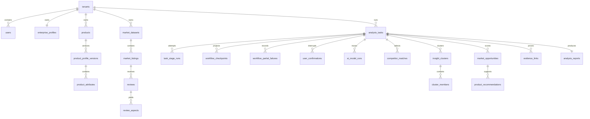

# FurniScope PostgreSQL 数据库设计 V3.0

## 1. 文档目标

本文定义“跨境家具超级 AI 员工”的 PostgreSQL 16 数据层。字段口径以《FurniScope产品数据字典V3》为准，可执行结构以根目录 `furniscope_postgresql_v3.sql` 为准。V3 只保留 `user/admin` 两种系统角色；多 Agent 是内部能力，不是用户或权限主体。

## 2. 设计边界

- `tenants` 是所有业务数据的隔离边界；服务层每次查询必须注入 `tenant_id`，数据库外键用于防止跨租户误关联。
- 核心库保存产品、获授权市场数据、原始评论、分析任务、证据、模型追溯、确认和在线报告，不保存对象文件字节、API Key、默认密码。
- PostgreSQL 内的 `workflow_checkpoints` 仅是业务安全投影；LangGraph 官方 Checkpointer 使用其官方表结构和连接配置，二者不得互相替代。
- 用户只看到五阶段：`understanding_product`、`researching_market`、`evaluating_opportunity`、`generating_recommendation`、`completed`；内部细粒度节点写入 `internal_stage` 和 `task_stage_runs`。
- Listing 生成、文件导出、验证任务、多人报告评审、产品运营事件不属于 V3 核心库。

## 3. Schema 与对象规模

- 业务 Schema：`furniscope`
- 迁移归档 Schema：`furniscope_archive`（仅迁移脚本创建）
- 扩展：`pgcrypto`，用于 UUID 默认值
- 核心表：35 张（含`auth_sessions`与`api_idempotency_records`）
- 主键：业务表统一 `BIGINT IDENTITY`；对外稳定标识使用 UUID；Checkpoint 使用业务字符串标识
- 时间：`TIMESTAMPTZ`；金额：`NUMERIC(18,2)`；置信度：`NUMERIC(6,4)`；结构化合并字段：`JSONB`

## 4. 核心实体关系

## 5. 全部表设计

| 模块 | 表 | 关键字段与职责 | 关键约束/索引 |
|---|---|---|---|
| 租户 | `tenants` | UUID、名称、状态、时区、默认语言 | tenant_code/UUID 唯一；状态 CHECK |
| 用户 | `users` | tenant、email、password_hash、role_code、状态 | email全系统唯一并自动解析tenant；role仅user/admin；tenant+role+status索引 |
| 认证 | `auth_sessions` | Refresh Token摘要、轮换家族、过期与撤销 | Token明文不落库；摘要唯一；tenant+user活动会话索引 |
| API控制 | `api_idempotency_records` | 路由、Key、请求哈希、资源引用、脱敏响应 | tenant+route+key唯一；24小时清理；禁止Token/文件/评论全文 |
| 企业 | `enterprise_profiles` | 业务模式、品类、市场、`constraints` | 每租户唯一；constraints 必须为数组 |
| 企业 | `manufacturing_capabilities` | 能力类型/编码、可用性、证据、置信度、版本 | tenant+code+version 唯一；证据与置信度 CHECK |
| 产品 | `products` | SKU、名称、家具品类、主图、当前画像版本 | tenant+SKU 唯一；tenant+category+status 索引 |
| 文件 | `file_assets` | 对象键、哈希、MIME、大小、扫描状态 | tenant+sha256 唯一；不存文件内容 |
| 解析 | `product_parse_jobs` | parse_job_uuid、状态、进度、错误、幂等键 | tenant+幂等键唯一；状态/进度 CHECK |
| 解析 | `product_parse_job_files` | 任务-文件关系、状态、轻量输出引用 | job+file 唯一；状态 CHECK |
| 产品 | `product_profile_versions` | 不可变画像版本、完整度、来源摘要、确认信息 | product+version 唯一；确认状态完整性 CHECK |
| 产品 | `product_attributes` | 属性值、单位、来源、定位、置信度 | profile+attribute 唯一；tenant/profile 索引 |
| 市场 | `market_datasets` | 平台、国家、品类、范围、质量、`field_mapping` | tenant+UUID 唯一；JSON 类型约束；市场联合索引 |
| 市场 | `market_listings` | 商品快照、价格、评论量、`normalized_attributes` | dataset+platform_listing_id 唯一；JSONB GIN |
| 评论 | `reviews` | 原文保护、翻译、评分、哈希、时间 | listing+平台评论ID唯一；原文不可被证据替代 |
| 配置 | `prompt_templates` | 场景、版本、模板、输出 Schema、状态 | scene+version 唯一；不存密钥 |
| 配置 | `model_route_configs` | 任务类型、主备模型、超时、重试、`compute_config` | task_type 唯一；JSON 类型约束；不存 API Key |
| 任务 | `analysis_tasks` | UUID、冻结输入、状态、内外阶段、进度、报告UUID | tenant+幂等键唯一；五阶段 CHECK；阶段联合索引 |
| 任务 | `task_stage_runs` | 内部节点每次尝试、输入/输出引用、耗时 | task+stage+attempt 唯一；幂等键唯一 |
| 恢复 | `workflow_checkpoints` | 安全业务投影、版本、哈希、恢复标记 | task+version唯一；仅安全 checkpoint 可供恢复 |
| 恢复 | `workflow_partial_failures` | 并行单元失败、影响、可重试、处置 | task+状态/可重试索引 |
| 确认 | `user_confirmations` | 问题、推荐项、选项、证据、影响、Checkpoint、回答、恢复命令 | 选项/证据数组非空；responded 状态字段完整；幂等唯一 |
| 恢复 | `workflow_control_events` | Supervisor 恢复/重试/停止事务 Outbox | task+event+idempotency 唯一；待发布索引 |
| AI | `ai_model_runs` | 实际模型/Prompt、输入哈希、Token、成本、延迟、Schema结果 | task+状态索引；无提示词密钥 |
| 竞品 | `competitor_matches` | 可比性类型、分数、原因、集合版本、确认来源 | task+listing+version 唯一；无岗位审核字段 |
| 评论 | `review_aspects` | taxonomy、情感、观点、原文 Span、置信度、模型运行 | review+index 唯一；触发器校验证据原文子串 |
| 洞察 | `insight_clusters` | 跨评论/商品聚类、频率、代表证据、置信度 | task+cluster_code 唯一；任务/分数索引 |
| 洞察 | `cluster_members` | cluster-aspect 多对多与距离 | 复合主键 |
| 指标 | `market_metrics` | 指标类型/维度/值/样本/算法/置信度 | 按task+metric_code+dimension建立查询索引；V3不声明未落DDL的复合唯一约束 |
| 指标 | `price_bands` | 币种、价格上下界、商品/评论量、特征渗透 | task+band_code 唯一；边界 CHECK |
| 机会 | `market_opportunities` | 六类评分、base/overall、置信度、等级、`manufacturing_fit` | task+code 唯一；评分范围 CHECK；JSONB GIN |
| 建议 | `product_recommendations` | 问题、根因、工程动作、影响、优先级、证据 | task/机会索引；无专家审核与验证任务 |
| 证据 | `evidence_links` | claim→source 的多态引用、Span、快照、置信度 | claim/source 联合索引；评论证据 Span 完整性 |
| 报告 | `analysis_reports` | UUID、摘要、结论、评分、范围快照、`sections` | task 唯一；sections 数组；仅在线查看 |
| 审计 | `audit_logs` | tenant/user、动作、对象、脱敏快照、request_id | tenant+时间、对象索引；禁止完整评论/密钥 |

完整字段类型、默认值、外键、CHECK、索引与列注释均已落在可执行 SQL 中，避免文档与 DDL 出现双重口径。

## 6. JSONB 合并字段契约

| 字段 | 顶层结构 | 最小条目结构 | 查询策略 |
|---|---|---|---|
| `enterprise_profiles.constraints` | array | constraint_type/operator/value/hardness/sensitivity_level | 常用租户键仍为普通列；复杂过滤可加 jsonpath GIN |
| `market_datasets.field_mapping` | array | source_field/target_entity/target_field/mapping_status | dataset/市场维度为普通列 |
| `market_listings.normalized_attributes` | object，属性码为 key | value/unit/source_locator/confidence | GIN；价格、评分、评论量保持普通列 |
| `model_route_configs.compute_config` | object | quota_unit/quota_total/warning_threshold/hard_limit | task_type 为普通唯一列；密钥只在环境变量 |
| `market_opportunities.manufacturing_fit` | array | requirement/capability/fit_status/fit_score/evidence_refs | base_score/confidence/recommendation_level 为普通列并建索引 |
| `analysis_reports.sections` | array | section_code/title/sort_order/content_type/content | 报告 UUID/task_id 为普通列；数组用于有序渲染 |

所有字段都有 `jsonb_typeof` CHECK；关键排序、过滤、关联字段不得仅放入大 JSONB。

## 7. 一致性与安全

- 证据 Span：数据库触发器校验 `review_aspects.evidence_quote` 与 `reviews.content_original[start:end]` 一致；原文不可被翻译文覆盖。
- 任务幂等：任务、解析任务、阶段运行、确认和控制事件分别有幂等唯一约束。
- 恢复：确认只能引用同一任务且 `is_safe_resume=true` 的业务 Checkpoint；回答产生 `workflow_control_events`，由 Supervisor 投递 `Command(resume=...)`。
- 部分失败：失败单元单独持久化，不把可用分支整体回滚；最终报告必须降低对应置信度并披露限制。
- 模型追溯：每次模型调用记录实际模型、Prompt 版本、输入哈希、Token、成本、重试和 Schema 校验。
- 租户安全：应用层强制 tenant scope；生产可进一步启用 RLS。审计快照必须脱敏。

## 8. V2.1→V3 迁移策略

迁移脚本在单事务中依次执行：基线检查与互斥锁→摘除缺陷旧触发器→逐表归档原行→先合并数据→校验迁移计数与结构→删除旧表→重建合法触发器和索引→提交。任何异常均回滚，包括已执行的 DROP。

| V2.1 实体 | V3 去向 |
|---|---|
| roles/user_roles | users.role_code；admin 保留，其余岗位映射 user；原行归档 |
| enterprise_constraints | enterprise_profiles.constraints |
| dataset_field_mappings | market_datasets.field_mapping |
| listing_attributes | market_listings.normalized_attributes |
| opportunity_scores | market_opportunities 最新评分普通列 |
| manufacturing_requirements/enterprise_fit_details | market_opportunities.manufacturing_fit |
| report_sections | analysis_reports.sections |
| competitor_set_confirmations | user_confirmations + safe checkpoint 引用 |
| compute_quotas | model_route_configs.compute_config；无路由可绑定时保留完整归档待 admin 配置 |
| validation_tasks/report_reviews/product_events/listing_generation_records/report_exports | 完整归档后退出核心库 |

## 9. 实际验证结果

验证环境：本机临时 PostgreSQL 16.14，独立端口 55432，2026-08-09。

| 验证项 | 实际结果 |
|---|---|
| V3 从零执行 | 成功，35张核心表、35个主键、91个外键、108个索引，事务提交 |
| 数据字典字段覆盖 | 数据字典 V3 的 434 个数据库实体字段全部存在于 DDL，缺失 0 |
| 表注释覆盖 | 35张核心表缺失表注释0；关键安全、JSONB、阶段与证据列另有列注释 |
| V2.1 空副本迁移 | 成功，35张核心表、关键旧字段0、V3必需字段9；历史库保留兼容目录差异 |
| V2.1 代表数据副本迁移 | 成功，角色映射 1 行、统一确认 1 行、13 行退役数据归档 |
| JSONB 合并 | constraints、field_mapping、normalized_attributes、sections 均保留样例值 |
| 评分合并 | base_score=73.00、confidence=0.8200 |
| Checkpoint 恢复关联 | confirmation checkpoint_id=`cp1`，状态 responded |
| 旧表检查 | 15 个退役表残留数 0 |
| 事务回滚 | 首轮发现旧触发器缺陷时迁移整体回滚；修复后同副本重跑成功 |

## 10. 后续跨文档依赖

1. RESTful API 文档需按 V3 字段和统一 `user_confirmation` 协议重写，移除 Listing/导出/人工运维接口。
2. 页面原型需改为 6 个 user 页面与 1 个 admin 页面，只展示五阶段，不暴露内部重试按钮。
3. 测试用例需增加两角色权限、证据 Span、部分失败降置信度、确认恢复和跨租户拒绝用例。
4. 后端 ORM/Alembic 模型需以本 DDL 为唯一结构源，并为 LangGraph 官方 Checkpointer 配置独立迁移。
5. admin 必须配置模型路由、Prompt 与算力策略；迁移归档中的无归属旧配额不可自动绑定虚构路由。

## 11. 版本记录

| 版本 | 日期 | 说明 |
|---|---|---|
| V3.0 | 2026-08-09 | 按超级 AI 员工简化基线和数据字典 V3 完整重构，并完成真实 PostgreSQL 验证 |

## 12. 本次变更摘要

- 角色固定为 user/admin，删除动态 RBAC 实体。
- 核心业务表保持精简，并新增必要的`auth_sessions`认证会话表；不恢复动态RBAC。
- 新增统一 `user_confirmations`，打通安全 Checkpoint、回答和恢复事件审计。
- 保留租户隔离、证据链、模型追溯、幂等、部分失败与可恢复能力。
- 提供可回滚、先迁移后删除、带归档的 V2.1→V3 SQL，并通过空库和带数据副本验证。
- 修正 `business_model` 及五类分析结果表的 `analysis_job_id` 字段命名，使 DDL 与数据字典 V3 完全一致。
