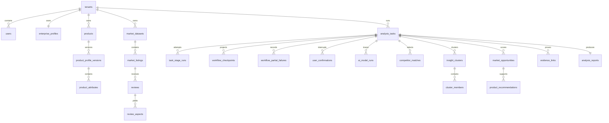

# FurniScope PostgreSQL 数据库设计 V3.0

> 2026-10-07增量：[企业闭环总体设计](./15_FurniScope_企业决策与数据闭环总体设计V1.md)及[数据库运行与升级说明](../开发文档/FurniScope_数据库运行与升级说明.md)补充现行结构。根SQL已纳入v3.15至v3.34的依赖顺序；本文35张核心表是早期基线统计，不代表现行总表数。

新增`forecast_data_versions`（确认后的标准数据不可变）、`enterprise_opportunity_policies`（策略版本）、`opportunity_feedback_events`（不可变决策事件）。训练任务记录同租户数据血缘及代码SHA，模型owner不可变，私有模型部署必须属于同租户。机会增加`market_score/adjusted_score/policy_snapshot`，任务冻结策略、企业及产品事实。字段与接口见[实现说明](../开发文档/FurniScope_企业决策与标准数据API实现说明V1.md)。

复核增加训练执行令牌/租约与次数、部署目录和预测路由快照、`forecast_import_templates`不可变模板、辅助表血缘、机会首次`decision_snapshot`及`opportunity_outcome_events`不可变实施/经营观察。旧机会不回填历史特征；不可变历史不通过级联删除清理。新表均受复合租户关联和RLS保护。

## 1. 文档目标

本文定义“跨境家具超级 AI 员工”的 PostgreSQL 16 数据层。字段口径以《FurniScope产品数据字典V3》为准，可执行结构以根目录 `furniscope_postgresql_v3.sql` 为准。`users.role_code`只保留`user/admin`两种登录身份；v3.27在企业租户内部增加`tenant_roles`、`role_permissions`和`user_role_assignments`做细粒度授权，但不把内部 Agent 当成用户或权限主体。

## 2. 设计边界

- `tenants` 是所有业务数据的隔离边界；服务层每次查询必须注入 `tenant_id`，数据库外键用于防止跨租户误关联。
- 核心库保存产品、获授权市场数据、原始评论、分析任务、证据、模型追溯、确认和在线报告，不保存对象文件字节、API Key、默认密码。
- PostgreSQL 内的 `workflow_checkpoints` 仅是业务安全投影；LangGraph 官方 Checkpointer 使用其官方表结构和连接配置，二者不得互相替代。
- 用户只看到五阶段：`understanding_product`、`researching_market`、`evaluating_opportunity`、`generating_recommendation`、`completed`；内部细粒度节点写入 `internal_stage` 和 `task_stage_runs`。
- Listing 生成、文件导出、验证任务、多人报告评审、产品运营事件不属于 V3 核心库。

## 3. Schema 与对象规模

- 业务 Schema：`furniscope`
- 迁移归档 Schema：`furniscope_archive`（仅迁移脚本创建）
- 扩展：`pgcrypto`，用于 UUID 默认值
- 核心表：35 张（含`auth_sessions`与`api_idempotency_records`）
- 主键：业务表统一 `BIGINT IDENTITY`；对外稳定标识使用 UUID；Checkpoint 使用业务字符串标识
- 时间：`TIMESTAMPTZ`；金额：`NUMERIC(18,2)`；置信度：`NUMERIC(6,4)`；结构化合并字段：`JSONB`

## 4. 核心实体关系



## 5. 全部表设计

| 模块 | 表 | 关键字段与职责 | 关键约束/索引 |
|---|---|---|---|
| 租户 | `tenants` | UUID、名称、状态、时区、默认语言 | tenant_code/UUID 唯一；状态 CHECK |
| 用户 | `users` | tenant、email、password_hash、role_code、状态 | email全系统唯一并自动解析tenant；role仅user/admin；tenant+role+status索引 |
| 认证 | `auth_sessions` | Refresh Token摘要、轮换家族、过期与撤销 | Token明文不落库；摘要唯一；tenant+user活动会话索引 |
| API控制 | `api_idempotency_records` | 路由、Key、请求哈希、资源引用、脱敏响应 | tenant+route+key唯一；24小时清理；禁止Token/文件/评论全文 |
| 企业 | `enterprise_profiles` | 业务模式、品类、市场、`constraints` | 每租户唯一；constraints 必须为数组 |
| 企业 | `manufacturing_capabilities` | 能力类型/编码、可用性、证据、置信度、版本 | tenant+code+version 唯一；证据与置信度 CHECK |
| 产品 | `products` | SKU、名称、家具品类、主图、当前画像版本 | tenant+SKU 唯一；tenant+category+status 索引 |
| 文件 | `file_assets` | 对象键、哈希、MIME、大小、扫描状态 | tenant+sha256 唯一；不存文件内容 |
| 解析 | `product_parse_jobs` | parse_job_uuid、状态、进度、错误、幂等键 | tenant+幂等键唯一；状态/进度 CHECK |
| 解析 | `product_parse_job_files` | 任务-文件关系、状态、轻量输出引用 | job+file 唯一；状态 CHECK |
| 产品 | `product_profile_versions` | 不可变画像版本、完整度、来源摘要、确认信息 | product+version 唯一；确认状态完整性 CHECK |
| 产品 | `product_attributes` | 属性值、单位、来源、定位、置信度 | profile+attribute 唯一；tenant/profile 索引 |
| 市场 | `market_datasets` | 平台、国家、品类、范围、质量、`field_mapping` | tenant+UUID 唯一；JSON 类型约束；市场联合索引 |
| 市场 | `market_listings` | 商品快照、价格、评论量、`normalized_attributes` | dataset+platform_listing_id 唯一；JSONB GIN |
| 评论 | `reviews` | 原文保护、翻译、评分、哈希、时间 | listing+平台评论ID唯一；原文不可被证据替代 |
| 配置 | `prompt_templates` | 场景、版本、模板、输出 Schema、状态 | scene+version 唯一；不存密钥 |
| 配置 | `model_route_configs` | 任务类型、主备模型、超时、重试、`compute_config` | task_type 唯一；JSON 类型约束；不存 API Key |
| 任务 | `analysis_tasks` | UUID、冻结输入、状态、内外阶段、进度、报告UUID | tenant+幂等键唯一；五阶段 CHECK；阶段联合索引 |
| 任务 | `task_stage_runs` | 内部节点每次尝试、输入/输出引用、耗时 | task+stage+attempt 唯一；幂等键唯一 |
| 恢复 | `workflow_checkpoints` | 安全业务投影、版本、哈希、恢复标记 | task+version唯一；仅安全 checkpoint 可供恢复 |
| 恢复 | `workflow_partial_failures` | 并行单元失败、影响、可重试、处置 | task+状态/可重试索引 |
| 确认 | `user_confirmations` | 问题、推荐项、选项、证据、影响、Checkpoint、回答、恢复命令 | 选项/证据数组非空；responded 状态字段完整；幂等唯一 |
| 恢复 | `workflow_control_events` | Supervisor 恢复/重试/停止事务 Outbox | task+event+idempotency 唯一；待发布索引 |
| AI | `ai_model_runs` | 实际模型/Prompt、输入哈希、Token、成本、延迟、Schema结果 | task+状态索引；无提示词密钥 |
| 竞品 | `competitor_matches` | 可比性类型、分数、原因、集合版本、确认来源 | task+listing+version 唯一；无岗位审核字段 |
| 评论 | `review_aspects` | taxonomy、情感、观点、原文 Span、置信度、模型运行 | review+index 唯一；触发器校验证据原文子串 |
| 洞察 | `insight_clusters` | 跨评论/商品聚类、频率、代表证据、置信度 | task+cluster_code 唯一；任务/分数索引 |
| 洞察 | `cluster_members` | cluster-aspect 多对多与距离 | 复合主键 |
| 指标 | `market_metrics` | 指标类型/维度/值/样本/算法/置信度 | 按task+metric_code+dimension建立查询索引；V3不声明未落DDL的复合唯一约束 |
| 指标 | `price_bands` | 币种、价格上下界、商品/评论量、特征渗透 | task+band_code 唯一；边界 CHECK |
| 机会 | `market_opportunities` | 六类评分、base/overall、置信度、等级、`manufacturing_fit` | task+code 唯一；评分范围 CHECK；JSONB GIN |
| 建议 | `product_recommendations` | 问题、根因、工程动作、影响、优先级、证据 | task/机会索引；无专家审核与验证任务 |
| 证据 | `evidence_links` | claim→source 的多态引用、Span、快照、置信度 | claim/source 联合索引；评论证据 Span 完整性 |
| 报告 | `analysis_reports` | UUID、摘要、结论、评分、范围快照、`sections` | task 唯一；sections 数组；仅在线查看 |
| 审计 | `audit_logs` | tenant/user、动作、对象、脱敏快照、request_id | tenant+时间、对象索引；禁止完整评论/密钥 |

完整字段类型、默认值、外键、CHECK、索引与列注释均已落在可执行 SQL 中，避免文档与 DDL 出现双重口径。

## 6. JSONB 合并字段契约

| 字段 | 顶层结构 | 最小条目结构 | 查询策略 |
|---|---|---|---|
| `enterprise_profiles.constraints` | array | constraint_type/operator/value/hardness/sensitivity_level | 常用租户键仍为普通列；复杂过滤可加 jsonpath GIN |
| `market_datasets.field_mapping` | array | source_field/target_entity/target_field/mapping_status | dataset/市场维度为普通列 |
| `market_listings.normalized_attributes` | object，属性码为 key | value/unit/source_locator/confidence | GIN；价格、评分、评论量保持普通列 |
| `model_route_configs.compute_config` | object | quota_unit/quota_total/warning_threshold/hard_limit | task_type 为普通唯一列；密钥只在环境变量 |
| `market_opportunities.manufacturing_fit` | array | requirement/capability/fit_status/fit_score/evidence_refs | base_score/confidence/recommendation_level 为普通列并建索引 |
| `analysis_reports.sections` | array | section_code/title/sort_order/content_type/content | 报告 UUID/task_id 为普通列；数组用于有序渲染 |

所有字段都有 `jsonb_typeof` CHECK；关键排序、过滤、关联字段不得仅放入大 JSONB。

## 7. 一致性与安全

- 证据 Span：数据库触发器校验 `review_aspects.evidence_quote` 与 `reviews.content_original[start:end]` 一致；原文不可被翻译文覆盖。
- 任务幂等：任务、解析任务、阶段运行、确认和控制事件分别有幂等唯一约束。
- 恢复：确认只能引用同一任务且 `is_safe_resume=true` 的业务 Checkpoint；回答产生 `workflow_control_events`，由 Supervisor 投递 `Command(resume=...)`。
- 部分失败：失败单元单独持久化，不把可用分支整体回滚；最终报告必须降低对应置信度并披露限制。
- 模型追溯：每次模型调用记录实际模型、Prompt 版本、输入哈希、Token、成本、重试和 Schema 校验。
- 租户安全：v3.16建立tenant业务表RLS和复合关联约束，v3.25对租户表启用`FORCE ROW LEVEL SECURITY`并拆分Migrator、Authenticator、Runtime、Platform Admin、Scheduler、Audit Writer、Backup和Monitor数据库职责。认证后普通业务事务使用NOLOGIN/NOBYPASSRLS的`furniscope_tenant`角色；提交后重绑、连接复用和后台执行均需有效租户。启动检查缺失策略或必需迁移时拒绝运行。认证/平台调度/LangGraph私有存储保留受信边界，不能声称防服务凭据泄露。

## 8. V2.1→V3 迁移策略

迁移脚本在单事务中依次执行：基线检查与互斥锁→摘除缺陷旧触发器→逐表归档原行→先合并数据→校验迁移计数与结构→删除旧表→重建合法触发器和索引→提交。任何异常均回滚，包括已执行的 DROP。

| V2.1 实体 | V3 去向 |
|---|---|
| roles/user_roles | users.role_code；admin 保留，其余岗位映射 user；原行归档 |
| enterprise_constraints | enterprise_profiles.constraints |
| dataset_field_mappings | market_datasets.field_mapping |
| listing_attributes | market_listings.normalized_attributes |
| opportunity_scores | market_opportunities 最新评分普通列 |
| manufacturing_requirements/enterprise_fit_details | market_opportunities.manufacturing_fit |
| report_sections | analysis_reports.sections |
| competitor_set_confirmations | user_confirmations + safe checkpoint 引用 |
| compute_quotas | model_route_configs.compute_config；无路由可绑定时保留完整归档待 admin 配置 |
| validation_tasks/report_reviews/product_events/listing_generation_records/report_exports | 完整归档后退出核心库 |

## 9. 实际验证结果

验证环境：本机临时 PostgreSQL 16.14，独立端口 55432，2026-08-09。

| 验证项 | 实际结果 |
|---|---|
| V3 从零执行 | 成功，35张核心表、35个主键、91个外键、108个索引，事务提交 |
| 数据字典字段覆盖 | 数据字典 V3 的 434 个数据库实体字段全部存在于 DDL，缺失 0 |
| 表注释覆盖 | 35张核心表缺失表注释0；关键安全、JSONB、阶段与证据列另有列注释 |
| V2.1 空副本迁移 | 成功，35张核心表、关键旧字段0、V3必需字段9；历史库保留兼容目录差异 |
| V2.1 代表数据副本迁移 | 成功，角色映射 1 行、统一确认 1 行、13 行退役数据归档 |
| JSONB 合并 | constraints、field_mapping、normalized_attributes、sections 均保留样例值 |
| 评分合并 | base_score=73.00、confidence=0.8200 |
| Checkpoint 恢复关联 | confirmation checkpoint_id=`cp1`，状态 responded |
| 旧表检查 | 15 个退役表残留数 0 |
| 事务回滚 | 首轮发现旧触发器缺陷时迁移整体回滚；修复后同副本重跑成功 |

## 10. 后续跨文档依赖

1. RESTful API 文档需按 V3 字段和统一 `user_confirmation` 协议重写，移除 Listing/导出/人工运维接口。
2. 页面原型需改为 6 个 user 页面与 1 个 admin 页面，只展示五阶段，不暴露内部重试按钮。
3. 测试用例需增加两角色权限、证据 Span、部分失败降置信度、确认恢复和跨租户拒绝用例。
4. 后端 ORM/Alembic 模型需以本 DDL 为唯一结构源，并为 LangGraph 官方 Checkpointer 配置独立迁移。
5. admin 必须配置模型路由、Prompt 与算力策略；迁移归档中的无归属旧配额不可自动绑定虚构路由。

## 11. 版本记录

| 版本 | 日期 | 说明 |
|---|---|---|
| V3.0 | 2026-08-09 | 按超级 AI 员工简化基线和数据字典 V3 完整重构，并完成真实 PostgreSQL 验证 |
| V3.1 | 2026-10-07 | 登记v3.31-v3.34受控事实、产品导入、租户数据分类及SKU事实身份增量 |

## 12. 本次变更摘要

- 登录身份固定为`user/admin`，旧V2岗位角色与审批语义退出登录Token和业务流程。
- v3.27重新引入的是租户内权限目录与成员角色映射，不改变登录身份枚举，也不把Agent能力变成角色。
- 新增统一 `user_confirmations`，打通安全 Checkpoint、回答和恢复事件审计。
- 保留租户隔离、证据链、模型追溯、幂等、部分失败与可恢复能力。
- 提供可回滚、先迁移后删除、带归档的 V2.1→V3 SQL，并通过空库和带数据副本验证。
- 修正 `business_model` 及五类分析结果表的 `analysis_job_id` 字段命名，使 DDL 与数据字典 V3 完全一致。

## 13. V3.23—V3.30 对话、记忆、安全与治理增量

根SQL现行增量顺序为：

```text
v3_15 -> v3_18 -> v3_16 -> v3_17 -> v3_19 -> v3_20
       -> v3_21 -> v3_22 -> v3_23_context_lifecycle
       -> v3_24_memory_agent_governance
       -> v3_25_database_security_baseline
       -> v3_26_competitor_watch_product_binding
       -> v3_27_audit_rbac
       -> v3_28_tenant_deletion_lifecycle
       -> v3_29_tenant_cell_routing
       -> v3_30_tenant_query_optimization
```

现行增量新增或升级以下实体：

| 资源 | 数据表 | 关键约束 |
|---|---|---|
| 客户记忆 | `customer_memories`、`customer_memory_policies` | `memory_uuid`对外标识；版本关系；`candidate/confirmed/superseded/archived/invalidated`状态；有效期、确认人、敏感级别和画像依赖 |
| Turn | `analysis_workspace_turns` | workspace内`client_turn_id`及`idempotency_key`唯一；状态和再生成关系可追溯 |
| Context | `analysis_workspace_contexts`、`analysis_workspace_states`、`analysis_context_snapshots` | 配置和语义状态按revision版本化；每轮冻结产品、市场、数据集、任务、意图、指代、来源、Token估算、裁剪列表和SHA |
| Citation | `citations` | 关联Turn及助手消息；保存来源类型、ID、版本、定位器、摘录和分数 |
| 知识库 | `knowledge_bases`、`knowledge_documents`、`knowledge_document_versions` | UUID资源、软删除、版本SHA和当前版本 |
| 检索 | `knowledge_chunks`、`knowledge_index_jobs` | 页码/定位器、chunk、Embedding、索引状态和错误；知识库支持tenant/user可见性 |
| 数据库身份 | PostgreSQL NOLOGIN职责角色 | v3.25职责分离；应用运行身份不得为SUPERUSER或BYPASSRLS |
| 企业授权 | `permission_catalog`、`tenant_roles`、`role_permissions`、`user_role_assignments` | 六个内置企业角色、权限到路由校验、最后一个tenant_owner保护 |
| 审计 | `audit_logs`链字段 | v3.27按租户生成递增序列和前序哈希；业务运行角色无UPDATE/DELETE/TRUNCATE权限 |
| 租户删除 | `tenant_deletion_requests`、`tenant_legal_holds`、`tenant_deletion_certificates` | 保留期、法务保留、显式执行和不可变删除证明 |
| Cell路由 | `deployment_cells`、`tenant_placements`、`tenant_migration_jobs` | 无凭据路由目录、租户驻留/服务层级、迁移状态和非active期间写栅栏 |
| 向量侧索引 | `knowledge_chunk_embeddings`及16个Hash分区 | `(tenant_id,chunk_id)`边界；从canonical chunk重建；同模型同维度检索；强制RLS |
| 扩展策略 | `table_scaling_policies` | canonical表保留稳定ID/FK，以tenant-first索引承载共享Cell；超过阈值迁往dedicated Cell |

候选记忆与已确认记忆是独立行。确认新值时使用事务级锁，将同作用域旧
`confirmed`版本改为`superseded`，再确认新版本；`workspace_id IS NULL`不再依赖
普通NULL唯一约束。删除语义为归档，不物理删除版本历史。

Turn先持久化`pending`幂等预留；完成事务锁定工作台后连续分配消息序号，并一次提交
用户消息、助手消息、上下文快照、Citation、候选记忆和完整响应。消息到Turn的复合
租户外键在删除Turn时只清空`turn_uuid`，不清空`tenant_id`。

当前工程版文档源文件保存在`knowledge_document_versions.source_content BYTEA`，
用于完整SHA复验和可重现索引；生产上线前仍应迁移到租户隔离对象存储，数据库只保留
不可变对象键、SHA、大小和版本元数据。该临时实现是本节对§2“对象文件不入库”边界的
明确例外，不得扩展为长期大文件存储方案。

`knowledge_chunk_embeddings`是派生侧索引，不替代`knowledge_chunks.embedding`中的
canonical JSONB。数据库可安装pgvector时增加`vector(1024)`与HNSW；不可安装、分区
HNSW不受支持或向量不是1024维时，迁移仍可完成，查询回退到PostgreSQL全文检索及
Python cosine。该表按`tenant_id`做16路Hash分区，租户过滤发生在候选检索之前。

全库custom dump由Manifest记录迁移集合、关键行数和审计链头；单租户逻辑包按父表导出
NDJSON和对象SHA，恢复只允许结构一致的空隔离数据库。分区子表不独立重复导出，恢复
时排除生成列并按IDENTITY语义推进序列。单租户包用于独立恢复和Cell迁移，不替代WAL
归档与全库PITR。

所有租户表均启用并强制RLS，普通租户和平台管理使用独立策略。2026-10-06在全新空库和
存量升级库完成安装、重复迁移及启动隔离检查，共识别81项RLS启动清单；存量租户哨兵
保持不变，RBAC默认角色、审计链、cell placement触发器和16分区侧索引探针通过。
关键迁移SHA-256：

```text
v3_23  4f695267ba77b02732539a43372b6247a0ad29e1bce490ddfcffe3416d0ec357
v3_24  7a89f534637d2049383b90af8e13ac7e8b0d47cd22ff5bdf2f6df3c9df05843f
v3_25  3f0a9f72bc86513c9ee94a1f5af247b7f43c78dea6e0d44e7d6975ed3d13fa80
v3_26  413589b98943db885a30c26ea1aa3d3c101e1de46284a546d0c0ea2d9078520a
v3_27  5ce3a360e1f584346585c219e76359ace38fbe4017a89712275918f4d89adc15
v3_28  a12892672e98982b651ba787ea0c19112dad527593b0484ee78b47dc3da2659c
v3_29  495e1bf08292fe8422ca0a2c8f82a217722e5fb79f0a24056ebc5b2d61f18e9e
v3_30  bf31bb3e2b306f027ed1f39b2201a133f20033ab19e2b1a725bb0463af3c66ee
v3_31  0c1f02a146da90fe9cc1c9ee365eaa068a2c6192f11a1f897f4e5b0a4d4aba14
v3_32  da72dc20a82c37401330d35104ff33436d644c9afa57bd6f486291e1696e4517
v3_33  5f3f746842ee0cdb4c14cc7ed98bd316b3c53c5937fadb31c5088d2447478d15
v3_34  7444a72abda3d554149ffd3ae2de6b536f3032208a70322a472c8c8a0d26fabc
```

## 14. V3.31—V3.32 事实查询与产品主档增量

根 SQL 在 v3.30 后依次引入：

```text
v3_31_controlled_data_query
  -> v3_32_product_catalog_imports
```

v3.31 新增`data_metric_catalog/data_fact_projections/sales_facts_daily/
inventory_facts_daily/data_query_executions`，将已确认标准数据按来源 SHA 投影为受控问数
事实；四张租户数据表启用并强制 RLS。

v3.32 为`products`增加`sku_compare_key=upper(btrim(sku))`生成列和租户唯一索引，
并新增：

| 表 | 用途 | 关键约束 |
|---|---|---|
| `product_groups` | SPU、变体、套装、BOM组 | 租户+类型+编码唯一 |
| `product_group_members` | SKU与组的多对多成员 | 同租户复合外键、角色CHECK、数量大于0 |
| `product_import_jobs` | 文件、配置、版本、SHA、状态与统计 | 租户幂等键唯一、20 MiB、状态/计数/JSON CHECK |
| `product_import_rows` | 原行、标准行、错误、警告和动作 | 任务+原行号主键、同租户复合外键 |

四表均`ENABLE/FORCE RLS`，同时应用`tenant_scope/platform_admin_scope`和
`trg_tenant_write_fence`。导入提交在一个数据库事务内写产品主档、草稿画像、组合关系、
SKU别名、行回执和审计；任何异常由路由回滚。v3.32迁移在创建唯一索引前主动扫描存量
SKU比较键碰撞，拒绝带歧义升级。

库存摘要不新增副本表，直接从`inventory_facts_daily`按SKU和站点选取最新已确认事实，
并从`forecast_data_versions`读取最近库存导入状态。该查询是历史快照，不代表实时库存。

## 15. V3.33—V3.34 租户分类与SKU事实身份增量

根 SQL 在v3.32后依次引入：

```text
v3_33_tenant_data_class
  -> v3_34_sku_fact_identity
```

v3.33为`tenants`增加`data_class`，仅允许`business/test/demo`。默认值为`business`，
测试与演示夹具必须显式标记，管理员业务账号列表和KPI由服务端只统计`business`，
不得再依据企业名称关键词猜测数据性质。

v3.34提供`furniscope.rename_tenant_sku_facts(tenant_id, old_sku, new_sku)`。产品SKU修改
事务通过该函数同步更新`products`、`tenant_sku_catalog`、`tenant_forecast_sku_aliases`、
`sales_facts_daily`和`inventory_facts_daily`，保留旧编码别名用于追溯，并在唯一键冲突时
整体回滚。函数采用固定`search_path`的`SECURITY DEFINER`边界，撤销`PUBLIC`执行权限，
仅授予`furniscope_tenant`和`furniscope_platform_admin`；函数内部再次校验当前租户上下文
或平台管理员角色，不能作为跨租户绕过RLS的通道。

2026-10-07已在独立fresh库和带存量哨兵的upgrade库验证安装、重复执行、启动隔离检查
和SKU事实身份探针，结果见
[`migration-summary.json`](../../artifacts/system-review-20261007-fixes/migration-v34/migration-summary.json)。

## 16. V3.36 市场决策数据治理增量

`v3_36_market_intelligence_governance`新增
`market_intelligence_batches/market_intelligence_lineage`。前者冻结数据包身份、业务
范围、来源摘要、SHA和生效状态；后者以逐记录粒度关联现有业务表，保存来源分类、定位符、
规则版本、双SHA、置信度和有效时间。

两表使用租户复合外键、`ENABLE/FORCE RLS`、平台管理策略和迁移写栅栏。批次身份不可
修改，血缘不可更新或删除，同一企业同一包最多一个`active`版本。大字段继续保存在
权威业务表或对象存储，治理表禁止保存完整评论正文和凭据。
