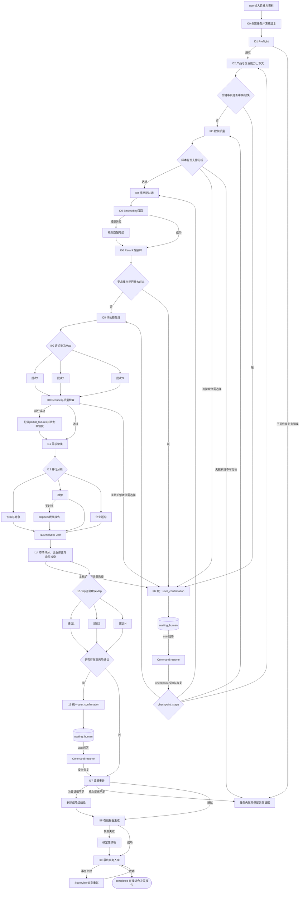

# FurniScope Agent 工作流设计 V2.0

> 2026-10-04增量：企业决策以[15总体设计](./15_FurniScope_企业决策与数据闭环总体设计V1.md)为权威依据。I00冻结企业策略和事实，I14采用五市场因子、可配置适配修正与独立硬条件；历史“六维分”不再表示六项直接相加。销量数据清洗与训练为独立流程，不改变本工作流的五阶段语义。

2026-10-05补全：产品解析提供真实原文证据与未确认候选，人工核验后才可进入企业适配。I14首次机会评分冻结完整特征，重试复用原结果；新分析才重新评分。机会反馈之后独立记录实施/经营观察，固定截点整任务导出供离线排序验收。销售训练通过租约和执行令牌恢复、逐SKU三窗口验证发布；这些流程不将反馈采纳视为经营成功，也不自动训练机会排序模型。

## 1. 文档定位

| 项目 | 内容 |
|---|---|
| 产品 | FurniScope——跨境家具超级 AI 员工 |
| 文档版本 | V2.0 |
| 文档状态 | Agent 编排与后续数据/API设计基线 |
| 适用范围 | 黑客松技术附件、LangGraph 实现、后端任务编排、状态恢复 |
| 上位依据 | 《产品需求规格说明书SRS_PRD_V2》《FurniScope产品简化决策基线V1》 |
| 实现范式 | LangGraph StateGraph + 异步任务队列 + PostgreSQL Checkpoint |
| 对外形态 | 一个跨境家具超级 AI 员工 |
| 模型入口 | FurniScope Model Router，向下依赖阿里云百炼 Model Router/模型服务 |

本文定义 FurniScope 超级 AI 员工的内部执行机制。产品理解、数据质量、竞品发现、评论洞察、市场分析、机会评分、工程建议、证据审计和报告组织是同一超级 AI 员工的专业能力，不是系统角色、岗位、任务领取人或权限主体。

> 本文只锁定 Agent 业务状态和工作流语义。数据库表名沿用当前设计用于说明写入位置；新版数据字典和 PostgreSQL 设计应依据本文完成最终字段与迁移定义。

---

## 2. 架构目标与设计边界

### 2.1 业务目标

1. 一个 `user` 提供目标、产品、企业能力和合规市场数据后，超级 AI 员工自主完成分析。
2. 从授权竞品和评论中识别可比商品、需求痛点、购买动机、人群和场景。
3. 将市场需求与材料、工艺、成本、MOQ、交期、认证和包装能力联合判断。
4. 输出五因子市场分、企业修正分、条件检查、独立置信度、工程建议和原始证据。
5. 默认自动重试、降级、部分继续和恢复，只在阻断性业务不确定性出现时询问 user。
6. 任一节点可审计、可恢复；成功节点不得重复写入、重复调用模型或重复计费。

### 2.2 明确边界

- 只使用已授权导入的数据，不绕过平台限制采集。
- 不把评论数、排名等代理指标伪装为真实销量。
- 不从单一时间快照推断趋势。
- 不根据图片确认海绵密度、内部框架、承重等隐藏属性。
- 不在缺少 BOM 或供应商报价时生成精确成本增量。
- 不自动触发打样、开模、备货、Listing、文件导出或其他外部动作。
- 不创建验证任务、多人报告评审或产品运营事件。
- 不按 owner、产品、运营、研发或销售分配人工节点。
- 不向 user 暴露细粒度节点重试、模型切换、分支补跑等运维操作。

### 2.3 决策优先级

```text
当前用户在本轮的明确表达
> 已确认的产品/企业事实
> 已确认且当前有效的客户记忆
> 服务端工作台状态与历史
> 已冻结任务/报告证据
> 当前租户有权访问的知识库文档
> 模型推断
```

确定性规则、租户边界、Schema和证据门禁对所有层级生效。高优先级输入可以临时覆盖低
优先级上下文，但不得静默改写长期记忆、企业画像或产品画像；写回长期资源必须走候选、
版本与人工确认流程。

只有前四层不能安全决定后续路径时，才允许中断 user。

---

## 3. 超级 AI 员工内部能力

### 3.1 统一能力架构

| 内部能力 | 业务目标 | 主要输入 | 主要输出 | 大模型参与 |
|---|---|---|---|:---:|
| Workflow Supervisor | 维护任务真相、编排、重试、降级、中断和恢复 | State、节点结果、错误 | 路由、状态、Checkpoint | 否 |
| Product Context Capability | 冻结产品和企业能力上下文 | 产品画像、资料、制造能力 | 可追溯上下文快照 | 条件 |
| Data Quality Capability | 判定数据可用范围和结论边界 | 数据集、商品、评论、授权 | 有效样本、质量限制 | 否 |
| Competitor Discovery Capability | 找到商业上可比的竞品 | 产品画像、商品、价格和场景 | 直接/标杆/替代竞品 | 是 |
| Review Insight Capability | 抽取观点、需求、情感、场景和证据 | 有效评论、家具本体 | 观点级结构化结果 | 是 |
| Need Clustering Capability | 识别跨评论需求模式 | 评论观点和向量 | 需求簇、成员、代表证据 | 条件 |
| Market Analytics Capability | 计算价格、竞争、卖点和趋势 | 竞品、评论、需求簇 | 确定性市场指标 | 否 |
| Opportunity Scoring Capability | 计算机会分与独立置信度 | 指标、需求、冻结策略与企业事实 | 市场分、企业修正、条件检查和置信度 | 否为主 |
| Product Strategy Capability | 将需求转为可验证工程建议 | 机会、证据、产品、知识 | 根因、动作、风险、验证方法 | 是 |
| Evidence Audit Capability | 阻止无证据结论进入报告 | 机会、建议、指标、原始证据 | 证据链、降级或阻断项 | 条件 |
| Report Composition Capability | 组织在线综合决策报告 | 已审计结构化结果 | 报告快照 | 是 |
| Persistence Capability | 事务化、幂等地持久化结果 | 节点输出 | 业务记录、Stage、Checkpoint | 否 |

### 3.2 对用户的统一呈现

- user 看见的是一个 FurniScope 超级 AI 员工，不选择 Agent，也不分配任务。
- 页面只展示五阶段、当前正在做的业务说明、限制、必要确认和最终报告。
- Agent/Capability 名称只用于技术实现、日志和诊断，不形成权限枚举。
- admin 可查看模型、Prompt、运行和错误诊断，但不作为业务审批人。

### 3.3 Workflow Supervisor 职责

Supervisor 是唯一的路由控制器，负责：

- 根据任务状态、Stage 结果和 Checkpoint 选择下一节点；
- 控制串行、并行 Map/Reduce、条件边和汇聚；
- 在错误发生后先自动重试，再进行模型或算法降级；
- 判断失败是阻断、可部分继续还是需要 `user_confirmation`；
- 聚合内部节点到五个用户展示阶段；
- 保证任务状态单调、幂等写入和同任务单 Supervisor 锁；
- user 回答后校验确认与 Checkpoint，再执行 `Command(resume=...)`；
- 将技术错误转换为对 user 可理解的限制或失败说明。

---

## 4. 工具体系

### 4.1 工具分类

| 类别 | 代表工具 | 使用能力 | 强制约束 |
|---|---|---|---|
| 数据查询 | `get_task_context`、`get_product_profile`、`get_dataset_scope`、`query_reviews` | 全部 | 自动附加并校验 `tenant_id`；只读事务 |
| 数据写入 | `upsert_stage_run`、`bulk_insert_aspects`、`save_opportunities` | Supervisor、Persistence | 幂等键、事务、版本保护 |
| 文件与导入 | `load_authorized_dataset`、`parse_uploaded_file` | Product Context、Data Quality | 只处理授权文件；文件安全检查 |
| 向量 | `embed_texts`、`vector_search_listings`、`cluster_aspects` | Competitor、Clustering | 内容哈希缓存、版本固定、批量上限 |
| 模型 | `structured_generate`、`rerank`、`translate` | 语义能力 | 统一 Model Router、JSON Schema、成本记录 |
| 规则与统计 | `hard_filter`、`compute_market_metrics`、`score_opportunity` | Data Quality、Analytics、Scoring | 确定性、版本化、可复算 |
| 知识检索 | `retrieve_furniture_knowledge` | Product Strategy | 租户/品类/版本过滤；来源可追溯 |
| 证据 | `validate_evidence_span`、`link_evidence`、`rerank_evidence` | Review、Evidence Audit | 原文不改写；保留反证和限制 |
| 报告 | `render_report_snapshot`、`persist_report` | Report Composition | 只接收审计通过结果；在线报告版本追加 |
| 运行控制 | `acquire_task_lock`、`save_checkpoint`、`emit_metric`、`send_alert` | Supervisor | 防并发、可恢复、可观测 |

### 4.2 Model Router 约束

1. 内部能力只提交 `task_type`、质量档位、延迟和成本上限，不接触供应商 API Key。
2. 每次调用记录模型运行，包含实际模型、Prompt 版本、Token、延迟、成本、状态和 Schema 结果。
3. 429、超时和部分 5xx 有界重试；认证失败、内容安全拒绝和确定性业务错误不无限重试。
4. 输出进入业务表前通过 JSON Schema、字段范围、实体归属和证据 Span 校验。
5. 同输入哈希、Prompt、路由和模型版本允许缓存复用，缓存命中不得重复计费。

---

## 5. LangGraph 全局 State

### 5.1 `FurniScopeGraphState`

| 字段 | 类型 | 说明 | 持久化位置 |
|---|---|---|---|
| `task_id` | bigint | 内部任务主键 | `analysis_tasks.id` |
| `task_uuid` | string | 对外任务标识 | `analysis_tasks.task_uuid` |
| `tenant_id` | bigint | 租户隔离边界 | `analysis_tasks.tenant_id` |
| `status` | enum | 内部任务总体状态 | `analysis_tasks.status` |
| `external_stage` | enum | 五阶段用户投影 | 任务聚合字段/Checkpoint |
| `internal_stage` | enum | 当前内部节点阶段 | 任务字段/`task_stage_runs` |
| `progress_percent` | decimal | 0—100 展示进度 | `analysis_tasks.progress_percent` |
| `product_id` | bigint | 产品标识 | `analysis_tasks.product_id` |
| `product_profile_version` | int | 冻结画像版本 | 任务版本字段 |
| `dataset_id` | bigint | 冻结数据集版本 | `analysis_tasks.dataset_id` |
| `target_market` | object | 国家、平台、币种 | 任务配置 |
| `version_bundle` | object | 本体、评分、Prompt、路由版本 | 任务版本字段 |
| `analysis_config` | object | 阈值、Top-K、权重、预算 | 任务配置 |
| `product_context_ref` | object | 产品与能力快照引用 | Checkpoint/Stage输出 |
| `valid_listing_ids` | array | 有效候选商品引用 | Checkpoint/Stage输出 |
| `valid_review_ids` | array | 有效评论引用 | Checkpoint/Stage输出 |
| `competitor_set_version` | int | 当前竞品集合版本 | Checkpoint/业务结果 |
| `quality_flags` | array | 数据限制和警告 | Checkpoint/报告风险 |
| `trend_eligible` | boolean | 是否允许趋势计算 | Checkpoint |
| `stage_results` | map | 节点结果引用 | Checkpoint |
| `user_confirmation` | object/null | 当前统一人工中断 State | 业务记录/Checkpoint |
| `retry_context` | object | 节点、尝试次数、最近错误 | `task_stage_runs` |
| `partial_failures` | array | 非阻断批次或分支失败 | Checkpoint/报告限制 |
| `fatal_error` | object/null | 阻断错误 | 任务失败字段 |
| `cancel_requested` | boolean | 系统安全停止标记 | Checkpoint/任务状态 |

`external_stage` 和 `internal_stage` 分离。后续数据字典可在保持语义不变的前提下确定物理字段映射，不得把内部节点枚举暴露为前端阶段。

大数组、文件正文、评论原文和向量不进入 State，只保存 ID、查询条件、对象存储键或结果引用，避免 Checkpoint 过大。

### 5.2 `user_confirmation` State

统一人工中断对象只包含以下已锁定字段：

| 字段 | 类型 | 必填 | 语义与约束 |
|---|---|:---:|---|
| `confirmation_id` | string/UUID | 是 | 当前确认唯一标识；同一中断恢复时不可更换 |
| `confirmation_type` | enum | 是 | `fact_conflict`、`insufficient_data`、`low_confidence`、`high_risk_recommendation` |
| `question` | string | 是 | 单一、具体、可由 user 回答的问题，不得要求审批整份中间结果 |
| `recommended_option` | string | 是 | Supervisor 基于证据给出的推荐选项，必须存在于 `options` |
| `options` | array | 是 | 互斥、可执行选项；每项说明选择含义，不设置岗位或审批人 |
| `evidence_refs` | array | 是 | 支持问题与推荐项的证据引用；证据不足也要引用数据质量结果 |
| `impact` | object/string | 是 | 各选项对样本、评分、置信度、建议或风险的影响 |
| `checkpoint_stage` | string | 是 | 产生中断并可安全恢复的内部阶段 |
| `expires_at` | datetime/null | 是 | 到期时间；`null` 表示不自动过期；过期不得自动替 user 作选择 |

约束：

- 同一任务同一时刻最多存在一个活动确认。
- 竞品歧义与高风险工程建议使用同一对象、同一 `interrupt()` 和同一恢复函数。
- `confirmation_type` 是业务触发类型，不是任务状态或系统角色。
- `options` 不得包含“转交产品经理”“等待专家审批”等岗位动作。
- `recommended_option` 只是推荐，不代表 user 已同意。

### 5.3 允许与禁止中断

允许中断的唯一条件：

| 类型 | 触发条件 | 典型位置 |
|---|---|---|
| `fact_conflict` | 两个高优先级来源给出互斥关键事实，且不同选择显著改变后续结果 | 产品上下文、竞品关键属性 |
| `insufficient_data` | 有效商品、评论或企业关键能力不足，无法形成最低限度可信主结论 | 数据质量、竞品集合、企业适配 |
| `low_confidence` | 降级后仍低于主结论置信门槛，但 user 可选择探索性继续或补资料 | 数据质量、抽取汇聚、机会评分 |
| `high_risk_recommendation` | 建议涉及安全、承重、阻燃、结构、认证、重大成本或不可逆投入 | 工程建议后 |

不得中断的情况：模型限流、网络抖动、单批 Schema 错误、可自动重试错误、存在安全降级的模型失败、非关键趋势缺失、次要证据不足、内部节点选择或 Agent 路由。

---

## 6. 任务状态与五阶段投影

### 6.1 内部任务总体状态 `analysis_tasks.status`

沿用现有内部状态语义，不新增岗位或审批状态：

| 枚举 | 含义 | 进入条件 | 可转出 | 终态 |
|---|---|---|---|:---:|
| `draft` | 草稿 | 创建但未启动 | `queued/cancelled` | 否 |
| `queued` | 已入队 | 启动或确认恢复后等待 Worker | `running/cancelled/failed` | 否 |
| `running` | 自动执行中 | Supervisor 获得任务锁 | `waiting_human/partial_succeeded/succeeded/failed/cancelled` | 否 |
| `waiting_human` | 等待 user 确认 | `interrupt()` 已持久化 | `queued/cancelled/failed` | 否 |
| `partial_succeeded` | 核心链路可继续但存在非阻断失败 | Reduce/Join 产生限制 | `running/succeeded/failed/cancelled` | 否 |
| `succeeded` | 分析完成 | 报告和必需结果最终事务提交 | - | 是 |
| `failed` | 阻断失败 | 自动重试与安全降级耗尽 | `queued`（系统受控恢复） | 条件终态 |
| `cancelled` | 安全停止 | 系统或有效停止请求在事务边界生效 | - | 是 |

`waiting_human` 只表示等待当前任务所属 user 回答统一确认，不表示专家审批。user 回答后先置 `queued`，由 Worker 重新取锁，再进入 `running`。

### 6.2 用户可见五阶段

| 外部阶段 | 业务说明 | 内部覆盖范围 | 建议进度 |
|---|---|---|---:|
| `understanding_product` | 正在理解产品 | I00—I02 | 0—15 |
| `researching_market` | 正在研究市场 | I03—I13中的数据、竞品、评论、价格与趋势分支 | 15—65 |
| `evaluating_opportunity` | 正在评估机会 | I11企业适配分支、I13—I14 | 65—80 |
| `generating_recommendation` | 正在生成建议 | I15—I19最终提交前 | 80—99 |
| `completed` | 分析完成 | I19成功事务提交后 | 100 |

I11/I12并行阶段横跨市场研究和机会评估。对外投影遵循主路径单调推进：进入企业适配汇聚前保持 `researching_market`，Join 完成并开始评分时切换为 `evaluating_opportunity`。

### 6.3 内部 Stage 语义

| 内部阶段 | 说明 |
|---|---|
| `task_initializing` | 创建任务并冻结版本 |
| `preflight_check` | 权限、版本和资源门禁 |
| `context_loading` | 产品与企业能力上下文 |
| `data_quality` | 数据质量和样本范围 |
| `competitor_filtering` | 竞品硬过滤 |
| `competitor_embedding` | 竞品向量召回 |
| `competitor_reranking` | 竞品重排与解释 |
| `user_confirmation` | 统一业务中断，可发生于不同 Checkpoint |
| `review_preprocessing` | 评论清洗和批次计划 |
| `review_extracting` | 观点 Map/Reduce 抽取 |
| `need_clustering` | 需求聚类与本体映射 |
| `market_analytics` | 价格、趋势和企业适配并行计算 |
| `opportunity_scoring` | 五市场因子、企业修正、硬条件与置信度 |
| `strategy_generating` | 工程建议 Map |
| `evidence_auditing` | 证据审计和报告门禁 |
| `report_generating` | 在线报告结构生成 |
| `persisting` | 最终事务提交 |
| `completed` | 必需结果全部入库 |

`competitor_review` 和 `expert_review` 不再是内部 Stage 枚举，统一替换为 `user_confirmation`，具体中断位置由 `checkpoint_stage` 区分。

### 6.4 `task_stage_runs.status`

保留：`queued`、`running`、`waiting_human`、`retry_scheduled`、`succeeded`、`partial_succeeded`、`failed`、`skipped`、`cancelled`。

每次自动重试生成新的 `attempt_no`；不得覆盖失败尝试。`waiting_human` 仅用于统一确认节点。

### 6.5 `ai_model_runs.status`

保留：`queued`、`running`、`succeeded`、`schema_failed`、`rate_limited`、`timeout`、`content_blocked`、`failed`、`cached`。

---

## 7. 端到端内部节点设计

所有节点由同一个 Workflow Supervisor 编排。下列“能力”是内部函数或 Agent 包装器，不是执行人。

### I00 Create Task and Freeze Versions

| 项目 | 设计 |
|---|---|
| 节点功能 | 在事务内创建任务，冻结产品画像、数据集、市场、评分、本体、Prompt和模型路由版本 |
| 输入 | user 的分析目标；产品、数据集和系统版本配置 |
| 输出 | 任务标识、幂等结果、冻结版本包 |
| 数据库写入 | `analysis_tasks`、审计记录；启动时写入队/Outbox |
| 判断条件 | user 与资源同租户；输入版本可用；幂等键一致 |
| 重试 | 幂等重放返回原任务；数据库死锁最多2次 |
| 异常兜底 | 任一冻结项失败事务回滚，不创建半任务 |

### I01 Preflight Gate

| 项目 | 设计 |
|---|---|
| 节点功能 | 校验租户、角色、任务状态、版本、数据集可用性、预算和安全停止标记 |
| 输入 | `analysis_tasks`、user/tenant、产品、数据集和运行配置 |
| 输出 | 门禁结果和可行动错误 |
| 数据库写入 | `task_stage_runs(preflight_check)`；任务进度 |
| 判断条件 | 通过进入I02；瞬时错误重试；可修正业务问题按触发规则判断失败或确认 |
| 重试 | 查询错误2次，短退避 |
| 异常兜底 | 未授权、跨租户或非法状态直接失败；不调用模型 |

### I02 Load Product and Capability Context

| 项目 | 设计 |
|---|---|
| 节点功能 | 加载并冻结产品画像、来源、企业材料、工艺、成本、MOQ、交付和认证上下文 |
| 输入 | 冻结产品版本、企业能力、产品资产 |
| 输出 | `product_context_ref`、未知项、冲突和质量标记 |
| 数据库写入 | Stage `output_ref`；上下文快照引用；必要时统一确认记录 |
| 判断条件 | 未知与不具备严格分开；关键高优先级事实互斥时 `fact_conflict`；关键事实缺失且阻断时 `insufficient_data` |
| 重试 | 数据库瞬时错误2次；对象文件不可用1次 |
| 异常兜底 | 非关键缺失进入 `quality_flags`；阻断冲突调用统一确认，不按岗位指派 |

### I03 Data Quality Gate

| 项目 | 设计 |
|---|---|
| 节点功能 | 校验授权、字段、去重、商品评论关联、语言、异常价格、时间和有效样本 |
| 输入 | 市场数据集、商品、评论及授权元数据 |
| 输出 | 有效商品/评论引用、`quality_flags`、`trend_eligible`、样本统计 |
| 数据库写入 | Stage结果；任务样本数；数据质量输出引用；必要时确认记录 |
| 判断条件 | 达标继续；低于高置信阈值但可探索则限制置信度；低于最低阈值且可由user选择补充/探索时确认；无授权直接失败 |
| 重试 | SQL/规则瞬时错误2次；业务质量差不重试 |
| 异常兜底 | 探索性继续必须把限制传递到评分和报告；不伪造销量或趋势 |

### I04 Competitor Hard Filter

| 项目 | 设计 |
|---|---|
| 节点功能 | 按市场、品类、价格、结构、座位数等硬条件缩小候选集 |
| 输入 | 产品上下文、有效商品、分析配置 |
| 输出 | 候选商品引用和过滤理由 |
| 数据库写入 | Stage输出引用 |
| 判断条件 | 达到候选阈值进入I05；不足时只放宽非关键价格/风格条件 |
| 重试 | 数据库瞬时错误2次 |
| 异常兜底 | 不放宽市场和品类硬边界；仍不足按 `insufficient_data/low_confidence` 规则确认或失败 |

### I05 Competitor Embedding Recall

| 项目 | 设计 |
|---|---|
| 节点功能 | 对产品与候选商品标准属性向量化并召回Top-K |
| 输入 | 产品上下文、候选商品属性、向量版本 |
| 输出 | Top-K商品、向量相似度和覆盖率 |
| 数据库写入 | 向量缓存/向量库、`ai_model_runs`、Stage引用 |
| 判断条件 | 缓存复用；有效覆盖达到阈值进入I06 |
| 重试 | 429/超时最多2次；失败批次拆半 |
| 异常兜底 | 全部不可用时以规则加权匹配并写入降级限制，不中断user |

### I06 Competitor Rerank and Explain

| 项目 | 设计 |
|---|---|
| 节点功能 | 按品类、功能、风格、价格、材质和场景重排，分类并解释 |
| 输入 | Top-K、产品画像、竞品属性、价格口径 |
| 输出 | 直接/标杆/替代/排除集合、分项分数和理由 |
| 数据库写入 | `competitor_matches`、`ai_model_runs`、Stage引用、竞品集合版本 |
| 判断条件 | Schema合法；ID属于候选；理由只引用已有属性；歧义不显著则自主继续 |
| 重试 | Schema修复1次；瞬时错误2次；任务+商品幂等UPSERT |
| 异常兜底 | Rerank不可用则向量+规则排序；重大集合歧义才路由统一确认 |

### I07 Unified Confirmation Gate: Competitor/Data Context

| 项目 | 设计 |
|---|---|
| 节点功能 | 仅在产品事实、样本或竞品集合存在阻断性歧义时构造统一确认并 `interrupt()` |
| 输入 | I02—I06冲突、样本阈值、竞品分数、理由和证据 |
| 输出 | `user_confirmation` State；恢复后为已验证的user选择 |
| 数据库写入 | 统一确认记录、审计、Checkpoint；任务/Stage=`waiting_human` |
| 判断条件 | 不满足四类触发条件时跳过；确认选项应用后仍满足最低分析边界才恢复 |
| 重试 | 无模型重试；重复提交按 `confirmation_id` 幂等 |
| 异常兜底 | 到期不自动选择；保持等待或按安全策略终止，不指派专家/岗位 |

### I08 Review Preprocess and Batch Plan

| 项目 | 设计 |
|---|---|
| 节点功能 | 对当前竞品集合评论去重、语言检测、垃圾/短文本标记并规划批次 |
| 输入 | 当前竞品集合、评论数据 |
| 输出 | 批次引用、有效评论数和分组统计 |
| 数据库写入 | Stage输出引用；任务有效样本数 |
| 判断条件 | 直接、标杆、替代竞品分组统计，不默认混合 |
| 重试 | 数据库错误2次；单评论异常隔离 |
| 异常兜底 | 异常评论计入限制；低于最低阈值按确认规则或失败 |

### I09 Review Aspect Extraction Map

| 项目 | 设计 |
|---|---|
| 节点功能 | 使用LangGraph `Send` 对评论批次并行抽取观点、需求、情感、场景和原文Span |
| 输入 | 评论批次、家具需求本体、Prompt版本 |
| 输出 | 观点记录、批次成功/失败引用 |
| 数据库写入 | `review_aspects`、`ai_model_runs`、批次Stage运行记录 |
| 判断条件 | 每观点通过Schema、枚举、Span和原文一致性校验 |
| 重试 | 单批2次；Schema修复1次；过大批次二分 |
| 异常兜底 | 隔离失败评论；成功批次不重跑；用唯一键幂等写入 |

### I10 Extraction Reduce and Quality Check

| 项目 | 设计 |
|---|---|
| 节点功能 | Reduce批次状态，计算覆盖率、重复率和证据有效率 |
| 输入 | I09批次结果、已写入观点 |
| 输出 | 抽取质量、成功观点引用、`partial_failures` |
| 数据库写入 | 父Stage汇总、失败批次和质量输出 |
| 判断条件 | 达阈值进入I11；部分失败在上限内继续并限制置信度；低于可用阈值按 `low_confidence` 判断是否确认 |
| 重试 | 只调度失败批次，不重跑成功批次 |
| 异常兜底 | 超过失败上限且无法形成可信主结论则失败；不得伪完整成功 |

### I11 Need Embedding and Clustering

| 项目 | 设计 |
|---|---|
| 节点功能 | 观点向量化、聚类、命名、家具本体映射和代表证据选择 |
| 输入 | 评论观点、家具需求本体 |
| 输出 | 需求聚类、成员、统计和代表证据 |
| 数据库写入 | `insight_clusters`、`cluster_members`、`ai_model_runs` |
| 判断条件 | 最小样本、跨商品覆盖和一致性达到规则阈值；小簇标长尾 |
| 重试 | Embedding按I05；聚类换种子1次；命名Schema修复1次 |
| 异常兜底 | 退化为需求本体码规则聚合，不允许模型凭空总结 |

### I12 Parallel Analytics Fork

I12通过并行分支执行，各分支只读共享输入、独立写入，避免写冲突。

| 分支 | 节点功能 | 输入 | 输出/数据库写入 | 判断、重试与兜底 |
|---|---|---|---|---|
| I12-A Price & Competition | 价格带、品牌集中、评分、评论规模、卖点和竞争强度 | 竞品、商品快照、需求簇 | 市场指标结果/Stage引用 | SQL错误2次；单项缺失为N/A，不置0；A为必需分支 |
| I12-B Trend | 价格、评论、新品和需求提及变化 | 多时间点快照和评论时间 | 趋势指标或`skipped`原因 | 至少两个可比时间点；SQL错误2次；不满足则截面报告 |
| I12-C Enterprise Fit | 匹配材料、工艺、MOQ、交期、认证和成本 | 企业能力、需求隐含要求 | 适配分、缺口和未知项 | 查询/规则错误2次；未知不作否；关键事实不足可触发统一确认 |

### I13 Analytics Join

| 项目 | 设计 |
|---|---|
| 节点功能 | Join I12-A/B/C，检查币种、时间、分母和能力口径一致性 |
| 输入 | 三个并行分支结果 |
| 输出 | 市场与企业适配指标包、限制和 `partial_failures` |
| 数据库写入 | Join Stage输出与分支状态汇总 |
| 判断条件 | A和C为必需；B可跳过；成功后外部阶段进入 `evaluating_opportunity` |
| 重试 | 只调度缺失/失败分支，不重复成功分支 |
| 异常兜底 | B失败降级截面报告；A/C耗尽重试且无安全结果则失败或按业务触发确认 |

### I14 Opportunity Scoring

| 项目 | 设计 |
|---|---|
| 节点功能 | 计算需求热度、增长、未满足程度、竞争空间、利润空间、企业适配度、基础分和独立置信度 |
| 输入 | 需求簇、市场指标、任务冻结的企业策略/能力/产品事实 |
| 输出 | 五市场分项、market_score、adjusted_score、适配分、置信度、条件明细及policy_snapshot |
| 数据库写入 | `market_opportunities`、Stage输出引用 |
| 判断条件 | 缺失分项按版本化规则归一；未知不填0；高分低置信度不强推荐 |
| 重试 | 仅数据库瞬时错误2次；任务+机会唯一键UPSERT |
| 异常兜底 | 配置非法直接失败；低置信但可探索时按统一确认规则处理 |

默认市场权重为需求热度0.30、增长0.15、未满足0.25、竞争空间0.20、利润代理0.10。缺失项按可用权重归一；企业策略可修改权重和适配强度。

$$
S_{\mathrm{market}}=\frac{\sum_{i\in A}w_ix_i}{\sum_{i\in A}w_i},
\qquad
S_{\mathrm{adjusted}}=S_{\mathrm{market}}[(1-\alpha)+\alpha F/100]
$$

$\alpha$默认0.3。$F$按已确认事实的已知检查项计算，完全未知时不填中性分，跳过适配乘数并要求补证据。精确能力、同单位数值条件分别判定pass/blocked/unknown；硬条件blocked输出`capability_gap`，工程建议优先级low。旧任务不重算；`base_score`兼容存放修正分，`manufacturing_fit`首项保留条件明细。实现为`external_toolbox.py`调用`enterprise_decision.py`，不是LLM自由打分或已训练排序模型。

### I15 Product Strategy Generation Map

| 项目 | 设计 |
|---|---|
| 节点功能 | 对Top机会并行检索家具知识，生成问题、根因假设、备选动作、影响、风险和验证方法 |
| 输入 | 机会、需求证据、产品上下文、企业能力、家具知识库 |
| 输出 | 工程建议和高风险标记 |
| 数据库写入 | `product_recommendations`、`ai_model_runs`、Map子Stage |
| 判断条件 | 每项必须关联证据；无BOM不生成精确成本；无规范不生成确定参数 |
| 重试 | 每机会2次；Schema修复1次；检索为空不重复生成 |
| 异常兜底 | 只输出问题和待验证项；单机会失败记录部分失败，不阻断其他机会 |

### I16 Unified Confirmation Gate: High-Risk Recommendation

| 项目 | 设计 |
|---|---|
| 节点功能 | 对安全、承重、阻燃、结构、认证、重大成本或不可逆建议构造同一 `user_confirmation` 并中断 |
| 输入 | 工程建议、风险等级、证据、企业能力缺口 |
| 输出 | 统一确认State；恢复后为user选择的报告处理方式 |
| 数据库写入 | 与I07相同的统一确认记录、审计和Checkpoint；不写专家复核字段 |
| 判断条件 | 只有 `high_risk_recommendation` 中断；普通待验证建议自动进入报告并明确标识 |
| 重试 | 无模型重试；按confirmation_id幂等恢复 |
| 异常兜底 | 到期不自动同意；未确认高风险建议不得包装为可直接执行指令 |

I07和I16不是两个审批协议，而是同一 `confirmation_gate()` 在不同 `checkpoint_stage` 的调用。

### I17 Evidence Audit

| 项目 | 设计 |
|---|---|
| 节点功能 | 审计机会、建议、评分、比例和报告结论的证据、反证、范围与版本 |
| 输入 | 结构化结果、评论原文、竞品、指标和产品属性 |
| 输出 | 证据链接、审计摘要、降级或阻断项 |
| 数据库写入 | `evidence_links`、审计结果、Stage输出 |
| 判断条件 | 主结论有主证据；Span匹配；统计有分母；事实/推断/建议/待验证分层 |
| 重试 | 规则检查不业务重试；Rerank/NLI瞬时失败2次 |
| 异常兜底 | 次要结论删除或降级；核心证据不足阻断报告，不向user转嫁技术复核 |

### I18 Report Compose

| 项目 | 设计 |
|---|---|
| 节点功能 | 使用模板和已审计结构化事实组织在线综合决策报告 |
| 输入 | 产品快照、数据范围、竞品、评论、指标、机会、建议、证据和限制 |
| 输出 | 待持久化报告对象 |
| 数据库写入 | `ai_model_runs`；报告临时/Stage结果引用 |
| 判断条件 | 符合Schema；不得产生输入不存在的数字、材料参数或引用 |
| 重试 | Schema/事实修复1次；瞬时错误2次 |
| 异常兜底 | 模型不可用时确定性模板生成事实完整的在线报告 |

### I19 Final Persist and Complete

| 项目 | 设计 |
|---|---|
| 节点功能 | 在最终事务中提交在线报告、最终证据索引、任务完成状态和审计记录 |
| 输入 | 报告对象、全部结果引用与版本 |
| 输出 | 可查询在线报告、`completed`外部阶段 |
| 数据库写入 | `analysis_reports`、`evidence_links`、`analysis_tasks`、审计记录 |
| 判断条件 | 租户、任务、版本一致；必需结果存在；部分失败和限制已进入报告 |
| 重试 | 数据库死锁2次；任务+报告版本唯一键幂等 |
| 异常兜底 | 事务失败全部回滚并从persisting重试；不得出现任务完成但无报告 |

成功事务提交后，内部任务为 `succeeded`，外部阶段为 `completed`，进度100%。报告是可直接查看的在线综合决策报告，不再等待发布审批。

---

## 8. 串行、并行与条件逻辑

### 8.1 串行主链

```text
I00 → I01 → I02 → I03 → I04 → I05 → I06
→ [按条件调用I07]
→ I08 → I09/I10 → I11 → I12/I13 → I14 → I15
→ [按条件调用I16]
→ I17 → I18 → I19
```

### 8.2 并行 Map/Reduce

- I09按评论批次使用 `Send` 并行Map，I10 Reduce汇总；失败只重跑对应批次。
- I12-A价格竞争、I12-B趋势、I12-C企业适配并行，I13 Join；成功分支不重复执行。
- I15按Top机会Map生成工程建议；单机会失败进入 `partial_failures`，不阻断其他机会。
- Reducer只合并结果引用、计数、状态和失败信息，不将评论正文或向量写入State。

### 8.3 关键条件边

| 条件 | 路由 |
|---|---|
| 产品关键事实冲突 | I07统一确认 |
| 数据满足高置信门槛 | 继续自动执行 |
| 数据可探索但低置信 | 记录限制；若影响主结论选择则I07确认 |
| 无授权数据 | 直接失败，不允许user绕过 |
| 竞品集合高置信 | 跳过I07，自主继续 |
| 竞品存在重大商业歧义 | I07统一确认 |
| Embedding/Rerank失败 | 规则/向量降级，不中断user |
| 评论批次部分失败 | 达覆盖阈值则部分继续 |
| 无时间序列 | 趋势分支`skipped`，生成截面报告 |
| 高机会分、低置信度 | 显示两者；必要时统一确认探索性路径 |
| 普通工程建议 | 自动进入报告并标记待验证 |
| 高风险工程建议 | I16统一确认 |
| 次要证据不足 | 删除或降级该结论 |
| 核心证据不足 | 阻断报告生成 |

---

## 9. `interrupt()` 与 `Command(resume=...)`

### 9.1 中断事务顺序

1. Supervisor根据四类条件构造 `user_confirmation`。
2. 校验九个必需字段、options互斥性、证据归属和推荐项合法性。
3. 在同一业务边界写确认记录、`task_stage_runs.waiting_human`、任务`waiting_human`和Checkpoint。
4. 调用 `interrupt(user_confirmation)`，释放Worker和任务执行锁。
5. 前端只展示问题、推荐项、选项、证据、影响和到期时间。

### 9.2 恢复输入

`Command(resume=...)` 的逻辑载荷只承担恢复所需信息：

```json
{
  "confirmation_id": "确认请求标识",
  "selected_option": "必须来自options的选择",
  "user_input": "选项允许时的必要补充事实",
  "checkpoint_stage": "与中断State一致的恢复位置"
}
```

`selected_option` 和 `user_input` 是恢复命令输入，不扩展 `user_confirmation` State。最终API字段名与约束由API V3和数据字典V3在本语义下定义。

### 9.3 Command恢复规则

1. 身份必须是任务所属租户的 `user`；admin不能替user作业务选择。
2. `confirmation_id` 必须存在、处于活动状态且属于当前任务。
3. `checkpoint_stage` 必须与持久化中断点一致；State和业务记录不一致时拒绝恢复并告警。
4. 选择必须存在于原 `options`；补充事实先执行Schema和租户安全校验。
5. 使用 `confirmation_id` 保证提交幂等：相同答案重复提交返回相同接受结果，不重复恢复。
6. 确认答案、原问题和证据写审计记录，不覆盖AI原始输出。
7. 在事务内将确认置为已响应、Stage置成功、任务置`queued`并写恢复Outbox。
8. Worker取锁后以 `Command(resume=payload)` 恢复，任务进入`running`。
9. 恢复节点重新验证受答案影响的输入；输入版本未变化的成功节点直接复用。
10. 若答案改变竞品集合，仅重算下游评论、指标、评分、建议和报告；若补充产品事实影响匹配，则从对应产品上下文Checkpoint恢复。
11. 已提交的成功结果通过输入版本哈希判断复用或生成新版本，不原地覆盖证据历史。
12. `expires_at` 已过期时不自动采用推荐项；需要重新生成确认或安全终止。

### 9.4 安全恢复失败

- Checkpoint缺失：从业务表和Stage运行记录重建可验证最小State；无法验证则失败并由admin诊断。
- 答案与当前输入版本冲突：拒绝旧确认，重新生成确认。
- 恢复消息重复：Outbox和确认幂等键去重。
- Worker在恢复中断：按最后完成Checkpoint和业务结果继续，不重复模型计费。

---

## 10. Checkpoint与幂等策略

### 10.1 Checkpoint时点

- 节点开始前保存轻量“执行前”Checkpoint。
- 节点业务结果成功提交后保存“完成”Checkpoint。
- Map批次保留子Stage状态，主Checkpoint只存批次引用和Reducer进度。
- 并行Fork前、Join后各保存一次Checkpoint。
- `interrupt()` 前必须持久化统一确认和中断Checkpoint。
- I19最终事务后保存完成Checkpoint。

### 10.2 事实来源优先级

```text
已提交业务结果表和唯一版本
> task_stage_runs及attempt记录
> PostgreSQL LangGraph Checkpoint
> Redis短期进度和执行锁
```

Checkpoint是路由辅助，不能覆盖已提交业务数据。长期使用`langgraph-checkpoint-postgres`；Redis只存运行锁、队列短状态和进度缓存。

### 10.3 幂等规则

- Stage幂等键：`{task_uuid}:{internal_stage}:{input_version_hash}`。
- Map结果使用任务、业务实体和结果序号组成唯一键。
- 模型缓存键包含输入哈希、Prompt、模型/路由和Schema版本。
- 每次重试创建新`attempt_no`，成功结果不删除。
- I19使用任务+报告版本唯一键，完成状态和报告同事务提交。
- user确认提交以`confirmation_id`幂等。

### 10.4 Worker恢复

- Worker重启后读取最近Checkpoint，并查询`running/retry_scheduled` Stage。
- 业务结果已存在且校验通过时补记Stage成功，不重复调用模型。
- Stage成功但业务结果缺失时视为一致性异常，从该节点重跑并告警。
- 同一任务只允许一个Supervisor执行锁；并行批次使用子锁。

---

## 11. 数据库写入时点

| 时点 | `analysis_tasks` | `task_stage_runs` | 业务/运行数据 |
|---|---|---|---|
| 创建 | `draft`、外部`understanding_product`、0 | 无或初始化记录 | 冻结版本、审计 |
| 启动 | `queued` | I01=`queued` | Outbox/队列消息 |
| 节点开始 | `running`、当前外部/内部阶段 | attempt=`running` | 执行前Checkpoint |
| 节点成功 | 更新进度和阶段 | `succeeded`+output_ref | 业务结果与完成Checkpoint |
| 自动重试 | 保持`running` | 原attempt=`retry_scheduled`，新attempt=`queued` | 成功结果保留 |
| 统一中断 | `waiting_human`、外部阶段保持不变 | `user_confirmation/waiting_human` | 确认State、审计、Checkpoint |
| 确认恢复 | `queued`后`running` | 确认Stage成功，恢复Stage新attempt | 答案审计、Outbox、Command |
| 评论Map | `running/researching_market` | 批次独立状态 | `review_aspects`、模型运行 |
| 并行分析 | `running/researching_market` | 三分支独立状态 | 市场/趋势/适配结果 |
| 进入评分 | `running/evaluating_opportunity` | I14运行 | 机会与评分 |
| 建议与报告 | `running/generating_recommendation` | I15—I19运行 | 建议、证据、报告对象 |
| 部分失败 | `partial_succeeded`或继续`running` | 分支`partial_succeeded/failed` | `partial_failures`和成功结果 |
| 最终成功 | `succeeded/completed/100` | I19=`succeeded` | 在线报告、证据、审计 |
| 最终失败 | `failed`、外部阶段停在最近阶段 | 当前Stage=`failed` | 保留中间结果和错误 |
| 安全停止 | `cancelled` | 活跃Stage=`cancelled` | 不删除已提交结果 |

写入规则：业务结果与Stage成功尽量同事务；无法同事务时先保证结果幂等，再补偿Stage。恢复不得覆盖历史AI输出、证据或已生成版本。

---

## 12. 重试、降级、部分失败与异常兜底

### 12.1 错误分类

| 类型 | 示例 | Supervisor动作 | 是否打断user |
|---|---|---|:---:|
| 瞬时基础设施 | DB连接、网络、对象存储超时 | 指数退避，最多2次 | 否 |
| 模型限流/超时 | 429、超时、部分5xx | 有界重试、备选模型或规则降级 | 否 |
| 模型Schema错误 | 缺字段、枚举非法 | 修复提示1次，仍失败则批次失败 | 否 |
| 内容安全拒绝 | 输入/输出被拦截 | 隔离内容，判断部分继续 | 通常否 |
| 业务事实冲突 | 高优先来源互斥 | 构造`fact_conflict`确认 | 是 |
| 样本不足 | 无法达到可信门槛 | 探索性降级或确认 | 条件 |
| 低置信度 | 降级后主结论仍不稳定 | 确认继续/补资料 | 条件 |
| 高风险建议 | 安全、认证、结构、重大成本 | 构造高风险确认 | 是 |
| 非关键分支失败 | 趋势或单机会失败 | 记录部分失败并继续 | 否 |
| 核心节点失败 | 无安全降级且重试耗尽 | 任务失败、admin诊断 | 否 |

### 12.2 超时与最大尝试

| 节点类型 | 单次超时 | 最大尝试 | 兜底 |
|---|---:|---:|---|
| 数据库/规则 | 30秒 | 3 | 阻断或按分支失败 |
| Embedding批次 | 20秒 | 3 | 拆批或规则匹配 |
| Rerank | 30秒 | 3 | 向量+规则排序 |
| 评论抽取批次 | 60秒 | 3 | 拆批、允许部分成功 |
| 工程建议 | 90秒 | 3 | 只输出问题和待验证项 |
| 报告生成 | 90秒 | 3 | 确定性模板 |
| user中断 | 无模型超时 | - | 到期不自动选择 |

### 12.3 部分失败规则

- 评论批次、趋势分支和单个机会建议可部分失败。
- 价格竞争、企业适配、机会评分、核心证据审计和最终事务属于主链必需能力；无安全结果时不得伪完成。
- `partial_failures` 必须记录失败范围、影响节点和对报告的限制引用；最终报告必须展示受影响范围。
- 部分失败不等同低质量静默成功；置信度必须按缺失覆盖降低。

### 12.4 运维透明原则

自动重试、分支补跑、模型切换、缓存复用、Checkpoint重建和一致性补偿由Supervisor与admin诊断处理。user只接收业务可行动确认或最终失败说明，不提供细粒度“重试N09”“切换模型”“恢复N13”等操作。

---

## 13. Mermaid工作流图



---

## 14. LangGraph实现映射

| LangGraph概念 | FurniScope V2实现 |
|---|---|
| `StateGraph` | `FurniScopeGraphState` |
| Node | I00—I19确定性函数或内部能力包装器 |
| Conditional Edge | 数据质量、候选数、置信度、风险、证据和降级路由 |
| `Send` | 评论批次、Top机会建议Map |
| Reducer | 批次状态、结果引用、失败列表和分支指标汇聚 |
| `interrupt()` | 唯一`user_confirmation`协议 |
| `Command(resume=...)` | 校验confirmation与checkpoint后的统一恢复 |
| Checkpointer | PostgreSQL长期Checkpoint；Redis运行锁和短状态 |
| Subgraph | 产品理解、竞品评论、市场机会、建议报告子图 |

推荐结构：

```text
FurniScopeSuperEmployeeGraph
├── UnderstandingProductSubgraph
│   ├── Preflight
│   └── ProductCapabilityContext
├── ResearchingMarketSubgraph
│   ├── DataQuality
│   ├── CompetitorDiscovery
│   ├── UnifiedConfirmationGate (conditional)
│   ├── ReviewMapReduce
│   └── NeedClustering
├── EvaluatingOpportunitySubgraph
│   ├── ParallelAnalytics
│   └── OpportunityScoring
└── GeneratingRecommendationSubgraph
    ├── StrategyMap
    ├── UnifiedConfirmationGate (conditional)
    ├── EvidenceAudit
    ├── ReportCompose
    └── FinalPersist
```

节点实现约束：节点只返回State增量；路由集中在条件边；模型输出先校验再持久化；工具参数必须含tenant和task上下文；Prompt、本体、评分、模型、Schema显式版本化。

---

## 15. 可观测性与验收标准

### 15.1 观测指标

- 任务总耗时、五个外部阶段及内部Stage的P50/P95和成功率；
- Map批次量、失败率、Schema修复率、证据Span有效率；
- 模型、Prompt、Token、成本、缓存、重试和降级次数；
- `user_confirmation` 类型、触发率、等待时间、到期和恢复成功率；
- 部分失败数量、影响范围和报告披露率；
- 核心结论证据覆盖率、审计降级率和阻断率；
- 幂等重复请求、避免的重复模型调用和恢复重用节点数。

### 15.2 工作流验收

| ID | 验收标准 |
|---|---|
| WF-01 | user一次提交后，除四类阻断条件外无需人工干预 |
| WF-02 | 对外只出现五个规定阶段，且进度单调 |
| WF-03 | 竞品集合高置信时自动继续，不强制人工复核 |
| WF-04 | 竞品歧义和高风险建议使用同一确认State和恢复函数 |
| WF-05 | 不存在owner、产品、运营、研发、销售人工节点分配 |
| WF-06 | 1,000条评论支持Map/Reduce，单批失败只重跑该批 |
| WF-07 | 无时序数据时趋势分支skipped，不输出增长结论 |
| WF-08 | 高机会分、低置信度分别展示，不包装为强推荐 |
| WF-09 | 每个核心机会和建议可回溯评论、竞品、指标或产品属性 |
| WF-10 | 非关键失败记录partial_failures并在报告披露 |
| WF-11 | user回答后通过Command从正确Checkpoint恢复，不重跑无变化成功节点 |
| WF-12 | 相同确认答案重复提交不触发重复恢复或计费 |
| WF-13 | 报告模型失败可用确定性模板生成事实完整在线报告 |
| WF-14 | 任务completed与在线报告必须在最终事务后一致可查 |
| WF-15 | 跨租户查询、确认和恢复全部被拒绝并审计 |
| WF-16 | admin可诊断运行但不能代user作业务确认 |

---

## 16. 旧N00—N19节点映射表

| V1旧节点 | V2新内部节点 | 主要变化 | 外部五阶段 |
|---|---|---|---|
| N00 创建任务与冻结版本 | I00 Create Task and Freeze Versions | 产品定位与两角色边界对齐 | `understanding_product` |
| N01 Preflight Gate | I01 Preflight Gate | 不再校验岗位审批，只校验user/admin和租户边界 | `understanding_product` |
| N02 Load Product and Capability Context | I02 Load Product and Capability Context | 关键冲突路由统一确认 | `understanding_product` |
| N03 Data Quality Gate | I03 Data Quality Gate | 样本不足/低置信按统一触发原则处理 | `researching_market` |
| N04 Competitor Hard Filter | I04 Competitor Hard Filter | 保留确定性硬过滤 | `researching_market` |
| N05 Competitor Embedding Recall | I05 Competitor Embedding Recall | 默认自动重试和规则降级 | `researching_market` |
| N06 Competitor Rerank and Explain | I06 Competitor Rerank and Explain | 高置信集合自主继续 | `researching_market` |
| N07 Human Competitor Review | I07 Unified Confirmation Gate | 删除固定人工复核；仅重大歧义调用`user_confirmation` | `researching_market` |
| N08 Review Preprocess and Batch Plan | I08 Review Preprocess and Batch Plan | 输入改为AI确定或user确认后的当前竞品集 | `researching_market` |
| N09 Review Aspect Extraction Map | I09 Review Aspect Extraction Map | 保留Send Map与证据Span | `researching_market` |
| N10 Extraction Reduce and Quality Check | I10 Extraction Reduce and Quality Check | 保留部分失败；低置信条件确认 | `researching_market` |
| N11 Need Embedding and Clustering | I11 Need Embedding and Clustering | 保留本体映射和规则降级 | `researching_market` |
| N12 Parallel Analytics Fork | I12 Parallel Analytics Fork | 保留价格/趋势/企业适配并行 | `researching_market` |
| N13 Analytics Join | I13 Analytics Join | Join后切换机会评估阶段 | `evaluating_opportunity` |
| N14 Opportunity Scoring | I14 Opportunity Scoring | 保留六维分与独立置信度 | `evaluating_opportunity` |
| N15 Product Strategy Generation Map | I15 Product Strategy Generation Map | 保留Top机会Map和工程约束 | `generating_recommendation` |
| N16 Human Expert Review Gate | I16 Unified Confirmation Gate | 删除专家复核；仅高风险建议调用同一`user_confirmation` | `generating_recommendation` |
| N17 Evidence Audit | I17 Evidence Audit | 保留证据门禁，次要结论自动降级 | `generating_recommendation` |
| N18 Report Compose | I18 Report Compose | 生成可直接查看的在线综合报告，不等待发布审批 | `generating_recommendation` |
| N19 Final Persist and Complete | I19 Final Persist and Complete | 最终事务后直接completed | `completed` |

---

## 17. 后续跨文档依赖

1. **数据字典V3：**定义`external_stage/internal_stage`物理映射、统一确认九字段、任务与Stage状态、部分失败、Checkpoint引用和模型运行字段。
2. **PostgreSQL设计V3：**删除竞品/专家复核专用字段或表，设计统一确认持久化、幂等约束、Checkpoint和V2迁移策略。
3. **RESTful API V3：**提供聚合任务状态、统一确认读取/提交和在线综合报告接口；不向user暴露内部重试/节点恢复接口。
4. **页面交互原型V3：**只展示五阶段，在AI执行页呈现统一确认卡片；取消独立竞品复核和专家复核页面。
5. **Mermaid V3：**同步本图的五阶段、Map/Reduce、统一中断和Command恢复时序。
6. **测试用例V2：**覆盖四类中断、确认幂等、过期、跨租户、部分失败、模型降级、Checkpoint重建和单user全链路。
7. **最终一致性校验：**核对PRD→Agent→数据字典→数据库→API→页面→测试的状态、字段和恢复闭环。

当前仍需后续文档锁定而未在本文擅自定义的内容：统一确认数据库实体名称与状态字段、API路径和编号、内部Stage物理枚举迁移、Checkpoint表结构、外部阶段进度聚合字段、部分失败JSON Schema及在线报告聚合响应。

---

## 18. 版本记录

| 版本 | 日期 | 说明 |
|---|---|---|
| V1.0 | 2026-08-09 | 定义N00—N19、Map/Reduce、竞品复核、专家复核、Checkpoint和证据审计 |
| V2.0 | 2026-08-09 | 重构为一个超级AI员工内部工作流；统一五阶段、user_confirmation、Supervisor自主恢复和单user闭环 |

## 19. 本次变更摘要

- 将所有专业Agent重新定义为一个超级AI员工的内部能力；
- 保留LangGraph细粒度节点、Send Map/Reduce、并行分析、任务幂等、部分失败和证据审计；
- 对外只投影五个规定阶段；
- 删除`competitor_review`和`expert_review`阶段，合并为统一`user_confirmation`；
- 定义统一确认九字段、四类触发条件、`interrupt()`持久化顺序和`Command(resume=...)`恢复规则；
- 将竞品集合改为高置信时自主继续，仅重大歧义中断；
- 将工程建议改为普通建议自动进入报告，仅高风险建议中断；
- 默认由Workflow Supervisor执行重试、降级、部分继续、恢复和一致性补偿；
- 更新内部任务状态、外部阶段投影、Checkpoint、数据库写入和异常兜底；
- 移除所有按传统岗位分配人工节点或审批人的规则；
- 最终报告改为事务提交后直接可查看的在线综合决策报告；
- 增加旧N00—N19到新内部节点与外部五阶段的完整映射。

## 20. 工作台 Turn 与上下文装配

工作台自由问询和任务证据问询共用`TurnService`。`task_uuid`为空时装配工作台知识；
非空时先验证任务属于同租户、同工作台，再追加任务结果和证据。旧任务聊天路由只调用
该服务，不再拥有独立Prompt或上下文拼装函数。

### 20.1 每轮执行顺序

```text
校验工作台和可选任务
  -> 按 Idempotency-Key/client_turn_id 预留 pending Turn
  -> 读取 Context 当前版本
  -> 解析意图、实体、指代和服务端工作台状态
  -> 服务端历史 + 企业画像 + 产品画像 + 授权数据集
  -> confirmed 客户记忆 + 绑定知识库检索 + 可选任务证据
  -> 按来源优先级处理冲突、Token 预算裁剪并计算 context_hash
  -> 模型生成或确定性降级
  -> 原子提交消息对、状态修订、快照、Citation、候选记忆和Turn响应
  -> 提交成功后释放 answer_delta/citation/memory_candidate/action/done
```

`analysis_workspace_states`显式保存`current_product_id/current_market/
compared_markets/current_dataset_id/current_task_id/current_analysis_stage/
pending_confirmation/last_user_intent/resolved_references`。解析顺序为问题中的明确实体、
本轮绑定、服务端状态、Context默认值，避免每轮从自由文本重新猜测。市场切换时只复用
同市场且品类匹配的数据集，否则解除绑定；“它/这个/刚才那个”、纠错、多市场比较、
暂停和恢复都写入本轮`resolution_log`。

裁剪顺序为旧历史、低优先级知识匹配、任务证据摘要；任何被裁剪来源都写入
`truncated_sources`。`context:preview`复用同一装配器，使“为什么没记住/没引用”
可在调用模型前排查。

### 20.2 记忆规则

只从策略`allowed_types`提取候选，产品成本等画像事实不得复制为客户记忆。默认
`confirmation_required=true`；候选确认后才进入后续上下文。记忆必须标明
`scope`、`effective_at/expires_at`、`sensitivity`、来源消息和确认人。新值通过
`supersedes_memory_uuid`连接旧值，确认动作同时完成新旧状态切换，生命周期为
`candidate -> confirmed -> superseded/archived/invalidated`。

依赖企业或产品画像的记忆保存`profile_dependencies`；来源画像版本变化时只失效显式
声明依赖的记忆，独立偏好不连带失效。`restricted`记忆只在Context Preview中显示被
策略排除，不进入模型Prompt。`user`作用域只对创建者可见，`workspace`只在当前工作台
生效，`tenant`才允许同企业授权成员复用。自然语言遗忘只生成带明确UUID目标的确认动作，
Agent不得直接执行模糊删除。

### 20.3 知识与引用

知识文档按版本解析、分页切片、Embedding召回和Rerank；每个入选chunk转换为真实
Citation。结构化画像、授权数据、任务证据和客户记忆也使用同一Citation结构。
回答只能返回本轮快照内的引用，不得根据来源类型和数量伪造`context_sources`。

知识文档一律按不可信数据处理，文档中的“忽略系统规则”“覆盖优先级”等指令不得进入
控制平面。知识库可见性为`tenant/user`；检索、绑定、重索引和Citation解析同时校验
tenant与创建者边界，删除版本后清理对应chunk。

### 20.4 流式可见性

SSE中的`progress`只描述已完成的可展示阶段，例如“已加载N项可审计上下文”。
禁止传输模型`reasoning`、思维链或隐藏Prompt。为避免“页面已显示但刷新丢失”，
模型输出先完成持久化事务，再以`answer_delta`分块释放。每个SSE事件带稳定`id`；
客户端在单次请求及一次自动重连中按ID去重，并复用原`Idempotency-Key`。服务端对已完成
Turn按持久化响应重放，不重新调用模型；同一工作台只允许一个`pending` Turn，避免快速
连续提交导致回答乱序。

### 20.5 冲突与写回规则

Context Builder固定采用§2.3的来源优先级，并把同一语义槽位的不同值写入
`context_governance.conflicts`。例如企业画像为美国、长期记忆为德国、本轮明确询问英国
时，本轮使用英国；该覆盖只更新工作台状态。只有用户明确要求长期记住且候选经确认后，
才新增记忆版本；企业/产品画像只能通过对应业务接口修改。模型推断永远不能写回事实表。

### 20.6 可观测与评测

每轮快照保存来源优先级、冲突、解析日志、Token估算、裁剪项和`context_hash`。固定评测
集覆盖指代、SKU纠错、市场切换、多市场比较、暂停/恢复、临时条件不误写和知识库Prompt
Injection。离线结果只证明确定性样例行为；真实模型响应时延、Token成本、无依据回答率
和线上检索效果仍需生产观测。

## 21. 通用自主 Agent 演进边界

现有 I00-I19 LangGraph 继续作为市场分析领域内的固定业务图，不直接改造成允许模型动态
增删节点的通用工作流。Web AI 员工的目标、计划、Tool/Skill 编排、Policy、
Verifier、Replanner、`Copilot / AI员工`双模式切换和独立工作台按
[`17_FurniScope_AI员工系统与桌面端总体设计V1.md`](./17_FurniScope_AI员工系统与桌面端总体设计V1.md)
推进；Tauri、本地 MCP、设备授权和本地 Bridge 按
[`18_FurniScope_桌面端未来规划V1.md`](./18_FurniScope_桌面端未来规划V1.md)后置实施。

演进时将当前固定图注册为高层`market_analysis.run`领域 Skill，由新的 Goal/Plan Runtime
调用；固定图内部的版本冻结、Checkpoint、幂等、人工确认、证据审计和最终事务语义保持
不变。当前生产口径仍是受控问数、RAG、固定`run_workflow`和预测路由；通用 Goal/Plan/Run
Runtime、动态 Tool 选择、MCP Host、桌面 Bridge 和本地计算机操作尚未实现，不得提前
作为现有能力对外描述。
