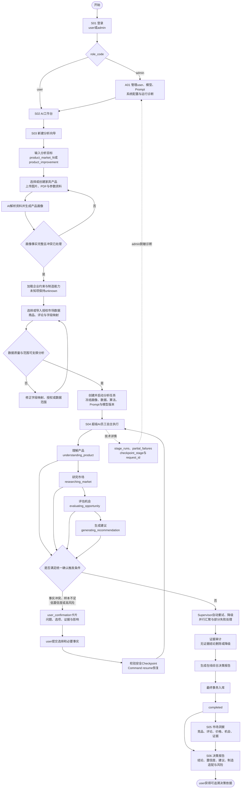
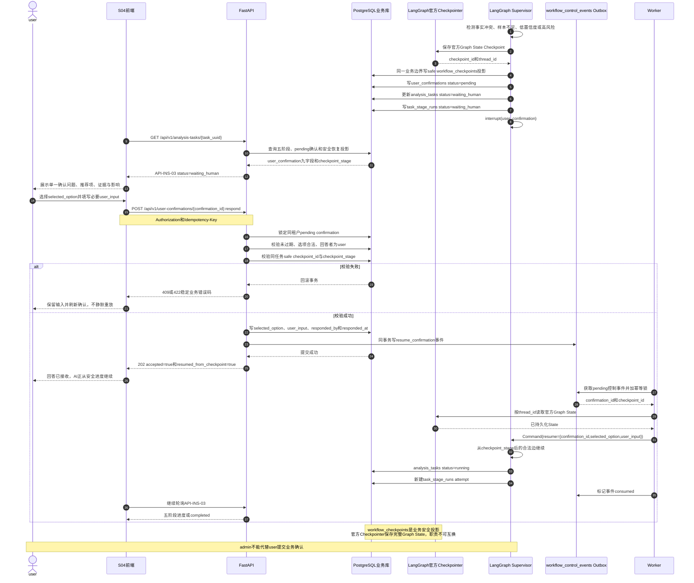
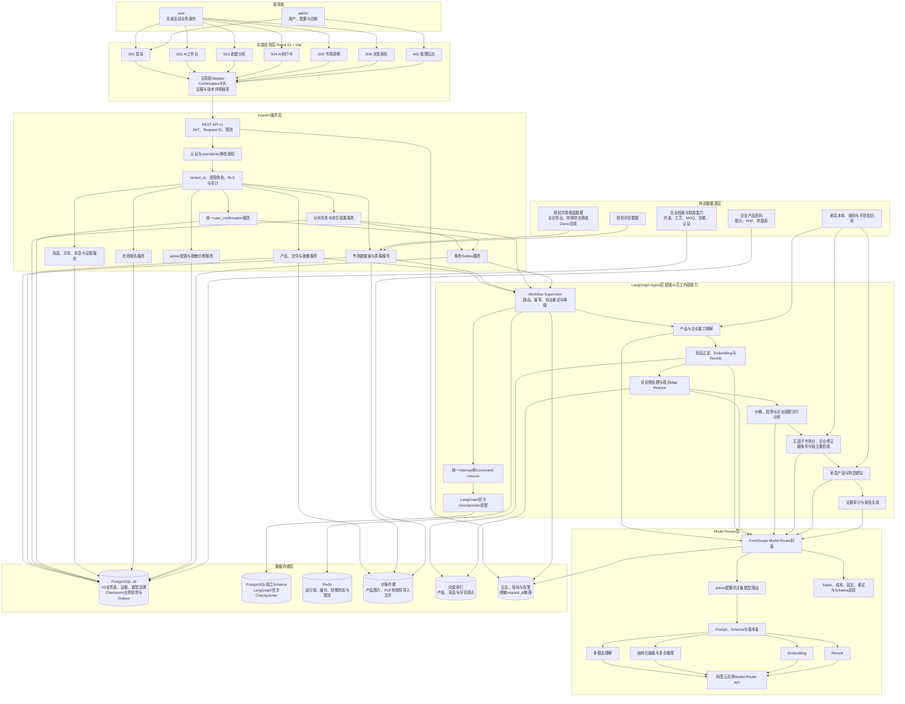
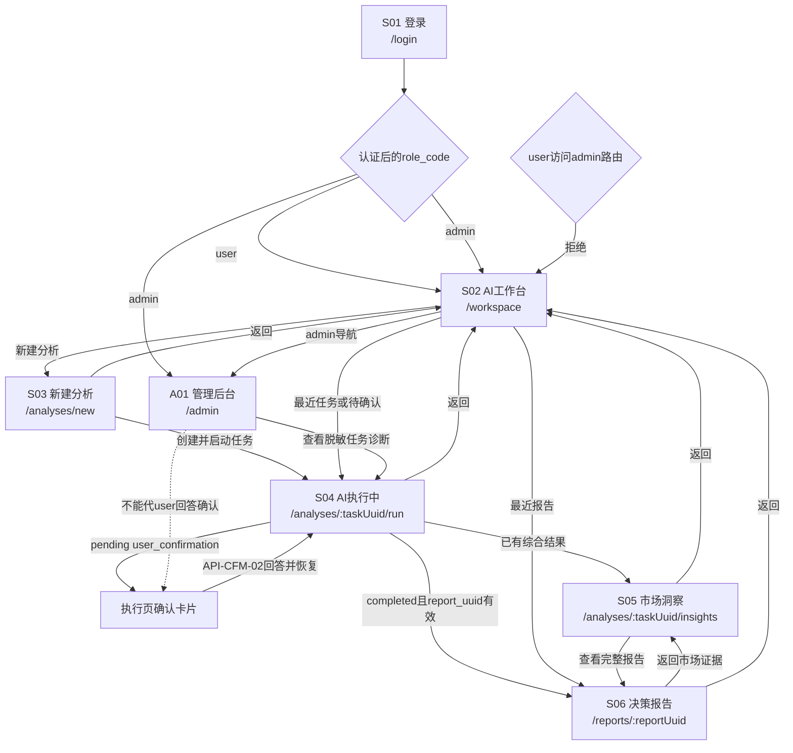

# FurniScope Mermaid 图 V3.0

> 2026-10-05企业增量的完整结构图见[15总体设计§3](./15_FurniScope_企业决策与数据闭环总体设计V1.md#3-总体结构)：标准数据与模板/对账、独立初训/追加/重建、租约恢复与逐SKU滚动发布、企业策略与硬条件、处理反馈→实施/经营观察→完整任务数据→离线验收及RLS。以下图保留核心分析编排，机会评分为五因子市场分及独立企业修正，排序学习仍待真实数据实验。

## 1. 文档说明

本文提供 FurniScope“跨境家具超级 AI 员工”V3 的六张可直接复制渲染的 Mermaid 图。图中系统角色只包含 `user/admin`；多 Agent 是超级 AI 员工的内部能力，不是用户岗位。核心范围不包含 Listing 生成、文件导出、验证任务、多人报告评审和产品运营事件。

图示基线：PRD V2、Agent工作流 V2、产品数据字典 V3、PostgreSQL设计 V3、RESTful API V3、页面交互原型 V3。

## 2. 超级 AI 员工业务流程图

## 3. user_confirmation 与 LangGraph Checkpoint 恢复时序图

## 4. 系统整体架构图

## 5. PostgreSQL V3 ER 图

```mermaid
erDiagram
    tenants {
        bigint id PK
        uuid tenant_uuid UK
        string tenant_code UK
        string name
        string status
    }
    users {
        bigint id PK
        bigint tenant_id FK
        string email
        string role_code
        string status
    }
    auth_sessions {
        bigint id PK
        uuid session_uuid UK
        bigint tenant_id FK
        bigint user_id FK
        string refresh_token_hash UK
        uuid token_family_uuid
        datetime expires_at
        datetime revoked_at
    }
    api_idempotency_records {
        bigint id PK
        bigint tenant_id FK
        bigint actor_user_id FK
        string route_code
        string idempotency_key
        string request_hash
        string status
        datetime expires_at
    }
    enterprise_profiles {
        bigint id PK
        bigint tenant_id FK
        json constraints
    }
    manufacturing_capabilities {
        bigint id PK
        bigint tenant_id FK
        string capability_code
        decimal confidence
    }
    products {
        bigint id PK
        bigint tenant_id FK
        string sku
        string name
        bigint current_profile_version_id FK
    }
    file_assets {
        bigint id PK
        bigint tenant_id FK
        string object_key
        string sha256
    }
    product_parse_jobs {
        bigint id PK
        uuid parse_job_id UK
        bigint tenant_id FK
        bigint product_id FK
        string status
    }
    product_parse_job_files {
        bigint id PK
        bigint parse_job_id FK
        bigint file_asset_id FK
        string parse_status
    }
    product_profile_versions {
        bigint id PK
        bigint tenant_id FK
        bigint product_id FK
        int version_no
        string status
    }
    product_attributes {
        bigint id PK
        bigint tenant_id FK
        bigint profile_version_id FK
        string attribute_code
        decimal confidence
    }
    market_datasets {
        bigint id PK
        bigint tenant_id FK
        string name
        string platform
        string market_country
        json field_mapping
    }
    market_listings {
        bigint id PK
        bigint tenant_id FK
        bigint dataset_id FK
        string platform_listing_id
        json normalized_attributes
    }
    reviews {
        bigint id PK
        bigint tenant_id FK
        bigint dataset_id FK
        bigint listing_id FK
        text content_original
    }
    prompt_templates {
        bigint id PK
        string code
        string version
        string task_type
        string status
    }
    model_route_configs {
        bigint id PK
        string task_type UK
        string primary_model_id
        json compute_config
    }
    analysis_tasks {
        bigint id PK
        uuid task_uuid UK
        bigint tenant_id FK
        bigint product_id FK
        bigint product_profile_version_id FK
        bigint dataset_id FK
        string status
        string external_stage
    }
    task_stage_runs {
        bigint id PK
        bigint task_id FK
        string stage_code
        int attempt_no
        string status
    }
    workflow_checkpoints {
        string checkpoint_id PK
        bigint tenant_id FK
        bigint task_id FK
        string stage_code
        boolean is_safe_resume
    }
    workflow_partial_failures {
        bigint id PK
        bigint tenant_id FK
        bigint task_id FK
        string unit_type
        boolean retryable
    }
    user_confirmations {
        bigint id PK
        uuid confirmation_id UK
        bigint tenant_id FK
        bigint task_id FK
        string checkpoint_id FK
        string confirmation_type
        string status
    }
    workflow_control_events {
        bigint id PK
        uuid event_uuid UK
        bigint tenant_id FK
        bigint task_id FK
        string checkpoint_id FK
        string event_type
        string status
    }
    ai_model_runs {
        bigint id PK
        bigint task_id FK
        bigint stage_run_id FK
        string model_id
        string prompt_version
        string status
    }
    competitor_matches {
        bigint id PK
        bigint task_id FK
        bigint listing_id FK
        bigint product_profile_version_id FK
        string competitor_type
        decimal overall_score
    }
    review_aspects {
        bigint id PK
        bigint task_id FK
        bigint review_id FK
        bigint model_run_id FK
        string taxonomy_code
        string evidence_quote
    }
    insight_clusters {
        bigint id PK
        bigint task_id FK
        int cluster_no
        decimal cluster_confidence
    }
    cluster_members {
        bigint cluster_id PK,FK
        bigint aspect_id PK,FK
        decimal distance
    }
    market_metrics {
        bigint id PK
        bigint task_id FK
        string metric_type
        decimal confidence
    }
    price_bands {
        bigint id PK
        bigint task_id FK
        string band_code
        string currency
    }
    market_opportunities {
        bigint id PK
        bigint task_id FK
        bigint price_band_id FK
        string opportunity_code
        decimal base_score
        decimal confidence
        json manufacturing_fit
    }
    product_recommendations {
        bigint id PK
        bigint task_id FK
        bigint opportunity_id FK
        bigint model_run_id FK
        string recommendation_type
        decimal confidence
    }
    evidence_links {
        bigint id PK
        bigint task_id FK
        string claim_type
        bigint claim_id
        string evidence_type
        bigint evidence_id
    }
    analysis_reports {
        bigint id PK
        uuid report_uuid UK
        bigint tenant_id FK
        bigint task_id FK
        bigint generated_model_run_id FK
        json sections
    }
    audit_logs {
        bigint id PK
        bigint tenant_id FK
        bigint user_id FK
        string action
        string request_id
    }

    tenants ||--o{ users : contains
    tenants ||--o{ auth_sessions : isolates
    users ||--o{ auth_sessions : authenticates
    tenants ||--o{ api_idempotency_records : isolates
    users ||--o{ api_idempotency_records : submits
    tenants ||--|| enterprise_profiles : owns
    tenants ||--o{ manufacturing_capabilities : owns
    tenants ||--o{ products : owns
    tenants ||--o{ file_assets : owns
    tenants ||--o{ market_datasets : owns
    tenants ||--o{ analysis_tasks : runs
    tenants ||--o{ audit_logs : records
    users ||--o{ audit_logs : performs

    products ||--o{ product_parse_jobs : parses
    products ||--o{ product_profile_versions : versions
    product_parse_jobs ||--o{ product_parse_job_files : contains
    file_assets ||--o{ product_parse_job_files : supplies
    product_profile_versions ||--o{ product_attributes : contains
    products o|--o| product_profile_versions : current_profile

    market_datasets ||--o{ market_listings : contains
    market_datasets ||--o{ reviews : scopes
    market_listings ||--o{ reviews : receives

    products ||--o{ analysis_tasks : analyzes
    product_profile_versions ||--o{ analysis_tasks : freezes
    market_datasets ||--o{ analysis_tasks : freezes
    analysis_tasks ||--o{ task_stage_runs : attempts
    analysis_tasks ||--o{ workflow_checkpoints : projects
    analysis_tasks ||--o{ workflow_partial_failures : records
    analysis_tasks ||--o{ user_confirmations : interrupts
    analysis_tasks ||--o{ workflow_control_events : controls
    workflow_checkpoints ||--o{ user_confirmations : resumes
    workflow_checkpoints ||--o{ workflow_control_events : targets
    analysis_tasks ||--o{ ai_model_runs : traces
    task_stage_runs o|--o{ ai_model_runs : invokes

    analysis_tasks ||--o{ competitor_matches : selects
    market_listings ||--o{ competitor_matches : matches
    product_profile_versions ||--o{ competitor_matches : compares
    analysis_tasks ||--o{ review_aspects : extracts
    reviews ||--o{ review_aspects : yields
    ai_model_runs ||--o{ review_aspects : generates
    analysis_tasks ||--o{ insight_clusters : clusters
    insight_clusters ||--o{ cluster_members : contains
    review_aspects ||--o{ cluster_members : joins
    analysis_tasks ||--o{ market_metrics : calculates
    analysis_tasks ||--o{ price_bands : segments
    analysis_tasks ||--o{ market_opportunities : scores
    price_bands o|--o{ market_opportunities : positions
    analysis_tasks ||--o{ product_recommendations : generates
    market_opportunities ||--o{ product_recommendations : supports
    ai_model_runs ||--o{ product_recommendations : generates
    analysis_tasks ||--o{ evidence_links : proves
    analysis_tasks ||--o{ analysis_reports : produces
    ai_model_runs ||--o{ analysis_reports : composes
```

> `evidence_links` 使用受约束的多态证据关联，因此 `claim_id/evidence_id` 不能用单一数据库外键表达；应用层按 `claim_type/evidence_type` 校验同任务、同租户和来源存在性。`workflow_checkpoints` 仅为业务安全投影，LangGraph官方Checkpointer表不纳入本业务ER图。

## 6. 6+1 页面跳转图

## 7. 外部五阶段与内部 Agent 节点映射图

```mermaid
flowchart LR
    subgraph E1[understanding_product 理解产品]
        I00[I00 创建任务并冻结版本]
        I01[I01 Preflight Gate]
        I02[I02 加载产品与企业能力上下文]
        I00 --> I01 --> I02
    end

    subgraph E2[researching_market 研究市场]
        I03[I03 数据质量门禁]
        I04[I04 竞品硬过滤]
        I05[I05 Embedding召回]
        I06[I06 Rerank与解释]
        I07[I07 统一确认门禁]
        I08[I08 评论预处理与批次计划]
        I09[I09 评论观点抽取Map]
        I10[I10 Reduce与质量检查]
        I11[I11 需求Embedding与聚类]
        I12[I12 价格、趋势、企业适配并行分析]
        I03 --> I04 --> I05 --> I06 --> I08 --> I09 --> I10 --> I11 --> I12
        I03 -. 数据不足或低置信 .-> I07
        I06 -. 重大竞品歧义 .-> I07
        I10 -. 主结论低置信 .-> I07
        I07 -. user回答后恢复 .-> I08
    end

    subgraph E3[evaluating_opportunity 评估机会]
        I13[I13 并行分析Join]
        I14[I14 市场分、企业修正<br/>硬条件与独立置信度]
        I13 --> I14
    end

    subgraph E4[generating_recommendation 生成建议]
        I15[I15 Top机会产品策略Map]
        I16[I16 统一确认门禁]
        I17[I17 证据审计]
        I18[I18 在线报告生成]
        I15 --> I17 --> I18
        I15 -. 高风险建议 .-> I16
        I16 -. user回答后恢复 .-> I17
    end

    subgraph E5[completed 完成]
        I19[I19 最终事务入库并完成]
        DONE([在线综合决策报告])
        I19 --> DONE
    end

    I02 --> I03
    I12 --> I13
    I14 --> I15
    I18 --> I19

    SUP[Workflow Supervisor] -. 自动重试、降级、幂等与部分失败 .-> I03
    SUP -. Map Reduce与Checkpoint .-> I09
    SUP -. 报告模板兜底与事务重试 .-> I18
    CONF[user_confirmation<br/>唯一人工中断协议] -. interrupt .-> I07
    CONF -. interrupt .-> I16
    CMD[Checkpoint校验与Command resume] -. 恢复 .-> I07
    CMD -. 恢复 .-> I16
```

映射规则：外部API和页面只能使用五阶段枚举；I00—I19仅出现在技术详情、admin诊断、日志和工作流实现中。I07与I16不是两个审批流程，而是同一 `user_confirmation` 协议在不同安全Checkpoint的调用。

## 8. 后续跨文档依赖

1. 测试用例需覆盖六图中的主路径、四类统一确认触发、Checkpoint冲突、Outbox幂等、部分失败和admin不可代答。
2. FastAPI与LangGraph实现需保持业务Checkpoint投影和官方Checkpointer职责分离，并按时序图保证事务提交后再消费恢复事件。
3. React路由和页面导航需严格使用S01—S06/A01，不恢复V2独立竞品复核、建议复核、Listing或导出路由。
4. 部署架构需确定LangGraph官方Checkpointer独立Schema、Redis用途、对象存储访问控制及向量索引实现。
5. 数据字典或数据库表若后续变化，必须同步ER图；不得仅修改图而不更新结构源文件。

## 9. 版本记录

| 版本 | 日期 | 说明 |
|---|---|---|
| V2.0 | 2026-08-08 | 基于多人岗位与V2接口的旧图集 |
| V3.0 | 2026-08-09 | 按超级AI员工定位重绘业务、恢复、架构、ER、页面与节点映射六张图 |

## 10. 本次变更摘要

- 图中角色收敛为user/admin，删除传统岗位权限节点、动态RBAC和多人审批链。
- 业务流程改为user输入目标后由超级AI员工自主完成研究与建议。
- 将竞品确认和专家复核统一为 `user_confirmation`，新增Checkpoint与`Command(resume=...)`完整时序。
- 系统架构明确React 19 + Vite、FastAPI、LangGraph、Model Router、PostgreSQL/Redis/对象存储及外部数据源分层。
- ER图更新为PostgreSQL V3.2全部35张核心表（含认证会话与API幂等账本），标明业务Checkpoint与官方Checkpointer边界。
- 页面图收敛为6个user页面和1个admin页面。
- 内部I00—I19节点统一投影到五个外部阶段，内部节点不进入user主导航。
