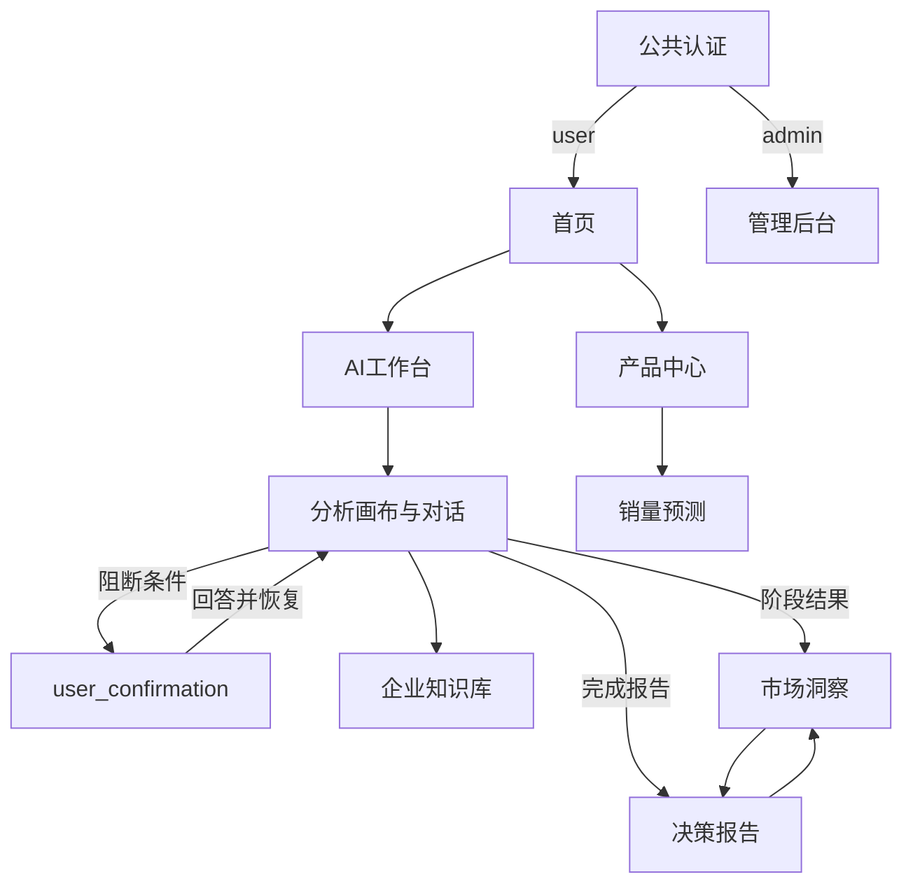

# FurniScope 页面交互原型说明 V3.0

## 2026-10-07 现行信息架构与复盘状态

现行产品以七个企业一级入口组织：`首页 / 产品中心 / AI 工作台 / 企业知识库 / 销量预测 / 市场洞察 / 决策报告`；工作日记、分析画布、数据集详情、竞品监控和报告详情是子页。管理员入口独立，只保留企业登录账号/租户生命周期和租户预测模型两个一级域。

决策报告支持在线阅读及只读 PDF 打印/下载；PDF必须复用服务端冻结值，不得在浏览器端补算金额。自动记忆抽取关闭，输入区不显示三档写入控件；企业知识库是独立持久化资源，工作台绑定只改变检索范围。

2026-10-07运行复盘发现移动端首页、工作日记、报告展示层派生金额、定价口径和多账号管理等未关闭问题，当前发布门槛及问题编号以[16号系统复盘](./16_FurniScope_系统功能与业务流程复盘V1.md)为准。本文后续 S01—S06 章节保留核心交互语义，路由和一级导航以本节及§3为准。

## 2026-10-05 企业闭环复核增量

以[15总体设计](./15_FurniScope_企业决策与数据闭环总体设计V1.md)和[API实现说明](../开发文档/FurniScope_企业决策与标准数据API实现说明V1.md)为本轮增量依据，沿用现有页面和导航：

| 入口 | 已实现交互 |
|---|---|
| 市场洞察 → AI智能选品 | 经营目标模板、五项权重及适配强度；企业事实与必要条件分别保存；旧任务保持原快照 |
| 机会 → 判断依据与处理结果 | 市场原分、修正分、满足/不满足/待确认明细；采纳/拒绝/待验证、原因、修改历史与反馈导出 |
| 机会 → 实施与经营观察 | 最新采纳关联、计划/实施/完成/放弃、实际日期、完整观察区间、目标达成、核验依据、可选确认销量/企业收支；保留修订 |
| AI智能选品 → 导出排序评测数据 | 固定截点按任务完整分页；保留未标注候选，标识旧特征、回溯实施和采纳更新的排除原因 |
| 产品中心 → 事实核验 | 带原文的未勾选候选、冲突纠正、独立成本/报价、记录依据、保存草稿后显式确认画像 |
| 销量预测 → 模型训练 | CSV/XLSX/JSON上传；字段映射、日期/销量/粒度口径；质量、样本、SHA与审计；确认标准版本 |
| 模型训练 → 导入与映射 | 不可变模板修订、SKU一一映射、订单取消/退货/重复、仓库站点、独立销量/库存对账 |
| 模型训练 → 训练范围 | 首次/追加/重建、合并与历史改写预览；排队/训练中/已发布/未达标/失败状态，评测与基线对照 |
| 训练记录 → 分层评测 | 逐SKU三窗口、加权/平均/最差误差及覆盖；稀疏仅整窗总量；新品和全零明确未验证 |
| 销量预测 | 发布后刷新SKU与当前数据日期；企业新引擎禁用未学习的价格/促销/库存情景 |
| 管理员 → 企业私有模型空间 | 展示部署和标准数据训练说明；直接上传代码发布尚未开放 |

映射或口径变化立即使旧预检失效；旧摘要不能用于确认。未达标或失败保留现用部署。权重标注“未校准启发式”；反馈表示用户决策，不能显示为已实现业务收益。本文原“六维机会评分”统一理解为五个市场因子及独立企业适配，竞品的六维可比性仍保持不变。

新品、手动基线、参考SKU或超范围预测缺乏误差依据时，区间及自动安全库存/生产建议显示“待验证”。经营观察只记录企业报告结果，不展示因果收益。桌面与390px移动端证据及7条真实API链路见[本轮验收](../../artifacts/enterprise-20261005/README.md)。

## 1. 文档目标

本文定义“跨境家具超级 AI 员工”的 Web 页面、信息架构和交互反馈，供赛事材料、Figma 原型和 React 19 + Vite 前端开发使用。页面不按传统岗位或内部 Agent 拆分，一个 `user` 可以独立完成产品资料输入、市场数据配置、分析启动、必要确认、洞察查看和决策报告阅读；`admin` 只管理企业账号/租户生命周期和租户预测模型。

文档字段以《FurniScope产品数据字典V3》为准，接口以《FurniScope RESTful API接口设计V3》为准，任务与恢复行为以《FurniScope Agent工作流设计V2》为准。

## 2. 全局交互原则

1. 角色只有 `user/admin`。业务按钮不按管理者、产品、运营、研发或销售拆权限。
2. user 面向一个“超级 AI 员工”，页面不把内部专业 Agent 显示为不同岗位或待办负责人。
3. AI 默认自主运行，只在事实冲突、数据不足、低置信度或高风险建议时显示统一 `user_confirmation`。
4. 外部进度只显示 `understanding_product/researching_market/evaluating_opportunity/generating_recommendation/completed` 五阶段。
5. `stage_runs`、`partial_failures`、`checkpoint_stage` 和请求 ID 只在“技术详情”抽屉展示，不提供 user 手工节点重试按钮。
6. 所有数字结论同时展示数据范围、置信度或限制；机会分与置信度不得混为一个视觉指标。
7. 评论原文和翻译分列；证据高亮以原文 `evidence_start/evidence_end/evidence_quote` 为准。
8. 页面不包含 Listing 生成、业务执行表格、验证任务、多人评审、发布审批或产品运营事件；只读报告 PDF 除外。

### 2.1 全局应用框架

- 桌面优先，同时保证390px移动端无整页横向溢出、关键字段不被裁切。
- 企业左侧/移动底部导航固定为：首页、产品中心、AI工作台、企业知识库、销量预测、市场洞察、决策报告。admin使用独立管理壳。
- 顶栏：租户简称、当前页面、全局“新建分析”、待确认数量、用户菜单。
- user 不显示内部 Agent 名、节点编号、模型切换和重试按钮；admin 诊断区允许查看脱敏内部 Stage。
- 主色深海军蓝 `#102A43`，行动色青绿 `#16A085`，背景 `#F6F8FB`；警告琥珀、失败红、成功绿、未知灰。
- 所有请求展示骨架屏；耗时操作提供明确阶段、可离页说明，不使用无限旋转图标作为唯一反馈。

### 2.2 通用组件

| 组件 | 用途 | 规则 |
|---|---|---|
| `AIStatusBadge` | 任务总体状态 | 文案面向用户，不把内部Stage当产品功能名 |
| `FiveStageStepper` | 五阶段进度 | 已完成、进行中、未开始；重试不倒退已展示进度 |
| `ConfidenceBadge` | 置信度 | 高/中/低与数值同时展示；低置信度不使用成功绿 |
| `EvidenceDrawer` | 证据下钻 | 显示来源、支持关系、原文Span、数据范围和相关度 |
| `ConfirmationCard` | 统一确认 | 单一问题、推荐项、互斥选项、证据、影响；不含转交岗位 |
| `TechnicalDetailsDrawer` | 诊断详情 | stage_runs、partial_failures、checkpoint_stage、retryable、request_id |
| `DataScopeBanner` | 数据口径 | 国家、平台、时间、商品量、有效评论量、数据限制 |
| `EmptyState` | 空数据 | 说明原因、下一步和可调用动作；不把处理中误显示为空 |

### 2.3 通用请求与反馈

- 401：仅调用一次 API-AUTH-02 `POST /api/v1/auth/refresh`；仍失败则清除会话并跳 S01。
- 403：显示权限或租户范围说明，不透露资源是否存在。
- 409：保留用户未提交输入，刷新相关资源后要求用户再次确认，不静默覆盖。
- 422：定位到具体字段或步骤，不只显示 Toast。
- 500/502/503/504：显示脱敏说明与 `request_id`；可返回工作台，不展示堆栈或 Prompt。
- 成功写操作：按钮进入防重复状态；使用 `Idempotency-Key`；成功后以服务端响应更新页面。

## 3. 页面清单

| 编号 | 页面 | 路由 | 可见角色 | 核心接口 |
|---|---|---|---|---|
| P01 | 登录/注册/找回 | `#login/#register/#forgot-password` | Public | 认证接口 |
| E01 | 首页 | `#workspace` | user | Dashboard、任务、报告、确认 |
| E02 | 产品中心 | `#products` | user | 产品、画像、关系、库存、批量导入 |
| E03 | AI工作台 | `#analysis/#workflow/#work-diary` | user | 工作台、Turn、任务、SSE、结果 |
| E04 | 企业知识库 | `#knowledge` | user | 知识库、文档、版本、索引、Context |
| E05 | 销量预测 | `#forecast` | user | 标准数据、目录映射、训练、预测历史 |
| E06 | 市场洞察 | `#insights/#dataset-detail/#competitor-tracking` | user | 数据集、竞品、评论、机会、定价、政策 |
| E07 | 决策报告 | `#report/#report-detail` | user | 报告集合、冻结详情、证据、PDF、归档 |
| A01 | 管理后台 | `#admin/#admin-login` | admin | 企业账号/租户生命周期、租户预测模型 |

## 4. 页面跳转关系

路由守卫：未登录访问企业业务页跳 P01；user 访问 `#admin` 返回 E01 并显示无权限提示；admin不进入企业业务壳，也不能代答企业确认。

## 5. S01 登录

### 5.1 页面用途与目标用户

- 用途：建立 user/admin 会话并加载租户和静态角色边界。
- 目标用户：所有系统账号。

### 5.2 整体布局与核心组件

- 左侧 45% 品牌区：FurniScope 标识、“跨境家具超级 AI 员工”一句话价值、产品资料→市场研究→决策建议的简化示意。
- 右侧登录卡：邮箱、密码、登录按钮、安全与隐私说明。
- 不展示岗位选择、租户手工输入、多角色切换或注册入口。

### 5.3 表单字段

| 字段 | 类型 | 必填 | 校验/反馈 |
|---|---|:---:|---|
| `email` | Email Input | 是 | 小写归一化；格式错误就地提示 |
| `password` | Password Input | 是 | 可显示/隐藏；不写入日志和浏览器持久存储 |

### 5.4 操作与 API

| 操作 | API编号、方法与完整路径 | 成功反馈 | 失败反馈 |
|---|---|---|---|
| 点击登录 | API-AUTH-01 `POST /api/v1/auth/login` | 按钮显示“正在进入”；保存安全会话；继续加载身份 | `AUTH_INVALID_CREDENTIALS`定位表单；停用/租户暂停给出管理员联系提示 |
| 加载身份 | API-AUTH-03 `GET /api/v1/users/me` | user/admin均跳S02；admin导航额外显示A01 | Token或租户上下文异常清除会话并停留S01 |
| 会话续期 | API-AUTH-02 `POST /api/v1/auth/refresh` | 无感更新Token并重放一次原只读请求 | 失败清除会话，提示“登录已过期” |

### 5.5 弹窗与页面状态

- 弹窗：连续失败触发安全限制时显示冷却说明，不透露账号存在性。
- 加载：登录按钮禁用，保留邮箱，不重复提交。
- 空态：不适用。
- 错误态：网络错误显示“检查网络后重试”和 request_id；密码不回填。
- 成功态：短暂显示“登录成功”，立即跳转，避免多余欢迎页。

### 5.6 UI生成Prompt

> Desktop SaaS login for “FurniScope”, split layout, dark navy furniture intelligence branding on left, clean white login card on right, email and password fields, teal primary button, subtle sofa data visualization, professional B2B AI style, no role selector.

## 6. S02 AI工作台

### 6.1 页面用途与目标用户

- 用途：让 user 一眼看到产品、运行任务、待确认和在线报告，并开始新分析。
- 目标用户：user；admin可看到平台允许的工作台摘要和A01入口。

### 6.2 整体布局与核心组件

- 顶部 Hero：问候语、“今天让AI研究什么产品？”和主按钮“新建分析”。
- 第一行四张指标卡：`active_product_count/running_task_count/waiting_confirmation_count/online_report_count`。
- 左侧 2/3：最近任务列表，显示产品名、五阶段、进度、状态、更新时间。
- 右侧 1/3：待确认事项；无确认时显示“AI正在自主处理，无需你操作”。
- 底部：最近在线报告卡片，突出结论、机会分和置信度。

### 6.3 展示与筛选字段

| 区域 | 字段 | 来源 |
|---|---|---|
| 指标 | `metrics.active_product_count/running_task_count/waiting_confirmation_count/online_report_count` | API-DSH-01 |
| 最近任务 | `task_uuid/job_name/product_name/status/stage/progress_percent/updated_at` | API-DSH-01 `recent_tasks` |
| 待确认 | `confirmation_id/confirmation_type/question/checkpoint_stage/expires_at` | API-DSH-01 `confirmation_todos`；详情用API-CFM-01 |
| 最近报告 | `report_uuid/title/overall_opportunity_score/overall_confidence` | API-DSH-01 `recent_reports` |

### 6.4 操作与 API

| 操作 | API编号、方法与完整路径 | 成功反馈 | 失败反馈 |
|---|---|---|---|
| 初始化身份 | API-AUTH-03 `GET /api/v1/users/me` | 显示租户、姓名和正确导航 | 401按全局刷新规则；403隐藏业务数据 |
| 加载工作台 | API-DSH-01 `GET /api/v1/dashboard/summary?recent_limit=5` | 指标、任务、确认、报告各区独立渲染 | 单区失败显示局部重试，不阻断其他区 |
| 查看全部待确认 | API-CFM-01 `GET /api/v1/user-confirmations?status=pending&page=1&page_size=20` | 展开右侧确认列表抽屉 | user以外角色不出现代答按钮 |
| 点击最近任务 | API-INS-03 `GET /api/v1/analysis-tasks/{task_uuid}` | running/waiting/failed跳S04；completed可选择S05/S06 | 404刷新工作台并提示任务不可访问 |
| 点击最近报告 | API-RPT-01 `GET /api/v1/reports/{report_uuid}` | 跳S06并显示报告骨架屏 | 报告未就绪留在S02并提供任务入口 |
| 新建分析 | 前端路由 `/analyses/new`，进入S03后调用API-PRD-02和API-DAT-03 | 跳S03 | 路由加载失败保留S02 |

### 6.5 弹窗与页面状态

- 弹窗：待确认列表使用抽屉；点击条目跳S04并定位确认卡。
- 加载：四张指标卡和列表分别使用骨架，不显示全屏遮罩。
- 空态：无产品/任务时展示“三步启动：产品资料→市场数据→AI分析”及新建按钮；无报告时说明完成首个分析后出现。
- 错误态：工作台整体失败显示 request_id 和重试；局部失败不把数量显示为0。
- 成功态：从S03返回时顶部显示“超级AI员工已开始工作”；从确认返回时显示“已恢复执行”。

### 6.6 UI生成Prompt

> Desktop AI employee dashboard for cross-border furniture, navy sidebar, light gray canvas, teal “New analysis” CTA, four metric cards, recent task list with five-stage progress bars, pending confirmation panel, recent report cards with score and confidence badges, clean premium B2B SaaS style.

## 7. S03 新建分析

### 7.1 页面用途与目标用户

- 用途：在一个向导中完成分析目标、产品与资料、企业约束、市场数据和启动确认，不再跳转产品库、画像页、数据集页和任务创建页。
- 目标用户：user。

### 7.2 整体布局与步骤

- 顶部四步 Stepper：①分析目标 ②产品与企业能力 ③市场数据 ④确认并启动。
- 主区 8列为当前步骤表单；右侧4列为“AI将如何处理”摘要和数据完整度。
- 底部固定操作栏：上一步、保存当前输入、下一步；第四步主按钮“交给AI开始分析”。

### 7.3 表单字段

#### 步骤一：分析目标

| 字段 | 类型 | 必填 | 规则 |
|---|---|:---:|---|
| `job_name` | Input | 是 | 默认产品+市场+日期，可编辑 |
| `job_type` | Radio | 是 | `product_market_fit/product_improvement` |
| `target_country` | Select | 是 | ISO国家码 |
| `target_platform` | Select | 是 | 与数据集平台一致 |
| `analysis_currency` | Select | 是 | ISO 4217 |

#### 步骤二：产品与企业能力

| 字段/组件 | 必填 | 规则 |
|---|:---:|---|
| 选择已有产品 `product_id` 或创建 `sku/name/category_code/description` | 是 | P0家具品类按现有本体；不编造产品事实 |
| 上传产品资料 `files/source_type/parse_config` | 否 | 图片、PDF、参数资料；安全扫描后解析 |
| 产品画像 `profile_version_id/attributes` | 是 | 展示来源、置信度、确认状态；冲突不得静默覆盖 |
| `enterprise_profile.constraints`摘要 | 条件 | 使用已有企业档案；未知显示unknown，不填0 |

#### 步骤三：市场数据

| 字段/组件 | 必填 | 规则 |
|---|:---:|---|
| 选择已有 `dataset_id` | 二选一 | 仅status=ready可启动 |
| 新建数据集 `name/platform/market_country/category_code/data_start_date/data_end_date/source_type/source_name` | 二选一 | 与步骤一目标一致 |
| `authorization_reference` | 条件 | 非公开授权数据必填 |
| 导入文件、`field_mapping`、`deduplication_strategy` | 新建时是 | 字段映射使用白名单 |
| 质量摘要 | 是 | listing_count/review_count/valid_review_count/quality_score/limitations |

#### 步骤四：确认并启动

- 展示冻结的 `product_profile_version_id/dataset_id/target_country/target_platform/analysis_currency`。
- 展示 `analysis_config` 中已由系统和admin配置的阈值、Top-K和权重摘要；user不编辑模型ID或Prompt。
- 显示数据限制、未知企业能力和将影响置信度的项目。

### 7.4 操作与 API

| 操作 | API编号、方法与完整路径 | 成功反馈 | 失败反馈 |
|---|---|---|---|
| 加载已有产品 | API-PRD-02 `GET /api/v1/products?page=1&page_size=100` | 列出画像状态和更新时间 | 空态直接展开创建产品表单 |
| 创建产品 | API-PRD-01 `POST /api/v1/products` | 保存product_id，自动进入资料区 | SKU冲突定位sku；品类错误定位category_code |
| 查看产品画像 | API-PRD-03 `GET /api/v1/products/{product_id}` | 填充画像版本、属性、来源与完整度 | 无画像显示上传资料引导 |
| 保存产品/草稿画像 | API-PRD-04 `PATCH /api/v1/products/{product_id}` | Toast“产品信息已保存”并刷新版本 | 409保留编辑内容，提供刷新再比较 |
| 上传并解析资料 | API-PRD-05 `POST /api/v1/products/{product_id}/assets:parse` | 显示文件级解析卡片并记录parse_job_id | 文件错误定位单个文件，不清除已成功文件 |
| 查询解析进度 | API-PRD-06 `GET /api/v1/product-parse-jobs/{parse_job_id}?include_files=true` | 每3秒刷新；完成后重新加载API-PRD-03 | 局部失败显示summary和file_results，可继续使用成功结果 |
| 确认画像 | API-PRD-07 `POST /api/v1/products/{product_id}/profile:confirm` | 状态变为confirmed并解锁下一步 | 冲突/不完整滚动到属性，不提供强制绕过 |
| 加载数据集 | API-DAT-03 `GET /api/v1/market-datasets?page=1&page_size=100&status=ready` | 列出范围、样本量、质量分和限制 | 无ready数据集展开导入流程 |
| 创建数据集 | API-DAT-01 `POST /api/v1/market-datasets` | 保存dataset_id并进入文件导入 | 授权缺失或范围不一致定位字段 |
| 导入商品评论 | API-DAT-02 `POST /api/v1/market-datasets/{dataset_id}/imports` | 显示validating状态并轮询详情 | 映射错误保留文件和映射草稿 |
| 查询数据质量 | API-DAT-04 `GET /api/v1/market-datasets/{dataset_id}` | ready时解锁下一步；展示quality_report和limitations | rejected显示修正建议，不允许启动 |
| 创建任务 | API-INS-01 `POST /api/v1/analysis-tasks` | 保存task_uuid；状态draft | 前置条件失败定位对应步骤 |
| 启动任务 | API-INS-02 `POST /api/v1/analysis-tasks/{task_uuid}:start` | Toast“超级AI员工已开始工作”，跳S04 | 创建成功但启动失败保留task_uuid，允许再次调用启动接口 |

### 7.5 弹窗与页面状态

- 弹窗：离开未保存向导时确认；开始分析前展示冻结输入、数据限制和计费/算力提示，不要求跨部门审批。
- 加载：解析和数据导入允许用户离开当前步骤；每个文件显示`security_status/parse_status`，其中安全状态使用`pending/clean/rejected/quarantined`。
- 空态：无已有产品、画像或数据集时，在当前步骤内完成创建，不跳独立管理页。
- 错误态：字段错误就地显示；模型解析失败可保留人工结构化输入；未知事实必须显示unknown。
- 成功态：每步完成显示绿色勾选；启动后不可继续修改冻结版本，修改需创建新任务。

### 7.6 UI生成Prompt

> Four-step desktop analysis wizard for a furniture AI employee: goal, product and files, market dataset, review and launch. Wide form area with right-side AI summary, file upload cards, product attribute confidence chips, dataset quality panel, sticky footer navigation, navy and teal enterprise SaaS visual style.

## 8. S04 AI执行中

### 8.1 页面用途与目标用户

- 用途：用可理解的五阶段展示AI进度，在确有阻断时让user完成一次业务确认，并提供受控技术详情。
- 目标用户：user；admin可从A01进入脱敏诊断视图。

### 8.2 整体布局与核心组件

- 顶部：任务名、产品名、总体状态、进度百分比、返回工作台。
- 中央：横向 `FiveStageStepper`，当前阶段下显示自然语言活动，如“正在比较可比家具商品”，不显示 I07/N09 等节点码。
- 阶段下方：AI工作日志摘要，仅展示对user有意义的里程碑和数据范围变化。
- 有pending确认时：页面中央置顶 `ConfirmationCard`。
- 右侧：部分失败/限制提示和“技术详情”入口。
- 底部：完成后出现“查看市场洞察”和“打开决策报告”。

### 8.3 展示字段

| 组件 | 字段 | API来源 | 展示规则 |
|---|---|---|---|
| 任务状态 | `task_uuid/status/stage/progress_percent` | API-INS-03 | stage仅五枚举；对外进度单调 |
| 确认卡 | `user_confirmation`九字段 | API-INS-03；列表可用API-CFM-01 | null时不占位 |
| 部分失败 | `partial_failures[].unit_type/failed_count/total_count/impact/retryable` | API-INS-03 | user只看影响，不显示重试按钮 |
| 报告入口 | `report_uuid` | API-INS-03 | null时禁用报告入口 |
| 技术详情 | `stage_runs/checkpoint_stage/retryable/request_id` | API-INS-03及响应Envelope | 默认折叠；错误脱敏 |

### 8.4 五阶段展示文案

| stage | 用户文案 | 典型可见产物 |
|---|---|---|
| `understanding_product` | 理解产品与企业能力 | 产品画像、冲突和未知项 |
| `researching_market` | 研究市场与可比商品 | 数据质量、竞品样本、评论抽取 |
| `evaluating_opportunity` | 评估需求与机会 | 聚类、价格、市场分、企业修正和条件检查 |
| `generating_recommendation` | 生成产品与制造建议 | 工程建议、适配和风险审计 |
| `completed` | 分析完成 | 综合洞察与在线报告 |

### 8.5 user_confirmation 卡片

- 卡片字段严格为：`confirmation_id/confirmation_type/question/recommended_option/options/evidence_refs/impact/checkpoint_stage/expires_at`。
- 推荐项带“AI建议”标签，但不预先替user提交。
- 选项互斥；选项需要补充事实时展开 `user_input` 的Schema表单。
- “查看依据”打开证据抽屉；“确认并继续”是唯一主操作。
- 不显示“转给研发”“请运营复核”“专家批准”等岗位动作。

### 8.6 技术详情抽屉

- 摘要：task_uuid、status、stage、progress_percent、checkpoint_stage、retryable、最近request_id。
- Stage Runs：user视图展示`stage_code/attempt_no/status/started_at/ended_at`；admin诊断视图可额外展示脱敏后的`error_code/error_message`，只读时间线。
- Partial Failures：`unit_type/failed_count/total_count/impact/retryable`；说明AI会自动重试/降级。
- user视图不提供Stage选择、模型切换、手工重试和取消。
- admin从A01进入时额外调用API-ADM-07，并可在P1诊断区执行API-ADM-08；不能回答确认。

### 8.7 操作与 API

| 操作 | API编号、方法与完整路径 | 成功反馈 | 失败反馈 |
|---|---|---|---|
| 初始化/轮询状态 | API-INS-03 `GET /api/v1/analysis-tasks/{task_uuid}?include_stage_runs=false` | 更新五阶段、进度、确认和结果入口 | 404返回S02；状态不一致展示request_id |
| 打开技术详情（user受控） | API-INS-03 `GET /api/v1/analysis-tasks/{task_uuid}?include_stage_runs=true&stage_run_limit=50` | 打开脱敏时间线 | 无权限时保留业务进度，不打开抽屉 |
| 查询当前确认 | API-CFM-01 `GET /api/v1/user-confirmations?status=pending&task_uuid={task_uuid}&page=1&page_size=1` | 确认卡与任务状态交叉校验 | 不一致时刷新API-INS-03，不允许提交旧卡 |
| 提交确认 | API-CFM-02 `POST /api/v1/user-confirmations/{confirmation_id}:respond` | 显示“回答已接收，AI正从安全进度继续”；立即刷新状态 | 到期/已回答刷新卡片；Checkpoint冲突不重放旧答案 |
| 查看综合洞察 | API-INS-04 `GET /api/v1/analysis-tasks/{task_uuid}/result` | 跳S05 | 结果未就绪保留S04并说明当前阶段 |
| 查看报告 | API-RPT-01 `GET /api/v1/reports/{report_uuid}` | report_uuid有效时跳S06 | REPORT_NOT_READY保留S04 |
| admin查看诊断【P1】 | API-ADM-07 `GET /api/v1/admin/analysis-tasks/{task_uuid}/diagnostics` | A01诊断抽屉显示脱敏模型和控制事件 | 诊断范围不足仅显示基本状态 |
| admin安全恢复/停止【P1】 | API-ADM-08 `POST /api/v1/admin/analysis-tasks/{task_uuid}:recover` | 显示控制事件pending并继续观察状态 | 有pending确认时禁止恢复；Checkpoint冲突要求重新诊断 |

### 8.8 轮询规则

1. 进入页面立即调用API-INS-03。
2. 页面可见且非终态时每3秒轮询；连续5次无变化退避至5秒；浏览器后台暂停。
3. `waiting_human`时停止常规轮询，展示确认卡；提交API-CFM-02返回202后立即刷新并恢复3秒轮询。
4. `succeeded/partial_succeeded/failed/cancelled`停止轮询；completed且report_uuid有效时解锁S06。
5. 单次超时不改变页面状态；连续3次失败显示连接横幅和request_id。

### 8.9 弹窗与页面状态

- 弹窗：确认影响详情；admin P1安全停止需要二次确认并填写审计原因。
- 加载：首次为五阶段骨架；轮询不闪烁页面；确认提交锁定按钮。
- 空态：无partial_failures显示“当前未发现影响结论的局部失败”；无确认不显示卡片。
- 错误态：failed展示failure_code/failure_message的用户安全文案和技术详情入口；不展示堆栈。
- 成功态：阶段完成有轻量动画；任务完成突出综合结果与报告，不弹强制全屏庆祝。

### 8.10 UI生成Prompt

> AI execution dashboard for a cross-border furniture super employee, large five-step horizontal progress tracker, current activity card, optional high-priority confirmation card with evidence and mutually exclusive options, partial-failure warning panel, collapsible technical details drawer, navy teal professional SaaS style, no internal agent node controls.

## 9. S05 市场洞察

### 9.1 页面用途与目标用户

- 用途：在一个页面中查看市场证据与机会判断，不再拆竞品看板、评论页和趋势页。
- 目标用户：user。

### 9.2 整体布局与 Tabs

- 顶部：DataScopeBanner、报告入口、机会分与置信度双指标。
- Tabs：①总览 ②竞品 ③评论需求 ④价格 ⑤机会 ⑥证据。
- 各Tab共享任务上下文、数据范围和筛选状态；URL使用 `?tab=competitors` 等可分享参数，不包含敏感查询正文。

### 9.3 Tab组件与字段

| Tab | 核心组件 | 字段/API |
|---|---|---|
| 总览 | 摘要卡、Top需求、Top机会、限制 | API-INS-04 `report_summary/data_scope/competitor_summary/insight_clusters/opportunities/partial_failures` |
| 竞品 | 类型分布、六维雷达、商品表、匹配原因抽屉 | API-CMP-01 `competitor_set_version/competitor_summary/available_review_count/items` |
| 评论需求 | 聚类气泡/排行、观点表、原文证据 | API-REV-02聚类；API-REV-01观点 |
| 价格 | 价格摘要、币种/时间口径、价格与机会关联 | API-RPT-01 `price_summary/data_scope_snapshot`；报告未生成时显示处理中 |
| 机会 | 五市场因子、market_score/adjusted_score、confidence和条件摘要 | API-OPP-01 |
| 证据 | claim筛选、支持/反驳/限制、EvidenceDrawer | API-EVD-01 |

### 9.4 筛选字段

- 竞品：`competitor_type/set_version/sort_by/page/page_size`。
- 评论观点：`taxonomy_code/sentiment/listing_id/min_confidence/page/page_size`。
- 需求聚类：`sentiment/taxonomy_code/min_confidence/page/page_size`。
- 机会：`recommendation_level/min_confidence/page/page_size`。
- 证据：`claim_type/claim_id/claim_path/page/page_size`。
- 筛选值只来自API V3定义，不新增岗位、审核状态或人工纳入状态。

### 9.5 操作与 API

| 操作 | API编号、方法与完整路径 | 成功反馈 | 失败反馈 |
|---|---|---|---|
| 加载总览 | API-INS-04 `GET /api/v1/analysis-tasks/{task_uuid}/result` | 渲染综合摘要和各Tab入口 | 未就绪显示S04进度入口 |
| 加载竞品 | API-CMP-01 `GET /api/v1/analysis-tasks/{task_uuid}/competitors` | 展示分层、六维分和匹配原因 | 无结果说明样本门禁/阶段状态，不显示人工改类按钮 |
| 加载评论观点 | API-REV-01 `GET /api/v1/analysis-tasks/{task_uuid}/review-aspects` | 分页表格和原文Span | 无评论显示数据范围限制，不把0评论解读为无需求 |
| 加载需求聚类 | API-REV-02 `GET /api/v1/analysis-tasks/{task_uuid}/insight-clusters` | 聚类排序并标明分母和置信度 | 聚类未完成提供S04入口 |
| 查看价格摘要 | API-RPT-01 `GET /api/v1/reports/{report_uuid}` | 读取price_summary及data_scope_snapshot | report_uuid为空显示“价格摘要随报告生成” |
| 加载机会 | API-OPP-01 `GET /api/v1/analysis-tasks/{task_uuid}/opportunities` | 同时展示评分、置信度、实际权重和manufacturing_fit | 缺成本/增长数据以空值和限制呈现，不显示0 |
| 查看证据 | API-EVD-01 `GET /api/v1/analysis-tasks/{task_uuid}/evidence?claim_type={claim_type}&claim_id={claim_id}` | 打开证据抽屉并定位原文 | 证据审计未完成则标记结论不可充分解释 |
| 打开报告 | API-RPT-01 `GET /api/v1/reports/{report_uuid}` | 跳S06 | 报告未完成保留S05 |

### 9.6 弹窗与页面状态

- 弹窗/抽屉：竞品匹配理由、评论原文、机会评分公式、制造适配和证据均用右侧抽屉；不提供人工审核提交。
- 加载：首次总览骨架；切换Tab按需加载并缓存同一任务结果；筛选使用表格局部loading。
- 空态：每个Tab区分“处理中”“无授权数据”“筛选无结果”“数据不足”四种，不统一写暂无数据。
- 错误态：局部Tab失败不清空其他Tab；显示request_id和重试本Tab。
- 成功态：筛选更新URL；打开证据时高亮对应结论；不使用“审核通过”文案。

### 9.7 决策中心现行分页与下钻

- AI智能选品、竞品动态追踪、评论深挖均提供“洞察概览”；选品另有经营配置工作台，竞品和评论分别进入监控工作台、舆情工作台。
- 三个概览列表统一支持`page/page_size`、上一页、下一页和详情返回位置保留。
- 选品列表每条表示由评论需求主题和市场信号形成的候选机会方向，不表示商品或 SKU。
- 竞品详情展示变更前后值和最近快照；评论主题详情展示情绪分布与受保护评论原文证据。
- 当旧后端尚未加载新增分页路由时，页面只显示总览预览和“需重启 API 服务”提示，并禁用翻页与详情入口，不再同时显示通用 404 错误和可操作列表。

### 9.8 UI生成Prompt

> Cross-border furniture market insights dashboard with top data-scope banner and separate opportunity score/confidence badges, six tabs for overview, competitors, review needs, pricing, opportunities and evidence. Include radar chart, ranked need clusters, opportunity score cards, dense data table and right evidence drawer, premium navy teal analytics UI.

## 10. S06 决策报告

### 10.1 页面用途与目标用户

- 用途：把AI研究结果组织成可直接决策的在线报告，突出做什么、为什么、可信程度、制造适配与风险。
- 目标用户：user；不再按管理者、研发、销售提供不同按钮。

### 10.2 整体布局与核心组件

- 顶部报告头：title、report_version、生成时间、数据范围、模型追溯入口。
- 首屏结论卡：`decision_recommendation/overall_opportunity_score/overall_confidence/executive_summary`。
- 主体顺序：市场机会→产品建议→制造适配→风险→待验证事项→完整章节。
- 右侧固定目录，根据 `sections.sort_order` 生成。
- 每个核心结论提供“为什么”按钮，打开EvidenceDrawer。
- 页面不显示发布、审批或生成Listing按钮；允许从集合页和详情页下载与冻结在线内容一致的只读 PDF。

### 10.3 展示字段

| 区域 | 字段 | 来源 |
|---|---|---|
| 报告头 | `report_uuid/report_version/title/status` | API-RPT-01 |
| 核心结论 | `executive_summary/decision_recommendation/overall_opportunity_score/overall_confidence` | API-RPT-01 |
| 范围/复现 | `data_scope_snapshot/product_profile_snapshot/enterprise_profile_snapshot/version_bundle/model_trace` | API-RPT-01 |
| 市场与风险 | `target_user_summary/price_summary/risk_summary/partial_failures_snapshot` | API-RPT-01 |
| 待验证 | `pending_validation_items` | API-RPT-01；仅展示，不创建validation_task |
| 章节 | `sections` | API-RPT-01，按sort_order |
| 机会 | 五个市场因子、market_score、adjusted_score、confidence、recommendation_level、manufacturing_fit | API-OPP-01 |
| 建议 | problem、hypotheses、action、benefit、impact、priority、confidence、validation_method、risk_level | API-REC-01 |

### 10.4 操作与 API

| 操作 | API编号、方法与完整路径 | 成功反馈 | 失败反馈 |
|---|---|---|---|
| 加载在线报告 | API-RPT-01 `GET /api/v1/reports/{report_uuid}?include_model_trace=true` | 渲染冻结快照、章节和限制 | 未就绪返回S04；证据审计失败显示阻断说明 |
| 加载机会详情 | API-OPP-01 `GET /api/v1/analysis-tasks/{task_uuid}/opportunities` | 展开市场分、企业修正和manufacturing_fit | 局部失败仍保留报告快照并标注限制 |
| 加载产品建议 | API-REC-01 `GET /api/v1/analysis-tasks/{task_uuid}/recommendations` | 展示建议卡与风险，不显示复核按钮 | 无建议时说明数据不足或能力缺口 |
| 查看结论证据 | API-EVD-01 `GET /api/v1/analysis-tasks/{task_uuid}/evidence?claim_type={claim_type}&claim_id={claim_id}&claim_path={claim_path}` | 原文、支持关系和范围快照进入抽屉 | 证据缺失标记validation_required，不伪装完整可信 |
| 下载只读 PDF | 浏览器打印/PDF；输入只能来自已加载冻结报告 | 集合页和详情页均可下载；数值与在线报告一致 | 冻结字段缺失时显示待核算，不允许展示层推算 |
| 返回市场洞察 | API-INS-04 `GET /api/v1/analysis-tasks/{task_uuid}/result` | 跳S05并保持任务上下文 | 结果不可访问返回S02 |

### 10.5 弹窗与页面状态

- 弹窗/抽屉：模型追溯仅显示provider/model/version/Prompt版本/Token/耗时/Schema结果，不显示Prompt正文或密钥；制造适配展开能力证据。
- 加载：报告头和章节分区骨架；机会/建议下钻延迟加载，不阻断首屏摘要。
- 空态：可选target_user_summary或price_summary为空时显示缺失原因；pending_validation_items为空显示“当前无额外待验证事项”。
- 错误态：报告不存在/跨租户返回S02；单章节结构错误使用安全降级文本并记录request_id。
- 成功态：目录定位、证据高亮和URL锚点同步；在线报告无需“发布成功”反馈。

### 10.6 UI生成Prompt

> Executive decision report for a furniture market AI product, strong conclusion hero with recommendation, separate opportunity score and confidence, sections for opportunities, product engineering recommendations, manufacturing fit, risks and validation items, sticky table of contents, evidence drawer, premium report-like navy teal SaaS design, no export or approval buttons.

### 10.7 S07 企业知识库

- 路由：`#knowledge`；从分析工作台进入时携带`workspace`与`return`参数。
- 布局：左侧知识库清单，右侧文档和索引表，文档检查器承载内容预览与版本历史。
- 知识库操作：创建、编辑、归档；权限仅允许`企业共享(tenant)`和`仅自己(user)`。
- 文档操作：上传、删除、重索引、同类型新版本上传；展示SHA、大小、版本和索引状态。
- 回溯规则：历史版本只读；回溯会克隆历史内容为新的当前版本并重新索引。
- 工作台绑定：仅修改该工作台Context的`knowledge_base_uuids`，不改变资料持久化与访问权限。
- 对话界面只保留知识库多选器和“前往知识库管理”；不再承载创建、上传、删除或版本管理。
- 自动记忆抽取关闭，输入区不显示“本轮/工作台/个人”写入范围控件。

## 11. A01 管理后台

### 11.1 页面用途与目标用户

- 用途：管理企业登录账号及租户生命周期，查看各租户的销量预测模型状态。
- 目标用户：仅admin。admin不进入企业业务工作台，也不代替企业用户回答确认。
- 不把模型路由、Prompt、数据源、SKU目录或工作流诊断恢复为一级管理员导航。

### 11.2 整体布局与 Tabs

- 独立admin侧栏，顶部持续显示“平台管理模式”。
- 仅两个一级域：企业用户、租户预测模型。
- 企业用户按真实登录账号逐一展示；预测模型按租户分组。

### 11.3 字段与组件

| Tab | 字段/组件 | API来源 |
|---|---|---|
| 企业用户 | user_id、tenant_id、企业、联系人、邮箱、账号状态、租户状态、授权、最近登录 | `/api/v1/admin/enterprise-users` |
| 租户预测模型 | tenant_id、部署状态、引擎、数据截至日、SKU覆盖、最近训练、部署历史和回滚 | `/api/v1/admin/forecast-models` |

### 11.4 操作与 API

| 操作 | 成功反馈 | 失败反馈 |
|---|---|---|
| 创建/审批企业账号 | 创建租户、登录账号和预测模型记录；显示审计结果 | 邮箱/租户冲突定位字段，不部分创建 |
| 停用/启用单个账号 | 只改变目标登录账号 | 不影响同租户其他账号 |
| 关闭企业租户 | 停用全部企业账号、撤销会话、创建可恢复删除任务 | 弹窗明确这是租户级操作；当前admin所在租户不可关闭 |
| 恢复企业租户 | 取消删除任务，并按关闭前快照恢复全部原active账号 | 人工停用账号不被误恢复 |
| 重置密码 | 只重置目标user并撤销其会话 | 不影响同租户其他账号 |
| 查看/更新模型 | 说明企业标准数据训练路径；评测通过后刷新部署 | 不提供直接上传Python发布 |

### 11.5 弹窗与页面状态

- 关闭租户、恢复租户和重置密码均二次确认并说明账号范围。
- “已删除”筛选保留关闭租户；默认列表不展示关闭租户。
- 所有写操作显示审计已记录，并使用资源版本避免并发覆盖。
- 当前实现仍有同租户只展示一个账号和恢复单账号问题，整改要求见16号复盘 FS-ADM-001/002。

### 11.6 UI生成Prompt

> Admin-only FurniScope control center with two domains: enterprise login accounts and tenant forecast models. Show every real login account, group deployments by tenant, support audited reversible tenant closure and recovery, and keep direct code publishing unavailable.

## 12. 页面—API V3 完整映射

| 页面 | P0接口 | P1接口 | 不应出现的接口 |
|---|---|---|---|
| S01 | API-AUTH-01/02/03 | 无 | 岗位选择、RBAC |
| S02 | API-AUTH-03、API-DSH-01、API-CFM-01、API-INS-03、API-RPT-01 | 无 | 多人待办分配 |
| S03 | API-PRD-01—07、API-DAT-01—04、API-INS-01/02 | 无 | 模型ID编辑、岗位审批 |
| S04 | API-INS-03/04、API-CFM-01/02、API-RPT-01 | API-ADM-07/08（admin） | user手工Stage重试、竞品/专家独立复核 |
| S05 | API-INS-04、API-CMP-01、API-REV-01/02、API-EVD-01、API-OPP-01、API-RPT-01 | 无 | 评论人工校正、竞品人工改类 |
| S06 | API-RPT-01、API-OPP-01、API-REC-01、API-EVD-01、API-INS-04 | 只读PDF | 发布、审批、业务执行表格、Listing |
| A01 | 无 | 企业账号/租户生命周期、租户预测模型接口 | 代user回答确认、动态RBAC、一级Prompt/路由/诊断台 |

## 13. Demo演示主路径

1. S01以user登录，进入S02。
2. S02点击“新建分析”，S03一次完成目标、产品资料、画像确认、市场数据和启动。
3. S04展示五阶段；Demo可触发一个 `low_confidence` 或 `high_risk_recommendation` 确认卡。
4. user查看证据并提交选项；页面反馈从Checkpoint恢复，继续五阶段。
5. S05用总览、竞品、评论需求、价格、机会、证据Tabs展示市场洞察。
6. S06展示结论、置信度、产品建议、制造适配、风险和待验证事项。
7. 如需展示技术能力，打开S04技术详情抽屉；不切换到内部Agent操作台。

## 14. V2页面→V3页面合并映射

| V2页面 | V3页面 | 处理方式 | 说明 |
|---|---|---|---|
| P01 登录首页 | S01 登录 | 保留重构 | 删除岗位/角色选择，只加载user/admin |
| P02 项目工作台 | S02 AI工作台 | 保留重构 | 围绕一个超级AI员工的任务、确认和报告 |
| P03 产品库 | S03 新建分析 | 合并 | 产品选择/创建内嵌向导 |
| P04 产品画像确认页 | S03 新建分析 | 合并 | 上传、解析、属性修正和画像确认在步骤二完成 |
| P05 市场数据集导入页 | S03 新建分析 | 合并 | 数据选择、授权、导入和质量门禁在步骤三完成 |
| P06 任务创建页 | S03 新建分析 | 合并 | 目标、冻结输入、创建和启动统一完成 |
| P07 任务运行详情页 | S04 AI执行中 | 重构 | 只显示五阶段；内部运行进入技术详情抽屉 |
| P08 竞品监控看板 | S05市场洞察竞品Tab | 合并 | 删除逐条人工复核和集合审批 |
| P09 评论分析结果页 | S05市场洞察评论需求/证据Tab | 合并 | 删除人工校正；保留原文证据和聚类 |
| P10 选品趋势报告页 | S05市场洞察 + S06决策报告 | 拆分重组 | 分析探索在S05，决策结果在S06 |
| P11 产品建议复核页 | S04确认卡 + S06产品建议 | 合并 | 高风险才触发统一确认，无专家审批页 |
| P12 Listing编辑预览页 | 无 | 移出核心 | 不进入V3导航、路由或API |
| P13 报告导出页面 | E07决策报告 | 合并收口 | 不恢复独立导出中心，只提供与冻结在线报告一致的PDF |
| V2管理员分散入口 | A01管理后台 | 合并 | 只保留企业账号/租户生命周期和租户预测模型两个一级域 |

## 15. 后续跨文档依赖

1. Mermaid图文档需同步七个企业一级入口、关联子页、五阶段、统一确认和综合结果路径。
2. 测试用例需按E01—E07/A01覆盖中断恢复、确认幂等、技术详情脱敏、user/admin边界和390px响应式。
3. React路由与组件使用§3现行Hash路由和API契约，不复用V2岗位权限守卫；UI视觉与组件实现以 `frontend/` 为准。
4. Figma原型需先建立全局色板、组件状态和证据/置信度规范，再逐页使用本文Prompt。
5. API V3后续若新增独立价格下钻接口，须先更新数据字典；当前价格Tab只读取API-RPT-01已有 `price_summary`。
6. 管理后台若要恢复Prompt、模型路由或诊断一级域，必须先经PRD和信息架构评审，页面不得自行增加。

## 16. 版本记录

| 版本 | 日期 | 说明 |
|---|---|---|
| V2.0 | 2026-08-08 | 13页面、多岗位、独立竞品/专家复核及Listing/导出扩展形态 |
| V3.0 | 2026-08-09 | 重构为一个user驾驭超级AI员工的6个业务页面+1个admin页面 |
| V3.1 | 2026-10-07 | 同步七个企业一级入口、知识库/记忆边界、销量预测、报告PDF和双域管理员后台；登记16号复盘整改门槛 |

## 17. 本次变更摘要

- 现行页面组织为7个企业一级入口、关联子页和1个独立admin入口。
- 将产品、资料解析、画像确认、市场数据和任务配置合并为一个新建分析向导。
- 将竞品确认与建议复核合并为S04统一 `user_confirmation` 卡片，并按Checkpoint安全恢复。
- S04主界面仅展示五阶段；内部运行信息收进技术详情抽屉。
- S05使用Tabs整合竞品、评论需求、价格、机会和证据；S06突出决策与可信依据。
- 删除岗位按钮权限、Listing页、独立导出中心、发布审批和多人评审交互；保留冻结报告PDF。
- 所有操作已绑定API V3完整编号、方法和路径；P1能力仅保留在admin后台。
