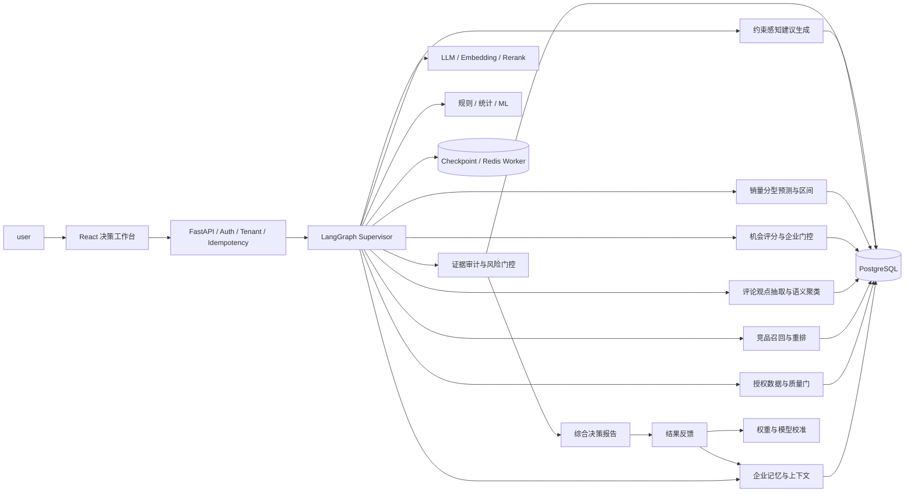

# FurniScope 决赛完善升级方案 V1

| 文档项 | 内容 |
|---|---|
| 产品名称 | FurniScope——跨境家具超级 AI 员工 |
| 文档类型 | 决赛专项升级与验收方案 |
| 文档版本 | V1.0 |
| 编制日期 | 2026-09-29 |
| 适用范围 | 决赛版本的产品、算法、工程、评测与演示 |
| 上位基线 | 《产品需求规格说明书（SRS/PRD）V2.0》 |
| 文档状态 | 增量实施方案，不替代现有 PRD、数据字典、数据库、API 和 Agent 工作流基线 |

> **口径声明：**本文严格区分“已实现事实”“当前实测结果”和“升级目标”。所有目标值均需通过锁定数据集、固定版本和可复现脚本验证，未完成验收前不得在答辩中表述为已达到。合成数据只用于 Demo 或故障测试，不得作为真实市场结论或模型效果证据。

---

## 1. 决赛升级结论

### 1.1 一句话定位

**FurniScope 不是一个会聊天的市场分析看板，而是一个拥有企业记忆、能够使用授权市场数据自主完成研究、通过混合算法形成可复算决策、在高风险节点请求确认、并从业务结果中持续学习的跨境家具超级 AI 员工。**

### 1.2 决赛主线

决赛版本只讲清并做实一条闭环：

```text
企业私有能力与产品资料
        +
授权市场商品、评论与时间信号
        ↓
可恢复的多 Agent 研究流程
        ↓
结构化需求洞察 + 市场机会评分 + 企业可行性门控
        ↓
可执行产品建议 + 结论级证据链 + 风险确认
        ↓
打样/评审/上市结果回流
        ↓
企业记忆、评分校准与模型路由更新
```

### 1.3 决赛必须回答的四个问题

| 问题 | 决赛答案 |
|---|---|
| 超级 AI 员工是什么 | 能理解企业、调用工具、自主执行、受风险边界约束、对结果负责并持续学习的业务执行主体 |
| 核心算法如何实现 | LLM 负责语义理解与解释，规则和统计负责事实计算，机器学习负责排序与预测，门控策略负责风险控制 |
| 指标依据是什么 | 算法离线指标、系统工程指标、证据可信指标、用户决策指标和业务结果指标五层联合验收 |
| 创新点在哪里 | 企业私有上下文、生成与确定性计算分权、结论级证据图谱、风险感知自主执行、机会与销量双引擎、结果反馈学习闭环 |

### 1.4 本轮升级原则

1. 不扩张为通用企业 Agent 平台，继续聚焦跨境家具选品与产品决策。
2. 不用更多 Agent 数量证明智能，使用闭环完成率、证据正确性和决策价值证明。
3. 不把 LLM 生成文本当作算法结果，数值必须由可复算程序产生。
4. 不把销量预测包装为已解决问题，先建立强基线、分型路由和可靠性门槛。
5. 不把市场高分直接等同于值得做，企业可行性必须独立门控。
6. 不把目标指标写成当前成绩，答辩材料必须绑定评测报告、数据版本和代码版本。

---

## 2. 当前基线与差距

### 2.1 已实现能力

| 领域 | 当前事实 | 决赛价值 |
|---|---|---|
| 产品形态 | 一个 `user` 驾驭一个跨境家具超级 AI 员工 | 产品边界清晰 |
| Agent 编排 | LangGraph 长流程、Checkpoint、`user_confirmation`、失败恢复 | 支撑自主执行与可恢复性 |
| 后端 | FastAPI、PostgreSQL、Redis Worker、租户隔离、幂等 | 具备企业级运行基础 |
| 模型能力 | Qwen 类模型、Embedding、Rerank、结构化输出 | 支撑语义抽取与候选排序 |
| 市场分析 | 授权数据检查、竞品筛选、评论洞察、价格与趋势、机会评分 | 已形成完整分析骨架 |
| 证据机制 | 结论与评论观点、来源和模型运行记录关联 | 具备可信 AI 基础 |
| 销量预测 | XGBoost/LightGBM 类树模型与回测资产 | 具备预测工程入口 |
| 前端 | React 19 + Vite，6+1 页面基线 | 可承载决赛交互 |

### 2.2 当前算法实测与限制

#### 2.2.1 评论洞察

当前实现主要依赖关键词 Taxonomy、评分与正负词规则：

- 一条评论可被拆分为句子，但主要按固定 Taxonomy 命中；
- 抽取置信度当前存在固定值；
- 需求重要度为提及率与负向率加权；
- 聚类仍接近 Taxonomy 汇总，不是真正的语义发现。

当前重要度公式为：

$$
Importance_{current}=0.7\times MentionRate+0.3\times NegativeRate
$$

该公式可解释，但缺少时间新鲜度、跨商品覆盖、严重度和重复评论降权，容易把“高频但低价值”误判为高优先级需求。

#### 2.2.2 机会评分

当前基础分为：

$$
Score_{current}=0.30H+0.15G+0.25U+0.20C+0.10P
$$

其中 $H$ 为需求热度、$G$ 为需求增长、$U$ 为未满足程度、$C$ 为竞争空间、$P$ 为利润空间。当前实现中：

- $G$ 由热度和未满足度派生；
- $P$ 由竞争空间和热度派生；
- 企业适配分与适配置信度当前写入 `0`；
- 真实趋势结果没有完整进入最终评分；
- 多个因子相关，存在重复计权；
- 权重尚无专家标注或历史业务结果校准依据。

因此当前分数只适合做规则排序原型，不应表述为已验证的商业机会概率。

#### 2.2.3 销量预测

固定训练窗加滚动单周回测的当前实测结果如下：

| 指标 | 当前值 | 解释 |
|---|---:|---|
| 商品目录 SKU 数 | 1,204 | 回测目录规模 |
| 有标签可评分 SKU 数 | 401 | 仅部分 SKU 在留出窗有观测 |
| 目录覆盖率 | 33.31% | 803 个 SKU 无留出窗观测 |
| 留出观测数 | 4,969 | 8 周滚动评测 |
| 模型 WAPE | 58.06% | 误差仍高 |
| 4 周移动平均 WAPE | 58.48% | 强基线 |
| 相对基线改善 | 0.42 个百分点 | 优势不足以证明显著价值 |
| MAE | 2.84 | 单观测平均绝对误差 |
| RMSE | 6.22 | 对大误差更敏感 |
| Bias | +3.92% | 存在轻微整体高估 |

结论：当前预测功能具备可运行性，但尚不具备“领先强基线”或“覆盖全目录”的证据。决赛应将其升级为“需求分型后的模型路由与风险区间”，而不是单一模型预测数字。

### 2.3 关键差距

| 优先级 | 差距 | 直接后果 |
|---:|---|---|
| P0 | 缺少锁定标注集与统一评测流水线 | 无法证明评论、证据和建议质量 |
| P0 | 机会因子不独立，企业适配未落地 | 高市场分可能不适合企业 |
| P0 | 评论抽取与聚类语义能力不足 | 创新点难以由算法效果支撑 |
| P0 | 建议偏模板化，缺少约束求解 | “洞察”到“企业行动”转换较弱 |
| P0 | 前端未突出自主执行、风险门控和证据下钻 | 容易被看成普通分析看板 |
| P1 | 销量预测对强基线提升有限 | 预测数字缺乏可信度 |
| P1 | 业务结果尚未回流 | 无法形成持续学习闭环 |
| P1 | 指标散落在模型、系统和产品文档 | 答辩无法形成统一证据链 |

---

## 3. 目标产品形态：企业环境中的超级 AI 员工

### 3.1 五项能力定义

| 能力 | 行为定义 | FurniScope 落点 |
|---|---|---|
| 记忆 | 记住企业确认过的事实和历史决策，不跨租户泄露 | 企业能力画像、产品版本、决策记录、反馈记录 |
| 感知 | 在授权边界内读取市场、商品、评论和销量数据 | 数据集版本、质量报告、来源授权 |
| 规划 | 将用户目标拆成可恢复的专业任务 | LangGraph I00-I19 与五阶段映射 |
| 决策 | 联合市场证据、企业约束、预测结果和风险形成建议 | 机会评分、可行性门控、策略生成 |
| 行动与学习 | 产出报告、发起必要确认，并吸收后续结果 | 报告、确认、反馈事件、校准模型 |

### 3.2 自主性分级

| 等级 | 行为 | 适用场景 |
|---|---|---|
| L0 辅助 | 只回答问题 | 非核心入口 |
| L1 建议 | 生成分析建议，不调用业务工具 | 临时问答 |
| L2 执行 | 在授权数据内自主完成多步研究 | 决赛默认等级 |
| L3 受控行动 | 低风险动作自动执行，高风险动作确认 | 决赛展示重点 |
| L4 全自治 | 自主执行不可逆业务动作 | 不在本项目范围 |

决赛版本定位为 **L2 + 部分 L3**。系统可以自主分析、重试、选择模型和生成报告；涉及安全、认证、重大成本、开模、备货等不可逆决策时只提供建议并触发确认。

### 3.3 企业记忆边界

记忆分为四层：

| 记忆层 | 内容 | 更新方式 | 使用限制 |
|---|---|---|---|
| 事实记忆 | 企业材料、设备、MOQ、成本、认证、产品属性 | 用户确认或可信文件解析 | 过期、冲突或低置信字段不得支持强结论 |
| 情景记忆 | 某市场、品类、数据集和分析任务上下文 | 系统自动记录 | 固定 `tenant_id` 与版本 |
| 决策记忆 | 用户接受、拒绝、搁置的建议及原因 | 用户反馈 | 不把单次选择直接当普遍规律 |
| 结果记忆 | 打样、成本、评审、上市、退货等结果 | 用户或系统回填 | 需记录时间窗和数据来源 |

---

## 4. 目标技术架构



### 4.1 生成与确定性计算分权

| 类型 | 负责内容 | 禁止内容 |
|---|---|---|
| LLM | 文档理解、观点结构化、根因假设、建议解释、报告叙事 | 编造价格、样本数、评分、销量、来源和公式结果 |
| Embedding/Rerank | 竞品语义召回、观点语义聚类、证据相关性排序 | 直接给出业务结论 |
| 规则与统计 | 数据质量、计数、比例、趋势、评分、置信区间、风险门 | 用无法复算的自然语言替代数值计算 |
| 监督模型 | 竞品排序、需求分类、销量预测、置信度校准 | 在训练分布外无提示输出确定值 |
| Agent 编排 | 任务拆解、工具选择、恢复、降级和确认 | 绕过授权、租户、风险和证据约束 |

### 4.2 决策输出契约

每个高优先级结论必须包含：

```json
{
  "claim": "结论正文",
  "claim_type": "fact|inference|recommendation",
  "score": 0.0,
  "confidence": 0.0,
  "sample_scope": {},
  "evidence_ids": [],
  "formula_version": "string",
  "model_run_ids": [],
  "limitations": [],
  "risk_level": "low|medium|high",
  "validation_action": "下一步验证方法"
}
```

---

## 5. 核心算法升级

### 5.1 评论观点抽取 V2

#### 5.1.1 输出 Schema

一条评论先拆成原子观点，每个观点只表达一个产品事实或感受：

```text
aspect
attribute
sentiment
severity
usage_scenario
user_segment
product_component
root_cause_hint
evidence_span
span_start/span_end
extraction_confidence
```

示例：

```text
“坐垫很舒服，但三个月后中间塌了”
→ 观点1：comfort / cushion / positive / “坐垫很舒服”
→ 观点2：durability / cushion / high / “三个月后中间塌了”
```

#### 5.1.2 实现路径

1. 规则完成语言识别、去重、垃圾文本过滤和句段切分。
2. LLM 按 JSON Schema 抽取原子观点和证据 Span。
3. Taxonomy 校验器将自由标签映射到家具本体，无法映射的进入候选新标签池。
4. 小型分类器或 LLM Judge 对低置信观点二次校验。
5. 程序检查 Span 必须是原评论子串，防止证据幻觉。
6. 抽取结果按模型、Prompt、Taxonomy 和数据版本落库。

#### 5.1.3 需求优先度 V2

对需求簇 $k$ 定义：

$$
NeedPriority_k =
0.30F_k+
0.20N_k+
0.15S_k+
0.15C_k+
0.10R_k+
0.10Q_k
$$

| 因子 | 定义 | 计算要点 |
|---|---|---|
| $F_k$ | 去重后的评论提及率 | 同一用户、同一商品重复文本降权 |
| $N_k$ | 负向率 | 区分负向与中性描述 |
| $S_k$ | 严重度 | 安全、损坏、退货意图权重更高 |
| $C_k$ | 跨商品覆盖率 | 防止单一爆量商品主导 |
| $R_k$ | 时间新鲜度 | 指数时间衰减 |
| $Q_k$ | 证据质量 | Span、样本完整性和抽取置信度 |

时间新鲜度可采用：

$$
w_i=\exp\left(-\lambda \Delta t_i\right)
$$

其中 $\Delta t_i$ 为评论距分析截止日的时间，$\lambda$ 由半衰期配置决定。

### 5.2 语义聚类与需求发现 V2

#### 5.2.1 两阶段聚类

1. **本体约束粗分：**按产品部件、属性和场景形成可解释候选桶。
2. **Embedding 细分：**桶内使用 HDBSCAN 或层次聚类发现相近表达。
3. **簇命名：**LLM 只根据代表性观点生成短名称和摘要。
4. **簇稳定性检查：**Bootstrap 重采样，计算簇成员稳定率。
5. **离群点保留：**不强行归类；高严重度离群观点单独上报。

#### 5.2.2 聚类验收

| 指标 | 目标 |
|---|---:|
| 人工成对一致性 F1 | $\ge 0.80$ |
| 簇纯度 | $\ge 0.80$ |
| 代表证据支持簇摘要比例 | $\ge 95\%$ |
| 高严重度观点召回率 | $\ge 95\%$ |
| Bootstrap 簇稳定率 | $\ge 0.75$ |

### 5.3 竞品识别 V2

竞品识别使用“硬约束过滤 + 多路召回 + 学习排序”：

$$
CompSim =
w_1S_{category}+
w_2S_{function}+
w_3S_{price}+
w_4S_{material}+
w_5S_{dimension}+
w_6S_{scenario}
$$

升级要求：

1. 硬过滤只处理市场、品类和不可违反属性。
2. BM25、Embedding 和属性规则分别召回，使用 RRF 合并。
3. Rerank 使用标注的竞品对训练或校准。
4. 分别输出直接竞品、标杆竞品和替代竞品。
5. 每个候选展示纳入/排除理由和各维相似度。
6. 重大歧义才触发 `user_confirmation`。

核心指标使用 `Recall@K`、`NDCG@K` 和直接竞品 Precision，不用单一相似度阈值证明效果。

### 5.4 机会评分 V3

#### 5.4.1 独立市场机会分

$$
MarketOpportunity =
0.22D+
0.18T+
0.20U+
0.15C+
0.15P+
0.10E
$$

| 因子 | 含义 | 数据来源 |
|---|---|---|
| $D$ | 需求强度 | 去重提及、跨商品覆盖、样本权重 |
| $T$ | 需求趋势 | 有时间戳的滚动趋势及显著性 |
| $U$ | 未满足程度 | 负向、严重度、低评分和问题持续性 |
| $C$ | 竞争空间 | 竞品密度、同质化、头部集中度 |
| $P$ | 价格/利润空间 | 授权价格、企业成本区间、履约代理 |
| $E$ | 证据质量 | 样本量、覆盖、时效、来源和一致性 |

规则：

- 各因子必须由不同原始信号计算，禁止互相派生后重复计权；
- 缺失因子不直接填 `0`，应标记未知并重归一可用权重；
- $T$ 没有足够时间点时不得用热度代替；
- $P$ 没有企业成本或履约信息时只输出价格空间，不输出利润空间；
- 权重初始由专家 AHP 或 Delphi 标注，后续由历史结果校准；
- 同时保留因子值、原始指标、归一化方法和公式版本。

#### 5.4.2 企业可行性独立门控

$$
EnterpriseFit =
0.25M+
0.20Process+
0.15Cost+
0.10MOQ+
0.10Delivery+
0.10Compliance+
0.10Packaging
$$

企业适配不并入市场分掩盖，而作为独立门控：

| 条件 | 输出 |
|---|---|
| `MarketOpportunity >= 70` 且 `EnterpriseFit >= 70` | 优先验证 |
| 市场高、企业适配低 | 有市场但当前企业不适合 |
| 市场低、企业适配高 | 可制造但市场证据不足 |
| 任一核心合规/安全条件未知 | 需要确认，不给“可执行”结论 |
| 证据置信度低于阈值 | 收集更多数据 |

最终决策不是一个失真的总分，而是：

```text
市场机会等级 × 企业适配等级 × 证据置信度 × 风险等级
```

#### 5.4.3 置信度

$$
Confidence =
Coverage \times Quality \times Consistency \times Calibration
$$

置信度与机会分独立，不能因为分数高而自动高置信。上线前使用可靠性图、ECE 和 Brier Score 做校准。

### 5.5 销量预测 V5：需求分型与模型路由

#### 5.5.1 需求分型

按非零需求间隔和需求波动计算：

$$
ADI=\frac{\text{总周期数}}{\text{非零需求周期数}}
$$

$$
CV^2=\left(\frac{\sigma_{nonzero}}{\mu_{nonzero}}\right)^2
$$

| 类型 | 条件示例 | 推荐模型 |
|---|---|---|
| Smooth | $ADI<1.32,\ CV^2<0.49$ | Seasonal Naive、ETS、LightGBM/XGBoost |
| Erratic | $ADI<1.32,\ CV^2\ge0.49$ | Robust tree model、Quantile model |
| Intermittent | $ADI\ge1.32,\ CV^2<0.49$ | Croston/SBA |
| Lumpy | $ADI\ge1.32,\ CV^2\ge0.49$ | TSB、零膨胀或两阶段模型 |

阈值需根据项目数据重新验证，不能机械沿用经验值。

#### 5.5.2 预测输出

每次预测必须输出：

- 点预测；
- P10/P50/P90 或等价预测区间；
- 所选模型和选择原因；
- 与 Seasonal Naive、4 周移动平均、Croston/TSB 的对比；
- 冷启动、缺货、促销和分布外标记；
- 可预测覆盖率与拒绝预测原因。

#### 5.5.3 准入条件

| 指标 | 决赛最低门槛 |
|---|---:|
| 相对最佳强基线 WAPE 改善 | $\ge 5\%$ |
| 高销量 SKU WAPE 改善 | $\ge 8\%$ |
| Bias 绝对值 | $\le 5\%$ |
| P90 区间覆盖率 | $85\%\sim95\%$ |
| 有效 SKU 预测覆盖率 | $\ge 80\%$，或明确解释不可评分原因 |

若未达到门槛，决赛界面应降级为“基线预测 + 不确定性说明”，不得展示为核心算法突破。

### 5.6 约束感知建议生成 V2

建议生成前构造约束对象：

```text
市场问题
+ 证据簇
+ 产品当前参数
+ 企业材料/工艺/成本/MOQ/认证/包装能力
+ 禁止条件
+ 风险等级
```

每条建议必须同时给出：

1. 问题与影响人群；
2. 证据和样本范围；
3. 根因假设，明确“假设”而非事实；
4. 可选工程动作；
5. 企业能力匹配与缺口；
6. 预期收益范围，不给虚假精确值；
7. 成本、认证、安全和履约风险；
8. 最小验证方法与通过标准。

程序化校验器负责检查：

- 建议是否引用存在的证据；
- 是否违反企业禁止条件；
- 高风险建议是否触发确认；
- 是否包含验证方法；
- 结论、推断和建议是否明确分型。

### 5.7 风险门控与自主执行

风险分：

$$
Risk =
Impact \times Irreversibility \times Uncertainty
$$

| 风险级别 | 系统行为 |
|---|---|
| 低 | 自动执行分析并记录 |
| 中 | 自动执行，报告中突出限制 |
| 高 | 停在 Checkpoint，发起 `user_confirmation` |
| 禁止 | 拒绝执行并说明依据 |

高风险包括安全承重、阻燃与认证、重大开模、显著成本增加、备货和不可逆外部动作。确认后必须从原 Checkpoint 恢复，不重复已完成节点。

---

## 6. 数据、评测与指标体系

### 6.1 五层指标

| 层级 | 关注问题 | 核心指标 |
|---|---|---|
| L1 算法 | 抽取、聚类、排序、预测是否有效 | Macro-F1、Span F1、NDCG@K、WAPE、Bias、ECE |
| L2 证据 | 结论是否有依据且依据正确 | 证据覆盖率、证据正确率、引用可定位率 |
| L3 系统 | 长流程是否稳定可恢复 | 完成率、P95 时延、恢复成功率、重复执行率 |
| L4 用户 | 是否帮助用户做决策 | 报告评分、建议采纳意向、节省时间、任务成功率 |
| L5 业务 | 是否形成真实正向结果 | 进入打样率、验证通过率、预测改善、退货/差评变化 |

### 6.2 锁定评测集

建立四套互相隔离的数据集：

| 数据集 | 内容 | 最低建议规模 | 用途 |
|---|---|---:|---|
| Review-Gold | 评论观点、标签、Span、严重度、场景 | 1,000 条评论 | 抽取评测 |
| Competitor-Gold | 查询产品与候选竞品相关等级 | 100 个查询、每个 20+ 候选 | 召回与排序 |
| Decision-Gold | 机会因子、企业约束、专家决策 | 50 个案例 | 评分与建议盲评 |
| Forecast-Holdout | 按时间滚动的销量留出集 | 覆盖主要需求类型 | 预测回测 |

标注要求：

1. 双人独立标注，冲突由第三人仲裁。
2. 报告 Cohen's Kappa 或 Krippendorff's Alpha。
3. 测试集锁定后不得用于 Prompt 调试和权重选择。
4. 所有数据集记录 SHA-256、样本范围、授权说明和生成脚本版本。
5. 每次评测输出代码 commit、配置、模型、Prompt、公式和数据哈希。

### 6.3 决赛指标门槛

| 指标 | 当前状态 | 决赛门槛 | 证据 |
|---|---|---:|---|
| 需求标签 Macro-F1 | 未形成锁定集实测 | $\ge0.85$ | Review-Gold 报告 |
| 观点 Span F1 | 未实测 | $\ge0.90$ | Review-Gold 报告 |
| 高严重度召回率 | 未实测 | $\ge0.95$ | Review-Gold 报告 |
| 竞品 Recall@10 | 未实测 | $\ge0.90$ | Competitor-Gold 报告 |
| 竞品 NDCG@10 | 未实测 | $\ge0.85$ | Competitor-Gold 报告 |
| 高优先结论证据覆盖率 | PRD 目标 | $100\%$ | 自动全检 |
| 证据正确率 | PRD 目标 | $\ge95\%$ | 人工盲检 |
| 建议可执行性 | 未实测 | $\ge4/5$ | 专家盲评 |
| 1,000 评论端到端耗时 | PRD 目标 | $\le5$ 分钟 | 固定环境压测 |
| 固定 Demo 成功率 | PRD 目标 | $\ge99\%$ | 连续 30 次 |
| Checkpoint 恢复 | 已有机制，需专项验证 | $100\%$ 且不重复已完成节点 | 故障注入 |
| 销量预测相对强基线改善 | 当前约 0.71%（绝对改善 0.42pp） | $\ge5\%$ | 滚动回测 |

### 6.4 消融实验

至少提供以下消融：

| 实验 | 对照 | 证明内容 |
|---|---|---|
| 关键词规则 vs 结构化观点抽取 | Macro-F1、Span F1 | 语义抽取价值 |
| Taxonomy 汇总 vs Embedding 聚类 | 纯度、稳定率、专家评分 | 新需求发现价值 |
| 单路语义相似 vs 多路召回+Rerank | Recall/NDCG | 竞品算法价值 |
| 机会评分 V2 vs V3 | 专家排序相关性、校准 | 独立变量和企业门控价值 |
| 单一树模型 vs 需求分型路由 | WAPE、Bias、覆盖率 | 预测升级价值 |
| 无企业记忆 vs 企业上下文 | 建议可执行性、冲突率 | 核心差异化价值 |
| 无风险门 vs 风险门控 | 高风险误执行率 | 企业自主执行安全性 |

---

## 7. 工程落地改造

### 7.1 后端模块

| 模块 | 改造任务 | 优先级 |
|---|---|---:|
| `furniscope_agent` | 评论观点 V2、语义聚类、机会 V3、企业门控、建议校验器 | P0 |
| `furniscope_forecast` | ADI/CV² 分型、Croston/TSB、模型路由、区间预测 | P1 |
| Evaluation | 锁定集加载、批量评测、Bootstrap、报告生成 | P0 |
| Evidence | 统一 Claim 契约、自动覆盖检查、证据 Span 校验 | P0 |
| Feedback | 接受/拒绝/验证结果事件与校准数据 | P1 |
| Observability | 节点耗时、重试、模型用量、失败和恢复指标 | P0 |

### 7.2 数据库增量实体

不直接在本方案锁死 DDL，实施时同步更新数据字典与 PostgreSQL 设计。建议增加：

| 实体 | 关键字段 |
|---|---|
| `review_aspects_v2` | Span 位置、严重度、场景、人群、部件、抽取版本 |
| `insight_cluster_members` | 簇与观点成员、距离、成员稳定度 |
| `opportunity_factors` | 原始值、归一值、缺失状态、公式版本、证据 |
| `enterprise_fit_assessments` | 各维适配、未知项、阻断项、置信度 |
| `forecast_routes` | 需求类型、候选模型、基线、选择原因、区间 |
| `decision_feedback_events` | 建议状态、原因、验证结果、时间窗、来源 |
| `evaluation_runs` | 数据 SHA、代码 commit、模型/Prompt/公式版本、指标 |

所有实体必须包含 `tenant_id`、创建时间、版本和审计字段；敏感企业数据不得写入普通运行日志。

### 7.3 API 增量

| API | 用途 |
|---|---|
| `GET /analysis-jobs/{id}/decision-trace` | 返回结论、因子、证据、公式和模型运行 |
| `GET /analysis-jobs/{id}/enterprise-fit` | 展示企业适配、未知与阻断项 |
| `GET /analysis-jobs/{id}/forecast` | 展示分型、基线、模型和区间 |
| `POST /recommendations/{id}/feedback` | 记录接受、拒绝、验证中和验证结果 |
| `GET /evaluation-runs/{id}` | 查询可复现评测结果 |

API 继续使用现有 Envelope、认证、租户、幂等和 ETag 约束。正式实现前必须同步 API V3、数据字典 V3 和数据库 V3 的增量版本。

### 7.4 前端决赛工作台

保留 6+1 页面范围，但强化三类体验：

1. **自主执行可见：**展示当前目标、正在调用的能力、完成结果和必要的降级，不暴露内部思维链。
2. **决策矩阵可见：**市场机会与企业适配使用二维矩阵，不只展示一个总分。
3. **证据与风险可见：**任一结论可下钻到原文 Span、样本范围、公式版本和限制。

核心界面：

| 界面 | 必须展示 |
|---|---|
| 分析任务 | 五阶段、节点结果、部分失败、恢复位置 |
| 市场洞察 | 需求簇、趋势、跨商品覆盖和代表证据 |
| 机会决策 | 市场机会 × 企业适配矩阵、置信度、风险 |
| 销量预测 | 基线对比、预测区间、需求类型、拒绝原因 |
| 建议详情 | 工程动作、能力匹配、风险、验证方法 |
| 证据抽屉 | 原文 Span、来源、样本、算法和版本 |
| 用户确认 | 一个具体问题、推荐项、证据、影响和恢复点 |

### 7.5 可观测与成本

每个 Agent 节点记录：

- 输入/输出引用，不记录敏感原文；
- 模型、Prompt、Token、耗时和费用；
- 重试、超时、降级和失败原因；
- Checkpoint 标识和恢复次数；
- 证据数量、质量标记和审计结果。

成本指标至少包括单任务 Token、单千评论成本、P50/P95 时延和缓存命中率。

---

## 8. 分阶段实施计划

### 阶段 A：可信基线与评测闭环

**目标：**先解决“无法证明效果”的问题。

任务：

1. 建立 Review-Gold、Competitor-Gold、Decision-Gold 和 Forecast-Holdout。
2. 固化数据 SHA、评测脚本、模型与 Prompt 版本。
3. 补充评论、竞品、证据、建议和预测基线报告。
4. 将当前规则和模型全部纳入同一评测入口。

验收：

- 四套数据集有授权、版本、SHA 和标注说明；
- 基线报告可一条命令复现；
- 当前能力不达标项如实列出。

### 阶段 B：核心算法升级

**目标：**形成决赛可证明的算法增量。

任务：

1. 评论观点抽取 V2 与 Span 校验；
2. 两阶段语义聚类；
3. 竞品多路召回与 Rerank；
4. 机会评分 V3 与企业适配门控；
5. 约束感知建议和风险校验。

验收：

- 主要离线指标达到第 6.3 节门槛；
- 消融实验能够解释每项增量价值；
- 所有高优先结论有证据和限制。

### 阶段 C：预测、反馈与工程强化

**目标：**补齐持续学习和企业级稳定性。

任务：

1. 销量 ADI/CV² 分型与模型路由；
2. 预测区间、强基线和拒绝预测机制；
3. 建议反馈与验证结果回流；
4. Checkpoint 故障注入、压测、成本和可观测性。

验收：

- 预测达到准入门槛或明确降级；
- 反馈可追溯，不污染事实记忆；
- 固定 Demo 连续 30 次成功率达到 99%；
- 恢复不重复已完成节点。

### 阶段 D：决赛体验与证据包

**目标：**让评委看到闭环，不依赖口头解释。

任务：

1. 完成机会 × 企业适配矩阵和证据下钻；
2. 固化一条主 Demo 和一条高风险确认 Demo；
3. 生成指标报告、架构图、模型卡和复现说明；
4. 进行断网、模型超时、数据不足和确认恢复演练。

验收：

- 8 分钟内完成核心故事；
- 任一关键数字可现场下钻；
- Demo 使用固定授权数据并标明数据范围；
- 失败时有明确降级路径。

---

## 9. 任务优先级与交付物

| ID | 任务 | 优先级 | 交付物 | Go 条件 |
|---|---|---:|---|---|
| T01 | 建立锁定评测集 | P0 | 数据、SHA、标注指南 | 双人标注与一致性报告 |
| T02 | 统一评测框架 | P0 | CLI/脚本、JSON/MD 报告 | 可复现基线 |
| T03 | 评论观点 V2 | P0 | Schema、抽取器、测试 | Macro-F1/Span F1 达标 |
| T04 | 语义聚类 V2 | P0 | 聚类器、稳定性报告 | 纯度与稳定率达标 |
| T05 | 竞品排序 V2 | P0 | 多路召回、Rerank | Recall/NDCG 达标 |
| T06 | 机会评分 V3 | P0 | 因子表、公式、校准报告 | 无派生变量重复计权 |
| T07 | 企业适配门控 | P0 | 适配矩阵、确认规则 | 未知和阻断项可解释 |
| T08 | 建议与证据校验 | P0 | 校验器、盲评报告 | 证据覆盖 100% |
| T09 | 决赛前端 | P0 | 决策工作台 | 主链路可完成 |
| T10 | 预测 V5 | P1 | 分型、路由、回测报告 | 相对强基线改善达标 |
| T11 | 反馈闭环 | P1 | 反馈 API、数据表、页面 | 结果可回流和追溯 |
| T12 | 稳定性与演示 | P0 | 压测、故障注入、Demo 脚本 | 连续 30 次通过 |

---

## 10. Go/No-Go 决策

### 10.1 总体 Go 条件

1. 评论抽取、竞品排序和证据正确性至少三项形成锁定集实测。
2. 企业适配不再固定为 `0`，机会评分 V3 可复算。
3. 高优先结论证据覆盖率为 100%。
4. 固定 Demo 30 次成功率达到 99%。
5. 关键数字均能展示数据范围、公式和版本。
6. 高风险场景能够触发确认并从 Checkpoint 恢复。

### 10.2 功能降级规则

| 功能 | No-Go 条件 | 决赛处理 |
|---|---|---|
| 销量预测 | 相对强基线改善不足 5% | 降为辅助信息，展示基线与区间，不作为创新主张 |
| 自动聚类 | 稳定率低于 0.75 | 使用本体簇，明确“规则聚合” |
| 企业利润空间 | 缺少成本/履约数据 | 只展示价格空间，利润标记未知 |
| 趋势判断 | 时间点不足或窗口偏差 | 展示快照，不声称增长趋势 |
| 建议自动执行 | 高风险或约束未知 | 触发确认，不执行外部动作 |
| 业务收益 | 无真实结果回流 | 只报告用户盲评和意向，不声称提升销量或利润 |

---

## 11. 决赛演示脚本

### 11.1 主 Demo：从产品到可执行决策

1. 用户选择企业画像和一款沙发，输入“是否适合进入美国小户型市场”。
2. AI 展示企业记忆中的已确认能力、过期信息和未知约束。
3. 系统读取固定授权数据，完成质量检查并冻结数据版本。
4. AI 自主筛选直接、标杆和替代竞品，展示一个排除理由。
5. 评论洞察展示“原子观点→语义簇→需求优先度”，下钻一条原文 Span。
6. 机会页面展示市场机会与企业适配二维矩阵，而不是单一总分。
7. 建议页面给出产品动作、能力匹配、风险和最小验证方案。
8. 点击任一结论，展示样本、公式、模型、Prompt 和证据版本。

### 11.2 风险 Demo：确认与恢复

1. 系统发现阻燃认证未知，但建议面向特定商业场景。
2. Agent 在风险节点暂停，展示具体问题、推荐项、替代项和影响。
3. 用户选择“仅按家用场景继续”。
4. 系统从 Checkpoint 恢复，不重复竞品和评论分析。
5. 最终报告记录确认内容、恢复位置和结论边界。

### 11.3 答辩指标页

只展示已通过评测的数字，并附：

- 数据集名称与 SHA；
- 样本量和时间范围；
- 代码 commit；
- 模型、Prompt、公式版本；
- 基线与改进值；
- 限制和未达标项。

---

## 12. 创新点与证据要求

| 创新点 | 技术实质 | 需要的证据 |
|---|---|---|
| 企业私有上下文驱动决策 | 市场信号与工艺、成本、MOQ、认证、包装联合判断 | 有/无企业上下文的建议盲评消融 |
| 生成与确定性计算分权 | LLM 不生成业务数值，所有结论绑定可复算指标 | 数值一致性与幻觉检查 |
| 结论级证据图谱 | Claim 到评论 Span、企业事实、公式和模型运行的关联 | 覆盖率 100%、正确率 95% |
| 风险感知自主执行 | 自主完成低风险任务，高风险 Checkpoint 确认恢复 | 故障与风险场景测试 |
| 市场机会与销量双引擎 | 长期产品方向与短期销量风险联合辅助 | 各自强基线与联合案例 |
| 结果反馈学习闭环 | 用户决策与验证结果回流评分校准和企业记忆 | 反馈事件、版本更新与离线回放 |

不应作为创新主张的内容：

- 使用了 LangGraph、Qwen、XGBoost 或向量数据库；
- Agent 数量多；
- 能生成一份报告；
- 页面有可视化图表；
- 使用 Prompt 让模型“扮演专家”。

这些是实现手段，只有形成可测量的业务闭环时才有价值。

---

## 13. 风险与应对

| 风险 | 影响 | 应对 |
|---|---|---|
| 标注规模不足 | 指标方差大 | Bootstrap 置信区间，优先补高争议样本 |
| LLM 输出漂移 | 结构化抽取不稳定 | Schema、重试、固定版本、低温度、回归集 |
| 授权市场数据稀疏 | 趋势和机会结论不可靠 | 数据质量门、缺失重归一、快照降级 |
| 企业数据不完整 | 适配与利润判断失真 | 未知不等于否，核心字段触发确认 |
| 预测被促销/缺货污染 | 误差和偏差增大 | 特征标记、分段评测、拒绝预测 |
| Demo 依赖外部模型 | 延迟或失败 | 缓存固定结果、受控降级、演示前预热 |
| 文档口径再次分裂 | 实现、答辩和验收不一致 | 本方案通过后同步 PRD、数据字典、DB、API、工作流和测试 |

---

## 14. 文档同步与变更控制

本方案通过评审后，按以下顺序同步：

1. `01_产品需求规格说明书SRS_PRD_V2.md`：补充决赛增量需求和已验证指标。
2. `02_FurniScope产品数据字典V3.md`：增加观点 V2、机会因子、适配、预测路由和反馈实体。
3. `03_FurniScope_PostgreSQL数据库设计V3.md`：形成增量 DDL 与迁移方案。
4. `04_FurniScope_Agent工作流设计V2.md`：增加风险门、模型路由和反馈节点。
5. `05_FurniScope_RESTful_API接口设计V3.md`：增加决策追溯、适配、预测和反馈 API。
6. `06_FurniScope_Mermaid图V3.md`：同步目标架构与关键序列。
7. `07_FurniScope页面交互原型说明V3.md`：同步决策矩阵和证据下钻。
8. `09_FurniScope测试用例V2.md`：增加算法准入、消融、故障注入和 Demo 稳定性用例。

任何单项升级只有在代码、测试、评测报告和关联设计文档同时更新后，才能从“目标”变更为“已实现”。

---

## 15. 最终验收清单

- [ ] 产品仍保持一个 user 驾驭一个超级 AI 员工的边界。
- [ ] 授权数据、企业数据和合成数据在界面与数据库中明确区分。
- [ ] 评论观点抽取有锁定集、Span 证据和版本记录。
- [ ] 竞品识别有 Recall/NDCG，不再只展示相似度公式。
- [ ] 机会评分因子独立，缺失值不按零处理。
- [ ] 企业适配已实现并作为独立门控。
- [ ] 高优先结论证据覆盖率达到 100%。
- [ ] 高风险建议触发确认并可从 Checkpoint 恢复。
- [ ] 销量预测与强基线对比，不达标时已降级。
- [ ] 决赛页面可展示市场机会 × 企业适配矩阵。
- [ ] 评测报告包含数据 SHA、代码 commit 和完整版本包。
- [ ] 固定 Demo 已连续运行 30 次并留存结果。
- [ ] PRD、数据、数据库、API、工作流、页面和测试口径已同步。

---

## 16. 当前事实审计依据

| 依据 | 文件 | 本方案使用范围 |
|---|---|---|
| 项目运行与实现状态 | [`README.md`](../../README.md) | 技术栈、运行入口和当前能力 |
| 产品需求基线 | [`01_产品需求规格说明书SRS_PRD_V2.md`](./01_产品需求规格说明书SRS_PRD_V2.md) | 产品边界、P0 指标和五阶段 |
| 技术架构与模型调用 | [`技术架构及调用模型说明.md`](../技术架构及调用模型说明.md) | Agent、模型和基础设施 |
| 市场分析实现 | [`external_toolbox.py`](../../backend/furniscope_agent/external_toolbox.py) | 评论规则、需求重要度、机会评分和企业适配现状 |
| 销量预测实现 | [`forecast.py`](../../backend/furniscope_forecast/forecast.py) | 特征、训练、预测和回测逻辑 |
| 全目录 V4 回测 | [`summary.json`](../../forecast_assets/backtest/full_catalog_v4/summary.json) | 覆盖率、WAPE、MAE、RMSE、Bias 和强基线对比 |
| 模型卡 | [`MODEL_CARD.json`](../../forecast_assets/MODEL_CARD.json) | 模型版本、限制和资产追溯 |

上述文件只能证明其记录的当前状态。方案中的 V2/V3/V5 算法、目标指标和业务收益仍需按本方案实施并重新验收。

---

## 17. 版本记录

| 日期 | 版本 | 变更说明 |
|---|---|---|
| 2026-09-29 | V1.0 | 基于当前代码、文档和销量回测证据，形成决赛产品、算法、工程、评测与演示一体化升级方案。 |
| 2026-09-29 | V1.1 | 落地五项市场智能总览、评论观点 V2、Embedding 语义聚类、机会评分 V3 企业门控、成本约束定价和官方政策源；未完成的离线指标仍保持目标口径。 |

### 17.1 V1.1 实施记录

| 能力 | 实施状态 | 可复现依据 |
|---|---|---|
| AI 智能选品 | 已实现代码与页面 | `market_opportunities` 五个独立市场因子按可用权重重归一，再应用企业事实门控；接口 `GET /api/v1/market-intelligence/overview` |
| 竞品动态追踪 | 已实现代码与页面 | 授权数据集/页面采集、快照差异、定时 Worker、价格/Listing/促销/上新告警 |
| 评论深挖 | 已实现代码与页面 | Qwen 结构化多观点抽取且原文 Span 强校验；在 Taxonomy 桶内用 Embedding + 平均链接层次聚类（余弦距离阈值 0.28），按抽取置信度和中心相似度选择代表证据；模型或依赖失败时回退 Taxonomy 聚合并记录 `ai_model_runs` |
| 智能定价 | 已实现代码与页面 | 按结构化类目选择可比竞品组，输出组内四分位价格带、单位成本、目标毛利、单位利润、促销底线、主导约束和四档价格场景；接口 `POST /api/v1/market-intelligence/pricing` |
| 跨境合规预警 | 已实现代码与页面 | CPSC RSS、Federal Register 官方 API 一键安装，关键词匹配、风险分级、定时同步和通知 |

本次实现没有把缺少的数据补成假数据。价格弹性少于 3 个有效历史变化样本时返回
`insufficient_history`；没有单位成本时定价状态为 `market_anchor_only`；没有已完成分析任务时，
选品与需求簇返回 `awaiting_analysis`。Macro-F1、Span F1、NDCG@K、专家排序相关性和业务收益
仍需锁定标注集与真实业务回流后验收，不得因功能代码完成而宣称已达标。
