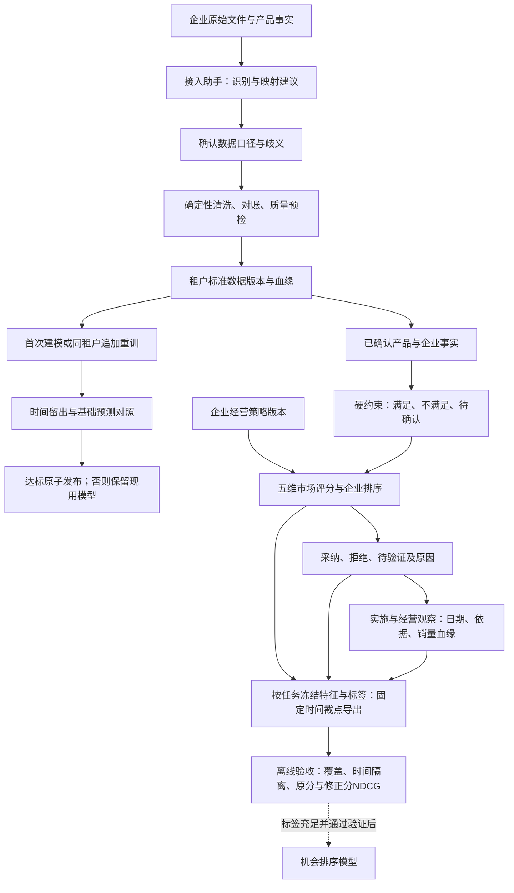
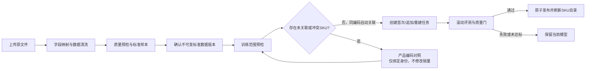

# FurniScope 企业决策与数据闭环总体设计 V1

> 日期：2026-10-04；复核补全完成于2026-10-05  
> 范围：企业评分策略、事实约束、销售数据接入、企业首次建模、训练隔离、质量验证与反馈闭环。  
> 状态：首轮及2026-10-05复核补全均完成本地工程验收，当前结果见§11。本文不是已上线或真实企业效果声明。  
> 授权：用户要求“做一个完整的规划然后进行补全”，本轮直接完成实现、测试与文档同步，不新增逐阶段审批。

## 1. 目标与边界

把“通用市场报告＋预置销量模型”补成企业可以接入、理解和验证的决策系统：

1. 同一市场机会，可以因企业经营目标和已确认能力不同而得到不同建议。
2. 企业可以从自己的原始文件开始，完成字段映射、业务口径确认、质量预检和标准数据发布。
3. 没有已有预测部署的企业也可以首次训练；每次训练能证明使用了哪些企业数据。
4. 新模型通过时间留出评测后才能替换当前模型；失败和未达标不影响现有预测。
5. 机会建议支持采纳、拒绝、待验证和原因记录，为后续排序学习积累标签。

保留当前 FastAPI、PostgreSQL、LangGraph、React 技术栈和 user/admin 两种角色；不引入新的一级制造能力页面，不改变五阶段分析体验。经营策略放在“AI 智能选品”，数据接入放在现有“模型训练”页签。能力事实继续使用现有企业画像接口和产品事实。

本轮不将尚未发生的真实企业试用、模型精度提升或排序学习效果标为完成；提供可运行的工程闭环及明确的数据准入条件。跨渠道全自动 ERP 接入、多语言任意文档理解、跨企业训练和生产部署不属于本轮范围。

## 2. 当前缺口与目标

| 当前状态 | 补全目标 | 可验证结果 |
|---|---|---|
| 五维权重与企业修正系数写死 | 企业策略版本化，分析任务冻结策略 | 更新策略不改变旧任务结果；同输入可重算 |
| 资料完整度进入能力分，泛化能力匹配较粗 | 能力、可行性、证据置信度分开；明确冲突阻断 | 缺资料不判“能做”；关键约束不满足不列为优先 |
| 企业开户可能绑定共享模型 | 共享模型保留参考推理，企业训练独立初始化 | 无部署也能建模；共享状态目录不复制进训练 |
| 追加训练复制整个历史状态 | 只合并同租户、同契约的标准数据版本 | 两租户同名 SKU 不混淆，训练血缘可追溯 |
| SKU别名全局唯一 | 别名带租户及来源上下文 | 两企业可有相同产品SKU和不同映射 |
| 固定Excel字段与隐含补零 | CSV/XLSX/JSON预检、明确映射和口径 | 非法行有原因；不静默丢弃或编造销量 |
| 可加载即发布 | 时间留出、基础预测对照、发布门槛 | 未达标保留旧部署，记录评测原因 |
| 仅应用层过滤为主 | 补复合关联约束、RLS策略和租户会话绑定 | 真实数据库验证跨租户读取、写入、关联被拒绝 |
| 报告交付后缺处理结果 | 持久化机会反馈和评测数据出口 | 企业只见自身反馈，标签带评分与策略快照 |

## 3. 总体结构



机会排序与销量预测各自有特征、标签和评测，不共用“训练好了”的状态。

## 4. 企业策略与机会评分

### 4.1 策略契约

策略包含：名称、经营目标模板、五维权重、企业适配修正强度、版本、更新时间和修改人。默认沿用当前权重，标注为未校准的行业启发式；提供均衡、需求增长、利润优先等业务模板。高级参数经服务端校验，权重必须非负、有限且合计为1，不允许全部为0。

$$
S_{\mathrm{market}} =
\frac{\sum_{i \in A} w_i x_i}{\sum_{i \in A} w_i}
$$

$$
S_{\mathrm{adjusted}} =
S_{\mathrm{market}}\left[(1-\alpha)+\alpha F/100\right]
$$

$A$ 表示存在可用证据的因子集合；$\alpha$ 为企业适配修正强度，默认0.3。缺失值保持缺失并降低置信度；不能把缺失当成已证实的中性值。硬约束独立于该公式。

分析创建时将策略及企业事实冻结入任务快照；重试使用相同快照。每个机会存储市场原分、修正分、采用权重、缺失因子、策略版本和约束检查明细。旧评分结果不后台重写。

### 4.2 事实与门控

只使用已确认企业事实和产品事实。支持品类、出口市场、材料、工艺、包装、认证、交期、成本和MOQ的确定性比较。

- `pass`：已知的必需条件均满足。
- `blocked`：至少一个明确的硬条件不满足。
- `unknown`：缺失必需信息、单位不兼容、事实未确认或规则无法解释。

不能因为某类能力存在就认定所有具体要求都满足；不能因为目录没有某项记录就认定企业明确没有该能力。资料完整度影响置信度，不直接作为制造能力加分项。

金额只在币种一致、口径明确时比较。市场售价与出厂价的差额仍标注为代理指标；没有完整费用时不称为真实利润。未满足程度优先使用负向观点占比，减少与提及热度重复计分。

当前实现的$F$是已知检查项中满足项的比例，仍是显式规则而非学习结果；置信度为已知检查项占全部检查项的比例。只计精确能力代码及有效确认来源，不按“某类能力里有一项yes”泛化。没有任何已知项时$F$保持空值，跳过适配乘数并要求补证据；没有明确制造要求时门控为`unknown`。硬约束独立决定推荐级别，不能被高市场分或其他能力抵消。

企业可声明适用于全部机会或指定需求主题的必需能力；已确认产品事实中的`material_codes/process_codes/packaging_codes/certification_codes`也可提出精确要求。成本、交期、MOQ只支持同单位下`lte/gte/eq`比较；未知算子、单位不一致、未确认或过期事实保留`unknown`，不猜测转换关系。不存在证据的成本影响不再生成示例金额。

产品中心与企业事实共用`furniture-facts-v1`受控词表。自由材质、工艺、包装、认证描述通过显式别名匹配提出候选及原文证据，候选不自动选中；否定、待认证等表述不建议为已具备。用户核验后保存标准代码及核验依据，服务端记录确认人、时间和词表版本。产品中心同时可补充单位成本、出厂报价、交期和MOQ及单位。

资料抽取必须提供输入原文中真实存在的短片段，模型置信度再高也不自动确认。多文件分歧、与既有值的冲突需先修正；新解析保留未涉及的属性。全部参数经显式画像确认后才启用分析；已确认版本的修改创建新草稿，不能通过确认旧版本回退当前画像。修改及确认锁住产品并检查ETag，历史画像经API只读。新任务冻结来源定位和人工确认信息；旧版自动确认的文档/图像/推断事实，没有人工核验记录时不用于新的企业适配和报价比较，旧任务快照不改写。

### 4.3 反馈与学习

机会反馈记录状态、原因、用户、时间、机会/任务/策略版本以及当时的分数；保留修改历史。跨租户机会不可写入。用户偏好与业务观察分别存储，不能将采纳直接转成成功收益标签。

| 记录 | 内容 | 标签含义 |
|---|---|---|
| 处理反馈 | 采纳、拒绝、待验证及原因 | 用户决策偏好 |
| 实施事件 | 计划中、实施中、已完成、已放弃；实际起止日期、依据 | 未开始或放弃均不自动记失败 |
| 经营观察 | 完整观察区间、达到目标/未达到/暂不能判断、核验依据；可选销量和财务 | 企业报告的目标达成情况，不是因果收益 |

实施事件关联同一机会最新的明确采纳修订，独立递增版本；并发冲突返回409，原事件不可改写或删除。修正状态、日期和证据需新增修订。已完成必须有实施起止和完整观察区间，实际日期不得在未来；观察不能早于实施。企业财务记录同时填写收入、费用、币种和口径依据，不由销量或售价推算利润、ROI或增量收入。

可选销量回流必须使用本企业已确认销量版本，验证标准文件SHA，精确匹配来源SKU、机会国家站点及观察日期，逐日覆盖完整后才汇总件数。SKU须通过显式映射或同名规则唯一对应机会产品；冻结产品ID、映射、原始及标准SHA、版本UUID、毛/净口径、补零与非正常在售天数。该汇总仅说明观察期的销量；缺货等状态保留，不据此推断机会的真实增量。

从`v3_22`起，新机会首次评分时冻结全部五因子（包括明确缺失值）、适配分与置信度、采用权重、门控、策略、任务时间与产品/企业事实。同任务重试复用原评分；重新评分须新建分析。数据库禁止改写或删除已冻结机会。历史机会不回填，历史反馈不重写；缺少当时特征时标注`legacy_features_not_reconstructable`，不得用当前事实补成训练样本。

排序导出按任务整组分页，包括未标注候选；每机会只给截点时最新一条决策和最新一条实施结果。首批返回`as_of`，后续页沿用，排除后到特征及标签。`pending_validation`、未实施、未完成、暂不能判断均无二元结果标签；采纳被更新后旧实施结果失去标签资格。实施开始早于评分或所关联采纳的日期时，标记回溯记录并排除业务标签；日期仅到日粒度，不声称能验证同日内先后顺序。保留原始记录及排除原因供核验。

真实排序训练还需足够任务数、标签覆盖、独立任务划分和时间留出。以任务创建时间分组切分，同一任务不能跨训练/验证；训练标签必须在验证开始前已记录，特征必须在预测时已存在。当前策略仍是显式启发式，本轮不声称已训练排序模型或证明真实经营收益。

离线工具`scripts/evaluate_opportunity_ranking.py`检查完整ranking-v2导出，按预先指定的验证开始时间划分整任务，训练特征和标签必须严格早于边界。只在至少两个候选、完整有效标注、同时有正负标签的任务上比较市场分和修正分NDCG，缺标签不记0；输出覆盖和排除原因、逐任务指标、输入及代码SHA。默认至少30训练任务/20验证任务才标记可开展模型实验，这不是上线或统计显著性门槛。工具不训练模型，完整标注筛选偏差仍须报告。

## 5. 企业数据接入

### 5.0 产品概念词典

| 概念 | 定义 | 处理内容 | 明确不处理 |
|---|---|---|---|
| 数据清洗 | 将原始文件变为可验证、可追溯的标准数据 | 字段识别与映射、日期格式、日汇总/订单明细、取消与退货、重复、缺失日期、站点、数量及对账 | 不决定某个来源SKU属于产品中心的哪个产品 |
| 标准数据版本 | 数据清洗后经用户确认的不可变输入版本 | 保存原文件/标准文件SHA256、规则、样本、质量报告和行级血缘 | 不代表已经训练或发布模型 |
| 产品编码对照（可选） | 将销售文件的来源SKU一一绑定到产品中心SKU，完成产品身份对齐 | 编码相同时自动关联；编码不同时保存显式一一对应；冲突或未关联项阻止训练发布 | 不修改日期、销量、库存、退货口径或标准数据文件 |
| 训练预检 | 在创建任务前检查标准数据合并范围和产品身份 | 日期缺口、历史覆盖、重叠/改写、未关联SKU、映射冲突 | 不训练模型，不替换当前部署 |
| 快速追加 | 面向已上线企业模型的严格格式日常更新入口 | 接收完整的日粒度XLSX，复用同一后端预检、确认、训练和发布质量门 | 不负责复杂字段转换、退货口径判断、缺日期补齐或模糊映射 |

“产品编码对照”在业务上等同于产品身份绑定，不是数据清洗。它只在训练范围预览发现未关联或冲突SKU时出现；如果来源SKU与产品中心SKU一致，系统自动关联，页面不要求用户维护冗余配置。检测到问题后，该步骤虽然名为“可选”，但对应问题解决前不得发布模型。

### 5.1 流程



标准路径时序固定为“文件上传＋数据清洗 → 确认标准数据 → 产品编码对照（仅在需要时）→ 训练预检/评测/发布”。不得将产品编码对照提前为顶层常驻配置，也不得用它替代字段映射或日期/销量校验。

原始文件和标准文件分别保存。映射、规则、输入SHA、输出SHA、租户、操作人和版本都持久化。预检可重做，已确认版本不可原地覆盖。

接入助手先使用确定性同义词映射；配置模型时可调用现有模型路由推荐未知列映射，仅发送表头与最小必要结构。模型输出必须通过结构校验，不能直接执行代码、改动销量或越过确认。

模型建议通过显式`mapping-suggestion`调用获取，只发送列名，不发送订单行；只接受原文件真实存在且不重复的列，规则识别优先。模型失败时返回可识别的不可用状态，仍可手工映射。合并追加版本时另查版本间的日期缺口，不因各文件单独预检通过就默认历史连续。

### 5.2 标准契约

最小订单日表：`date, sku, site, sales`；可选价格、折扣等事实。日期解释、站点、销量口径、原始粒度必须明确。库存表独立：`date, sku, site, inventory`。

| 数据问题 | 默认处理 |
|---|---|
| 空SKU、非法日期、无穷或非法销量 | 质量错误，定位原始行；阻止训练 |
| 重复日期/SKU/站点 | 日汇总格式报冲突；只有确认明细粒度时才聚合 |
| 负销量 | 要求确认退货/净销量口径；不擅自取绝对值或改0 |
| 缺日期 | 默认未知；只有明确确认连续销售与完整导出时才补零，并留痕 |
| 缺货/停售 | 单独状态，不自动作为正常零需求标签 |
| 大单/异常高值 | 提示复核，默认保留事实，不自动平滑 |
| 缺价格/库存 | 保持未知并标识；不用未来值倒填 |
| 混合币种、日期歧义、EU共享库存 | 要求明确映射或补充说明，不复制成各国独立库存 |
| 重复上传 | 以租户、文件SHA、规则及幂等键识别，不重复建训练任务 |

质量报告至少包含原始行数、有效行数、重复/错误/补全数量、数量对账、SKU/站点覆盖、时间范围、缺失日期、规则版本、错误行样本和可训练状态。完整行级转换记录作为受租户保护的审计产物，不批量塞入应用日志。

### 5.3 企业模板与多表对账

`sales-contract-v2`增加订单行快照口径。映射订单号和行号后，必须确认每个日期为完整订单快照；追加历史按日替换，不能把部分订单批次当完整日销量。订单号＋行号＋站点定位记录，重复默认报错；企业可显式选择仅去除内容完全相同的行。状态、日期、SKU或数量冲突始终报错；合并历史时同一订单行分布在不同日期/SKU也拒绝。

订单状态需逐一映射为成交、取消或有退款。取消单扣除全部件数；净销量按实际退货件数扣减，退货回写原订单日期，退款金额不能推断退货件数。原订单数量为退货前非负件数，退货件数不得超过原数量。预检核对“原始数量−重复数量−取消数量−净口径退货数量＝标准数量”，逐行保留原因。

仓库须明确映射到唯一站点，站点列与映射冲突报错；共享库存保持EU等独立站点，不复制到多个国家。可选单价为不含运费税费的折后成交单价，折扣为0—1比例，必须显式确认并提供币种。同日混合币种拒绝；不同成交价保留逐行事实，不强行平均。缺失事实不补造，也不因此开放模型价格弹性情景。

训练页可关联已确认的独立销量对账表和库存表，按日期/SKU/站点精确匹配并冻结来源UUID与SHA。销量口径须一致；差额、缺失或多余记录阻止确认，不能用同一原文件修订充当独立对账表。库存不回填未来值，不匹配项可见；匹配的零库存保留并阻止训练，须核验缺货及快照时点。完整差额与行号写入审计，页面展示摘要。

已确认数据可保存为企业模板；模板保存映射、业务规则和列契约，不携带辅助表绑定。每次更新新增不可变修订，并发保存检查版本；旧数据保留原模板快照。复用时检查列契约、清除旧预检，再由企业重新预检和确认。模板与原文件受同一租户RLS保护，对应迁移`v3_21_import_templates.sql`。

### 5.4 入口路由与快速追加边界

没有企业私有模型时，“模型训练”默认进入“标准数据建模”；成功发布后默认进入“快速追加”。用户始终可以切换入口，但快速追加页面必须提示首次接入优先走标准路径。

快速追加前端先读取XLSX首个工作表并检查：

1. 表头唯一且至少包含日期、SKU、站点、销量件数；
2. 日期为`YYYY-MM-DD`或可确定解释的Excel日期单元格；
3. 销量为非负有限数，每个日期/SKU/站点只有一条每日汇总；
4. 每个SKU/站点日期连续，不包含订单号、订单行、取消/退款或退货件数等复杂口径；
5. 无模型的兼容首次训练文件至少覆盖140天，并仍明确推荐标准数据建模。

不符合时列出原因并提供“转到标准数据建模”，不得静默猜测转换规则。符合时展示行数、SKU数和日期范围，并要求用户在页面内二次确认“完整每日汇总、退货前售出件数、同键以本次为准”后才能提交。

前端检查只用于尽早引导，不能替代服务端质量门。`POST /api/v1/forecast/append`仍执行上传、确定性预检、标准版本确认和训练创建；存在本企业`tenant_private`部署时选择`append`，否则兼容性地选择`initial`。该自动判断提高误操作容错，但不把快速追加定义为新用户推荐入口，也不绕过SKU身份、历史连续性和模型评测。

## 6. 预测训练与发布

### 6.1 生命周期

1. **首次训练**：没有本企业可信标准历史时，从当前确认数据独立初始化，不读取共享模型的日/周历史。
2. **追加训练**：只读取同租户可信标准版本，按已确认规则合并。覆盖历史日数据必须在预览中显示数量和范围。
3. **完整重建**：明确选择重建时使用新全量数据；生成新版本，旧版本和现用模型保留。
4. **失败/未达标**：记录原因和质量指标；当前部署不变。
5. **成功发布**：制品完整性、归属和评测通过后，在事务中切换部署并刷新SKU目录。

旧模型若只有打包历史而没有可信租户血缘，不能自动认领为本企业训练数据。用户可以继续参考预测，或上传本企业完整历史建立新私有模型。管理员替换引擎也不能绕过历史归属和验证门槛。

### 6.2 评测约束

- 按时间先划分训练与验证，再计算历史统计和训练参数；不调用使用全量已拟合模型的“回测”作为发布证据。
- 同时记录日/周粒度样本量、覆盖率、MAE、WAPE和偏差；实际销量总和为0时WAPE无定义，不能制造百分比。
- 对照最近值、移动平均或季节性简单方法；验证预测使用与上线一致的预测接口和步长。
- 数据不够时给出所需历史长度，保留冷启动/基线入口，不静默宣称XGBoost训练成功。
- 所有阈值是工程准入规则，不是效果承诺；版本化记录门槛及未通过原因。
- 本轮工程测试用明确标注的合成数据检查行为，不能用其指标替代真实企业精度。

### 6.3 制品与并发

每个训练任务绑定：租户、数据版本、父数据版本、训练代码SHA、规则版本、超参数、评测结果和制品SHA256。

制品先写租户临时目录，完整后重命名；部署切换失败时清理未发布制品。租户内禁止并发发布覆盖，发布前检查开始训练时的部署未被其他任务替换。真正的内容SHA与文件mtime缓存指纹分开，不把mtime指纹称为完整性校验。

2026-10-05起训练使用独立可终止子进程，不再以无法强制停止的线程执行写制品操作。每次领取生成独立执行令牌，数据库记录执行次数、心跳和租约截止时间；每次尝试使用独立目录。发布或质量拒绝前在事务中锁住训练行并校验令牌和租约，旧执行无法覆盖新执行的结果。Redis消息同步续租，失去消息所有权后不得确认或重试该条消息。

worker每30秒扫描过期训练租约并重新投递；只恢复已过期任务，正常心跳不重置。数据库执行次数受`WORKER_MAX_ATTEMPTS`限制（默认3），耗尽后失败并释放租户训练名额。优雅停止会终止子进程并把未耗尽任务放回队列；硬中断依靠租约过期恢复。恢复投递使用时间桶去重键，避免原消息已被确认或原去重键残留时任务永久搁置。

残留目录清理同时检查训练行锁、当前执行令牌、模型引用和子进程文件锁。仍被模型引用、仍由活跃执行使用、数据库状态不明或仍被孤儿子进程写入的目录保留，待后续巡检重试。升级到租约协议时须停止旧版本worker后再启动新版本，旧二进制不具备令牌校验。

### 6.4 本轮实际引擎与兼容边界

| 引擎 | 数据来源 | 训练与评测 | 使用边界 |
|---|---|---|---|
| 既有 V4 XGBoost＋LightGBM | 原预置制品 | 保留历史推理协议 | 参考预测；没有企业标准血缘时不可追加 |
| `tenant-xgb-v1`（历史版本） | 本企业确认的日销量版本 | 单次留出28天/4周；各SKU共享日/周模型 | 原制品携带旧引擎，继续兼容推理；新训练升级到v2 |
| `tenant-xgb-v2` | 本企业确认的日销量版本 | 每SKU/站点独立建模，日/周各三个不重叠验证窗口；按历史分层 | 首次、追加、完整重建统一使用 |

当前协议`sku-rolling-v2`：日模型有140天、周模型有20个完整自然周时参加评测；日窗口各28天、周窗口各4周，逐窗口只使用此前历史，且不同SKU完全独立拟合，防止其他SKU的未来信息进入训练。分层方法由第一个验证窗口之前的历史决定，不根据验证成绩临时选算法。

| 分层 | 预测路径 | 精度与发布条件 |
|---|---|---|
| 历史足够、首段零销量占比<50% | 每SKU独立XGBoost | 每个验证窗口WAPE≤0.60、绝对偏差≤0.35，且WAPE≤最佳最近值/近期均值基线×1.05＋0.005 |
| 历史足够、首段零销量占比≥50% | 日取最近28天、周取最近4周均值 | 仅验证整窗口总量：每窗绝对总量偏差≤0.35，且不劣于最佳基线总量偏差×1.05＋0.005；逐期WAPE仍展示，不声称具体成交时点准确 |
| 短历史/新品 | 最近7天或4周均值；无完整周时用已知日均×7 | 未验证、可靠度D，不提供误差带；保留目录，不拖累成熟SKU |
| 全零历史 | 零值基线 | WAPE无定义，未验证需求恢复，可靠度D |
| 完全无历史 | 必须显式基准日销量或本企业参考SKU | 不伪造历史；需已有可用部署，无部署的纯新品企业尚不能发布模型 |

日/周至少各有一个SKU完整评测通过才可发布；任何已参加评测的SKU任一窗口失败都拒绝整次发布。仅新品或全零数据不能宣称模型训练成功。覆盖率明确为参加评测SKU数/全部SKU数，未验证SKU单独列出；同时给出销量加权WAPE、SKU平均WAPE和最差SKU，不能用大SKU掩盖小SKU。实际总销量为0时不计算WAPE；非零预测不能通过零销量窗口，全部验证期销量为0亦不能获得已验证状态。

该版本仅学习销量历史；支持显式基础日销量和参考SKU，不假装已学习价格、促销或库存弹性。库存可以独立接入和预检，未进入销量训练特征。价格/促销等情景参数在企业引擎中明确拒绝；后续需有相应事实数据及情景评测再开放。

成熟模型在紧接历史且不超过28天/4周的预测上给出本SKU验证MAE参考带；稀疏模型仅在完整28天/4周窗口给出总量MAE参考带，不给逐期区间。延迟开始、超长跨度、短历史、手动基线及参考SKU转移均无可验证区间；对应安全库存及自动生产量返回空并显示“待验证”。参考SKU的精度不能转移声明为目标SKU精度。所有误差带均非95%概率保证。旧制品保留其原推理协议与历史评测记录。

旧管理员“上传Python后复制历史直接发布”入口返回`FORECAST_STANDARD_TRAINING_REQUIRED`，防止绕过血缘和独立验证；引导使用标准数据训练。自定义引擎接入独立评测协议后再恢复代码替换能力。

`scripts/evaluate_enterprise_forecast.py`接收原始销量文件及已核验ImportRules，复用同一清洗与滚动评测函数，在本地输出质量、逐SKU指标、输入/标准记录/规则/代码SHA和环境版本，不产生部署。它不替代平台身份、产品编码对照或辅助表对账；规则、退出码和复现见[真实数据离线验收指南](../开发文档/FurniScope_真实数据离线验收指南.md)。

## 7. 数据库与租户隔离

新增/调整的逻辑实体：

| 实体 | 目的 | 强制边界 |
|---|---|---|
| 企业机会策略版本 | 经营目标与权重历史 | 租户+版本唯一，任务冻结 |
| 机会反馈事件 | 建议处理结果与原因 | 机会、创建人和租户一致 |
| 机会实施事件 | 实施进度、经营观察和可选数据血缘 | 最新采纳关联、复合外键、RLS、不可变修订 |
| 企业训练数据版本 | 原文件、映射、标准文件、质量、SHA与父版本 | 父子版本必须同租户 |
| 训练任务 | 首次、追加、重建及评测发布状态 | 数据、任务、制品归属一致 |
| 租户产品编码对照 | 产品中心SKU与来源SKU一一绑定 | 租户内唯一，禁止全局隐式映射 |

复合外键优先覆盖产品→画像→属性、数据版本→训练、预测任务→运行→结果等关联。模型增加scope/owner一致性约束；部署不能引用其他企业私有模型。

RLS使用受限数据库角色与服务端租户上下文；应用登录角色与日常租户查询权限分离。认证后绑定租户，事务提交后后续事务必须重新绑定；连接池归还不能残留上一企业上下文。后台任务也需绑定相同租户。平台调度与管理员跨企业操作保留明确的受信边界，不通过客户端标志开启。

实际角色为`furniscope_tenant`（NOLOGIN/NOSUPERUSER/NOBYPASSRLS），SQLAlchemy通过事务事件恢复`SET LOCAL ROLE`和租户GUC；asyncpg每次连接借出重新绑定。认证、管理员操作、跨企业任务调度及LangGraph内部检查点存储使用受信服务连接；本方案防止业务查询遗漏租户过滤，不声称抵抗服务数据库凭据泄露。启动时拒绝存在未启用租户策略的业务表。旧模型SHA不一致也停止推理，不能由普通用户请求自动修改共享制品校验值。

迁移需要同时验证空库与升级库。不自动猜测历史映射归属；只迁移有明确租户使用证据的映射，歧义保留供核验。对生产存量脏关联先报告再处理，不自动删历史业务数据。

## 8. API与页面

接口路径以[企业决策与标准数据API实现说明](../开发文档/FurniScope_企业决策与标准数据API实现说明V1.md)及OpenAPI为准，已实现分组如下：

| API组 | 操作 | 页面 |
|---|---|---|
| `/api/v1/enterprise/opportunity-policy` | 查询默认/当前策略、版本校验保存 | AI智能选品中的经营目标 |
| 机会反馈接口 | 查询/提交状态与原因、导出评测记录 | 机会条目处理结果 |
| 机会实施与排序导出接口 | 实施/观察修订、确认销量血缘、按任务和截点导出 | AI智能选品机会条目及经营策略区 |
| `/api/v1/forecast/data-imports` | 上传与预检、确认映射、质量报告、标准版本 | 模型训练 |
| `/api/v1/forecast/training-runs` | 以确认数据创建首次/追加/重建任务、查询评测状态 | 模型训练及历史 |
| `/api/v1/forecast/append` | 兼容旧调用，复用同一数据质量和血缘规则 | 旧入口兼容 |

页面禁止把接口失败显示成空数据；展示首次建模、排队、训练、未达标、失败和已发布的不同状态。文件或映射变更后旧预检失效。用户可查看质量问题、确认处理方案；不暴露原始内部Agent图、服务器路径或密钥。

## 9. 实施顺序与验收清单

| 阶段 | 工作 | 依赖 | 状态 |
|---|---|---|---|
| P0 | 总体设计、契约、现有改动确认 | 无 | 已完成规划 |
| P1 | 数据库增量、租户映射、关联约束及RLS上下文 | P0 | 已实现并通过真实PG验证 |
| P2 | 文件映射、质量预检、标准版本、接入助手 | P1 | 已实现并完成页面/API联调 |
| P3 | 企业首次建模、隔离追加、时间评测和发布 | P2 | 已实现；真实HTTP/浏览器完成初训、预测与失败保留 |
| P4 | 企业策略、约束门控、任务快照、反馈数据 | P1 | 已实现；页面保存与刷新持久化通过 |
| P5 | 前端入口、错误与质量状态、真实API联调 | P2/P3/P4 | 已完成，桌面及390px移动宽度验证 |
| P6 | 自动化测试、空库/升级验证、关联文档对齐 | P1—P5 | 已完成本轮工程验收，证据见§10 |
| 后续实证 | 企业标签采集、策略校准、排序模型效果评测 | 真实企业数据 | 尚无效果证据 |

- [x] 两企业相同SKU、映射、训练输入不互相影响。
- [x] 数据库拒绝跨租户父子关联及私有模型部署。
- [x] 受限数据库角色漏写tenant过滤时仍不能读写别家数据。
- [x] 事务提交、连接复用和后台任务保留正确租户上下文（session、asyncpg重借出、HTTP及页面后台训练已测）。
- [x] CSV/XLSX/JSON映射预检可重现；错误、歧义和数量对账可见。
- [x] 原始文件不变，标准版本与转换记录可追溯。
- [x] 无已有部署的新企业可首次建模。
- [x] 共享历史不会进入企业首次或追加训练。
- [x] 回测训练集不含验证期标签，预测步长与线上一致。
- [x] 数据不足、训练失败、质量不达标不替换旧模型（含制品篡改、磁盘失败、部署CAS变化）。
- [x] 企业策略和事实冻结；旧任务不因配置更新而变化。
- [x] 关键硬约束不满足时禁止优先建议；未知信息明确待确认。
- [x] 反馈按租户持久化，导出可追溯标签。
- [x] Python相关测试、真实PostgreSQL集成、前端build与操作验证通过；旧V4缺失制品的2项测试不计通过。
- [x] 索引、PRD、Agent、页面、API、数据字典、数据库、预测集成、接入说明和测试文档同步。

## 10. 交付记录

最终本地验收（2026-10-04）：

| 验证范围 | 结果 | 说明 |
|---|---|---|
| Python全`tests` | 123通过、6跳过 | 真实PG；跳过含4项Redis及2项旧V4缺失制品 |
| 独立Redis补测 | 4通过 | 6396端口独立实例，覆盖去重、重试/死信、非法消息及worker安全停止 |
| 合并Python覆盖 | 127项通过、2项仍跳过 | 后两项为旧daily.pkl/LFS或state缺失；不计为已验证 |
| 前端既有相关契约 | 7通过 | 训练入口、管理员模型入口、预测历史、市场入口与会话过期 |
| 无Mock企业浏览器链路 | 3通过 | 登录→预检→初训发布→预测；未达标重建保留旧模型；策略/事实/反馈刷新可追溯 |
| 前端生产构建 | 通过 | 标识符检查、Vite及Sites打包；仍有大于500kB的bundle提示 |
| Sites托管契约 | 5通过 | 静态文件、路由回退、API不错误回退、打包产物 |
| 数据库初始化/升级 | 通过 | 独立空库、已有测试库升级、重复迁移及启动RLS检查 |

验收使用合成销售和机会样本，仅验证工程行为；没有调用外部模型生成真实经营结论。未修改生产数据库，未部署、提交或推送。代码、测试、依赖和文档的工作区SHA清单、原始测试日志及页面截图保存在[验收证据目录](../../artifacts/enterprise-20261004/README.md)。

页面入口：

1. **市场洞察 → AI智能选品**：保存经营策略，确认企业事实和必要条件；展开机会查看依据、记录处理原因、导出反馈。
2. **销量预测 → 模型训练**：上传文件，确认字段和口径，运行预检、查看标准样本/审计，确认后预览训练范围并执行首次/追加/重建。
3. **销量预测**：已发布企业模型用于实际预测；只支持当前已实现的历史销量及显式冷启动输入。

闭环开发中修复了受限租户请求执行`ALTER TABLE`、市场总览可空SQL参数/错误字段、侧栏装饰遮挡操作等真实联调问题。表兼容检查移至受信启动流程。

以下两轮记录保留为历史里程碑，其中“待完成”描述的是当时状态，以本节最终验收为准。

首轮后端里程碑（2026-10-04，尚未完成整体验收）：

- 新增`v3_15_enterprise_data.sql`，在本机独立数据库`furniscope_enterprise_test_20261004`完成空库初始化及重复迁移验证；未修改生产数据库。
- `sales_data_cleaner.py`、`forecast_data_service.py`实现CSV/XLSX/JSON映射、质量报告、原文行号、SHA校验、确认与新清洗版本；`forecast_training_service.py`只从同企业确认版本重建历史。
- 新增`tenant_engine.py`及`tests/test_enterprise_training.py`。Python3.12隔离环境按现有`requirements.lock`安装，已核对FastAPI0.141.1、XGBoost3.4.1、pandas3.0.5。
- 命令：`PYTHONPATH=.:backend FURNISCOPE_TEST_DATABASE_URL=postgresql://bytedance@localhost/furniscope_enterprise_test_20261004 /tmp/furniscope-enterprise-venv/bin/python -m pytest tests/test_enterprise_training.py tests/test_forecast_integration.py -q --tb=short`。
- 结果：16通过、1跳过。跳过项为原预置V4制品只有Git LFS指针；已修复指针被错误报告为模型就绪的问题。合成销量测试验证工程行为，不提供真实企业预测精度证据。
- 剩余：RLS事务绑定与关联约束、策略/反馈、前端接入、异常与并发测试、关联文档同步；不能将上述里程碑表述为整套方案已完成。

第二轮后端里程碑（2026-10-04，页面和综合验收仍未完成）：

- 新增`v3_16_tenant_boundaries.sql`和`v3_17_opportunity_policy.sql`；独立新库`furniscope_enterprise_fresh_20261004`通过全量建库，已有测试库通过升级、重复执行及启动校验。
- `enterprise_decision.py`与企业策略/反馈API落地；分析创建时冻结策略、企业资料和产品事实，数据库禁止修改新任务决策快照，反馈为不可变事件。
- API认证、普通worker、开发后台任务、asyncpg分析与确认恢复接入受限租户角色；模型归属不可更改，跨租户部署受数据库阻断。
- 增加原始重复表头识别、非有限汇总处理、版本间日期缺口检查、修订父版本、模型辅助列映射及不确定提交结果下的制品保留。
- 测试命令：`PYTHONPATH=.:backend FURNISCOPE_TEST_DATABASE_URL=postgresql://bytedance@localhost/furniscope_enterprise_test_20261004 /tmp/furniscope-enterprise-venv/bin/python -m pytest tests/test_enterprise_policy.py tests/test_external_toolbox.py tests/test_market_intelligence.py tests/test_tenant_boundaries.py tests/test_enterprise_training.py tests/test_forecast_integration.py -q --tb=short`。
- 结果：36通过、1跳过（旧V4只有LFS指针）；测试数据为合成工程样本。待完成：前端训练/策略/反馈、API操作联调、回归测试及全部关联文档对齐。

## 11. 复核补全（2026-10-05）

用户要求“逐一补全”，范围沿用企业决策、数据接入、预测与反馈。以下七项已完成本地工程验收；首轮§10的测试结果与SHA继续作为历史证据保留。

| 顺序 | 复核缺口 | 当前状态 |
|---|---|---|
| 1 | 训练中断/超时恢复、失效执行、残留制品 | 已实现；训练回归、故障注入及真实Redis/PG共22项通过 |
| 2 | 成本与报价混用、产品编码对照维护、回滚目录一致性 | 已实现；新增对照/回滚数据库2项、真实HTTP1项及浏览器3项通过 |
| 3 | 自由产品事实到受控能力代码的确认桥接 | 已实现；原文候选、人工核验、冲突处理、历史保留及企业适配链路通过PG/HTTP和浏览器验证 |
| 4 | 企业模板、订单取消退款、多表对账和仓库站点映射 | 已实现；含原流程的PG/HTTP回归24项通过，跨版本订单补验通过；浏览器5条流程通过（新流程修正测试选择器后单独通过） |
| 5 | 按SKU分层、滚动回测、新品与稀疏历史基线 | 已实现v2，专项及预测回归23通过、旧V4制品缺失1跳过；真实API浏览器6条链路分批通过（修正选择器后），桌面及390px移动端验证 |
| 6 | 实施结果、经营回流和完整排序评测样本 | 已实现；评分/PG/HTTP专项13项通过；最终7条真实API浏览器链路全部通过 |
| 7 | 当前工作区回归、迁移、恢复演练与文档对齐 | 已完成；销量/排序离线工具、全量回归、空库与升级、SIGKILL实测及SHA见下表 |

最终证据保存在[2026-10-05验收目录](../../artifacts/enterprise-20261005/README.md)，包含当前源码/测试/文档SHA、测试日志及桌面/390px截图，不覆盖首轮历史证据。

| 最终验证 | 结果 | 边界 |
|---|---|---|
| Python全`tests`，实际PG16与Redis | 172通过、2跳过 | 跳过仅旧V4 daily.pkl/旧state缺失；5条第三方SWIG弃用提示 |
| Playwright全套 | 23通过、1跳过 | 16条既有契约与7条企业真实API链路；另一个旧独立后端环境测试未启用 |
| 前端build / Sites | 构建通过、5项Sites通过 | 保留已有大于500kB的bundle提示 |
| 数据库空库/升级/重复执行 | 两条路径均通过 | 全新本地库；升级含既有租户哨兵保留；两次启动RLS检查通过；v3_18补齐版本登记 |
| 独立worker SIGKILL | 通过 | 暂停实际训练子进程后杀worker；10秒真实租约过期，重启后第二次执行成功发布；旧子进程不能覆盖，孤儿清理、发布制品保留、Redis pending=0 |
| 离线预测/排序工具 | 13项专项纳入全回归；CLI实测通过 | 合成稳定销量通过离线门槛；小样本排序和真实API合成导出明确No-Go；不是企业效果证据 |

验收中修正旧认证测试的第一页假设与物理清理方式：按夹具唯一标识搜索，保留冻结历史、关闭租户并完整撤销会话；未放宽数据库不可变约束。硬中断演练首轮脚本误用了`model_id`，修为真实字段`artifact_model_id`后演练通过，失败日志也保留。清理年龄阈值仅在旧子进程已完成后加速，租约过期和恢复未修改时间或替换生产逻辑。

未修改生产数据库、未部署、未提交或推送。真实企业接入、权重校准、机会排序模型训练及业务收益验证仍需真实数据；上新/营销/连接器三赛道完整扩展不属于本轮。

第二项规则：单位成本只读取`unit_cost`，不以出厂报价替代。训练页按需维护来源SKU与产品中心SKU的一一对照；训练预览列出缺失与碰撞，企业训练必须完整关联才能启动。显式对照优先于同名匹配，对照随训练任务冻结，发布时复核产品身份。训练发布、内部登记及管理员回滚共用原子部署/目录切换；旧制品须真实SHA与目录覆盖校验通过，且拥有可信目录快照。预测入队冻结SKU和参考SKU路由，后续模型或对照切换不会改变已排队预测。对应新增迁移`v3_20_forecast_routing.sql`；历史缺快照版本须重建。工作区现有客户记忆表迁移也已接入初始化、先建表再应用租户边界，避免启动隔离检查失败。

## 12. 对话、记忆与知识库统一生命周期（2026-10-06）

本节是工作台上下文闭环的现行权威口径。工作台聊天和任务问询共用
`/api/v1/analysis-workspaces/{workspace_uuid}/turns:stream`；可选`task_uuid`
只决定是否加载任务证据，不再维护第二套上下文装配逻辑。

```text
工作台 Context 版本
  -> Turn 幂等预留
  -> 意图、实体、指代与服务端工作台状态解析
  -> 受控问数 / RAG / 工作流 / 预测工具路由
  -> 服务端历史、画像、有效记忆、知识和可选任务证据
  -> 来源优先级、冲突决策与 Token 预算裁剪
  -> 模型生成
  -> 消息对、状态修订、上下文快照、Citation、候选记忆、Turn 响应原子提交
  -> 提交成功后才向客户端释放 answer_delta 和 done
```

外部模型调用不持有数据库长事务。`pending` Turn 先持久化幂等键和请求摘要；
完成事务一次写入用户消息、助手消息、上下文快照、真实引用、候选记忆和完整响应。
因此浏览器不会收到尚未持久化的答案；相同`Idempotency-Key`重放已完成结果，
不同请求复用同一键返回冲突。

| 生命周期 | 已实现约束 |
|---|---|
| Turn | `client_turn_id`与幂等键双重去重；同工作台仅一个pending；取消、失败、完成有明确终态；重新生成保留`regenerated_from_turn_uuid` |
| 显式状态 | 服务端维护当前产品、市场、比较市场、数据集、任务、分析阶段、待确认项、上一意图和指代解析；每轮保存revision与解析日志 |
| 记忆 | 资源标识统一为`memory_uuid`；已有资源继续支持读取、确认、归档和历史审计；当前版本由`MEMORY_AUTO_EXTRACT_ENABLED=false`关闭所有新记忆自动抽取入口 |
| 安全遗忘 | 自然语言只生成`forget_memory`确认动作，用户确认后才按UUID归档 |
| Context | 产品、数据集、知识库、记忆作用域、任务和检索策略显式绑定并版本化；每轮冻结快照、来源和SHA |
| Citation | 回答引用落库，保留来源类型、来源ID、版本、定位器、摘录和相关分数，可通过UUID解析 |
| 知识库 | 独立管理页承载知识库/文档CRUD、tenant/user可见性、SHA版本、内容预览、历史回溯、异步索引状态、重索引和工作台绑定 |
| SSE | 仅输出`turn_started/progress/answer_delta/citation/tool_result/memory_candidate/action/done/error`；事件ID稳定、自动重连去重、完成Turn幂等重放，不传模型私有推理 |
| 安全 | `restricted`记忆不进入Prompt；知识文档按不可信数据处理；v3.25强制RLS和数据库职责分离；v3.27增加租户内RBAC与append-only哈希审计链；v3.29增加cell路由和迁移写栅栏 |

Context Builder固定采用：

```text
当前用户明确表达
> 已确认产品/企业事实
> 已确认且有效的客户记忆
> 服务端工作台状态与历史
> 已冻结任务/报告证据
> 当前租户可访问的知识文档
> 模型推断
```

高优先级值只覆盖本轮决策，不静默修改长期资源。冲突进入快照的
`context_governance.conflicts`；长期记忆必须生成候选并确认，企业/产品事实只能通过
对应业务接口修改。画像变化只使显式声明依赖该画像版本的记忆进入`invalidated`，独立
偏好继续有效。`user`记忆和知识库只对创建者可见，`workspace`记忆不越过工作台，
`tenant`资源仍受权限和RLS约束。

P0与P1工程闭环已完成。P2中的历史审计、文档重索引和上下文Token预算已落地。
记忆资源接口保留，但自动抽取已按当前产品范围关闭，前端不再展示记忆写入范围控件。
企业知识库已从对话抽屉迁移至独立页面；对话只保留检索范围选择器和管理入口。
真实模型时延、Token成本、线上无依据回答率、生产检索效果、知识原文件对象存储迁移、
目标云桶验收和真实企业数据试点仍未完成，不能表述为已生产上线。

生命周期阶段验证：Python真实PostgreSQL全量`179 passed, 10 skipped`；
Playwright合同`16 passed, 8 skipped`；固定记忆Agent评测10/10场景通过，记忆误写率
为0。其原始日志见
[2026-10-06生命周期验收目录](../../artifacts/context-lifecycle-20261006/)。
后续多租户生产化收口的现行结果见§13，不把两个阶段的用例数相加充当全量结果。

## 13. 多租户数据库生产化收口（2026-10-06）

### 13.1 隔离模式与演进路径

现行默认是**单数据库、单Schema、共享业务表**，以`tenant_id`、复合外键和PostgreSQL
RLS进行逻辑隔离。这一模式适合中小租户共享运行，但不把所有租户永久锁定在同一个
数据库：`deployment_cells`和`tenant_placements`组成无凭据控制面目录，大租户、
受监管租户或持续高负载租户可迁往独立Cell数据库。

```text
共享 Cell
  -> tenant_id + tenant-first index
  -> ENABLE/FORCE RLS + 事务级租户上下文
  -> Redis 租户并发/排队配额
  -> 达到容量、驻留或隔离阈值
  -> 冻结源租户写入
  -> 校验和租户包导出/空库恢复
  -> 行数与内容摘要复核
  -> 路由代际切换
  -> 独立 Cell
```

Cell目录只存`routing_endpoint`和`database_secret_ref`引用，不保存数据库口令。迁移期间
placement依次经过`frozen/validating/cutover`，业务写入由数据库触发器拒绝；源端最终
保持`cutover`，目标端才进入`active`。异常时恢复源placement并记录失败，不允许两个
Cell同时接受同一租户写入。

### 13.2 访问控制、审计与删除

| 层级 | 已实现约束 |
|---|---|
| 部署身份 | App、Admin、Worker、LangGraph、Backup、Monitor使用不同LOGIN账号；迁移中的NOLOGIN职责角色定义最小权限 |
| 业务事务 | `furniscope_tenant`为`NOLOGIN/NOSUPERUSER/NOBYPASSRLS`；`SET LOCAL ROLE`与租户GUC每个事务重绑，连接归还后清除 |
| 数据库策略 | 带租户边界的父表启用`ENABLE ROW LEVEL SECURITY`和`FORCE ROW LEVEL SECURITY`；Owner也不能因表所有权绕过 |
| 关系完整性 | 高频父子关系使用`(id, tenant_id)`复合唯一键/外键，阻止跨租户误关联 |
| 企业RBAC | 六个内置租户角色映射到产品、数据、预测、分析、知识、记忆、审计等权限；路由再次校验权限 |
| 审计 | `audit_logs`按租户维护序列、前序哈希和事件哈希；业务账号无UPDATE/DELETE/TRUNCATE权限 |
| 删除 | 请求经过保留期和Legal Hold检查；业务数据与对象清除后匿名化保留必要主体，生成不可变删除证明与证据哈希 |

管理员和Worker不是RLS绕过账号。跨租户平台操作必须显式进入受信职责，生产启动时若
发现运行账号为SUPERUSER/BYPASSRLS、缺少职责分离、迁移未完成或策略表达式不符合
`tenant_id=current_setting(...)`约束，服务拒绝就绪。

### 13.3 备份、恢复与单租户迁移

全库备份使用custom-format dump，同时生成dump SHA-256、Manifest、迁移集合、关键表
行数和各租户审计链头。恢复只允许到显式确认的隔离目标库；恢复前校验双重SHA及
Manifest协议，恢复后复核迁移、行数和审计链头。

单租户包导出父表一次，不重复导出分区；包内每表NDJSON和对象内容分别校验SHA。恢复
目标必须是结构版本完全相同的空隔离数据库，并正确跳过生成列、处理IDENTITY列及推进
序列。该机制支持独立恢复与Cell迁移，不等同于数据库PITR；生产仍需由基础设施提供
WAL归档、全库PITR和跨故障域副本。

### 13.4 性能与资源隔离

Redis队列按租户执行原子排队上限、并发槽位、延迟重投、任务超时和租约心跳。默认
`WORKER_TENANT_MAX_IN_FLIGHT=1`、`WORKER_TENANT_QUEUE_LIMIT=100`，一个繁忙租户
不能占满全部Worker。数据库侧现阶段以tenant-first索引和独立Cell升级进行隔离，尚未
实现共享数据库内按租户硬限制CPU、内存、IO和连接数；这些属于生产网关、连接池及
Cell容量控制职责，不能表述为已完成。

`v3_30_tenant_query_optimization.sql`不对FK密集的canonical业务表做高风险原地分区。
`market_listings`、`reviews`、`sentiment_events`、`knowledge_chunks`等按现有查询增加
tenant-first组合索引；达到`table_scaling_policies`阈值的大租户升级到独立Cell。

知识Embedding使用可重建的`knowledge_chunk_embeddings`侧索引，按`tenant_id`做16路
Hash分区。安装pgvector时增加固定1024维`vector`列和HNSW；无扩展、无安装权限或维度
不匹配时保留JSONB、全文检索和Python cosine降级，不阻断迁移。检索先做租户过滤，
词法候选使用PostgreSQL FTS，向量候选只接受同模型同维度记录。

### 13.5 最终工程验收与剩余边界

| 验证 | 现行结果 |
|---|---|
| Python全量 | 190项收集，`188 passed, 2 skipped`；两项仅因旧V4预测制品缺失 |
| Playwright全量 | `23 passed, 1 skipped`；7条企业真实API链路已运行 |
| 前端 | 生产构建通过；Sites合同`5 passed`；保留主包大于500 kB提示 |
| 迁移 | `v3_15`—`v3_30` fresh、upgrade、repeat均通过；升级租户哨兵保持 |
| 数据库探针 | 81项RLS启动清单、RBAC、审计链、Cell placement和16分区侧索引通过 |
| 配置 | Compose在缺少职责账号口令时拒绝解析；提供占位值后的结构检查通过 |

原始JUnit、迁移日志、迁移SHA和汇总见
[多租户隔离验收目录](../../artifacts/tenant-isolation-20261006/)。

尚未完成的生产能力包括：真实企业负载压测、按租户数据库资源计量与告警、WAL/PITR
灾备演练、跨区域复制、目标云对象存储与知识原文件迁移验收、pgvector生产环境召回率/
延迟基准、自动容量预测和批量Cell再均衡。因此当前结论是“生产化边界、存储/PITR配置
与迁移工具已实现并通过本地工程验收”，不是“已完成生产部署或合规认证”。

## 14. Agent 工具编排、智能问数与 RAG 收口（2026-10-06）

工作台Turn的现行执行顺序如下。前端不再用正则直接创建分析任务；只有服务端返回
`run_workflow`动作后，前端才能创建并启动任务。

```text
用户问题
  -> 服务端 Intent Router
  -> Data Query Tool | RAG Tool | Workflow Tool | Forecast Router | Conversation
  -> 确定性结果或带证据的模型回答
  -> Citation + tool_result + suggested_actions
  -> 原子Turn持久化和SSE重放
```

### 14.1 受控智能问数

P0只开放受控`DataQueryPlan`，不允许模型生成或执行SQL。QueryPlan仅接受指标目录中的
10项销量/库存指标、`total/daily/weekly/monthly`粒度、SKU/站点维度、日期/SKU/站点/
状态过滤和最多500行结果；销量与库存指标不能混查，未知字段直接拒绝。

已确认的标准数据版本先按canonical SHA投影到`sales_facts_daily`或
`inventory_facts_daily`。查询执行器只使用服务端固定SQL表达式，结果保留数据版本UUID、
canonical SHA、解析后过滤条件、结果SHA、耗时和真实Citation。销售额不做隐式汇率换算；
多币种或价格覆盖不完整时拒绝或披露限制。所有事实表、投影表和查询审计表均启用
`ENABLE/FORCE RLS`，查询前再次校验`dataset.read`。

### 14.2 RAG 与证据边界

知识问题自动选择当前用户可访问且已就绪的知识库，执行关键词和向量混合检索、Rerank及
相关性阈值过滤。低于`KNOWLEDGE_RELEVANCE_THRESHOLD`或无匹配时返回拒答，不让模型
补写事实。回答中的可验证陈述使用`[document:<document_uuid>#p<page>]`，Citation保存
文档版本、页码、片段和分数。知识文档始终作为不可信数据，不能覆盖系统规则；
`knowledge.read/write`、可见范围和数据库RLS共同阻断跨用户或跨租户召回。工作台
`knowledge_base_uuids`只限定显式检索范围，不影响知识库持久化；未绑定时，资料类意图
由后端在当前用户可访问且已就绪的知识库中自动选择。

### 14.3 明确未开放的能力

自由NL2SQL不属于当前P0。未来若开放，必须同时满足只读SQL AST、表列白名单、参数化、
RLS、只读事务、查询超时、强制LIMIT、成本门槛、审计和攻击评测；任何一项缺失均不得
进入生产。当前“智能问数”只指可审计指标目录上的确定性聚合，不代表任意数据库问答。

### 14.4 本地工程验收

| 验证 | 结果 |
|---|---|
| Python全量，真实PostgreSQL 16与独立Redis | `196 passed, 2 skipped`；跳过仅旧V4预测制品缺失 |
| Playwright合同 | `17 passed, 8 skipped`；跳过为需显式独立后端的7条企业实测和1条旧全栈入口 |
| 前端生产构建 / Sites合同 | 通过 / `5 passed`；保留既有主包大于500 kB提示 |
| v3.31迁移 | fresh、upgrade、repeat、存量哨兵、4张问数租户表FORCE RLS及10项指标通过 |
| Agent工具固定评测 | 意图路由、QueryPlan和RAG阈值决策均为1.0；不安全SQL生成率0 |
| 记忆Agent固定评测 | 产品/市场、指代、意图、记忆写入和注入防护均为1.0；误写率0 |
| 页面视觉 | 1440px与390px无横向溢出；问数表格/图表、知识库抽屉可见；页面错误0 |

原始结构化结果见[Agent工具验收目录](../../artifacts/agent-tools-20261006/)和
[v3.31迁移验收目录](../../artifacts/data-query-migrations-20261006-final/)。
这些结果证明本地工程正确性与隔离边界，不替代真实企业数据效果、生产负载或线上模型
成本验收。

## 15. 产品中心主档与批量导入闭环（2026-10-07）

产品中心现已从“产品档案 MVP”扩展为受控主数据入口。`products`仍是标准 SKU 身份源，
支持修改 SKU、名称、品类、生命周期和说明；SKU 保存原文，同时用
`upper(btrim(sku))`生成租户内比较键，阻止大小写或首尾空格碰撞。品类受控词表为
`sofa/chair/table/bed/storage/other`；非 sofa 可维护主档，但当前多模态画像仅完成
sofa 验证，导入时必须给出警告。品类变化令画像回到草稿，画像属性变化创建或复用草稿
版本，不改写已确认画像。

SPU、变体、套装和 BOM 统一建模为`product_groups + product_group_members`。一个 SKU
可加入多个组，成员角色和正数用量受数据库及服务双重约束。归档把生命周期改为
`discontinued`、画像状态改为`archived`并设置`deleted_at`，同时解除预测 SKU 别名；
列表和详情不再返回已归档主档，操作写入哈希审计链。

库存写入仍走标准数据版本和`inventory_facts_daily`独立链路。产品详情只按 SKU 展示各
站点最近一条已确认库存事实、合计、数据日期、来源版本及最近导入状态，并固定标记
`is_realtime=false`。编辑产品不会改写库存事实，销量模型也不会把库存自动作为特征。

批量导入链路为：

```text
下载版本化五工作表模板
  -> 选择Sheet/表头行
  -> 确认字段、单位、字典映射
  -> 服务端严格预检并持久化任务/行
  -> 前20行修正、错误Excel、重新计算preview_sha256
  -> 用户确认SHA
  -> 单事务写入主档、画像草稿、产品关系和SKU别名
```

模板固定包含`填写说明/Product_Master/SKU_Alias/Dictionaries/Examples`；
`Product_Master`不放示例。下载响应返回`template_version`、文件 SHA-256 和 Schema
SHA-256。默认`create_only`，只有用户显式选择`upsert`才更新现有 SKU。未知枚举禁止
猜测，数值必须可解析且非负，尺寸/重量/价格执行单位条件必填，公式单元格阻断，来源
SKU 与产品 SKU 必须一一对应。预览 SHA 变化后旧确认失效。

`product_import_jobs/product_import_rows`保存来源 SHA、配置、状态、计数、错误、警告、
标准化值和最终产品 ID；幂等键在租户内唯一，跨租户读取返回 404。上传阶段展示真实
字节进度；预检完成后的`ready/blocked/failed`任务可从最近任务恢复，传输中断仍需使用
同一文件和幂等键重传。当前 XLSX 解析在预检 HTTP 请求内同步完成，不宣称后台解析进度。

本轮 PostgreSQL 16 验收覆盖 v3.32 首次执行和重复执行；自动化覆盖模板、严格校验、
错误报告、SKU 别名、`create_only/upsert`、陈旧 SHA、阻断修正、取消恢复、租户隔离、
审计、库存摘要和归档。1 万行解析核心为 1.56 秒；包含 1 万行真实服务预检在内的完整
HTTP 生命周期测试为 2.85 秒，门槛为单次预检小于 20 秒。

## 16. AI 员工自主模式与桌面端规划（2026-10-07）

Web AI 员工系统的专项权威设计见
[`17_FurniScope_AI员工系统与桌面端总体设计V1.md`](./17_FurniScope_AI员工系统与桌面端总体设计V1.md)；
桌面端的独立未来规划见
[`18_FurniScope_桌面端未来规划V1.md`](./18_FurniScope_桌面端未来规划V1.md)。
近期目标以现有 SaaS 作为身份、策略、计划、审计和长期状态控制面，以现有产品、市场、
预测、知识和报告服务作为云端业务执行面，先完成 Web AI 员工闭环。

现有五阶段分析图保留为领域 Skill；受控问数继续禁止自由 NL2SQL；知识文档继续作为
不可信数据；RLS、RBAC、Checkpoint、Outbox、租户队列和人工确认继续是底层硬边界。
现有平台页面和 Copilot 模式完整保留。AI员工Runtime、独立工作台及
Goal/Plan/Run/Approval/Artifact 代码继续保留，但本期企业前台不展示
`Copilot / AI员工`全局模式切换入口；双模式交互作为后续启用方案，以专项设计文档为准。

首个目标是“有边界的 L3 自主”，而非任意通用 Agent。云端不得下发任意本地 Shell；
桌面端只有在 Web Runtime 通过启动门槛后才作为独立项目推进。通用 Agent Runtime、
动态 Skill 编排、Tauri 桌面端、本地 MCP Host 和本地 Bridge 当前均为规划项，尚未进入
现行工程验收结果。

## 17. 五项市场决策数据治理（2026-10-07）

决策中心五项能力继续复用现有权威业务表；新增
`market_intelligence_batches/market_intelligence_lineage`作为统一治理层，分别保存
版本批次和逐记录来源。治理层不复制完整评论正文或商品大字段，只记录业务目标表、
目标记录、来源分类、定位符、规则版本、输入/输出SHA、置信度和有效时间。

来源分类固定为`authorized_source_record/derived_result/planning_assumption/
official_source_registry`。经营规划值不能标为已确认成本，官方入口未采集公告时不能写
政策事件，不足的历史序列保持缺失。两张治理表启用`FORCE RLS`、租户写栅栏和最小授权；
血缘只允许插入，批次按受控状态机生效、替换或撤销。

完整数据、表结构、介质选择、访问矩阵、容量策略和备份恢复口径以
[`19_FurniScope_五项市场决策数据与存储方案V1.md`](./19_FurniScope_五项市场决策数据与存储方案V1.md)
为准。当前HeFeng范围包含5个机会、6个观察目标、12个证据观点、7个需求簇、2个官方
来源和48条逐记录血缘。2026-10-08经营基线已把6个观察目标扩展为多时点价格/Listing
快照并形成变化告警；评论计数时序仍不足，评论增长代理敏感度保持为空。

## 18. 持续经营闭环与生产设施配置（2026-10-08）

本轮关闭“只有数字展示”的四个工程缺口：

1. 竞品观察目标保留版本化快照和差异告警，当前本地基线每个目标已有多个独立时点；
   后续真实变化仍必须由授权来源和常驻Worker持续追加，初始化历史不构成市场实证。
2. `v3_37_operational_outcomes.sql`为机会结果增加打样、投产、销量和退货实绩。
   服务端派生退货率、企业上报净额及reported ROI，页面展示不可变修订历史；这些值是
   企业经营观察，不自动升级为因果收益。
3. 独立Redis Worker每30秒执行队列恢复、到期授权源调度和通知投递，并暴露独立心跳与
   维护失败指标。AI员工Runtime默认关闭，初始化脚本强制全部触发器为`disabled`，
   Worker不恢复或消费`agent_run`。
4. 统一文件接口已支持Local/S3兼容后端，production强制S3、TLS和预创建私有桶；
   Compose增加MinIO联调、Caddy HTTPS、WAL归档、复制账号、周期基础备份、PITR校验/
   恢复准备以及Worker监控抓取与告警。

当前验收边界必须保持清楚：本地API、PostgreSQL、Redis和Worker业务闭环已运行验证；
Docker守护进程当前未运行，因此MinIO、Caddy、监控Profile及PITR容器没有本机运行证据。
真实域名ACME签发、云对象存储凭据、异地WAL、告警接收器、恢复演练、跨故障域/跨区域
副本仍属于目标基础设施验收，不能表述为已生产上线。
