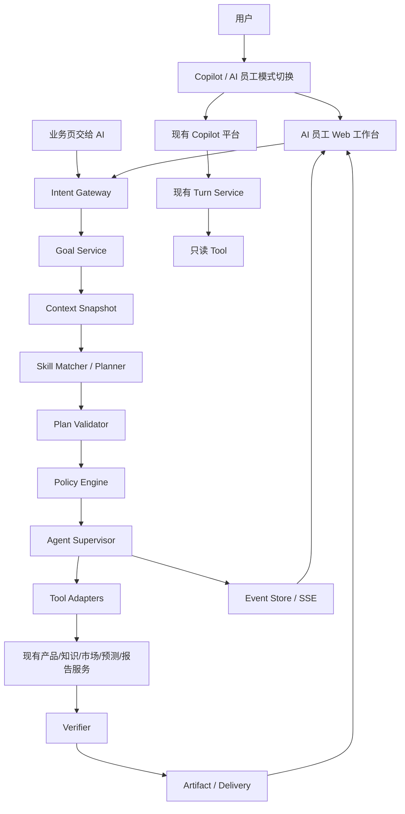

# FurniScope AI 员工系统与 Web 工作台总体设计 V1

> 日期：2026-10-07
>
> 状态：Runtime 与 Web 工作台代码保留；本期不展示 Copilot / AI员工切换入口。动态规划/重规划、定时触发、真实企业试点和生产验收未完成。
>
> 当前版本边界：本文保留完整双模式目标设计，作为后续启用依据；当前企业前台只开放 Copilot，`ProductModeSwitcher` 由发布开关隐藏。
>
> 文件名兼容说明：为保持既有链接稳定，暂保留原文件名；本文已不再承载桌面端实施细节。桌面端见 [`18_FurniScope_桌面端未来规划V1.md`](./18_FurniScope_桌面端未来规划V1.md)。
>
> 权威关系：本文扩展 [`04_FurniScope_Agent工作流设计V2.md`](./04_FurniScope_Agent工作流设计V2.md) 与 [`15_FurniScope_企业决策与数据闭环总体设计V1.md`](./15_FurniScope_企业决策与数据闭环总体设计V1.md)，不改变现有五阶段分析、受控问数、RAG、预测训练、租户隔离、人工确认和真实效果边界。
>
> 产品原则：现有平台与 Copilot 完整保留；一个 user 可主动切换到一个跨境家具 AI 员工，也可随时切回 Copilot。AI 员工内部可组合多个 Tool 和 Skill，但不要求用户管理 Agent 群。

## 1. 结论先行

### 1.1 应当单独实现什么

“AI 员工系统”应作为现有 SaaS 上方的一层独立任务操作系统实现，而不是继续扩展聊天页，
也不是重写产品、市场、预测、知识库和报告模块。

独立层只负责：

1. 接收结果目标；
2. 冻结上下文、数据范围、预算和授权；
3. 选择经过登记的 Skill；
4. 生成并校验可执行计划；
5. 调用现有业务 API 或固定工作流；
6. 跟踪执行、验证结果、处理异常和交付制品；
7. 保存完整任务事实和审计证据。

现有业务模块继续负责专业规则和业务数据。AI 员工不得绕过这些模块直接操作 Repository、
拼接 SQL 或复制业务算法。

### 1.2 Copilot 与 AI 员工并存

当前平台页面、导航、Copilot 对话、五阶段画布和各专业模块全部保留，不因新增 AI 员工而
合并、改名或重定向。登录后的默认体验仍是当前 Copilot 平台。

新增一个全局模式切换器：

| 模式 | 定位 | 行为 |
|---|---|---|
| `Copilot` | 人主导操作，AI 回答和辅助 | 完整保留现有页面、路由和交互 |
| `AI 员工` | 人交付目标，AI 在边界内规划和执行 | 进入独立 Goal 驾驶舱与执行台 |

切换器放在所有登录后页面的统一 Topbar，使用双选分段控件。切换到 AI 员工时打开新增的
`#employee` 工作空间；切回 Copilot 时恢复用户离开前的完整路由、查询参数、筛选、选中项
和滚动位置。

模式切换不代表扩大权限：

- 进入 AI 员工模式只改变交互和编排方式；
- RLS、RBAC、Policy、质量门和人工确认继续生效；
- 切换模式不创建、暂停或取消任务；
- AI 员工后台任务在 Copilot 模式下继续运行；
- Copilot 不自动把普通问答升级为 Goal；
- 用户可在任一现有业务页通过“交给 AI 员工”显式创建 Goal。

### 1.3 Web 优先，桌面后置

近期只实现云端 Web AI 员工：

- 复用当前 React/Vite、FastAPI、PostgreSQL、Redis 和 LangGraph；
- 先接入已有云端能力；
- 首期只开放 R0-R2 动作；
- 外发、发布、破坏性操作保持确认或禁用；
- 不以桌面端、MCP 或本地文件系统为前置依赖。

桌面端必须等 Web Runtime、Tool 契约、Policy 和审计稳定后再建设，避免同时引入“自主执行”
和“本地高权限”两类风险。

## 2. 当前事实与核心缺口

### 2.1 当前已有能力

| 现有能力 | 主要实现 | 可复用基础 |
|---|---|---|
| 首页驾驶舱 | `frontend/src/App.jsx` 的 `Dashboard` | 任务、异常、报告聚合 |
| AI 工作台 | `frontend/src/AnalysisCenter.jsx` | 会话、上下文、任务运行、SSE、节点详情 |
| 工作日记 | `frontend/src/WorkDiaryPage.jsx` | 工作台与分析历史 |
| 服务端 Turn | `TurnService` | 幂等、上下文快照、Citation、流式响应 |
| 意图路由 | `AgentToolOrchestrator` | 问数、RAG、工作流、预测、普通对话分类 |
| 五阶段分析 | 固定 LangGraph | Checkpoint、恢复、确认、最终报告 |
| 产品中心 | 产品主档、解析、导入、事实确认 API | 标准 SKU 与产品事实 |
| 企业知识库 | 文档、版本、索引、检索、Citation | 受权限约束的知识 Tool |
| 受控问数 | `DataQueryPlan` 与固定 SQL 指标 | 可审计数据查询 Tool |
| 销量预测 | 数据接入、训练、评测、发布、推理 | 预测领域 Tool |
| 市场洞察 | 数据集、竞品、评论、机会、经营反馈 | 市场领域 Tool |
| 报告 | 报告列表、详情、证据与 PDF | Artifact 与交付基础 |
| 基础设施 | PostgreSQL、RLS、Redis、Outbox、审计 | Runtime 持久化和恢复基础 |

### 2.2 原有缺口与当前收口

原有 `AgentToolOrchestrator` 仍是 Copilot 的单轮路由器：

- 一轮只进入一个主要意图；
- `run_workflow` 返回前端动作，由前端再创建分析任务；
- `AnalysisCenter` 的画布继续固定为五阶段分析，不承担通用目标编排。

v3.35 之后已新增独立的 `Goal / Plan / Run / Step / Approval / Artifact / Event`
持久化模型、租户级 API、Supervisor、三个确定性 Skill 和独立 `#employee` 工作台。当前
Runtime 能在后台连续执行登记能力，支持暂停、恢复、取消、人工确认、制品 SHA 和时间线；
每次能力执行前重新校验当前 RBAC 权限并原子占用工具调用预算。

当前仍不包含模型动态选 Tool、自由生成 Plan、自动重规划和定时 Trigger，因此实现等级按
L2 确定性执行基线描述，不把它宣称为完整有界 L3 或生产自治系统。

### 2.3 本次目标和非目标

目标：

- 在现有 Copilot 平台之外新增可随时进入和退出的 AI 员工工作台；
- 让已有业务能力成为可编排、可验证的 Tool/Skill；
- 支持一个 Goal 跨知识、问数、市场、预测和报告推进；
- 让用户可以离开页面，任务仍在后台运行；
- 只在业务歧义、权限扩大或高风险动作时中断用户。

非目标：

- 不把固定五阶段 LangGraph 改造成模型任意增删节点的动态图；
- 不开放自由 NL2SQL；
- 不允许 Planner 直接调用数据库或内部 Repository；
- 不在首期提供用户自定义代码 Skill；
- 不把后端存在的通知或政策代码提前声明为已交付产品能力；
- 不实现桌面端、本地 MCP、Shell、键鼠或全盘文件读取；
- 不用合成工程测试替代真实企业效果验证。

## 3. 产品心智：一个员工，一套工作事实

### 3.1 核心对象

| 对象 | 用户理解 | 系统职责 |
|---|---|---|
| AI Employee | 对结果负责的数字员工 | 固定岗位、边界、默认 Skill 和预算策略 |
| Conversation | 与员工围绕 Goal 沟通的上下文 | 澄清、追加约束和结果解释，不替代 Copilot 会话 |
| Goal | 用户正式交办的结果目标 | 约束、期限、验收、授权和优先级 |
| Plan | AI 对 Goal 的执行承诺 | 版本化 DAG，不可覆盖历史 |
| Run | 一次真实执行 | 状态、预算、Checkpoint 和恢复 |
| Step | 可调度执行单元 | 调用一个 Tool 或一个高层 Skill |
| Tool | 原子、类型化能力 | JSON Schema、权限、效果和回执 |
| Skill | 版本化业务 SOP | 组合 Tool，固化领域顺序和质量门 |
| Approval | 需要人处理的例外 | 范围、影响、选择、到期和恢复 |
| Artifact | 可核验交付物 | 类型、版本、来源、SHA 和深链 |

### 3.2 工作台不是所有页面的集合

工作台只展示任务需要的信息和制品摘要，不把产品中心、知识库、预测或市场洞察完整嵌套
进来。

采用“编排与专业工作面分离”：

```text
AI 员工工作台
  -> 调用类型化 Tool / Skill
  -> 生成任务 Step 和 Artifact
  -> 在工作台显示摘要、状态、证据和下一步
  -> 需要深度查看或人工编辑时深链到专业页面
  -> 返回后恢复原 Goal、视图和滚动位置
```

这与当前“知识库管理与对话消费分离”“快速预览与独立详情页分离”的交互原则一致。

## 4. Web 工作台信息架构

### 4.1 双模式导航

Copilot 模式完全沿用当前一级导航：

```text
首页 / 产品中心 / AI 工作台 / 企业知识库 / 销量预测 / 市场洞察 / 决策报告
```

AI 员工模式使用独立工作空间，不修改上述页面：

```text
AI 员工驾驶舱 / 全部目标 / 待我处理 / 交付物
```

统一 Topbar 左侧显示模式切换器：

```text
[ Copilot | AI 员工 ]
```

切换规则：

- 首次登录默认 `Copilot`，不强迫用户选择；
- 用户切换后可记住个人偏好，但登录页不增加阻塞步骤；
- Copilot 侧栏和所有现有页面保持原样；
- AI 员工使用自己的二级导航，不把 Goal 混入现有工作日记；
- 两种模式共享同一用户、租户、业务数据和权限，但分别维护页面导航状态；
- URL 可直接进入任一模式，浏览器前进/后退行为必须正确。

### 4.2 AI 员工首页：驾驶舱

驾驶舱是 AI 员工模式的默认页，回答四个问题：

1. AI 员工今天承诺做什么；
2. 哪些事情需要我处理；
3. 最近交付了什么；
4. 当前运行是否健康、是否超出预算。

```text
┌────────────┬──────────────────────────────────────────────┐
│ AI员工导航 │ [ Copilot | AI 员工 ]          在线 · L2   │
│            ├──────────────────────────────────────────────┤
│ 驾驶舱     │ 交给 AI 员工一个目标……             [交办]   │
│ 全部目标   ├──────────────────────────┬───────────────────┤
│ 待我处理   │ 当前承诺                 │ 需要你处理        │
│ 交付物     │ · 正在执行               │ · 事实冲突        │
│            │ · 下一步与预计交付       │ · 权限/风险确认   │
│            ├──────────────────────────┼───────────────────┤
│            │ 最近交付                 │ 今日活动          │
│            │ 报告/预测/数据版本       │ Step 事件时间线   │
└────────────┴──────────────────────────┴───────────────────┘
```

驾驶舱不是营销首页，不使用大面积 Hero、装饰性插画或重复 KPI 卡。它是高频经营界面：

- 首屏直接出现目标输入；
- “需要你处理”优先于成功统计；
- 承诺卡展示结果、下一步、预计完成和阻塞，不只展示百分比；
- 最近交付按 Artifact 展示，不把聊天回答算作正式交付；
- 系统健康作为紧凑状态，不占据主要业务空间。

### 4.3 目标执行页：执行台

用户打开某个 Goal 后进入执行台：

```text
┌──────────┬───────────────┬──────────────────────────┬───────────────┐
│ 主导航   │ 目标列表      │ 当前目标                 │ 检查器        │
│          │ 搜索/筛选     │ [驾驶舱][执行台][制品]   │ 上下文        │
│          │               ├──────────────────────────┤ 证据          │
│          │ 运行中        │ 目标与验收条件           │ Tool 回执     │
│          │ 待确认        │ 计划 DAG / Step 列表     │ 风险与确认    │
│          │ 已完成        │ 当前制品预览             │ 版本与成本    │
│          │ 失败          │ 事件时间线               │               │
│          │               ├──────────────────────────┤               │
│          │               │ 对话与追加指令输入       │               │
└──────────┴───────────────┴──────────────────────────┴───────────────┘
```

区域职责：

| 区域 | 内容 | 约束 |
|---|---|---|
| 目标列表 | 状态、标题、期限、待确认、最近活动 | 不与普通聊天会话混为一列 |
| 目标头 | 目标、验收条件、自治范围、暂停/取消 | 不显示模型私有思维链 |
| 计划区 | 业务 Step、依赖、状态、失败和重规划 | 默认显示业务语言，技术日志按需展开 |
| 工作面 | 表格、报告、预测、差异等 Artifact 预览 | 复杂编辑跳到专业页面 |
| 检查器 | 输入来源、Citation、Tool 回执、Policy | 右侧可收起，不承载完整业务页面 |
| 时间线 | 状态变更、重试、确认、交付 | 只使用服务端持久化事件 |
| 对话区 | 澄清、解释、追加约束、追问结果 | 追加约束会生成新 Plan 版本 |

### 4.4 三个任务视图

同一 Goal 使用三个视图，不创建三套状态：

| 视图 | 用途 | 默认用户 |
|---|---|---|
| 驾驶舱 | 看承诺、里程碑、异常和结果 | 日常经营用户 |
| 执行台 | 看计划、Step、证据、版本和接管 | 复杂任务、验收和排障 |
| 制品 | 看报告、预测、标准数据和导出 | 结果消费与复核 |

工作台首页的驾驶舱与单 Goal 的驾驶舱共用组件和事件，不独立计算状态。

### 4.5 Copilot 与 AI 员工切换

#### 从 Copilot 进入 AI 员工

入口有两类：

1. Topbar 中点击 `AI 员工`；
2. 在现有产品、知识、市场、预测或报告页面点击“交给 AI 员工”。

第二类入口携带当前业务上下文：

```json
{
  "source_mode": "copilot",
  "return_href": "forecast?tab=training",
  "resource_refs": [
    {"type": "product", "id": "9001"},
    {"type": "forecast_data_version", "id": "uuid"}
  ],
  "suggested_goal": "检查该数据版本并完成首次训练"
}
```

AI 员工先显示 Goal 草稿、预计交付物和权限范围。用户提交 Goal 后进入执行台。进入 AI 员工
模式本身不自动执行当前 Copilot 页面上的操作。

#### 从 AI 员工返回 Copilot

用户点击模式切换器中的 `Copilot`：

- 优先恢复本次进入 AI 员工前的 `return_href`；
- 没有来源页面时恢复该用户最近一次 Copilot 路由；
- 恢复查询参数、Tab、筛选、选中资源和滚动位置；
- AI 员工任务继续后台运行；
- 有待确认事项时只显示非阻塞状态提示，不阻止切换。

#### 状态保存

前端保存的是导航快照，不是任务真相：

```json
{
  "mode": "copilot",
  "href": "products?status=ready&product=9001",
  "scroll_key": "product-list",
  "scroll_top": 824,
  "captured_at": "2026-10-07T12:00:00Z"
}
```

Goal、Run、Approval 和 Artifact 始终以服务端为准。

### 4.6 视觉方向

定位为“安静、工业化、可审计的经营工作台”：

- 主色使用现有青绿色，正文使用中性墨色；警告用琥珀，失败用红色；
- 页面背景和信息层级不能被单一蓝灰色统治；
- 卡片圆角不超过 8px，不把整页分区都做成悬浮卡；
- 主任务面使用连续工作区，卡片只用于重复任务、确认和制品；
- 数字使用等宽数字样式，标题与正文维持现有中文字体体系；
- 状态图标统一使用现有 Phosphor Icons；
- 动画只用于状态迁移、流式事件和新 Artifact 出现，不使用无业务含义的“思考”动画；
- 颜色不是唯一状态信号，必须同时有图标和文字；
- 任何“已完成”状态旁都能打开验证依据。

### 4.7 响应式规则

| 宽度 | 布局 |
|---|---|
| `>= 1280px` | 主导航 + 目标列表 + 主工作面 + 可收起检查器 |
| `768-1279px` | 主导航折叠；目标列表与检查器互斥抽屉 |
| `< 768px` | 仅驾驶舱、目标详情、确认和制品；不显示 DAG 画布 |

移动端底部固定命令区只保留：

- 输入；
- 发送；
- 附件；
- 暂停或继续当前任务。

计划编辑、Tool 详情和复杂数据表在移动端进入独立页面，禁止挤在抽屉中。

## 5. 在现有 Copilot 旁新增 AI 员工

### 5.1 路由新增

所有现有 Hash 路由保持不变，新增：

| 新路由 | 用途 | 与 Copilot 的关系 |
|---|---|---|
| `#employee` | AI 员工驾驶舱 | 独立入口 |
| `#employee?tab=goals` | 全部 Goal | 不替代 `#work-diary` |
| `#employee?tab=approvals` | 待我处理 | 可深链回原业务页 |
| `#employee?tab=artifacts` | 全部交付物 | 不替代 `#report` |
| `#employee?goal={uuid}&view=studio` | Goal 执行台 | 可引用现有分析任务 |
| `#employee?goal={uuid}&view=artifacts` | Goal 制品 | 可深链到现有报告详情 |

禁止把 `#workspace`、`#analysis`、`#workflow`、`#work-diary` 或其他现有业务路由重定向到
AI 员工。模式切换器只负责保存和恢复两个模式各自的最近路由。

迁移期不得把旧 `analysis_tasks` 直接改成通用 Goal。采用关联方式：

```text
agent_goal
  -> agent_plan_step(capability_id = market_analysis.run)
  -> existing analysis_task_uuid
```

旧任务继续按原状态机和原页面运行；Agent Runtime 只在 AI 员工模式中投影其状态和
Artifact，不改变 Copilot 展示。

### 5.2 前端迁移顺序

1. 在现有登录后 Topbar 增加 `Copilot / AI 员工` 模式切换器；
2. 新增独立 `AIEmployeeWorkbench`，不改写当前 `Dashboard` 和 `AnalysisCenter`；
3. 抽取可安全复用的消息、Citation、状态、SSE 和制品预览组件；
4. 新增 `GoalList`、`GoalComposer`、`PlanBoard`、`ArtifactViewer`、`ApprovalInbox` 和 `RunTimeline`；
5. 实现 `ModeNavigationStore`，分别保存两个模式的最近路由和页面恢复信息；
6. 新 Runtime 未启用时隐藏 AI 员工切换项，现有 Copilot 不受影响；
7. 通过租户和用户 Feature Flag 逐步开放 AI 员工模式；
8. AI 员工稳定后仍保留全部 Copilot 页面和模式切换能力。

### 5.3 后端迁移顺序

1. 先建立 Tool Catalog 和 Adapter，不改现有业务服务；
2. 建立 Goal/Plan/Run 独立表和 API；
3. 用确定性 Skill 模板生成首批 Plan；
4. Supervisor 调用 Tool Adapter，现有分析图作为一个高层 Step；
5. Verifier 读取业务后置条件与回执；
6. `TurnService` 与 `AgentToolOrchestrator` 继续服务 Copilot，不改变其现有执行语义；
7. 新增 `AgentGoalService` 和 Goal 入口，独立处理 AI 员工目标；
8. 共享 Context Builder、Tool Adapter 和 Citation 时，分别保留 Copilot Turn 与 Goal Run 的调用来源；
9. 完成固定 Skill 后再引入有限的模型规划和重规划。

### 5.4 兼容期双轨规则

| 场景 | 双模式行为 |
|---|---|
| Copilot 普通问答 | 继续由 `TurnService` 处理 |
| Copilot 知识问答 | 继续由 RAG 与 Citation 处理 |
| Copilot 经营问数 | 继续由受控 `DataQueryPlan` 处理 |
| Copilot 启动市场分析 | 继续使用现有 `analysis_task` 流程 |
| AI 员工市场分析 Step | 新 Goal 包装并调用原有 `analysis_task` |
| 查看原工作日记 | 保持当前页面和数据语义 |
| AI 员工预测 Step | 通过 Adapter 创建原生预测任务，不复制状态机 |
| AI 员工报告 Artifact | 引用现有 `report_uuid`，可深链到原页面 |

同一次用户动作必须带 `source_mode` 和独立幂等键，禁止 Copilot 旧动作与 AI 员工 Supervisor
重复创建任务。

## 6. 当前能力如何接入一个工作台

### 6.1 接入原则

每项能力都通过 Tool Adapter 暴露，至少包含：

- 稳定 `capability_id` 和版本；
- 输入与输出 JSON Schema；
- 所需 RBAC 权限和数据分类；
- 效果等级；
- 幂等规则；
- 超时、并发和预算；
- 业务回执；
- Verifier；
- 专业页面深链。

Planner 只看能力摘要，不知道数据库表，也不调用 React 页面。

### 6.2 能力接入矩阵

| 能力 ID | 现有来源 | 效果 | 首期状态 | 工作台呈现 |
|---|---|---:|---|---|
| `product.search` | 产品列表 API | R1 | 可首批接入 | 产品选择结果 |
| `product.read` | 产品详情与事实 API | R1 | 可首批接入 | 产品上下文 |
| `product.profile.prepare` | 解析与草稿画像 | R2 | 需 Adapter | 待确认事实制品 |
| `product.profile.confirm` | 画像确认 API | R3 | 必须人工确认 | Approval |
| `product.import.inspect` | 产品导入自动识别 | R1 | 需浏览器上传后接入 | 质量报告 |
| `knowledge.search` | 知识库混合检索 | R1 | 已有工作台能力 | Citation 列表 |
| `business.query` | 受控问数 | R1 | 已有工作台能力 | 表格/图表制品 |
| `market.dataset.read` | 市场数据集 API | R1 | 可首批接入 | 数据范围 |
| `market_analysis.run` | 五阶段 LangGraph | R2 | 首个领域 Skill | 计划子流程与报告 |
| `competitor.watch.read` | 竞品监控 API | R1 | 后续接入 | 异常摘要 |
| `competitor.watch.update` | 竞品监控写接口 | R2/R3 | 后续按策略开放 | 变更确认 |
| `forecast.data.inspect` | 销量数据预检 | R1/R2 | 需用户先上传 | 质量报告 |
| `forecast.train` | 训练任务 API | R2 | 第二批接入 | 训练 Run |
| `forecast.publish` | 质量门与部署 | R3 | 保持强确认 | 发布回执 |
| `forecast.predict` | 预测任务 API | R2 | 第二批接入 | 预测制品 |
| `report.read` | 报告 API | R1 | 可首批接入 | 报告预览 |
| `report.compose` | 现有报告结果组织 | R2 | 随 Skill 接入 | 报告 Artifact |
| `report.archive` | 报告归档 API | R2 | 后续接入 | 状态回执 |
| `notification.draft` | 通知草稿目标能力 | R2 | 规划中 | 草稿 Artifact |
| `notification.send` | 外部投递 | R3 | 未开放 | 不在首期 UI 展示 |

说明：

- “现有来源存在”不等于“已接入 AI 员工”；
- 通知渠道和政策源未完成产品交付前，不得出现在 AI 员工可用能力中；
- 上传文件仍由浏览器原生文件选择器完成，Agent 只能处理用户已上传且服务端已登记的对象；
- 复杂字段修正继续进入产品导入或销量建模页面，工作台只显示异常摘要和返回结果。

### 6.3 首批 Skill

首批不要让模型自由拼装任意 Tool，先实现三个确定性 Skill：

#### `market_entry_assessment@1`

```text
读取产品与已确认事实
-> 选择授权市场数据
-> 运行现有五阶段分析
-> 验证报告和证据
-> 交付决策报告
```

#### `weekly_sales_review@1`

```text
冻结销量数据版本和日期范围
-> 执行受控问数
-> 可选调用已发布模型预测
-> 比较实际、预测和数据质量
-> 生成周报草稿
```

没有已验证预测模型时，必须输出“预测未纳入”，不能用历史聚合冒充预测。

#### `data_readiness_check@1`

```text
读取用户已上传的数据版本
-> 执行质量预检
-> 检查 SKU 身份关联
-> 汇总阻断问题
-> 交付修复清单和专业页面入口
```

该 Skill 不自动确认标准数据、不自动发布模型。

### 6.4 专业页面返回协议

工作台深链到专业页面时携带：

```text
return=employee
goal={goal_uuid}
run={run_uuid}
step={step_uuid}
artifact={artifact_uuid}
```

专业页面完成操作后返回结构化结果，而不是让工作台重新抓取并猜测：

```json
{
  "result": "completed",
  "resource_type": "forecast_data_version",
  "resource_uuid": "uuid",
  "resource_version": 3,
  "sha256": "sha256",
  "return_to": {
    "goal_uuid": "uuid",
    "step_uuid": "uuid"
  }
}
```

返回时恢复 Goal、标签页、列表筛选和滚动位置。

## 7. Web AI 员工总体架构



### 7.1 分层职责

| 层 | 职责 | 禁止 |
|---|---|---|
| Mode Switch | 保存双模式导航并切换工作空间 | 改写或停止任务 |
| Copilot | 维持当前问答、页面和固定工作流 | 静默创建 AI 员工 Goal |
| Workbench | Goal 输入、展示、暂停、确认、深链 | 前端推算任务真相 |
| Intent Gateway | 规范 AI 员工 GoalRequest 和业务页委托 | 直接执行业务写入 |
| Goal Service | 目标、约束、期限、验收、幂等 | 生成自由文本计划后直接执行 |
| Planner | 选择 Skill、填参数、生成计划版本 | 修改权限和风险等级 |
| Plan Validator | DAG、Schema、能力、预算、依赖校验 | 调用 Tool |
| Policy Engine | 确定性授权决策 | 由模型输出 allow |
| Supervisor | 调度、租约、Checkpoint、恢复 | 绕过 Adapter |
| Tool Adapter | 翻译并调用现有服务 | 复制领域算法 |
| Verifier | 验证后置条件和回执 | 用模型自述代替业务证据 |
| Artifact Service | 记录制品、来源、SHA 和深链 | 把普通聊天当正式交付 |

### 7.2 独立部署边界

首期不需要拆微服务。建议在现有 FastAPI 单体中新增独立模块和表，通过同一数据库事务、
Redis 队列和鉴权体系运行。

只有在以下条件出现后再拆分 Agent Runtime 服务：

- Agent Step 吞吐与 Web API 资源竞争；
- 需要独立扩缩容或故障域；
- Tool 执行存在显著不同的依赖与运行环境；
- 数据库连接池、队列和部署节奏已形成明确边界。

“逻辑独立、部署先不独立”能减少首期改造成本，也符合当前代码组织方式。

## 8. Runtime 设计

### 8.1 自主等级

| 等级 | 定义 | 当前/目标 |
|---|---|---|
| L0 | 只回答 | 已具备 |
| L1 | 建议并给入口 | 已具备 |
| L2 | 运行固定 Skill，关键点确认 | 当前部分具备，近期主目标 |
| L3 | 在授权范围内组合 Skill、验证和局部重规划 | Web 试点后目标 |
| L4 | 任意能力与长期开放自治 | 不规划 |

第一版工作台可以有“员工感”，但实现上必须先做可靠 L2，再逐步打开有界 L3。

### 8.2 Goal 契约

```json
{
  "objective": "评估 HF-A0396 在美国站的进入机会并生成报告",
  "expected_deliverables": [
    {"type": "decision_report", "required": true}
  ],
  "constraints": {
    "product_ids": [9001],
    "market": "US",
    "knowledge_base_uuids": []
  },
  "acceptance_criteria": [
    "report_uuid_present",
    "evidence_count_gte_1",
    "source_versions_frozen"
  ],
  "autonomy_envelope": {
    "allowed_effects": ["read", "internal_write"],
    "max_tool_calls": 30,
    "max_replans": 1
  },
  "deadline": null,
  "priority": "normal",
  "trigger_type": "user_delegate",
  "idempotency_key": "uuid"
}
```

只有影响业务结果、数据范围或权限的缺失项才询问用户。能从当前工作台、已确认事实和 Skill
默认值确定的参数不重复询问。

### 8.3 Plan 契约

Plan 是不可变版本。每个 Step 包含：

- `step_uuid`、依赖和顺序；
- `capability_id`、版本和 provider；
- 输入资源引用及版本；
- 输出 Schema；
- 效果等级；
- 超时、重试、幂等键和租约；
- 验证器与成功后置条件；
- 失败分类、降级和补偿；
- 是否需要确认。

首期上限：

- 单 Goal 最多 12 个 Step；
- 单 Step 最多 2 次自动重试；
- 单 Goal 最多 1 次模型重规划；
- 最多 30 次 Tool 调用；
- 单个高层固定 Skill 内部节点不计为通用 Plan Step。

### 8.4 先 Skill 匹配，后开放动态规划

第一阶段 Planner 不自由生成 DAG：

```text
Goal
-> 规则 + 模型选择一个已激活 Skill
-> 填充 Skill 输入
-> 编译为固定 Plan
-> 静态校验
```

第二阶段才允许在白名单内组合最多 3 个已验证 Skill。即使开放组合，Planner 输出也必须
通过 `AgentPlanV1` Schema 和确定性校验。

### 8.5 Supervisor

Supervisor：

- 领取 ready Step；
- 重新加载权限、资源版本和预算；
- 获取租户并发槽位与 Step 租约；
- 冻结 Tool 输入并计算哈希；
- 调用 Tool Adapter；
- 保存结构化回执、成本和 Artifact；
- 进入验证；
- 根据错误分类重试、降级、重规划或请求确认；
- 丢失租约后停止提交结果。

现有 `RedisJobQueue`、Checkpoint 和 Outbox 可复用，但通用 Run 使用独立实体，不能把所有
状态塞入 `analysis_tasks`。

### 8.6 Verifier

完成证据优先级：

```text
业务后置条件查询
> 目标系统回执
> Artifact SHA / 行数 / Schema
> 确定性验证器
> 第二数据源交叉检查
> 模型语义检查
```

模型语义检查不能单独证明任务完成。示例：

- 报告完成：必须有 `report_uuid`、报告版本和证据索引；
- 预测完成：必须有 `forecast_job_uuid`、模型版本和结果行；
- 数据准备完成：必须有确认状态、标准 SHA 和质量报告；
- 市场分析完成：必须满足原五阶段最终事务；
- 通知发送：必须有外部渠道回执；首期不开放。

### 8.7 状态机

Goal/Run：

```text
draft -> planning -> plan_ready -> queued -> running
running -> waiting_human -> queued
running -> verifying -> running
running -> replanning -> plan_ready
running -> delivering -> succeeded / partial_succeeded
任意非终态 -> failed / cancelled
```

Step：

```text
pending -> ready -> running -> verifying -> succeeded
running -> retry_scheduled -> ready
running/verifying -> waiting_human
running/verifying -> failed / skipped / rolled_back
```

只有 Supervisor、Policy 和确认恢复事务可改变状态；前端和模型均不能直接写终态。

## 9. Policy 与最小化人工干预

### 9.1 风险等级

| 等级 | 示例 | 默认策略 |
|---|---|---|
| R0 | 读公开配置、计算 | 自动 |
| R1 | 读租户产品、知识、已授权数据 | 权限内自动 |
| R2 | 创建内部任务、草稿、未发布报告 | 用户在 AI 员工模式提交 Goal 后自动 |
| R3 | 发布模型、确认事实、外部发送、归档关键数据 | 单次确认或有限时预授权 |
| R4 | 读取凭据、越权数据、绕过确认、任意代码 | 拒绝 |

### 9.2 Policy 决策

Policy Engine 接收 user、tenant、role、Goal、Plan、Step、Tool、实际参数、数据分类、
资源版本和预算，输出：

- `allow`
- `allow_with_constraints`
- `require_confirmation`
- `deny`

Policy 必须是确定性代码，规则版本和输入摘要进入审计。模型不能把“用户希望尽快完成”
解释成扩大权限。

### 9.3 什么时候打断用户

不因以下技术问题打断：

- 可重试网络错误；
- 模型限流；
- 可替代 Tool 暂时不可用；
- 非关键分支失败；
- 已有确定性降级路径。

只在以下情况打断：

- 缺少会改变结果的业务事实；
- 已确认事实冲突；
- 需要扩大产品、市场、数据或接收方范围；
- R3 动作没有授权；
- 预算或期限必须调整；
- 所有安全降级均失败。

确认卡必须用业务语言说明“将发生什么、影响什么、为什么现在需要确认”，不能只显示内部
节点名和异常栈。

## 10. 数据模型

建议新增迁移 `v3_35_agent_runtime.sql`，名称以实施时迁移序列为准。

| 表 | 核心内容 |
|---|---|
| `ai_employee_profiles` | 固定员工画像、自治等级、默认预算和启用 Skill |
| `agent_goals` | 目标、约束、验收、期限、Envelope、状态 |
| `agent_plans` | 不可变计划版本、Plan SHA、风险摘要 |
| `agent_plan_steps` | DAG、能力、输入引用、验证和状态 |
| `agent_runs` | 当前 Plan、Checkpoint、预算和交付状态 |
| `agent_step_runs` | 尝试、租约、输入哈希、输出、错误 |
| `agent_tool_definitions` | Tool Schema、效果、权限、验证器和状态 |
| `agent_tool_invocations` | 实际参数摘要、Policy、回执、成本和 SHA |
| `agent_skill_packages` | Skill 版本、内容哈希、测试和生命周期 |
| `agent_approvals` | 影响、选项、范围、状态、到期和恢复引用 |
| `agent_artifacts` | 类型、来源、业务资源引用、版本和 SHA |
| `agent_events` | 可重放 UI 事件 |
| `agent_triggers` | 第二阶段的按钮、定时和内部事件 |

所有表继续采用：

- `tenant_id` 复合关系；
- `ENABLE/FORCE RLS`；
- 不可变版本或显式修订；
- append-only 高风险审计；
- 幂等键；
- Secret 只保存引用。

`agent_artifacts` 优先引用现有业务对象，不复制正文：

```json
{
  "artifact_type": "decision_report",
  "resource_type": "analysis_report",
  "resource_uuid": "uuid",
  "resource_version": 1,
  "sha256": "sha256",
  "open_href": "report-detail?id=uuid&from=employee"
}
```

## 11. API 与事件

### 11.1 工作台聚合

```text
GET  /api/v1/ai-employee/overview
GET  /api/v1/ai-employee/goals
GET  /api/v1/ai-employee/approvals
GET  /api/v1/ai-employee/artifacts
```

首页使用一个聚合接口返回承诺、例外、交付和活动，避免多个页面接口重复加载。

### 11.2 Copilot 与 Goal

```text
POST /api/v1/analysis-workspaces/{workspace_uuid}/turns
POST /api/v1/agent-goals:draft
POST /api/v1/agent-goals
GET  /api/v1/agent-goals/{goal_uuid}
POST /api/v1/agent-goals/{goal_uuid}:plan
POST /api/v1/agent-goals/{goal_uuid}:start
```

第一行是现有 Copilot 接口，保持兼容；其余接口只供 AI 员工模式使用。`GoalDraft` 只生成
结构化草稿，不产生副作用。`POST /agent-goals` 使用 Idempotency-Key，并记录
`source_mode=employee` 或显式业务页委托来源。

### 11.3 运行控制

```text
GET  /api/v1/agent-runs/{run_uuid}
GET  /api/v1/agent-runs/{run_uuid}/timeline
GET  /api/v1/agent-runs/{run_uuid}/events
POST /api/v1/agent-runs/{run_uuid}:pause
POST /api/v1/agent-runs/{run_uuid}:resume
POST /api/v1/agent-runs/{run_uuid}:cancel
POST /api/v1/agent-approvals/{approval_uuid}:respond
```

### 11.4 Tool 与 Skill

```text
GET /api/v1/agent-capabilities
GET /api/v1/agent-skills
GET /api/v1/agent-skills/{skill_uuid}
```

首期 Skill 由代码和迁移发布，不提供普通用户在线编辑、上传或安装入口。

### 11.5 SSE 事件

```text
goal_created
plan_ready
plan_revised
step_started
step_progress
tool_result
verification_result
approval_required
artifact_ready
run_completed
run_failed
```

每个事件有稳定 ID、Run 序号和持久化记录。前端断线后按最后事件 ID 恢复，不显示模型
思维链。

## 12. 建议代码结构

### 12.1 后端

保持当前 FastAPI 分层风格：

```text
backend/furniscope_api/
  routes/
    agent_goals.py
    agent_runs.py
    agent_capabilities.py
  schemas/
    agent_runtime.py
  repositories/
    agent_repository.py
  services/
    agent_goal_service.py
    agent_planner.py
    agent_plan_validator.py
    agent_policy.py
    agent_supervisor.py
    agent_verifier.py
    agent_artifact_service.py
    agent_event_service.py
    agent_tool_catalog.py
    agent_tool_adapters.py
```

Tool Adapter 调用现有 Service 或公开业务接口，不访问前端组件，也不复制 Repository 查询。

### 12.2 前端

```text
frontend/src/
  AIEmployeeWorkbench.jsx
  ai-employee/
    ProductModeSwitcher.jsx
    ModeNavigationStore.js
    EmployeeCockpit.jsx
    GoalComposer.jsx
    GoalList.jsx
    GoalHeader.jsx
    PlanBoard.jsx
    ArtifactViewer.jsx
    ApprovalInbox.jsx
    RunTimeline.jsx
    ContextInspector.jsx
    useAgentEventStream.js
  ai-employee.css
```

现有组件复用：

- 会话消息渲染和 Citation；
- 任务 SSE 连接与重连；
- 知识、产品、报告详情页；
- 五阶段节点详情；
- 文件上传和数据预检；
- 通用 Topbar、Sidebar、状态和空态组件。

不要把新 Runtime 逻辑堆入 `AnalysisCenter.jsx`。该文件继续服务原 Copilot 模式；AI 员工
使用独立组件，只抽取无业务副作用的通用展示组件。

## 13. 分阶段实施

按 4-5 人团队估算，Web MVP 约 9-11 周。阶段可以局部并行，但数据契约和状态机必须先行。

### 阶段 0：冻结 UX 与契约，1 周

交付：

- `Copilot / AI 员工` 全局切换原型；
- 双模式导航快照与恢复协议；
- Goal、Plan、Step、Tool、Approval、Artifact Schema；
- 首批 Tool Catalog；
- 三个 Skill 的输入、计划和验收；
- 风险矩阵、状态机和 Feature Flag。

Go 条件：

- 所有任务动作映射到稳定能力 ID；
- 模式名称、当前模式和切换结果始终可见；
- 切换不会改写 Copilot 页面或任务状态；
- 现有五阶段和预测业务规则不被复制或改写。

### 阶段 1：Runtime 与兼容 Skill，3 周

交付：

- 数据库迁移；
- Goal/Plan/Run API；
- Tool Catalog、Policy、Supervisor、Verifier；
- `market_entry_assessment@1`；
- 旧 `analysis_task` 的 Step 关联与状态投影；
- Agent SSE。

Go 条件：

- 固定用例可重放；
- 幂等重复副作用为 0；
- 跨租户调用为 0；
- 旧分析任务结果与新 Goal 投影一致。

### 阶段 2：独立 AI 员工工作台，2 周

交付：

- 全局 `Copilot / AI 员工` 模式切换器；
- Employee Cockpit；
- Goal 输入与草稿确认；
- Goal 列表、执行台、制品和确认收件箱；
- Copilot 原路由零重定向；
- 双模式页面状态恢复；
- 浏览器 1440px、1024px 和移动 390px 适配。

Go 条件：

- Copilot 功能、路由和页面回归全部通过；
- 只有 AI 员工模式或显式“交给 AI 员工”动作能创建 Goal；
- 用户切回 Copilot 后 Goal 继续运行；
- 驾驶舱和执行台对同一 Run 状态一致；
- 双向切换、页面刷新、SSE 重连和浏览器返回不丢位置。

### 阶段 3：跨模块 Skill，2 周

交付：

- `weekly_sales_review@1`；
- `data_readiness_check@1`；
- 预测、问数、知识和报告 Adapter；
- 专业页面返回协议；
- Artifact 统一展示。

Go 条件：

- 一个 Goal 可以跨至少三个现有模块；
- 每个交付物都有业务资源 ID 和 SHA；
- 缺少预测模型时不生成伪预测；
- 数据质量阻断不能被 Planner 绕过。

### 阶段 4：有界自主试点，1-3 周

交付：

- 局部重试和一次重规划；
- Button Binding；
- 定时 Trigger 仅对已验证 Skill 开放；
- 预算、成本、人工打断率和完成误判监控；
- 企业灰度和回滚开关。

Go 条件：

- 稳定 Skill 端到端成功率 `>= 90%`；
- 不必要确认率 `<= 10%`；
- 验收误判完成率 P0 为 `0`；
- 所有未打断动作均在有效 Envelope 内；
- 真实企业效果仍单独评估，不由工程通过替代。

## 14. 测试与验收

### 14.1 后端

- Goal、Plan 和 Run 状态转换；
- Plan DAG、Schema、预算、能力版本和风险校验；
- Tool Adapter 租户隔离；
- 幂等创建、重复消费和租约丢失；
- 旧分析任务、预测任务和报告关联；
- Policy 拒绝、确认和恢复；
- Artifact SHA、来源版本和删除边界；
- SSE 断点重放；
- Worker 崩溃和 Redis/PostgreSQL 短暂故障恢复。

### 14.2 前端

- `Copilot / AI 员工` 当前模式始终明确；
- Copilot 全部现有页面、操作和路由保持可用；
- 从业务页“交给 AI 员工”时上下文正确冻结；
- 切回 Copilot 时恢复原路由、参数、筛选、选中项和滚动位置；
- 模式切换不暂停、不取消、不重复创建任务；
- 驾驶舱、执行台、制品状态一致；
- 专业页面往返状态恢复；
- 待确认、失败、部分完成、取消和空状态；
- 1440×1000、1024×768、390×844 无横向溢出；
- 长标题、长错误、长证据和大表格不遮挡；
- 页面切换不重复加载同一 Goal 快照。

### 14.3 产品验收

用户必须能完成：

1. 登录后继续使用当前 Copilot 和全部原有页面；
2. 从 Topbar 主动切换到 AI 员工模式；
3. 向 AI 员工提交 Goal 并查看承诺、下一步和预计交付；
4. 切回 Copilot 后继续原页面操作，AI 员工任务仍在后台运行；
5. 再次进入 AI 员工时恢复原 Goal 和视图；
6. 只处理真正需要判断的异常；
7. 打开最终 Artifact 并核验来源；
8. 从业务模块点击“交给 AI 员工”并能返回原页面；
9. 暂停、取消和查看完整执行记录。

## 15. Go/No-Go

### 15.1 工程门槛

| 指标 | 门槛 |
|---|---:|
| Goal/Run 幂等重复副作用 | 0 |
| 越过 Policy 的 Tool 调用 | 0 |
| 跨租户读取/写入 | 0 |
| 无业务回执但标记完成 | 0 |
| 丢失租约后提交结果 | 0 |
| R3 无确认执行 | 0 |
| Plan、Tool、Skill、Artifact 版本可追溯 | 100% |
| 固定恢复用例状态一致 | 100% |

### 15.2 No-Go 条件

出现任意一项不得开放 AI 员工自主执行：

1. Planner 可以调用未登记能力；
2. Tool Adapter 绕过现有业务权限或质量门；
3. 前端可以直接写 Run/Step 终态；
4. 模型文本可以单独证明任务完成；
5. 切换模式会改写、暂停或取消任务；
6. Copilot 路由被重定向、替换或功能降级；
7. Copilot 动作与 AI 员工 Runtime 会重复创建任务；
8. 用户无法切回原 Copilot 页面；
9. 用户无法暂停、取消、拒绝确认或查看证据；
10. 通知、政策或真实效果被提前宣称已交付。

## 16. 桌面端关系

Web AI 员工是桌面端的控制面和事实来源，但本期不包含桌面实现。桌面端未来只新增：

- 设备身份；
- 本地授权；
- 本地执行与回执；
- 本地 MCP；
- 文件和应用适配器；
- 签名更新与本地审计。

它不得重新实现 Goal、Plan、Policy、业务 Skill 或云端数据主档。完整方案、启动门槛和
安全基线见 [`18_FurniScope_桌面端未来规划V1.md`](./18_FurniScope_桌面端未来规划V1.md)。

## 17. 本轮设计完成清单

- [x] 明确 AI 员工系统应作为独立编排层实现。
- [x] 明确现有 Copilot 平台与新增 AI 员工双模式并存。
- [x] 定义登录后全局模式切换和双向页面恢复。
- [x] 定义 AI 员工的驾驶舱、执行台和制品视图。
- [x] 明确不合并、不重定向、不替换当前页面和工作日记。
- [x] 定义现有业务能力的 Tool Adapter 接入矩阵。
- [x] 定义首批三个确定性 Skill。
- [x] 给出 Web 架构、数据、API、代码结构和迁移顺序。
- [x] 将桌面端拆分为独立未来规划。
- [x] 实现确定性 Goal/Plan/Run Runtime、逐能力 RBAC 重验和预算硬限制。
- [x] 实现独立 Web AI 员工工作台及 Copilot 双向路由恢复。
- [ ] 实现动态规划/重规划、定时 Trigger 和生产灰度开关。
- [ ] 完成真实企业试点和生产验收。
