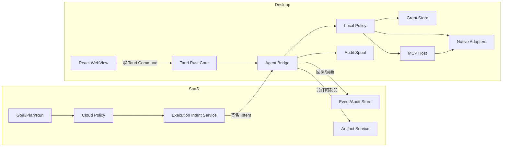

# FurniScope 桌面端未来规划 V1

> 日期：2026-10-07
>
> 状态：未来规划，未进入当前实施与交付范围。
>
> 前置依赖：[`17_FurniScope_AI员工系统与桌面端总体设计V1.md`](./17_FurniScope_AI员工系统与桌面端总体设计V1.md) 中的 Web AI 员工 Runtime、Tool/Skill 契约、Policy、Artifact 和审计完成试点验收后，方可启动桌面端。
>
> 口径约束：当前没有 Tauri 桌面应用、Local Agent Bridge、本地 MCP Host、设备配对或本地计算机操作能力，不得作为已实现功能对外描述。

## 1. 规划结论

桌面端不是另一套 AI 员工，也不是把 Web 页面套进桌面壳。它是 Web AI 员工的受控本地执行
面，负责访问浏览器沙箱无法安全访问的用户授权资源。

目标架构：

```text
Web/SaaS：身份、Goal、Plan、Policy、Skill、审计和长期状态
Desktop：设备身份、本地 Grant、二次策略校验、有限能力执行和回执
```

推荐技术方案：

- `Tauri 2 + React/Vite` 桌面壳；
- Rust Core 提供窄 IPC 和平台安全能力；
- 独立 `Agent Bridge` sidecar 承载本地任务队列、MCP Client 和 Adapter；
- 本地 `Policy Engine` 对每个 Execution Intent 再校验；
- macOS Keychain / Windows Credential Manager 保存设备凭据；
- SQLite 只保存本地授权、执行队列、审计缓冲和可重建索引。

云端不能下发任意 Shell。桌面端只能执行已登记、带 Schema、签名、时效和本地授权的能力。

## 2. 为什么现在不做

桌面端会同时引入：

- 本地高权限；
- 跨平台打包与升级；
- 设备身份与撤销；
- 离线和重复执行；
- 文件、应用、浏览器和 MCP 供应链风险；
- 云端与本地双重状态一致性。

如果 Web Runtime 尚未稳定，桌面端会迫使项目同时调试任务编排和本地执行，无法区分故障
责任。必须先证明：

1. Goal/Plan/Run 状态机稳定；
2. Tool/Skill 契约能够表达现有云端能力；
3. Policy 能阻断越权；
4. Verifier 不依赖模型自述；
5. 任务可暂停、恢复、取消和重放；
6. Web 工作台能正确展示设备等待和本地回执。

## 3. 启动门槛

以下条件全部满足后，桌面端 PoC 才能启动：

| 前置项 | 门槛 |
|---|---|
| Web AI 员工 Runtime | 至少 3 个 Skill 完成企业灰度 |
| 稳定 Skill 成功率 | `>= 90%` |
| 跨租户或越权 Tool 调用 | `0` |
| 无回执完成 | `0` |
| Tool Schema | 版本化并覆盖所有首批云端能力 |
| Policy | R0-R4 决策和确认恢复通过故障测试 |
| Artifact | 资源引用、SHA、数据分类和保留规则已落地 |
| Event Store | 断线重放和前端状态恢复通过 |
| 安全投入 | 明确桌面安全负责人和发布签名流程 |
| 目标平台 | 明确首批 macOS/Windows 版本与 CPU 架构 |

未满足启动门槛时，只允许做隔离技术验证，不进入产品路线。

## 4. 目标与非目标

### 4.1 目标

- 从用户明确选择的本地文件或目录读取业务数据；
- 在本地完成解析、SHA、格式校验、脱敏和摘要；
- 将用户允许的最小数据上传到 SaaS；
- 把报告或标准文件保存到用户选择的目录；
- 连接经过签名和审核的本地 MCP Server；
- 读取白名单 ERP 导出目录或只读数据源；
- 在设备离线、撤销和重连时保持任务一致；
- 让所有本地动作有可验证回执和本地审计。

### 4.2 首期非目标

- 任意 Shell 或终端；
- 全盘扫描；
- 读取密码、Cookie、SSH Key、浏览器凭据；
- 自动输入密码或处理 MFA；
- 后台持续录屏；
- 隐蔽键盘或鼠标控制；
- 无回执的坐标点击；
- 自动提权或修改系统安全设置；
- 自动安装未知 MCP Server；
- 将本地完整文件默认上传到云端；
- 在设备上再运行一套独立 Planner。

## 5. 产品形态

### 5.1 桌面端界面

桌面端复用 Web AI 员工工作台的主要界面：

- `Copilot / AI 员工`模式切换器；
- AI 员工驾驶舱；
- Goal 执行台；
- Approval Inbox；
- Artifact Viewer；
- Capability Center 的设备与本地授权部分。

桌面专属界面仅包括：

| 页面 | 作用 |
|---|---|
| 设备与同步 | 配对状态、版本、心跳、撤销和同步 |
| 本地授权 | 文件、目录、应用、域名和时效 Grant |
| 本地能力 | Native Adapter 与本地 MCP 的状态 |
| 执行队列 | 待执行、执行中、离线等待和失败 |
| 本地审计 | Intent、参数摘要、回执和上传记录 |
| 更新与诊断 | 版本、签名、日志导出和安全诊断 |

即使未来桌面壳承载完整产品，现有 Copilot 页面、路由和操作也保持不变；桌面能力只在
AI 员工模式或用户明确授权的本地动作中启用。不得创建一套与 Web 不同的 Goal、任务或
消息历史。

### 5.2 桌面状态在 Web 中的投影

Web 工作台只展示：

- 设备在线/离线；
- 本地 Step 是否等待设备；
- 需要的授权类型；
- 本地执行进度；
- 结构化回执和 Artifact；
- 是否有数据上传。

Web 页面不显示绝对本地路径、Secret、命令行或原始敏感内容。

### 5.3 本地授权交互

授权必须由操作系统选择器或明确的应用连接流程发起：

```text
任务需要读取销量文件
-> 桌面端显示能力、用途、文件类型和最大范围
-> 用户使用系统选择器选择文件/目录
-> 本地生成 Grant
-> SaaS 仅得到 Grant UUID、逻辑标签和能力摘要
-> 每次执行由 Local Policy 校验
```

授权卡应明确：

- 谁提出；
- 为哪个 Goal；
- 使用哪个 Skill/Tool 版本；
- 读取或写入什么；
- 是否上传；
- 最大文件数与大小；
- 生效次数或到期时间；
- 如何撤销。

## 6. 技术选型

### 6.1 方案比较

| 方案 | React 复用 | 本地能力 | 安全边界 | 资源占用 | 跨平台 | 结论 |
|---|:---:|:---:|:---:|:---:|:---:|---|
| Tauri 2 | 高 | 高 | Capabilities + Rust 窄 IPC | 较低 | macOS/Windows/Linux | 推荐 |
| Electron | 高 | 高 | 可实现，但 Node/依赖面更大 | 较高 | 成熟 | 备选 |
| PWA | 最高 | 低 | 浏览器沙箱强 | 最低 | 高 | 无法满足本地执行 |
| Swift/.NET 原生 | 低 | 最高 | 强 | 中 | 双端开发 | 首期成本过高 |

### 6.2 Tauri PoC 必验项

- macOS Apple Silicon/Intel 打包；
- Windows x64，是否支持 ARM64由试点客户决定；
- WebView 对复杂表格、SSE 和长任务页面的兼容；
- Sidecar 打包、签名、启动和崩溃恢复；
- 代码签名、公证、企业代理和自动更新；
- SQLite Schema 迁移；
- Keychain/Credential Manager；
- 深链、托盘和系统通知；
- 企业安全软件对 IPC、Sidecar 和更新的影响。

若 Tauri 无法通过稳定性和安全门槛，可评估 Electron，但 Renderer 仍不能直接获得 Node、
Shell 或文件系统权限。

## 7. 总体架构



### 7.1 进程模型

```text
React WebView
  -> allowlist Tauri Command
  -> Rust Core
  -> Unix Domain Socket / Windows Named Pipe
  -> Agent Bridge Sidecar
  -> Local Policy
  -> MCP Client / Native Adapter
```

边界：

- WebView 只发送类型化请求；
- Rust Core 校验窗口标签、调用来源和参数；
- Bridge 不监听公网端口；
- 本地 IPC 仅当前操作系统用户可访问；
- Native Adapter 不接受原始命令行；
- Sidecar 崩溃不能使 WebView 获得更高权限。

### 7.2 云端与设备通信

桌面端主动出站：

1. 首次配对生成设备密钥对；
2. SaaS 保存设备公钥、租户、用户、平台、版本和能力摘要；
3. Bridge 使用短期设备令牌建立出站 WebSocket；
4. 长连接不可用时回退到带 ETag 的长轮询；
5. SaaS 下发签名 Execution Intent；
6. Bridge 校验签名、nonce、时效、设备、Plan、Step、Schema 和 Grant；
7. 本地执行后返回结构化回执；
8. 只有策略允许的 Artifact 才上传；
9. 离线事件写入本地审计缓冲，恢复后按序重传。

设备不开放云端可访问的监听端口。

## 8. Execution Intent

### 8.1 契约

```json
{
  "intent_uuid": "uuid",
  "run_uuid": "uuid",
  "step_uuid": "uuid",
  "device_uuid": "uuid",
  "capability_id": "local.files.inspect",
  "capability_version": "1",
  "arguments": {
    "grant_uuid": "uuid",
    "patterns": ["*.csv", "*.xlsx"]
  },
  "constraints": {
    "max_files": 100,
    "max_total_bytes": 524288000,
    "upload": "metadata_and_error_samples"
  },
  "plan_sha256": "sha256",
  "nonce": "random",
  "expires_at": "2026-10-07T12:00:00Z",
  "signature": "base64"
}
```

明确禁止字段：

- `command`
- `shell`
- `script`
- 任意代码正文
- 任意未登记 URL
- 明文 Secret
- 绝对路径

### 8.2 幂等与租约

- `intent_uuid` 全局唯一；
- 同一 Intent 最多产生一次不可回滚副作用；
- Bridge 在本地记录 `received/running/completed/failed/expired`；
- SaaS 重发已完成 Intent 时，Bridge 返回原回执；
- 执行前后分别校验云端租约和本地 Grant；
- 设备时间偏差超过阈值时拒绝高风险 Intent；
- 写文件使用临时文件、`fsync` 和原子替换；
- 断线期间不开始需要云端最终确认的 R3 动作。

### 8.3 回执

```json
{
  "intent_uuid": "uuid",
  "status": "completed",
  "capability_id": "local.files.inspect",
  "started_at": "2026-10-07T11:00:01Z",
  "completed_at": "2026-10-07T11:00:04Z",
  "result": {
    "file_count": 3,
    "total_bytes": 2381042,
    "summary_sha256": "sha256"
  },
  "artifacts": [],
  "local_audit_sha256": "sha256",
  "device_signature": "base64"
}
```

回执只证明对应能力的结果，不能扩张为其他业务结论。

## 9. Local Policy 与 Grant

### 9.1 双重策略

每个本地动作必须同时满足：

```text
Cloud Policy = allow
AND Intent signature valid
AND Local Policy = allow
AND Grant active
AND device/user/session match
```

任一失败即拒绝。云端无权覆盖本地拒绝。

### 9.2 Grant 类型

| Grant | 范围 | 默认期限 |
|---|---|---|
| File Grant | 单文件、读取或写入 | 单次 |
| Directory Grant | 指定目录、匹配模式、递归深度 | 当前 Goal |
| Domain Grant | HTTPS 域名和路径前缀 | 当前 Goal |
| Application Grant | 已签名应用和能力 | 单次 |
| MCP Grant | Server 哈希、Tool 列表和效果 | 版本有效期 |
| Upload Grant | 数据分类、最大大小和目标 | 单次 |

用户说“以后都允许”不能转成无限期全盘授权。最长授权期限由企业策略限定。

### 9.3 路径安全

- 路径只保存在本地；
- 解析真实路径后再检查授权根；
- 阻断 `..`、符号链接逃逸和挂载点变化；
- 默认不递归；
- 默认排除隐藏文件、凭据目录和系统目录；
- 压缩包在解压前检查条目数、压缩比和目标路径；
- 文件读取设置大小、行数、Sheet 数和解析时间上限；
- 路径变更后旧 Grant 失效。

## 10. 本地 MCP 规划

### 10.1 Host 责任

FurniScope Desktop 是 MCP Host：

- 管理 Server 安装、启动、停止和升级；
- 为每个 Server 建立隔离 Client 会话；
- 缓存并清洗能力描述；
- 校验参数、结果大小、类型和数据分类；
- 不向 Server 暴露完整对话或其他 Server 上下文；
- 记录工具清单、调用摘要、结果 SHA 和错误；
- 执行取消和超时。

### 10.2 传输

| 场景 | 传输 | 策略 |
|---|---|---|
| 本地 MCP | stdio | 首选；固定可执行文件、参数、哈希和工作目录 |
| 本机 HTTP MCP | 默认禁用 | 必须 loopback、Origin 校验和本地会话认证 |
| 远端 MCP | Streamable HTTP | 由 SaaS 侧接入，不通过 Desktop 代理 |

### 10.3 信任等级

| 等级 | 来源 | 默认权限 |
|---|---|---|
| Built-in | FurniScope 签名内置 | 按 Tool 风险策略 |
| Admin-approved | 企业管理员审核并固定哈希 | 审核范围 |
| User-added | 用户本机添加 | 只读，首次每 Tool 确认 |
| Changed/Untrusted | 哈希或能力变化 | 禁用 |

MCP Tool 描述、Prompt、Resource 和 Tool 输出都是不可信数据，不能修改系统策略。

## 11. 首批本地能力

### 11.1 只读 MVP

| 能力 ID | 作用 | 数据上传默认 |
|---|---|---|
| `local.files.select` | 系统选择器创建 Grant | 不上传 |
| `local.files.inspect` | 元数据、MIME、SHA、大小 | 元数据 |
| `local.tables.preview` | CSV/XLSX/JSON 结构识别 | 表头与摘要 |
| `local.tables.validate` | 运行 FurniScope 标准规则 | 质量摘要与错误样本 |
| `local.folder.watch` | 监听指定目录新文件 | 仅事件 |
| `local.erp.export.read` | 读取白名单 ERP 导出目录 | 摘要 |

### 11.2 受控写入

只读 MVP 验收后再开放：

| 能力 ID | 作用 | 约束 |
|---|---|---|
| `local.report.save` | 保存报告 | 用户选择目录、原子写入 |
| `local.standard_data.save` | 保存标准数据 | 不覆盖，或显式覆盖确认 |
| `local.export.package` | 生成交付包 | 固定格式和大小上限 |

### 11.3 延后评估

- 浏览器白名单自动化；
- ERP API 插件；
- 本地数据库只读连接；
- Office 插件；
- OS Accessibility；
- 屏幕读取和键鼠操作。

后两项只有在 API、文件交换和浏览器 DOM 自动化均无法满足业务需求时才评估。

## 12. 数据与隐私

### 12.1 本地优先

```text
本地读取
-> 本地解析和规则检查
-> 生成结构摘要 / SHA / 错误样本
-> Policy 判断上传范围
-> 用户确认高敏上传
-> 只上传任务所需最小内容
```

### 12.2 数据分类

| 分类 | 示例 | 默认策略 |
|---|---|---|
| Public | 公共产品资料 | 可按 Skill 使用 |
| Internal | 企业一般 SOP | 租户内，禁止外发 |
| Confidential | 销量、成本、合同 | 最小化；上传受限 |
| Restricted | 凭据、个人敏感数据 | 不进入模型，不允许 Tool 读取 |

### 12.3 Secret

- OAuth Token、数据库密码和设备私钥只进入系统凭据库；
- UI 只展示连接名称和权限范围；
- 日志、Prompt、Artifact、崩溃报告和云端数据库不得包含 Secret；
- Secret 注入只发生在调用目标 Adapter 的最小进程范围；
- 撤销后立即停止新调用。

## 13. 桌面数据与 API

### 13.1 云端表

| 表 | 内容 |
|---|---|
| `desktop_devices` | 设备、公钥、平台、版本、状态和所属用户 |
| `desktop_device_sessions` | 短期会话、心跳和撤销 |
| `desktop_capability_grants` | 授权元数据，不含绝对路径 |
| `desktop_execution_intents` | 签名意图、nonce、时效和状态 |
| `desktop_execution_receipts` | 回执、摘要、设备签名和 SHA |

### 13.2 本地 SQLite

| 表 | 内容 |
|---|---|
| `local_device` | 设备标识和公钥引用 |
| `local_grants` | 真实路径、能力、期限和撤销状态 |
| `local_intents` | 执行状态和幂等结果 |
| `local_audit_spool` | 待上传审计事件 |
| `local_resource_index` | 可重建文件元数据索引 |
| `local_schema_migrations` | 本地数据库版本 |

### 13.3 云端 API

```text
POST /api/v1/desktop/devices:pair
POST /api/v1/desktop/devices/{device_uuid}:heartbeat
POST /api/v1/desktop/devices/{device_uuid}:revoke
GET  /api/v1/desktop/devices/{device_uuid}/intents:claim
POST /api/v1/desktop/intents/{intent_uuid}:ack
POST /api/v1/desktop/intents/{intent_uuid}:complete
POST /api/v1/desktop/intents/{intent_uuid}:fail
POST /api/v1/desktop/devices/{device_uuid}/audit:sync
```

普通 Web Access Token 不能直接领取本地任务。设备 API 同时校验设备凭据、用户归属和租户。

## 14. 更新与供应链

- 安装包、更新清单、Tauri 主程序和 Sidecar 均签名；
- macOS 完成 Developer ID 签名与公证；
- Windows 完成 Authenticode 签名；
- 更新采用分批发布、最低版本和可回滚策略；
- Sidecar 与主程序维护兼容矩阵；
- MCP Server 固定版本和哈希；
- 依赖生成 SBOM；
- 更新失败保留上一个可启动版本；
- 日志导出默认脱敏；
- 崩溃报告上传必须显式告知。

## 15. 分阶段路线图

桌面端在 Web AI 员工通过启动门槛后，预计 12-16 周。

### 阶段 D0：安全 PoC，2 周

范围：

- Tauri Shell；
- 窄 IPC；
- Sidecar 生命周期；
- Keychain/Credential Manager；
- 单文件选择与 SHA；
- 签名 Intent 本地校验。

Go 条件：

- Renderer 无文件和进程直接权限；
- 云端无法构造任意命令；
- 未授权路径读取成功率为 0；
- macOS/Windows 安装、启动和卸载通过。

### 阶段 D1：设备与只读 Bridge，3 周

范围：

- 设备配对、心跳、撤销；
- 出站连接和 Intent 队列；
- Local Policy 与 Grant；
- CSV/XLSX/JSON 本地预检；
- 结构化回执和审计缓冲。

Go 条件：

- 设备撤销后新 Intent 全部拒绝；
- 断线重连不重复执行；
- 本地敏感文件默认不上传；
- 回执可关联 Goal/Plan/Step。

### 阶段 D2：本地 MCP，3 周

范围：

- stdio MCP Host；
- 签名内置 Server；
- Tool 清单快照；
- 参数和结果清洗；
- 哈希变化禁用。

Go 条件：

- 未审核 Tool 不可调用；
- Prompt Injection 不能改变 Policy；
- Server 崩溃、超时和取消可恢复；
- 不向 Server 暴露无关上下文。

### 阶段 D3：受控写入，2 周

范围：

- 保存报告；
- 保存标准数据；
- 原子文件写入；
- 覆盖、冲突和磁盘不足处理。

Go 条件：

- 无授权写入成功率为 0；
- 重试不产生重复文件；
- 覆盖动作有明确确认和备份；
- Artifact SHA 与本地文件一致。

### 阶段 D4：企业试点与硬化，2-6 周

范围：

- 真实企业目录和文件规模；
- 企业代理、安全软件和受限账户；
- 更新回滚；
- 性能、资源和长时间运行；
- 威胁建模与渗透测试；
- 支持和诊断流程。

## 16. 测试矩阵

### 16.1 平台

- macOS：Apple Silicon，当前和前一主要版本；
- Windows：x64，当前受支持企业版本；
- Intel macOS 与 Windows ARM64 是否支持由试点需求决定；
- 企业代理、VPN、离线和弱网；
- 标准用户权限，不依赖管理员权限。

### 16.2 安全

- 路径穿越、符号链接逃逸和挂载点切换；
- SSRF、DNS rebinding 和恶意重定向；
- 压缩包炸弹和超大文件；
- 恶意 MCP 描述、Tool 输出和 Resource；
- Intent 重放、过期、篡改和跨设备使用；
- 设备撤销和 Grant 撤销竞争；
- Secret 泄漏扫描；
- 更新包和 Sidecar 篡改；
- 本地 IPC 跨用户访问；
- Renderer XSS 后的权限边界。

### 16.3 一致性

- Intent 至少一次投递下的幂等；
- Sidecar 崩溃恢复；
- 设备休眠、网络切换和系统重启；
- Goal 取消与本地执行并发；
- 本地完成但云端未收到回执；
- 云端已取消但本地队列未刷新；
- Artifact 上传部分失败；
- 本地数据库升级与回滚。

## 17. Go/No-Go

### 17.1 必须满足

- 未授权目录读取和写入成功率为 0；
- 云端无法下发任意 Shell 或代码；
- Renderer 无法直接访问文件、进程或 Secret；
- 设备与 Grant 撤销在下一次调用前生效；
- MCP 哈希变化立即禁用；
- 本地 HTTP 不监听 `0.0.0.0`；
- 本地 Secret 不进入日志、Prompt、Artifact 或云端；
- 断线重连不重复写入、外发或上传；
- 更新签名、代码签名和平台公证通过；
- 用户可查看、暂停和撤销所有本地能力。

### 17.2 No-Go 条件

出现任意一项不得进入企业试点：

1. WebView 或网页脚本可直接调用通用文件/进程 API；
2. Intent 存在原始命令、脚本或任意 URL 字段；
3. Local Policy 可被云端覆盖；
4. 用户添加的 MCP 默认拥有写权限；
5. 本地路径或 Secret 被上传；
6. 无设备签名回执却标记 Step 完成；
7. 设备重连会重复副作用；
8. 自动更新不可回滚；
9. 安全日志无法关联用户、设备、Goal、Plan 和 Step；
10. 产品文案暗示可以“任意操作电脑”。

## 18. 与 Web AI 员工的责任边界

| 能力 | Web/SaaS | Desktop |
|---|:---:|:---:|
| Goal/Plan/Run 真相 | 是 | 只缓存投影 |
| Planner/Replanner | 是 | 否 |
| Cloud Policy | 是 | 否 |
| Local Policy | 否 | 是 |
| 业务主档和报告 | 是 | 只读引用或授权导出 |
| 设备身份和本地路径 | 设备摘要 | 本地真相 |
| 本地 Tool 执行 | 下发 Intent | 执行 |
| 执行回执 | 验证并持久化 | 生成并签名 |
| Secret | 只存引用 | 系统凭据库 |
| 本地 MCP 生命周期 | 记录信任摘要 | 实际管理 |

桌面端不能在离线时自行创建新的业务 Goal、扩大 Plan 或修改 Cloud Policy。离线可完成已经
领取且仍有效的低风险 Intent；恢复后必须同步回执，再由云端 Supervisor 决定下一步。

## 19. 规划完成清单

- [x] 明确桌面端是受控执行面，不是第二套 Agent。
- [x] 给出启动门槛和首期非目标。
- [x] 选择 Tauri 2 + Rust Core + Agent Bridge。
- [x] 定义设备、Intent、Local Policy、Grant 和回执。
- [x] 定义本地 MCP 信任边界。
- [x] 定义本地优先数据处理。
- [x] 给出阶段路线、测试矩阵和 No-Go。
- [ ] Web AI 员工通过启动门槛。
- [ ] 完成 Tauri 安全 PoC。
- [ ] 完成 macOS/Windows 企业试点。

## 20. 外部技术依据

- [Tauri 2 Capabilities](https://v2.tauri.app/security/capabilities/)
- [Tauri Sidecar](https://v2.tauri.app/develop/sidecar/)
- [Tauri Updater](https://tauri.app/plugin/updater/)
- [Electron Process Sandboxing](https://www.electronjs.org/docs/latest/tutorial/sandbox)
- [Electron Context Isolation](https://www.electronjs.org/docs/latest/tutorial/context-isolation)
- [MCP Architecture](https://modelcontextprotocol.io/specification/2025-11-25/architecture/index)
- [MCP Transports](https://modelcontextprotocol.io/specification/2025-06-18/basic/transports)
- [MCP Security Best Practices](https://modelcontextprotocol.io/docs/tutorials/security/security_best_practices)
