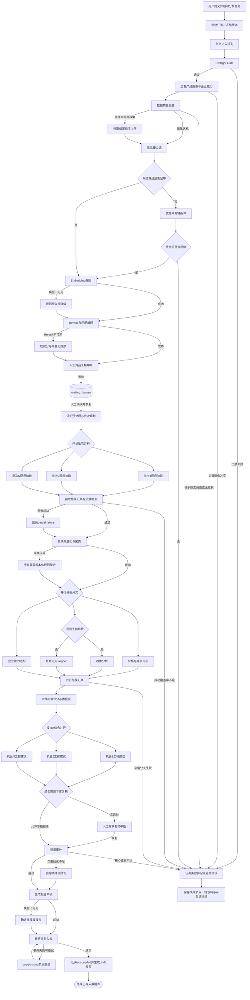

# FurniScope Agent 工作流设计 V1.0

## 1. 文档定位

| 项目 | 内容 |
|---|---|
| 产品 | FurniScope——家具出海产品机会雷达 |
| 适用范围 | 黑客松技术附件、Agent 编排设计、后端实现依据 |
| 实现范式 | LangGraph 状态图 + 异步任务队列 + PostgreSQL Checkpoint |
| 核心链路 | 产品与数据门禁 → 竞品匹配 → 评论洞察 → 市场统计 → 企业适配 → 机会评分 → 工程建议 → 证据审计 → 报告入库 |
| 模型入口 | FurniScope Model Router，向下依赖阿里云百炼 Model Router/模型服务 |
| 设计原则 | 确定性计算优先、模型输出受 Schema 约束、结论必须可追溯、高风险动作必须人工确认 |

本工作流不把一切包装为一个“全能 Agent”。任务编排、数据质量、统计、评分和持久化由确定性节点完成；Agent 只处理需要语义理解、相似性判断和受约束推理的部分。

---

## 2. 架构目标与边界

### 2.1 业务目标

1. 将已确认的家具产品画像与指定市场数据集绑定，形成可复现分析任务。
2. 从授权竞品和评论中找到真正可比的商品、需求痛点、购买动机与使用场景。
3. 将市场需求与企业材料、工艺、成本、MOQ、交期和认证能力联合判断。
4. 输出机会分、独立置信度、工程建议、风险、验证方法和原始证据。
5. 任一失败节点可恢复、可重试，已成功节点不得重复写入或重复计费。

### 2.2 明确边界

- 工作流只使用已授权导入的数据，不负责绕过平台限制实时爬取。
- 不把评论数、排名等代理指标伪装为真实销量。
- 不从单个时间快照推断趋势。
- 不根据图片确认海绵密度、内部框架、承重等隐藏属性。
- 不在缺少 BOM 或供应商报价时生成精确成本增量。
- 不自动触发打样、备货、发布报告或发布 Listing。

---

## 3. Agent 角色划分

### 3.1 Agent 总览

| Agent | 业务目标 | 主要输入 | 主要输出 | 是否调用大模型 |
|---|---|---|---|:---:|
| Workflow Supervisor | 编排状态、路由节点、控制重试与人工中断 | 任务状态、节点结果、异常 | 下一节点、任务状态、恢复点 | 否 |
| Product Context Agent | 组装任务所需的已确认产品与企业能力上下文 | 产品画像、属性、企业能力 | 冻结的产品与能力快照 | 条件调用 |
| Data Quality Agent | 判断数据是否可分析及结论边界 | 数据集、商品、评论、授权与质量报告 | 有效样本、限制、质量等级 | 否 |
| Competitor Discovery Agent | 识别直接、标杆和替代竞品 | 产品画像、竞品标准属性、价格带 | 候选竞品、分项分数、匹配原因 | 是 |
| Review Insight Agent | 从评论中抽取观点、需求、情感、场景和证据 | 有效评论、需求本体 | 观点级结构化结果 | 是 |
| Need Clustering Agent | 聚合跨评论、跨商品的需求模式 | 评论观点与向量 | 需求聚类、成员关系、代表证据 | 条件调用 |
| Market Analytics Agent | 计算价格、竞争、卖点和趋势指标 | 竞品、评论、聚类、时间范围 | 确定性市场指标 | 否 |
| Opportunity Scoring Agent | 结合市场和企业能力计算机会分及置信度 | 市场指标、聚类、企业能力 | 市场机会、六维分、推荐等级 | 否为主 |
| Product Strategy Agent | 将用户问题转为可复核工程建议 | 机会、聚类、产品参数、知识检索结果 | 根因假设、动作、风险、验证方法 | 是 |
| Evidence Auditor Agent | 校验结论与证据是否一致、完整、可发布 | 机会、建议、指标、原始证据 | 证据链、审计结果、阻断项 | 条件调用 |
| Report Composer Agent | 将已验证结构化事实编排为报告快照 | 全部结果、证据、风险与版本 | 分析报告草稿 | 是 |
| Persistence Agent | 以事务和幂等方式写入业务表 | 节点结构化输出 | 数据库记录、Checkpoint | 否 |

### 3.2 Workflow Supervisor

**业务目标：**维护唯一任务真相，避免 Agent 自由对话导致状态漂移。

**职责：**

- 根据 `analysis_tasks.status/current_stage` 和 LangGraph State 决定下一节点；
- 创建和更新 `task_stage_runs`；
- 处理串行、并行、条件分支、人工中断和恢复；
- 控制节点级超时、重试、熔断、取消和部分成功；
- 汇总进度并保证任务状态单调演进。

**可用工具：**任务查询工具、任务状态写入工具、Checkpoint 工具、队列工具、分布式锁工具、告警工具。

### 3.3 Product Context Agent

**业务目标：**生成任务执行期间不可漂移的产品与企业能力上下文。

**职责：**

- 读取指定 `product_profile_version`；
- 验证画像已确认、关键属性无冲突；
- 读取企业制造能力、成本、MOQ、交期和认证；
- 将“未知”与“不具备”严格区分；
- 仅对可见图片字段使用多模态补充建议，不覆盖人工确认值。

**可用工具：**产品查询工具、企业能力查询工具、对象存储读取工具、多模态推理工具、Schema 校验工具。

### 3.4 Data Quality Agent

**业务目标：**确保后续分析建立在明确的数据范围和有效样本上。

**职责：**

- 校验数据集状态、来源、授权依据和版本；
- 统计商品、评论、语言、时间、重复、异常、孤立评论；
- 生成有效样本 ID 和数据限制；
- 判断是否支持趋势分析和高置信度结论。

**可用工具：**数据集查询工具、SQL 聚合工具、规则校验工具、语言检测工具、数据质量报告工具。

### 3.5 Competitor Discovery Agent

**业务目标：**降低错误竞品对价格、评论与机会判断的污染。

**职责：**

1. 按品类、市场、价格和关键家具属性硬过滤；
2. 使用 Embedding 召回相似商品；
3. 使用 Rerank 对功能、风格、价格、材质和场景重排序；
4. 分类为直接、标杆、替代或排除；
5. 生成基于已有属性的匹配原因，等待人工确认。

**可用工具：**商品查询工具、规则过滤工具、向量检索工具、Rerank 工具、大模型结构化推理工具、竞品结果写入工具。

### 3.6 Review Insight Agent

**业务目标：**将零散评论转换为可验证的观点级需求数据。

**职责：**

- 语言检测、去重、垃圾文本和短文本标记；
- 将单条评论拆成多个情感可不同的观点；
- 抽取需求本体、人群、场景、严重度、购买动机和产品属性；
- 生成严格对应原文的 `evidence_start/evidence_end/evidence_quote`；
- 保存原文与翻译，翻译不覆盖原文。

**可用工具：**评论批量查询工具、文本清洗工具、翻译工具、轻量大模型抽取工具、JSON Schema 校验工具、批量写入工具。

### 3.7 Need Clustering Agent

**业务目标：**识别跨商品、跨评论重复出现的需求模式。

**职责：**

- 对规范化观点向量化；
- 通过聚类算法生成候选簇；
- 由大模型为簇生成短名称并映射家具需求本体；
- 计算评论数、商品覆盖数、提及率、严重度和置信度；
- 选择代表证据，但不得虚构聚类解释。

**可用工具：**Embedding 工具、向量聚类工具、本体查询工具、聚类命名推理工具、统计工具、聚类写入工具。

### 3.8 Market Analytics Agent

**业务目标：**用确定性统计回答市场规模代理、价格空间与竞争结构问题。

**职责：**

- 计算价格带、评分、评论数、品牌集中度、卖点渗透率；
- 计算需求与竞品解决覆盖矩阵；
- 有至少两个有效时间点时才计算趋势；
- 标记销量、排名、评论数等代理指标的真实口径。

**可用工具：**SQL 聚合工具、指标计算工具、时间序列判断工具、币种标准化工具、统计结果写入工具。

### 3.9 Opportunity Scoring Agent

**业务目标：**将市场吸引力、企业适配和数据可信度分开量化。

**职责：**

- 计算需求热度、需求增长、未满足程度、竞争空间、利润空间和企业适配度；
- 缺少某分项时标记 `N/A` 并按版本化规则归一化权重，不填 0；
- 总分表示相对机会，置信度表示证据充分程度；
- 输出优先验证、补充数据、能力缺口或机会有限。

**可用工具：**指标查询工具、能力匹配工具、规则评分工具、权重配置工具、置信度计算工具、机会写入工具。

### 3.10 Product Strategy Agent

**业务目标：**将需求缺口转换为工厂可讨论、可验证而非确定执行的产品动作。

**职责：**

- 区分用户表达、产品问题假设和工程动作；
- 检索材料、结构、包装与测试知识；
- 生成多个可能根因而非强行单一归因；
- 输出动作、影响维度、能力缺口、风险、补充信息和验证方法；
- 默认复核状态为 `pending`。

**可用工具：**产品属性查询工具、企业能力查询工具、家具知识库检索工具、向量检索工具、推理模型工具、建议写入工具。

### 3.11 Evidence Auditor Agent

**业务目标：**阻止没有证据或证据不支持的结论进入最终报告。

**职责：**

- 为机会、建议、评分和报告结论建立 `evidence_links`；
- 进行证据 Span、来源实体、数据版本和比例分母校验；
- 区分事实、推断、建议和待验证；
- 识别反证、限制和低相关证据；
- 输出可发布、降级发布或阻断报告生成。

**可用工具：**证据反向查询工具、规则校验工具、Rerank 工具、NLI/结构化推理工具、证据链写入工具。

### 3.12 Report Composer Agent

**业务目标：**基于已验证结构化事实生成可复现报告，而非自由发挥的长文本。

**职责：**

- 只读取通过审计的结构化结果；
- 生成执行摘要、机会说明、建议、风险和待验证清单；
- 固定产品、数据集、Prompt、模型、评分和本体版本；
- 生成 `draft` 报告，不自动发布。

**可用工具：**报告数据查询工具、报告模板工具、大模型生成工具、Schema 校验工具、报告写入工具。

---

## 4. 工具体系

### 4.1 工具分类

| 工具类别 | 代表工具 | 使用 Agent | 核心约束 |
|---|---|---|---|
| 数据查询工具 | `get_task_context`、`get_product_profile`、`get_dataset_scope`、`query_reviews` | 全部 | 自动附加 `tenant_id`；只读事务 |
| 数据写入工具 | `upsert_stage_run`、`bulk_insert_aspects`、`save_opportunities` | Supervisor、Persistence | 幂等键；事务；禁止覆盖已发布结果 |
| 采集/导入工具 | `load_authorized_dataset`、`parse_uploaded_file` | Data Quality | 只处理授权文件；不提供绕过平台规则的爬虫 |
| 向量工具 | `embed_texts`、`vector_search_listings`、`cluster_aspects` | Competitor、Clustering | 输入哈希缓存；批量上限；版本固定 |
| 大模型工具 | `structured_generate`、`rerank`、`translate` | 语义 Agent | 统一经 Model Router；JSON Schema；Token 与成本记录 |
| 规则与统计工具 | `hard_filter`、`compute_market_metrics`、`score_opportunity` | Data Quality、Analytics、Scoring | 确定性、版本化、可重复执行 |
| 知识检索工具 | `retrieve_furniture_knowledge` | Product Strategy | 仅返回有来源的材料、结构和验证知识 |
| 证据工具 | `validate_evidence_span`、`link_evidence`、`rerank_evidence` | Review、Evidence Auditor | 原文不可改写；支持反证和限制 |
| 报告工具 | `render_report_snapshot`、`persist_report` | Report Composer | 只接收审计通过结果；报告版本只追加 |
| 运维工具 | `acquire_task_lock`、`emit_metric`、`send_alert` | Supervisor | 防并发执行；记录请求 ID 和阶段耗时 |

### 4.2 Model Router 约束

- Agent 不指定外部供应商密钥，只传 `task_type`、质量档位、延迟和成本上限。
- 每次调用先创建 `ai_model_runs`，完成后回写实际 `model_id`、Token、延迟、成本、状态和 `schema_valid`。
- 允许对 429、超时和部分 5xx 有界重试；内容安全拒绝、认证失败和业务 Schema 错误不得无限重试。
- 结构化输出在进入业务表前必须通过 JSON Schema、字段范围和证据 Span 三层校验。
- 同一输入哈希、Prompt 版本、模型路由版本可复用缓存；缓存命中仍记录逻辑调用但不得重复计费。

---

## 5. LangGraph 全局状态设计

### 5.1 `FurniScopeGraphState`

| 字段 | 类型 | 说明 | 持久化位置 |
|---|---|---|---|
| `task_id` | bigint | 内部任务主键 | `analysis_tasks.id` |
| `task_uuid` | string | 对外任务标识 | `analysis_tasks.task_uuid` |
| `tenant_id` | bigint | 数据隔离边界 | `analysis_tasks.tenant_id` |
| `status` | enum | 任务总体状态 | `analysis_tasks.status` |
| `current_stage` | enum | 当前或最近节点 | `analysis_tasks.current_stage` |
| `progress_percent` | decimal | 0—100 的展示进度 | `analysis_tasks.progress_percent` |
| `product_id` | bigint | 产品 ID | `analysis_tasks.product_id` |
| `product_profile_version` | int | 冻结画像版本 | `analysis_tasks.product_profile_version` |
| `dataset_id` | bigint | 冻结数据集版本 | `analysis_tasks.dataset_id` |
| `target_market` | object | 国家、平台、币种 | 任务字段及 `analysis_config` |
| `version_bundle` | object | 本体、评分、Prompt、路由版本 | 任务版本字段 |
| `analysis_config` | object | 阈值、Top-K、权重、预算 | `analysis_tasks.analysis_config` |
| `product_context_ref` | object | 产品与能力快照引用 | Checkpoint/阶段 `output_ref` |
| `valid_listing_ids` | array | 质量检查后的候选商品 | Checkpoint/阶段 `output_ref` |
| `valid_review_ids` | array | 有效评论 | Checkpoint/阶段 `output_ref` |
| `competitor_set_version` | int | 人工确认后的竞品集版本 | Checkpoint/审计日志 |
| `quality_flags` | array | 数据限制与警告 | Checkpoint/报告风险 |
| `trend_eligible` | boolean | 是否允许趋势分析 | Checkpoint |
| `stage_results` | map | 各节点结果引用，不放大文本 | Checkpoint |
| `human_review` | object | 人工中断类型、状态和反馈 | 业务表与 Checkpoint |
| `retry_context` | object | 节点、尝试次数、最近错误 | `task_stage_runs` |
| `partial_failures` | array | 非阻断批次或分支失败 | Checkpoint/报告限制 |
| `fatal_error` | object | 阻断错误 | `analysis_tasks.failure_*` |
| `cancel_requested` | boolean | 用户取消标记 | Checkpoint/任务状态 |

大数组、文件内容、评论原文和向量不直接存入 LangGraph State，只保存数据库查询条件、对象存储键或结果 ID，避免 Checkpoint 过大。

### 5.2 Checkpoint 策略

- 每个节点开始前保存一次轻量 Checkpoint，成功持久化业务结果后再保存完成 Checkpoint。
- 使用官方 `langgraph-checkpoint-postgres` 作为长期 Checkpointer；Redis 仅保存运行锁、短期进度和队列状态。
- 恢复时以业务表和 `task_stage_runs` 为事实来源，Checkpoint 为路由辅助，不能覆盖已提交业务数据。
- 人工中断使用 LangGraph `interrupt()`；恢复时以 `task_uuid + checkpoint_id` 加人工输入调用 `Command(resume=...)`。

---

## 6. 任务状态枚举

### 6.1 `analysis_tasks.status`

| 枚举值 | 中文名称 | 进入条件 | 可转出状态 | 是否终态 |
|---|---|---|---|:---:|
| `draft` | 草稿 | API 创建任务但未启动 | `queued/cancelled` | 否 |
| `queued` | 已入队 | 启动事务成功，等待 Worker | `running/cancelled/failed` | 否 |
| `running` | 分析中 | 任一自动节点执行中 | `waiting_human/partial_succeeded/succeeded/failed/cancelled` | 否 |
| `waiting_human` | 待人工处理 | 竞品集合或专家建议需要确认 | `queued/cancelled/failed` | 否 |
| `partial_succeeded` | 部分完成 | 非关键分支失败但核心报告可生成 | `succeeded/failed/cancelled` | 否 |
| `succeeded` | 分析完成 | 报告草稿与全部必需结果成功入库 | - | 是 |
| `failed` | 分析失败 | 阻断节点耗尽重试且无安全降级 | `queued`（管理员恢复） | 条件终态 |
| `cancelled` | 已取消 | 用户取消且当前事务安全结束 | - | 是 |

`waiting_human` 不等于失败，也不占用模型 Worker。人工提交后不直接改为 `running`，而是先变为 `queued`，由 Worker 重新取得锁后进入 `running`。

### 6.2 `analysis_tasks.current_stage`

| 枚举值 | 节点含义 | 建议进度区间 |
|---|---|---:|
| `draft` | 任务草稿 | 0 |
| `preflight_check` | 参数、权限和版本门禁 | 1—5 |
| `context_loading` | 产品与企业能力上下文 | 5—10 |
| `data_quality` | 数据质量和样本范围 | 10—18 |
| `competitor_filtering` | 竞品硬过滤 | 18—24 |
| `competitor_embedding` | 向量召回 | 24—30 |
| `competitor_reranking` | 竞品重排与解释 | 30—36 |
| `competitor_review` | 等待人工竞品确认 | 36 |
| `review_preprocessing` | 评论清洗与批次切分 | 36—42 |
| `review_extracting` | 观点并行抽取 | 42—58 |
| `need_clustering` | 观点向量化与聚类 | 58—66 |
| `market_analytics` | 市场、价格和竞争统计 | 66—73 |
| `opportunity_scoring` | 六维评分与置信度 | 73—80 |
| `strategy_generating` | 工程建议生成 | 80—87 |
| `expert_review` | 等待专家复核 | 87 |
| `evidence_auditing` | 证据链与发布门禁 | 87—93 |
| `report_generating` | 报告草稿生成 | 93—98 |
| `persisting` | 最终事务、索引与审计 | 98—100 |
| `completed` | 全部必需结果入库 | 100 |

### 6.3 `task_stage_runs.status`

| 枚举值 | 说明 |
|---|---|
| `queued` | 已创建节点运行记录，等待执行 |
| `running` | 已获得阶段锁并开始执行 |
| `waiting_human` | 节点已中断，等待人工输入 |
| `retry_scheduled` | 可重试失败，已安排下一次尝试 |
| `succeeded` | 节点业务结果与 `output_ref` 已提交 |
| `partial_succeeded` | 批次或非关键输出部分失败 |
| `failed` | 节点失败且本次不再自动重试 |
| `skipped` | 条件不满足，无需执行，如无时序数据的趋势分支 |
| `cancelled` | 任务取消导致节点停止 |

### 6.4 `ai_model_runs.status`

`queued/running/succeeded/schema_failed/rate_limited/timeout/content_blocked/failed/cached`。

---

## 7. 端到端节点设计

### N00 创建任务与冻结版本

| 项目 | 设计 |
|---|---|
| 节点功能 | 接收用户请求，在一个事务内创建任务并冻结产品画像、数据集、市场、评分、本体和 Prompt 版本 |
| 输入来源 | REST API 请求；`products`；`market_datasets`；系统版本配置 |
| 输出去向 | 新增 `analysis_tasks`，状态 `draft`；审计日志 |
| 判断条件 | 用户有创建权限；产品和数据集属于同租户；幂等键未冲突 |
| 重试策略 | API 幂等重放返回原任务；数据库死锁最多重试 2 次 |
| 异常兜底 | 任一冻结字段失败则事务回滚，不创建半任务 |

用户调用启动接口后，状态原子更新为 `queued`，再投递队列。只有数据库提交成功后才能发消息；推荐使用 Outbox 或事务后投递补偿。

### N01 Preflight Gate

| 项目 | 设计 |
|---|---|
| 节点功能 | 验证租户、权限、任务状态、画像确认、数据集 ready、市场范围、预算和取消标记 |
| 输入来源 | `analysis_tasks`、`products`、`market_datasets`、租户与用户表 |
| 输出去向 | `task_stage_runs(preflight_check)`；State 中的门禁结果 |
| 判断条件 | 全部通过进入 N02；可修正业务条件失败则任务 `failed` 并返回明确错误 |
| 重试策略 | 纯查询错误最多 2 次，200 ms/500 ms 退避 |
| 异常兜底 | 不调用模型；禁止在画像未确认或数据集未就绪时继续 |

### N02 Load Product and Capability Context

| 项目 | 设计 |
|---|---|
| 节点功能 | 读取指定画像版本和企业能力，构建脱敏任务上下文快照 |
| 输入来源 | `products`、`product_attributes`、`enterprise_profiles`、`manufacturing_capabilities` |
| 输出去向 | `task_stage_runs.output_ref`；State `product_context_ref`；最终报告产品快照来源 |
| 判断条件 | 关键属性冲突为阻断；未知能力保留 `unknown`，不当作 `false` |
| 重试策略 | 数据库瞬时错误 2 次；对象文件不可用 1 次 |
| 异常兜底 | 非关键属性缺失写入 `quality_flags`；关键字段缺失终止任务 |

### N03 Data Quality Gate

| 项目 | 设计 |
|---|---|
| 节点功能 | 校验授权、字段完整、商品评论关联、重复、语言、异常价格、时间和有效样本 |
| 输入来源 | `market_datasets`、`competitor_listings`、`competitor_reviews` |
| 输出去向 | State 有效 ID、`quality_flags`、`trend_eligible`；任务样本数；阶段输出引用 |
| 判断条件 | 无商品或无有效评论为阻断；样本低于高置信阈值但高于探索阈值则条件继续 |
| 重试策略 | SQL/规则节点 2 次；不因业务质量差自动重试 |
| 异常兜底 | 探索性继续时设置置信度上限并将限制强制传入报告；授权缺失直接失败 |

### N04 Competitor Hard Filter

| 项目 | 设计 |
|---|---|
| 节点功能 | 按国家、平台、品类、价格带、结构、座位数等硬条件缩小候选集 |
| 输入来源 | N02 产品上下文、N03 有效商品、`analysis_config` |
| 输出去向 | State 候选 listing IDs；阶段输出引用 |
| 判断条件 | 候选数达到 `min_candidate_count` 进入 N05；不足时进入放宽分支 |
| 重试策略 | 确定性节点仅对数据库错误重试 2 次 |
| 异常兜底 | 按配置依次放宽非关键价格/风格条件；不得放宽品类和市场硬边界；仍不足则失败或探索性结束 |

### N05 Competitor Embedding Recall

| 项目 | 设计 |
|---|---|
| 节点功能 | 将产品和候选商品标准属性向量化并召回 Top-K |
| 输入来源 | N02 产品上下文、N04 候选商品标准属性 |
| 输出去向 | 向量缓存/向量库；State Top-K ID 与相似度；`ai_model_runs` |
| 判断条件 | 缓存命中直接复用；有效向量覆盖率达到阈值进入 N06 |
| 重试策略 | 429/超时最多 2 次，指数退避；失败批次拆半重试 |
| 异常兜底 | Embedding 全部不可用时退化为规则加权匹配，并在报告标记限制 |

### N06 Competitor Rerank and Explain

| 项目 | 设计 |
|---|---|
| 节点功能 | 对 Top-K 重排，计算六项分数，分类并生成可解释匹配原因 |
| 输入来源 | N05 Top-K、产品画像、竞品属性、价格口径 |
| 输出去向 | `competitor_matches`；`ai_model_runs`；阶段 `output_ref` |
| 判断条件 | 输出 Schema 合法、listing ID 属于候选集、原因只引用已有属性 |
| 重试策略 | Schema 修复 1 次；上游瞬时错误最多 2 次；写入使用任务+商品唯一键幂等 UPSERT |
| 异常兜底 | Rerank 不可用时使用 Embedding 分与规则分排序；所有结果标记低置信度 |

### N07 Human Competitor Review

| 项目 | 设计 |
|---|---|
| 节点功能 | 暂停图，等待用户纳入、排除或改类竞品 |
| 输入来源 | `competitor_matches`、前端人工反馈 |
| 输出去向 | 更新 `competitor_matches.review_*`、`audit_logs`、State `competitor_set_version` |
| 判断条件 | 已确认直接竞品和有效评论数量达到阈值才可恢复 |
| 重试策略 | 无模型重试；并发编辑使用版本号，冲突由用户刷新处理 |
| 异常兜底 | 超过配置等待期限不自动确认；任务保持 `waiting_human`，可被用户取消 |

进入本节点时：`analysis_tasks.status=waiting_human`、`current_stage=competitor_review`；`task_stage_runs.status=waiting_human`。人工确认后阶段置 `succeeded`，任务先置 `queued` 再恢复。

### N08 Review Preprocess and Batch Plan

| 项目 | 设计 |
|---|---|
| 节点功能 | 仅选择已纳入竞品评论，做去重、语言、垃圾、短文本处理并切分批次 |
| 输入来源 | 人工确认竞品集、`competitor_reviews` |
| 输出去向 | State 批次引用；更新有效评论样本数；阶段输出引用 |
| 判断条件 | 直接、标杆、替代竞品分组统计，不默认混合 |
| 重试策略 | 数据库错误 2 次；单评论清洗异常隔离记录 |
| 异常兜底 | 异常评论剔除并进入限制统计；有效评论低于探索阈值则终止 |

### N09 Review Aspect Extraction Map

| 项目 | 设计 |
|---|---|
| 节点功能 | 对评论批次并行执行观点抽取与证据 Span 定位 |
| 输入来源 | N08 批次、家具需求本体、Prompt 版本 |
| 输出去向 | `review_aspects`、`ai_model_runs`；批次结果引用 |
| 判断条件 | 每条观点通过 Schema、枚举、Span 和原文一致性校验 |
| 重试策略 | 单批最多 2 次；Schema 失败先修复提示重试 1 次；批次过大时二分 |
| 异常兜底 | 失败评论隔离；成功覆盖率达到阈值则 `partial_succeeded` 继续，否则阻断 |

LangGraph 使用 Send API 或 map-reduce fan-out：每个批次是独立子节点，写入唯一键 `(task_id, review_id, aspect_index)`，最终由 N10 汇聚。

### N10 Extraction Reduce and Quality Check

| 项目 | 设计 |
|---|---|
| 节点功能 | 汇总批次、计算覆盖率、检查重复观点和证据有效率 |
| 输入来源 | N09 批次状态、`review_aspects` |
| 输出去向 | Stage 汇总；State `partial_failures` 和抽取质量指标 |
| 判断条件 | 证据正确率代理、抽取覆盖率达到阈值进入 N11 |
| 重试策略 | 只重跑失败批次，不重跑成功批次 |
| 异常兜底 | 部分失败上限内继续并限制置信度；超过上限任务失败 |

### N11 Need Embedding and Clustering

| 项目 | 设计 |
|---|---|
| 节点功能 | 观点向量化、聚类、命名、本体映射和代表证据选择 |
| 输入来源 | `review_aspects`、家具需求本体 |
| 输出去向 | `insight_clusters`、`cluster_members`、`ai_model_runs` |
| 判断条件 | 聚类最小样本、跨商品覆盖和一致性达到阈值；小簇标记长尾 |
| 重试策略 | Embedding 按 N05；聚类算法异常 1 次更换初始化种子；命名 Schema 修复 1 次 |
| 异常兜底 | 聚类不可用时按需求本体码做规则聚合；禁止让模型凭空总结簇 |

### N12 Parallel Analytics Fork

该节点将状态分成三个并行分支，分支均为只读输入、独立输出，避免写冲突。

#### N12-A Price and Competition Analytics

| 项目 | 设计 |
|---|---|
| 节点功能 | 统计价格带、品牌集中、评分、评论规模、卖点和竞争强度 |
| 输入来源 | 已确认竞品、商品快照、聚类 |
| 输出去向 | Stage `output_ref` 中的市场指标；报告摘要来源 |
| 判断条件 | 币种和价格口径一致；代理指标显式标注 |
| 重试策略 | SQL 错误 2 次 |
| 异常兜底 | 单项数据缺失置 `N/A`，不置 0 |

#### N12-B Trend Analytics

| 项目 | 设计 |
|---|---|
| 节点功能 | 计算价格、评论、新品和需求提及变化 |
| 输入来源 | 多时间点商品快照与评论时间 |
| 输出去向 | 趋势指标或 `skipped` 原因 |
| 判断条件 | `trend_eligible=true` 且至少两个可比较时间点 |
| 重试策略 | SQL 错误 2 次 |
| 异常兜底 | 条件不满足直接 `skipped`，报告明确“仅支持截面分析” |

#### N12-C Enterprise Fit Analytics

| 项目 | 设计 |
|---|---|
| 节点功能 | 匹配企业材料、工艺、MOQ、交期、认证和成本约束 |
| 输入来源 | N02 企业能力、聚类隐含产品要求 |
| 输出去向 | 能力适配分、缺口和未知项 |
| 判断条件 | 过期能力和未知字段不得作为高置信支持 |
| 重试策略 | 查询与规则错误 2 次 |
| 异常兜底 | 能力数据不足时降低适配置信度并要求人工补充 |

### N13 Analytics Join

| 项目 | 设计 |
|---|---|
| 节点功能 | 等待 N12-A/B/C，合并结果并检查口径一致性 |
| 输入来源 | 三个并行分支输出 |
| 输出去向 | State 市场指标包、质量限制 |
| 判断条件 | A 和 C 为必需；B 可跳过；非关键分支失败允许部分成功 |
| 重试策略 | 不重复执行成功分支，只调度缺失分支 |
| 异常兜底 | A 或 C 耗尽重试则失败；B 失败则降级为截面报告 |

### N14 Opportunity Scoring

| 项目 | 设计 |
|---|---|
| 节点功能 | 生成机会候选，计算六维分、总分、置信度和推荐等级 |
| 输入来源 | N11 聚类、N13 市场与企业适配指标、版本化权重 |
| 输出去向 | `market_opportunities`；阶段输出引用 |
| 判断条件 | 缺失分项按规则归一化；置信度与总分分离；分值必须 0—100 |
| 重试策略 | 确定性节点仅数据库错误重试 2 次；唯一键幂等 UPSERT |
| 异常兜底 | 关键分项不足则输出“补充数据”而非强推荐；评分配置非法直接失败 |

### N15 Product Strategy Generation Map

| 项目 | 设计 |
|---|---|
| 节点功能 | 按 Top 机会并行检索知识并生成工程建议 |
| 输入来源 | 机会、核心聚类、产品画像、企业能力、家具知识库 |
| 输出去向 | `product_recommendations`、`ai_model_runs` |
| 判断条件 | 每项必须包含问题、证据、根因假设、动作、影响、风险和验证方法 |
| 重试策略 | 每个机会最多 2 次；Schema 修复 1 次；知识检索为空不重复调用生成模型 |
| 异常兜底 | 无可靠知识时只输出问题与待验证项，不生成确定参数；单机会失败不阻断其他机会 |

### N16 Human Expert Review Gate

| 项目 | 设计 |
|---|---|
| 节点功能 | 根据配置决定是否在报告前暂停等待专家复核 |
| 输入来源 | 产品建议、风险级别、企业策略 |
| 输出去向 | 更新 `product_recommendations.expert_review_*`、审计日志、State |
| 判断条件 | 高风险/高成本建议必须中断；Demo 可配置至少复核 Top 1 建议 |
| 重试策略 | 无自动重试；并发冲突由用户处理 |
| 异常兜底 | 未复核建议可进入草稿，但必须标记待验证；正式发布由报告接口另行阻断 |

进入中断时：`analysis_tasks.status=waiting_human`、`current_stage=expert_review`。如果赛事演示要求全自动跑完，可把此节点配置为“生成草稿继续”，但不得伪造人工确认状态。

### N17 Evidence Audit

| 项目 | 设计 |
|---|---|
| 节点功能 | 校验机会、建议、评分和报告结论的证据、反证、范围和版本 |
| 输入来源 | 所有结果表、评论原文、竞品、指标、产品属性 |
| 输出去向 | `evidence_links`；审计摘要；阻断项和限制 |
| 判断条件 | 主结论至少一个主证据；证据实体存在；Span 匹配；统计有分母；推断正确标记 |
| 重试策略 | 规则检查无业务重试；Rerank/NLI 瞬时失败最多 2 次 |
| 异常兜底 | 次要结论证据不足则删除或降级；核心结论证据不足阻断报告生成 |

### N18 Report Compose

| 项目 | 设计 |
|---|---|
| 节点功能 | 使用模板和已审计事实生成报告结构与执行摘要 |
| 输入来源 | 产品快照、数据范围、市场指标、机会、建议、证据和限制 |
| 输出去向 | 待校验报告对象；`ai_model_runs` |
| 判断条件 | 输出符合报告 Schema；不得出现输入中不存在的数字、材料参数和引用 |
| 重试策略 | Schema/事实错误允许修复提示重试 1 次；上游瞬时错误 2 次 |
| 异常兜底 | 生成模型不可用时使用确定性模板拼装报告，语言质量降低但事实完整 |

### N19 Final Persist and Complete

| 项目 | 设计 |
|---|---|
| 节点功能 | 在事务中写入报告草稿、最终证据链接、任务完成状态和审计记录 |
| 输入来源 | N18 报告对象、全部阶段结果与版本 |
| 输出去向 | `analysis_reports`、`evidence_links`、`analysis_tasks`、`audit_logs` |
| 判断条件 | 报告关联正确任务与租户；版本唯一；必需结果存在 |
| 重试策略 | 数据库死锁 2 次；通过任务+报告版本唯一键保证幂等 |
| 异常兜底 | 事务失败全部回滚，任务保持 `running/persisting` 后重试；不得标记完成但无报告 |

成功提交后：`analysis_tasks.status=succeeded`、`current_stage=completed`、`progress_percent=100`、写入 `completed_at`。报告状态为 `draft`，发布仍需用户调用独立发布接口。

---

## 8. 串行、并行与条件逻辑

### 8.1 串行主链

`N01 → N02 → N03 → N04 → N05 → N06 → N07 → N08 → N09/N10 → N11 → N12/N13 → N14 → N15 → N16 → N17 → N18 → N19`

严格串行的原因：后节点的统计口径必须建立在前节点冻结结果上，尤其是竞品人工确认之前不得大规模分析评论。

### 8.2 并行逻辑

- N09 按评论批次 Map 并行，N10 Reduce 汇总。
- N12-A 市场竞争、N12-B 趋势、N12-C 企业适配并行，N13 Join。
- N15 按 Top 机会并行生成建议，每个机会独立失败和重试。
- 同一任务的并行节点必须使用不同 `stage_code` 或分支 ID；共享表写入需有唯一键。

### 8.3 条件分支

| 条件 | 分支 |
|---|---|
| 数据样本低于探索阈值 | 任务失败，不调用模型 |
| 样本介于探索与高置信阈值 | 继续，但设置置信度上限和强制风险说明 |
| 竞品候选不足 | 放宽非关键条件；仍不足则失败或探索性结束 |
| Embedding/Rerank 不可用 | 使用规则分降级并记录限制 |
| 人工竞品确认未完成 | `interrupt`，停止后续评论分析 |
| 无两个可比较时间点 | 趋势分支 `skipped` |
| 某机会建议生成失败 | 其他机会继续，记录部分失败 |
| 高风险建议 | 进入专家人工中断 |
| 证据审计失败 | 删除/降级次要结论；核心结论失败则阻断报告 |
| 报告模型不可用 | 使用确定性模板生成草稿 |

---

## 9. Mermaid 工作流图



---

## 10. 数据库写入时点

| 时点 | `analysis_tasks` | `task_stage_runs` | 业务结果表 |
|---|---|---|---|
| 创建任务 | `draft/draft/0` | 无 | 无 |
| 启动入队 | `queued/preflight_check/1` | 创建 preflight `queued` | 无 |
| 节点开始 | `running/<stage>/<progress>` | 当前 attempt `running` | 无或暂存 |
| 节点成功 | 更新阶段和进度 | `succeeded`，写 `output_ref` 和耗时 | 同一事务或先业务结果后阶段成功 |
| 节点重试 | 仍为 `running` | 原 attempt `retry_scheduled`，新 attempt `queued` | 已成功结果不删除 |
| 竞品中断 | `waiting_human/competitor_review/36` | `waiting_human` | `competitor_matches` 已存在 |
| 评论抽取 | `running/review_extracting/42-58` | 每批记录或父阶段汇总 | 批量写 `review_aspects` |
| 并行分析 | `running/market_analytics/66-73` | 三个分支独立状态 | 输出引用或统计结果 |
| 专家中断 | `waiting_human/expert_review/87` | `waiting_human` | 建议状态 `pending` |
| 部分成功 | `partial_succeeded/<stage>/<progress>` | 失败分支 `partial_succeeded/failed` | 保留成功结果 |
| 最终成功 | `succeeded/completed/100` | persisting `succeeded` | 报告 `draft`、证据链、审计日志 |
| 最终失败 | `failed/<failed_stage>/<progress>` | 当前阶段 `failed` | 保留已提交中间结果 |
| 取消 | `cancelled/<current>/<progress>` | 活跃阶段 `cancelled` | 不删除已有结果 |

### 10.1 写入一致性规则

1. `task_stage_runs.idempotency_key` 推荐格式：`{task_uuid}:{stage_code}:{input_version_hash}`。
2. 每次重试创建新的 `attempt_no`，不覆盖旧失败记录。
3. 业务结果写入成功与 Stage 标记成功必须保持一致；若不能同事务，优先保证业务结果幂等，再补偿阶段状态。
4. `review_aspects`、`competitor_matches`、`market_opportunities` 和报告使用业务唯一键 UPSERT 或插入冲突检查。
5. 已发布报告不可由任务恢复流程覆盖；恢复只能创建新报告版本。

---

## 11. 重试、超时与异常兜底

### 11.1 错误分类

| 类型 | 示例 | 自动重试 | 处理 |
|---|---|:---:|---|
| 瞬时基础设施错误 | 数据库连接、网络抖动、对象存储超时 | 是 | 指数退避，最多 2 次 |
| 模型限流/超时 | 429、响应超时、部分 5xx | 是 | Model Router 有界重试和降级 |
| 模型结构错误 | JSON 缺字段、枚举非法 | 条件 | 修复 Prompt 1 次，仍失败则批次失败 |
| 内容安全拒绝 | 输入或输出被拦截 | 否 | 隔离内容，记录原因，判断是否可部分继续 |
| 业务前置错误 | 画像未确认、数据集未 ready | 否 | 任务失败并要求用户修复后新建/恢复 |
| 数据质量不足 | 无有效评论、无候选竞品 | 否 | 失败或探索性分支，不盲目重试 |
| 人工等待 | 竞品/建议未确认 | 否 | `waiting_human`，释放 Worker |
| 取消请求 | 用户主动取消 | 否 | 当前原子写完成后安全停止 |

### 11.2 超时建议

| 节点 | 单次超时 | 最大尝试 | 兜底 |
|---|---:|---:|---|
| 数据库规则节点 | 30 秒 | 3 | 失败 |
| Embedding 批次 | 20 秒 | 3 | 拆批或规则降级 |
| Rerank | 30 秒 | 3 | 向量+规则排序 |
| 评论抽取批次 | 60 秒 | 3 | 拆批，允许部分成功 |
| 工程建议 | 90 秒 | 3 | 只输出待验证问题 |
| 报告生成 | 90 秒 | 3 | 确定性模板 |
| 人工中断 | 不设模型超时 | - | 到期提醒，不自动代替用户确认 |

### 11.3 恢复策略

- Worker 重启后读取最后一个 Checkpoint，并查询所有 `running/retry_scheduled` 的 Stage。
- 若业务结果已存在且校验通过，Stage 直接补记 `succeeded`，不重复调用模型。
- 若 Stage 显示成功但业务结果缺失，视为一致性异常，从该节点重跑并告警。
- 同一任务只允许一个 Supervisor 获得执行锁；并行批次使用子锁。
- 达到最大重试次数后，阻断节点置任务 `failed`；非阻断分支记录 `partial_failures`。

---

## 12. LangGraph 实现映射

### 12.1 图结构映射

| LangGraph 概念 | FurniScope 实现 |
|---|---|
| `StateGraph` | `FurniScopeGraphState` |
| Node | N01—N19 的确定性函数或 Agent 调用包装器 |
| Conditional Edge | 数据质量、候选数、趋势资格、人工复核、证据门禁和降级路由 |
| `Send` | 评论批次抽取、Top 机会建议生成 |
| Reducer | 批次状态、观点 ID、失败列表和分支指标合并 |
| `interrupt()` | 竞品集合确认、专家建议复核 |
| `Command(resume=...)` | 带人工版本和反馈恢复任务 |
| Checkpointer | PostgreSQL 官方长期 Checkpoint；Redis 运行锁和短状态 |
| Subgraph | 评论分析子图、市场分析子图、报告生成子图 |

### 12.2 推荐子图

```text
MainGraph
├── PreflightSubgraph
├── CompetitorSubgraph
│   └── HumanCompetitorReview
├── ReviewInsightSubgraph
│   ├── BatchMap
│   └── ReduceAndCluster
├── MarketOpportunitySubgraph
│   ├── PriceCompetitionBranch
│   ├── TrendBranch
│   └── EnterpriseFitBranch
├── ProductStrategySubgraph
│   └── HumanExpertReview
└── ReportSubgraph
    ├── EvidenceAudit
    ├── Compose
    └── FinalPersist
```

### 12.3 节点函数约束

- 节点只返回 State 增量，不返回整个大对象。
- 节点不得直接决定未经定义的下一状态；路由集中在条件边函数。
- 外部调用前创建模型运行记录，调用后更新同一记录。
- 节点输出必须先验证再写业务表，写入后才返回成功状态。
- Prompt、本体、评分和输出 Schema 必须显式版本化。
- 工具调用参数必须包含 `tenant_id` 和 `task_id`，服务端再次校验资源归属。

---

## 13. 可观测性与验收标准

### 13.1 关键观测指标

- 任务总耗时、各 Stage P50/P95 耗时和成功率；
- 评论每批处理量、失败率、Schema 修复率和证据 Span 有效率；
- Model Router 实际模型、Token、成本、缓存命中、重试与降级次数；
- 人工中断等待时长、竞品排除率、建议驳回率；
- 机会结论主证据覆盖率和报告生成阻断率；
- 同一幂等键重复调用次数与避免的重复计费量。

### 13.2 工作流验收

| 编号 | 验收标准 |
|---|---|
| WF-01 | 画像未确认时，任务在调用任何模型前终止 |
| WF-02 | 数据不足时不生成伪完整报告，限制进入最终报告 |
| WF-03 | 竞品人工确认前不执行大规模评论抽取 |
| WF-04 | 1,000 条评论支持批量并行，完整链路目标不超过 5 分钟 |
| WF-05 | 单批失败只重跑该批，不重复写入成功观点或重复计费 |
| WF-06 | 无时序数据时趋势节点为 `skipped`，报告不展示增长结论 |
| WF-07 | 高机会分、低置信度必须同时展示，不包装为强推荐 |
| WF-08 | 每个核心机会和建议可追溯到评论、竞品、指标或产品属性 |
| WF-09 | 报告模型失败时可用确定性模板生成事实完整的草稿 |
| WF-10 | 任务成功状态与报告草稿必须在最终事务后一致可查 |
| WF-11 | Worker 中断后可从最后成功 Stage 恢复 |
| WF-12 | 人工反馈不覆盖原始 AI 输出，修改前后可审计 |

---

## 14. 版本记录

| 版本 | 日期 | 说明 |
|---|---|---|
| V1.0 | 2026-08-09 | 基于 FurniScope PRD、产品数据字典和 PostgreSQL V2 数据库设计，定义适配 LangGraph 的端到端 Agent 工作流 |
