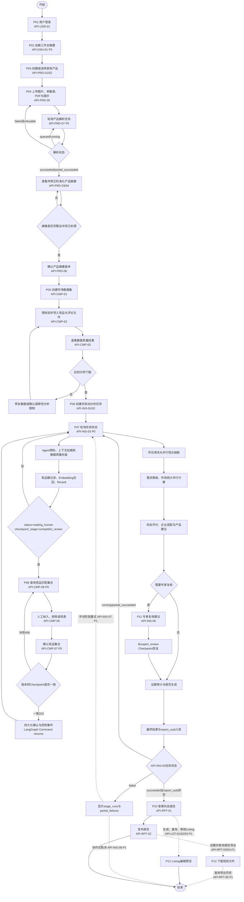
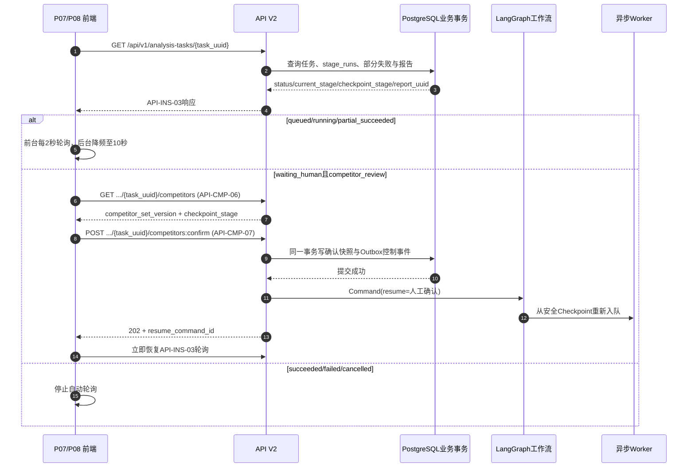
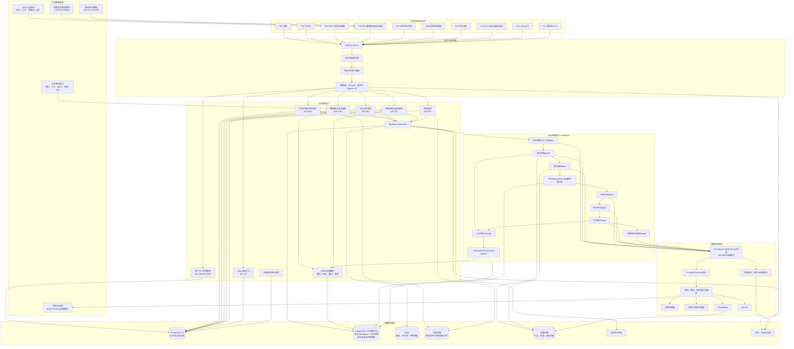
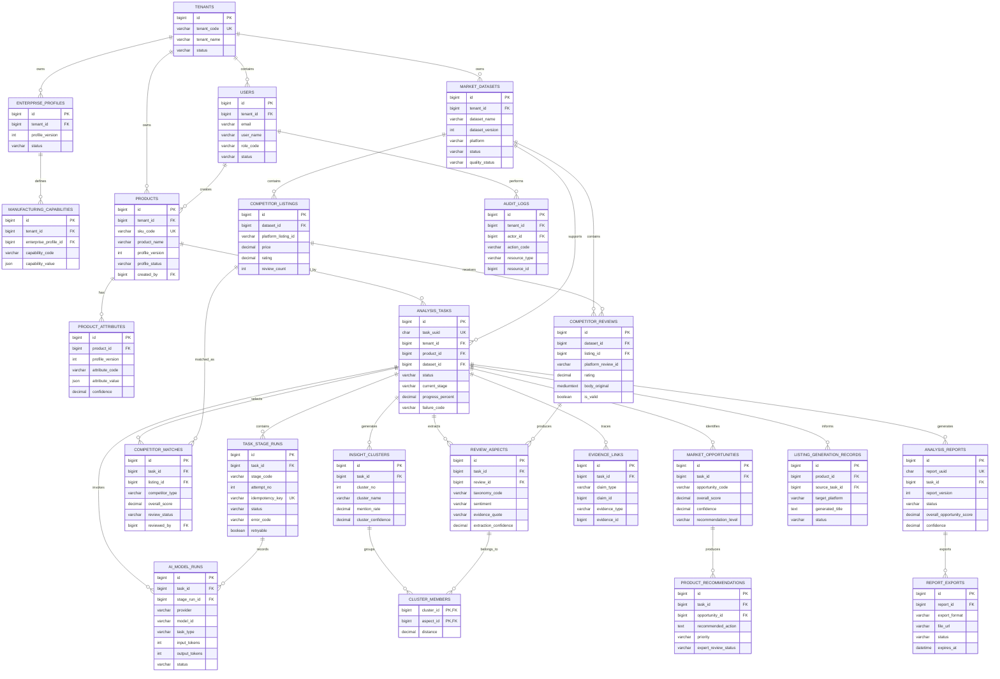
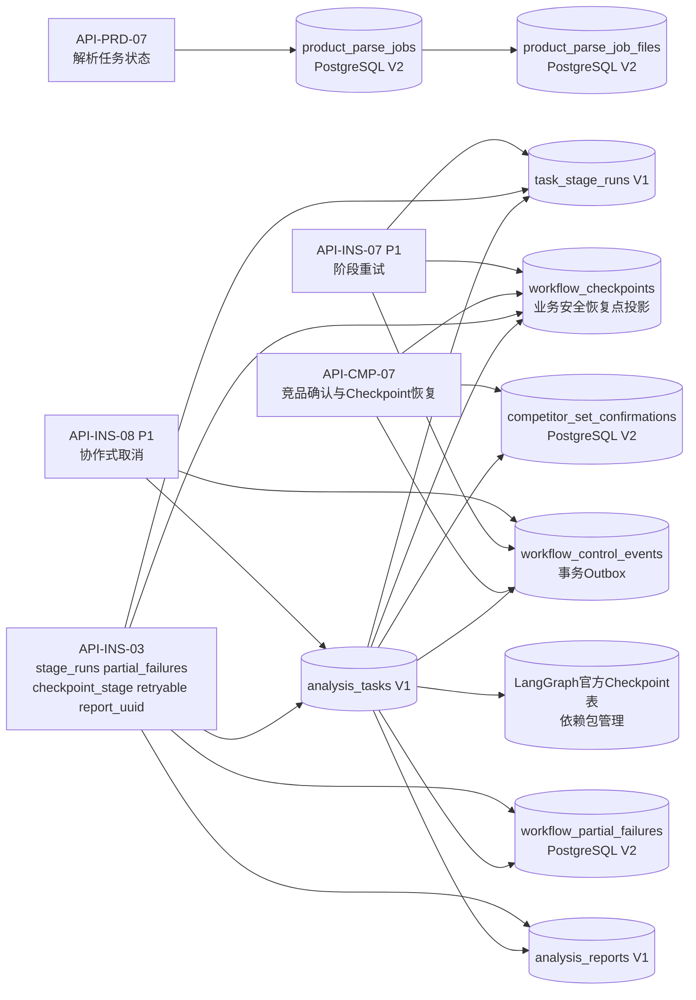

# FurniScope 项目 Mermaid 图 V2.0

## 0. 文档基线与图例

本文件按“有 V2 使用 V2、无 V2 保持 V1”的规则更新：

| 设计域 | 使用版本 |
|---|---|
| 产品需求规格说明书 | PRD V1 |
| 产品数据字典 | 数据字典 V2 |
| 数据库表结构 | PostgreSQL 数据库设计 V2 |
| Agent 工作流 | Agent 工作流 V1 |
| RESTful API | API V2 |
| 页面交互原型 | 交互原型 V2 |

图中 `P0` 表示本次 Demo 主链路；`P1` 表示【P1迭代功能，本次Demo暂不实现】。业务数据、工作流投影与 LangGraph 官方 Checkpoint 均采用 PostgreSQL；Redis 仅承担缓存、运行锁和短期队列状态。

---

## 1. 业务流程图

### 1.1 任务进度轮询与恢复时序图

---

## 2. 系统整体架构图

---

## 3. 数据库 ER 关系图（PostgreSQL V2 业务基线）

---

## 4. PostgreSQL V2 工作流持久化关系图

> LangGraph 官方 Checkpointer 内部表由 `checkpointer.setup()` 管理；下图中的业务投影表由 `furniscope_postgresql_v2.sql` 创建，用于 API 查询、恢复门禁和审计。

## 5. 版本记录

| 版本 | 变更说明 |
|---|---|
| V1.0 | 初版业务流程、系统架构与 MySQL ER 图 |
| V2.0 | 对齐 PostgreSQL 数据库 V2、数据字典 V2、API V2 与交互原型 V2；增加 API 编号、任务轮询、竞品确认 Checkpoint 恢复、P0/P1 边界、官方 Checkpointer 与业务投影分工 |
