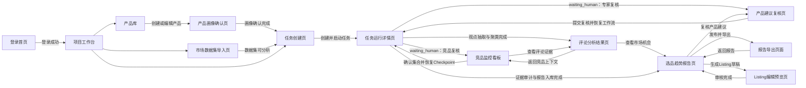

# FurniScope 页面交互原型说明 V1.2

## 1. 文档概述

| 项目 | 内容 |
|---|---|
| 产品名称 | FurniScope——家具出海产品机会雷达 |
| 适用范围 | 黑客松材料、Demo 原型、前端开发与接口联调 |
| 核心用户 | 企业管理者、产品/研发负责人、跨境运营、外贸业务员、系统管理员 |
| 设计端 | Web 桌面端优先，推荐画布宽度 1440 px，最小适配宽度 1280 px |
| 核心任务 | 产品理解 → 数据导入 → 竞品复核 → 评论洞察 → 市场机会 → 产品建议 → 报告输出 |
| 交互原则 | 证据优先、人机协同、异步过程可见、分数与置信度分离、敏感字段按角色隐藏 |

### 1.1 统一应用框架

- 左侧导航：工作台、产品库、市场数据、分析任务、竞品看板、评论洞察、机会报告、Listing、报告导出。
- 顶部栏：当前企业、全局搜索、任务通知、帮助、用户菜单。
- 内容区：页面标题、上下文面包屑、主操作按钮、筛选区、主体内容。
- 右侧抽屉：证据详情、字段来源、任务日志和快捷帮助，避免频繁离开当前分析页。
- 状态语义：蓝色表示进行中，绿色表示完成/已确认，黄色表示待人工处理，红色表示失败/阻断，灰色表示未知/不可用。
- 数据口径：所有比率展示分母；所有价格展示币种、市场、数据时间；机会分和置信度不得合并表达。

### 1.2 全局交互规则

| 场景 | 统一规则 |
|---|---|
| 成功反馈 | 轻量操作使用右上角 Toast；创建任务、发布报告等关键操作同时更新页面状态 |
| 失败反馈 | 字段错误就近提示；业务错误显示顶部错误条；系统异常提供请求 ID 和“重试”按钮 |
| 异步任务 | 2—5 秒轮询；展示当前阶段、进度、样本量和可重试错误，不使用无信息的无限转圈 |
| Agent 状态 | 统一展示 `queued/running/waiting_human/partial_succeeded/succeeded/failed/cancelled` 的中文语义，不把人工等待显示为失败 |
| 节点状态 | 支持 `retry_scheduled/skipped/partial_succeeded`；跳过必须说明条件不满足，部分成功必须说明缺失范围 |
| 人工中断 | 竞品确认和专家建议复核使用醒目的待办行动栏；提交后先显示“已提交，等待恢复”，再进入运行中 |
| 工作流恢复 | 页面刷新或 Worker 重启后按数据库任务状态恢复；不重置已完成阶段，不重复显示模型计费 |
| 防重复提交 | 创建、启动、生成、发布和导出按钮点击后立即禁用，并携带 `Idempotency-Key` |
| 并发编辑 | 编辑页携带 `If-Match`；发生 `RESOURCE_VERSION_CONFLICT` 时提示刷新并对比变更 |
| 离开保护 | 表单存在未保存修改时弹出离开确认 |
| 权限限制 | 无权限按钮隐藏或禁用，并说明所需角色；敏感价格字段默认脱敏 |
| 空数据 | 说明为空原因、下一步动作和可用入口，禁止只显示“暂无数据” |
| 可追溯性 | 洞察、机会、建议和报告结论均可打开证据抽屉下钻到商品或评论原文 |

---

## 2. 前端页面清单

| 编号 | 页面名称 | 路由建议 | 主要角色 | 页面级别 | 核心 API |
|---|---|---|---|---|---|
| P01 | 登录首页 | `/login` | 全部用户 | 公共页 | API-USR-01 |
| P02 | 项目工作台 | `/workspace` | 全部登录用户 | 一级页 | API-USR-03、API-DSH-01 |
| P03 | 产品库 | `/products` | 管理者、产品、运营 | 一级页 | API-PRD-01、API-PRD-02、API-PRD-03 |
| P04 | 产品画像确认页 | `/products/:id/profile` | 产品、运营 | 二级页 | API-PRD-03～06 |
| P05 | 市场数据集导入页 | `/datasets/new` | 运营、管理员 | 二级页 | API-CMP-01～03 |
| P06 | 任务创建页 | `/analysis-tasks/new` | 产品、运营 | 一级流程页 | API-PRD-02、API-INS-01、API-INS-02 |
| P07 | 任务运行详情页 | `/analysis-tasks/:uuid/run` | 产品、运营、管理员 | 二级页 | API-INS-03 |
| P08 | 竞品监控看板 | `/analysis-tasks/:uuid/competitors` | 产品、运营 | 一级结果页 | API-CMP-04、API-CMP-05 |
| P09 | 评论分析结果页 | `/analysis-tasks/:uuid/reviews` | 产品、运营 | 一级结果页 | API-REV-01～04 |
| P10 | 选品趋势报告页 | `/reports/:reportUuid` | 管理者、产品、运营、外贸 | 一级决策页 | API-INS-04～06、API-RPT-01～02 |
| P11 | 产品建议复核页 | `/analysis-tasks/:uuid/recommendations/:id` | 管理者、产品、研发 | 二级页 | API-INS-05、API-INS-06 |
| P12 | Listing 编辑预览页 | `/listing-generations/:id` | 运营、产品 | 一级扩展页 | API-LST-01～03 |
| P13 | 报告导出页面 | `/reports/:reportUuid/exports` | 管理者、产品、运营 | 二级页 | API-RPT-01、API-RPT-03、API-RPT-04 |

> “竞品监控”在 Demo 中指固定版本数据集的分析与对比，不表达未经授权的实时爬取或持续监听能力。

---

## 3. 页面跳转关系

---

## 4. 页面详细交互规格

## P01 登录首页

### 页面定义

- **页面用途：**完成租户、用户身份认证并进入企业工作台。
- **目标用户：**所有已开通 Demo 账号的用户。
- **整体布局：**左右分栏。左侧为品牌定位、核心价值和简洁的市场洞察示意；右侧为居中的登录卡片。窄屏隐藏左侧视觉区。
- **核心组件：**品牌 Logo、产品标语、登录表单、密码可见切换、登录按钮、Demo 账号提示、服务状态提示。

### 表单字段

| 字段 | 控件 | 必填 | 校验与说明 |
|---|---|:---:|---|
| 企业编码 | Input | 是 | 1—64 字符，自动去除首尾空格 |
| 邮箱 | Email Input | 是 | 转小写后校验邮箱格式 |
| 密码 | Password Input | 是 | 8—64 字符，不进入前端日志 |
| 记住企业 | Checkbox | 否 | 仅保存企业编码，不保存密码 |

### 操作与 API

| 操作 | API | 成功反馈 | 失败反馈 |
|---|---|---|---|
| 点击“登录” | `POST /api/v1/auth/login`，API-USR-01 | 保存 Token；Toast“登录成功”；跳转 P02 | `AUTH_INVALID_CREDENTIALS` 在表单顶部提示；停用状态给出管理员联系说明 |
| 登录后加载权限 | `GET /api/v1/users/me`，API-USR-03 | 初始化租户、角色和导航权限 | Token 异常清除会话并停留登录页 |

### 弹窗与页面状态

- **弹窗：**无需常规弹窗；连续失败触发安全提示，不暴露具体账号存在性。
- **加载状态：**登录按钮显示 Spinner 和“正在登录”，全部字段暂时禁用。
- **空数据状态：**不适用。
- **错误异常状态：**网络失败显示“连接服务失败”和重试；429 显示剩余等待时间；输入错误在字段下方展示。

### UI 生成 Prompt

> 设计一个 1440px 企业级 SaaS 登录页，左侧为浅灰蓝家具市场洞察视觉区和简短价值文案，右侧白色登录卡片，包含企业编码、邮箱、密码、记住企业和主按钮；深海军蓝主色、青绿色强调色、圆角 10px、轻阴影、现代克制的数据产品风格。

---

## P02 项目工作台

### 页面定义

- **页面用途：**提供最近产品、分析任务、待处理事项和已发布报告的统一入口。
- **目标用户：**全部登录用户；内容按角色裁剪。
- **整体布局：**左侧固定导航；顶部欢迎区和“新建分析任务”；首屏为四张指标卡，中部为最近任务表格和任务漏斗，右侧为待人工处理列表，底部为最近报告。
- **核心组件：**指标卡、最近任务表、状态 Badge、任务进度条、待办卡片、快速入口、报告卡片。

### 筛选字段

| 字段 | 控件 | 必填 | 说明 |
|---|---|:---:|---|
| 时间范围 | Select | 否 | 最近 7/30/90 天 |
| 任务状态 | MultiSelect | 否 | 草稿、运行中、待复核、已完成、失败 |
| 产品关键词 | Search Input | 否 | SKU 或产品名 |

### 操作与 API

| 操作 | API | 成功反馈 | 失败反馈 |
|---|---|---|---|
| 初始化用户信息 | `GET /api/v1/users/me`，API-USR-03 | 按权限渲染导航和敏感字段 | 401 自动尝试 API-USR-02；仍失败跳 P01 |
| 加载工作台聚合数据 | `GET /api/v1/dashboard/summary`，API-DSH-01（V2） | 展示指标、最近任务、待办和报告 | 单卡片降级为错误占位，不阻断其他区域 |
| 新建分析任务 | 无请求 | 跳转 P06 | 无 |
| 点击产品 | `GET /api/v1/products/{product_id}`，API-PRD-03 | 跳转 P04 并展示详情 | 产品不存在则刷新列表并 Toast |
| 点击任务 | `GET /api/v1/analysis-tasks/{task_uuid}`，API-INS-03 | 按状态跳 P07/P08/P09/P10 | 无权限显示 403 提示 |

### 弹窗与页面状态

- **弹窗：**“快速开始”弹窗展示创建产品、导入数据、创建任务三条路径。
- **加载状态：**指标卡使用 Skeleton；任务表保留表头与五行骨架。
- **空数据状态：**首次使用显示三步引导：创建产品、导入数据、启动分析。
- **错误异常状态：**聚合接口失败允许分别重试；权限为空显示联系管理员提示。

### UI 生成 Prompt

> 创建企业级 AI 市场洞察工作台，左侧深色导航，顶部欢迎区和醒目的“新建分析任务”按钮；主体包含四张数据指标卡、最近分析任务表、横向进度条、右侧待人工复核清单和底部报告卡片，浅灰背景、白色卡片、蓝绿数据强调、紧凑专业。

---

## P03 产品库

### 页面定义

- **页面用途：**管理家具 SKU 主档，识别画像完整度和分析准备状态。
- **目标用户：**企业管理者、产品/研发、市场运营；外贸默认只读。
- **整体布局：**页头含搜索和“新建产品”；上方筛选条；主体支持卡片/表格视图切换；右侧详情抽屉展示画像摘要。
- **核心组件：**搜索框、品类与状态筛选、产品表格、产品缩略图、完整度环形进度、状态 Badge、分页器、详情抽屉。

### 表单与筛选字段

| 字段 | 控件 | 必填 | 说明 |
|---|---|:---:|---|
| 关键词 | Search Input | 否 | SKU 或产品名称 |
| 品类 | Select | 否 | V1 默认沙发 |
| 生命周期 | Select | 否 | `draft/active/inactive` |
| 画像状态 | Select | 否 | `unreviewed/confirmed/conflict` |
| SKU | Input | 新建时是 | 租户内唯一 |
| 产品名称 | Input | 新建时是 | 最长 200 字符 |
| 出厂价与币种 | Money Input | 否 | 仅授权角色可见 |
| MOQ、交期 | Number Input | 否 | 正整数 |

### 操作与 API

| 操作 | API | 成功反馈 | 失败反馈 |
|---|---|---|---|
| 查询/筛选产品 | `GET /api/v1/products`，API-PRD-02 | 刷新列表并同步 URL Query | 参数错误回退默认筛选并提示 |
| 新建产品 | `POST /api/v1/products`，API-PRD-01 | 关闭弹窗；Toast；跳转 P04 | SKU 重复定位 SKU 字段；权限错误禁用提交 |
| 打开产品详情 | `GET /api/v1/products/{product_id}`，API-PRD-03 | 打开右侧抽屉 | 不存在时从列表移除并提示 |
| 编辑画像 | 同上 | 跳转 P04 | 无 |
| 为产品创建分析 | 无请求 | 带 `product_id` 跳转 P06 | 画像未确认时先跳 P04 并说明原因 |

### 弹窗与页面状态

- **弹窗：**新建产品弹窗；停用产品确认弹窗。当前 API 未提供停用端点，Demo 可隐藏停用动作。
- **加载状态：**表格骨架；筛选切换保留旧数据并显示顶部细进度条。
- **空数据状态：**无产品时展示“上传第一款沙发产品”；筛选为空时提供清除筛选。
- **错误异常状态：**敏感字段无权限显示 `••••`；接口异常保留筛选条件并提供重试。

### UI 生成 Prompt

> 设计跨境家具 SaaS 产品库页面，左侧导航，顶部搜索、品类和画像状态筛选以及蓝色“新建产品”按钮；主体为产品表格，包含沙发缩略图、SKU、名称、品类、画像完整度圆环、确认状态、分析状态和操作菜单，右侧可展开产品详情抽屉，风格清爽专业。

---

## P04 产品画像确认页

### 页面定义

- **页面用途：**上传产品资料，查看 AI 提取属性，处理冲突和缺失项并人工确认画像。
- **目标用户：**产品/研发负责人、市场运营。
- **整体布局：**顶部步骤条“资料上传—AI 解析—字段校验—确认画像”；左侧产品图片与文件列表；中部按舒适、尺寸、材质、结构、包装分组的属性表单；右侧为来源、置信度和冲突摘要。
- **核心组件：**拖拽上传、图片画廊、解析任务状态、属性分组 Accordion、来源标签、置信度条、冲突 Diff、缺失项清单、确认按钮。

### 表单字段

| 字段组 | 代表字段 | 交互规则 |
|---|---|---|
| 基础信息 | 名称、品类、风格、颜色 | 文本或枚举；显示来源 |
| 尺寸空间 | 长宽高、座深、座高 | 数值与单位分离，统一换算为 cm |
| 材质触感 | 面料、填充、框架材料 | 隐藏属性不能只凭图片确认 |
| 结构功能 | 模块结构、可拆洗、储物、承重 | 支持是/否/未知三态 |
| 商务约束 | 出厂价、币种、MOQ、交期 | 敏感字段按权限控制 |
| 包装履约 | 包装尺寸、重量、安装方式 | 缺失时显示对物流判断的影响 |

### 操作与 API

| 操作 | API | 成功反馈 | 失败反馈 |
|---|---|---|---|
| 加载当前画像 | `GET /api/v1/products/{product_id}`，API-PRD-03 | 填充属性、来源、冲突和缺失项 | 版本不存在返回当前版本并提示 |
| 上传并解析资料 | `POST /api/v1/products/{product_id}/assets:parse`，API-PRD-05 | 显示解析任务卡和阶段状态 | 文件类型/大小错误定位文件；模型失败允许重试 |
| 查询解析进度 | `GET /api/v1/product-parse-jobs/{parse_job_id}`，API-PRD-07（V2） | 完成后自动刷新画像 | 超时显示“后台继续处理”，允许离页 |
| 保存人工修正 | `PATCH /api/v1/products/{product_id}`，API-PRD-04 | Toast“已保存为新画像版本” | 并发冲突弹出刷新/复制当前修改选项 |
| 确认画像 | `POST /api/v1/products/{product_id}/profile:confirm`，API-PRD-06 | 状态变为已确认；显示“创建分析任务” | 冲突或不完整时滚动定位阻断字段 |

### 弹窗与页面状态

- **弹窗：**字段冲突处理弹窗并列展示两个值和来源；确认画像弹窗说明隐藏属性仍需人工负责；未保存离开弹窗。
- **加载状态：**文件逐个上传进度；解析阶段显示“文本抽取/视觉识别/Schema 映射/冲突检测”。
- **空数据状态：**未上传资料时显示拖拽区和模板下载入口。
- **错误异常状态：**模型无法判断时合法显示“未知”；禁止自动填充；解析部分成功时保留已解析字段并标记失败文件。

### UI 生成 Prompt

> 设计家具产品画像确认页面，顶部四步进度条；左侧产品图片和上传文件列表，中间为分组属性表单，右侧展示字段来源、AI置信度、冲突警告和缺失清单；使用白色卡片、浅蓝分组标题、黄色待确认标签、红色冲突标记，底部固定“保存修改”和“确认画像”操作栏。

---

## P05 市场数据集导入页

### 页面定义

- **页面用途：**创建有来源和授权记录的竞品数据集，完成文件导入、字段映射和质量检查。
- **目标用户：**跨境运营、系统管理员。
- **整体布局：**三步向导：“定义范围—上传映射—质量确认”；第一步为范围表单，第二步为双文件上传与字段映射表，第三步为质量仪表板和样本预览。
- **核心组件：**步骤条、授权说明输入、文件上传、字段映射下拉、数据预览表、质量指标卡、警告列表、可分析范围确认。

### 表单字段

| 字段 | 控件 | 必填 | 说明 |
|---|---|:---:|---|
| 数据集名称 | Input | 是 | 项目内可识别名称 |
| 来源类型 | Select | 是 | 授权导出、人工上传、Demo 数据 |
| 来源说明 | Textarea | 是 | 数据来源及取得方式 |
| 授权依据 | Textarea | 是 | 使用授权或合规依据 |
| 国家、平台、品类 | Select | 是 | 固定数据范围 |
| 币种 | Select | 是 | 数据价格币种 |
| 时间范围 | Date Range | 否 | 不足两个时点时不输出趋势 |
| 商品文件 | Upload | 是 | CSV/XLSX/JSON，≤50 MB |
| 评论文件 | Upload | 否 | CSV/XLSX/JSON，≤100 MB |
| 字段映射 | Mapping Grid | 是 | 商品 ID、标题、价格等必需字段必须映射 |

### 操作与 API

| 操作 | API | 成功反馈 | 失败反馈 |
|---|---|---|---|
| 创建数据集 | `POST /api/v1/market-datasets`，API-CMP-01 | 进入第二步并保存 `dataset_id` | 缺授权依据时定位字段并解释合规要求 |
| 试运行校验 | `POST /api/v1/market-datasets/{id}/imports?dry_run=true`，API-CMP-02 | 显示映射预览和错误统计，不落库 | 映射错误高亮对应行 |
| 确认导入 | 同 API-CMP-02，`dry_run=false` | 进入质量检查步骤 | 文件异常可替换单个文件重试 |
| 查询质量结果 | `GET /api/v1/market-datasets/{id}`，API-CMP-03 | 展示商品数、有效评论、重复率和警告 | 导入中继续轮询；失败展示原因和重新导入入口 |
| 查看商品样本 | `GET /api/v1/market-datasets/{id}/competitor-listings`，API-CMP-04 | 打开样本抽屉 | 无有效商品时提示修正映射 |
| 使用该数据集分析 | 无请求 | 带 `dataset_id` 跳 P06 | `quality_status=failed` 时禁用并解释 |

### 弹窗与页面状态

- **弹窗：**覆盖导入确认；低样本继续分析确认，明确报告只能标为探索性。
- **加载状态：**上传进度与服务端校验进度分开；质量检查展示阶段文本。
- **空数据状态：**提供字段模板下载和 Demo 数据入口。
- **错误异常状态：**孤立评论、异常价格、重复数据分组展示；允许下载错误明细。

### UI 生成 Prompt

> 创建三步式市场数据导入向导，步骤为范围定义、文件上传与字段映射、数据质量确认；包含竞品和评论双上传区、源字段到标准字段的映射表、商品数与评论数指标卡、重复率和无效率图表、黄色数据警告列表，蓝白企业级分析工具风格。

---

## P06 任务创建页

### 页面定义

- **页面用途：**用最少步骤锁定产品画像、数据集、目标市场和分析配置并启动任务。
- **目标用户：**产品经理、跨境运营。
- **整体布局：**左侧四步表单，右侧固定“任务配置摘要”和费用/样本风险提示；步骤为产品、数据集、市场范围、确认启动。
- **核心组件：**产品选择卡、画像状态、数据集选择器、质量摘要、国家与平台选择、价格带、样本上限、评分权重高级设置、提交摘要。

### 表单字段

| 字段 | 控件 | 必填 | 说明 |
|---|---|:---:|---|
| 任务名称 | Input | 是 | 默认“SKU + 国家 + 平台机会分析” |
| 产品 | Search Select | 是 | 只允许已确认画像版本 |
| 产品画像版本 | Readonly Select | 是 | 默认最新已确认版本 |
| 市场数据集 | Search Select | 是 | 只允许 ready 数据集 |
| 目标国家 | Select | 是 | 必须与数据集范围一致 |
| 目标平台 | Select | 是 | 必须与数据集范围一致 |
| 分析币种 | Select | 是 | 默认数据集币种 |
| 价格带 | Money Range | 否 | 最小值不得大于最大值 |
| 评论样本上限 | Number | 否 | Demo 默认 4,000 |
| 六维评分权重 | Slider Group | 否 | 高级设置；总和必须为 100% |
| 确认数据范围 | Checkbox | 是 | 明确平台、时间和样本限制 |

### 操作与 API

| 操作 | API | 成功反馈 | 失败反馈 |
|---|---|---|---|
| 搜索产品 | `GET /api/v1/products`，API-PRD-02 | 展示画像状态和完整度 | 无已确认产品时引导 P04 |
| 查看数据集质量 | `GET /api/v1/market-datasets/{id}`，API-CMP-03 | 右侧显示范围和警告 | 不可用时禁止下一步并引导 P05 |
| 保存任务草稿 | `POST /api/v1/analysis-tasks`，API-INS-01 | 保存 `task_uuid`，Toast“任务已创建” | 画像/数据集错误定位对应步骤 |
| 创建并启动 | 先 API-INS-01，再 `POST /api/v1/analysis-tasks/{uuid}:start`，API-INS-02 | 跳 P07，展示已进入队列 | 创建成功但启动失败时保留草稿并提供重试启动 |

### 弹窗与页面状态

- **弹窗：**低样本探索性分析确认；自定义权重恢复默认确认；预计模型成本超阈值确认。
- **加载状态：**提交时摘要区显示创建/入队两阶段状态。
- **空数据状态：**无产品或无数据集时显示对应创建入口，不展示空下拉框。
- **错误异常状态：**范围不匹配在产品、数据集和市场之间显示连线式冲突说明；幂等冲突加载原任务。

### UI 生成 Prompt

> 设计四步分析任务创建页面，左侧为产品、市场数据集、目标市场、确认启动的纵向步骤表单，右侧固定任务摘要卡，显示产品缩略图、数据质量、样本量、价格带和AI成本提示；白底、蓝色步骤线、绿色已完成标记、黄色风险提醒，底部主按钮“创建并启动分析”。

---

## P07 任务运行详情页

### 页面定义

- **页面用途：**展示 LangGraph 工作流从门禁到报告入库的真实执行状态、并行分支、样本变化、Checkpoint 恢复点和人工控制点。
- **目标用户：**产品、运营、系统管理员。
- **整体布局：**顶部任务名称、总体状态和进度；中部为可横向滚动的主工作流，评论抽取和市场分析以可展开的并行分支展示；下方左侧为阶段运行时间线，右侧为样本、数据限制、模型用量和恢复点；`waiting_human` 时出现固定行动栏。
- **核心组件：**总体进度、Agent 节点图、并行分支组、阶段状态 Badge、尝试次数、耗时、样本计数、限制卡、Checkpoint 标识、失败详情、人工待办按钮。

### 展示字段

| 字段 | 来源 | 说明 |
|---|---|---|
| 状态、当前阶段、进度 | `analysis_tasks` | `draft/queued/running/waiting_human/partial_succeeded/succeeded/failed/cancelled` |
| 阶段、尝试次数、耗时 | `task_stage_runs` | `queued/running/waiting_human/retry_scheduled/succeeded/partial_succeeded/failed/skipped/cancelled` |
| 商品与评论样本量 | `analysis_tasks` | 显示过滤前后变化 |
| 模型警告 | `ai_model_runs` | 不向普通用户展示敏感 Prompt |
| 当前恢复点 | LangGraph Checkpoint 与 `output_ref` | 显示最近成功节点，不暴露完整内部 State |
| 部分失败 | Graph State `partial_failures` | 展示失败批次数、影响比例和置信度影响 |

### Agent 阶段展示映射

前端将 20 个后端节点压缩成 9 个业务阶段；点击阶段可展开技术节点，主视图不堆叠内部实现细节。

| 页面阶段 | 后端节点/current_stage | 页面说明 |
|---|---|---|
| 任务门禁 | N01 `preflight_check` | 权限、产品版本、数据集和预算检查 |
| 上下文与数据质量 | N02—N03 `context_loading/data_quality` | 冻结产品能力快照并确认分析边界 |
| 竞品识别 | N04—N07 `competitor_filtering/competitor_embedding/competitor_reranking/competitor_review` | 规则过滤、向量召回、重排和人工确认 |
| 评论洞察 | N08—N10 `review_preprocessing/review_extracting` | 评论分批并行抽取与汇聚质检 |
| 需求聚类 | N11 `need_clustering` | 观点向量化、聚类和本体映射 |
| 市场分析 | N12—N13 `market_analytics` | 价格竞争、趋势资格和企业适配三路并行 |
| 机会与策略 | N14—N16 `opportunity_scoring/strategy_generating/expert_review` | 六维评分、建议生成和专家中断 |
| 证据与报告 | N17—N18 `evidence_auditing/report_generating` | 证据门禁及报告草稿生成 |
| 结果入库 | N19 `persisting/completed` | 报告、证据、审计和任务完成事务 |

### 操作与 API

| 操作 | API | 成功反馈 | 失败反馈 |
|---|---|---|---|
| 初始化与轮询 | `GET /api/v1/analysis-tasks/{task_uuid}`，API-INS-03 | 更新进度；完成阶段出现结果入口 | 404 返回工作台；状态损坏显示请求 ID |
| 前往竞品复核 | 无请求；由 `waiting_human + competitor_review` 路由 | 跳 P08，保留任务上下文 | 非对应中断点时禁用并解释当前阶段 |
| 前往专家复核 | 无请求；由 `waiting_human + expert_review` 路由 | 跳 P11 | 建议未生成时禁用 |
| 查看评论结果 | 无请求 | 跳 P09 | 评论阶段未完成时显示预计阶段 |
| 查看报告 | API-INS-03 V2 取得 `report_uuid`，再调用 `GET /api/v1/reports/{report_uuid}`，API-RPT-01 | 跳 P10 | `report_uuid=null` 时说明报告尚未完成并停留 P07 |
| 重试失败阶段 | `POST /api/v1/analysis-tasks/{uuid}/stages/{stage}:retry`，API-INS-07（V2，P1） | 先变为 `retry_scheduled`，入队后变为 `queued`；从最近 Checkpoint 恢复 | 不可重试时说明需修复数据或新建任务 |
| 取消任务 | `POST /api/v1/analysis-tasks/{uuid}:cancel`，API-INS-08（V2，P1） | 显示“正在安全停止”；最终变为 `cancelled` | 已完成或正在提交最终事务时返回状态冲突 |

### 弹窗与页面状态

- **弹窗：**失败详情包含错误码、影响范围、尝试历史、是否可重试和请求 ID；取消弹窗说明已写入结果不会删除。
- **加载状态：**首次骨架；轮询不遮罩页面；`running` 使用动态脉冲，`retry_scheduled` 显示下次尝试，`waiting_human` 停止动画并突出人工动作。
- **空数据状态：**任务刚入队显示队列位置或“等待资源”，不显示 0 数据图表。
- **错误异常状态：**`partial_succeeded` 保留成功结果并列出缺失批次/分支；`skipped` 显示“不满足趋势条件”等原因；模型超时显示自动重试次数；恢复后已完成节点保持成功状态且不重复计费。

### UI 生成 Prompt

> 创建 AI Agent 工作流运行页，顶部显示任务标题、总体进度和状态；中部横向九阶段流程，评论抽取与市场分析节点可展开并行分支，节点支持成功、运行、人工等待、重试、部分成功、跳过和失败；底部为时间线、样本指标、Checkpoint 与警告卡，深蓝和青绿色企业科技风，人工待办使用醒目琥珀色行动栏。

---

## P08 竞品监控看板

### 页面定义

- **页面用途：**对固定数据集内的竞品进行价格、评分、评论规模和可比性分析，并完成竞品人工复核。
- **目标用户：**跨境运营、产品经理。
- **整体布局：**顶部市场范围和数据时间；第一行指标卡；中部左侧价格×评分散点图，右侧品牌/卖点分布；底部为竞品表格和右侧匹配详情抽屉。
- **核心组件：**市场范围标签、指标卡、散点图、价格分布、卖点排行、竞品表、类型 Badge、六维相似度雷达、纳入/排除控件。

### 筛选字段

| 字段 | 控件 | 必填 | 说明 |
|---|---|:---:|---|
| 价格区间 | Range | 否 | 明确币种 |
| 最低评分 | Select | 否 | 0—5 |
| 最低评论数 | Number | 否 | 非负整数 |
| 竞品类型 | MultiSelect | 否 | 直接、标杆、替代、排除 |
| 人工复核状态 | Select | 否 | 待复核、已纳入、已排除 |
| 品牌/标题关键词 | Search | 否 | 最长 100 字符 |

### 操作与 API

| 操作 | API | 成功反馈 | 失败反馈 |
|---|---|---|---|
| 加载竞品基础数据 | `GET /api/v1/market-datasets/{id}/competitor-listings`，API-CMP-04 | 渲染图表和表格 | 参数错误恢复默认筛选 |
| 加载任务竞品匹配结果 | `GET /api/v1/analysis-tasks/{uuid}/competitors`，API-CMP-06（V2） | 展示类型、六维分数和匹配原因 | 暂不可用时只展示数据集商品并禁用复核 |
| 纳入、排除或改类 | `PATCH /api/v1/analysis-tasks/{uuid}/competitors/{listing_id}`，API-CMP-05 | 乐观更新行状态；Toast；后台重新统计样本 | 状态不可复核时回滚并提示 |
| 查看评论证据 | 无请求 | 带 `listing_id` 跳 P09 | 无有效评论时禁用并说明 |
| 确认竞品集合 | `POST /api/v1/analysis-tasks/{uuid}/competitors:confirm`，API-CMP-07（V2） | 提交 LangGraph `Command(resume=...)`；页面显示“已确认，任务重新入队”，返回 P07 | 至少保留配置数量的直接竞品和有效评论，否则保持 `waiting_human` |

### 弹窗与页面状态

- **弹窗：**排除竞品必须填写理由；确认集合显示直接/标杆/替代商品数和评论数。
- **加载状态：**图表 Skeleton；表格保留列结构；复核单行时只锁定该行；确认集合后显示 `queued`，不得提前显示评论分析中。
- **空数据状态：**硬过滤无候选时建议放宽价格带或检查品类映射。
- **错误异常状态：**数据集单时点时隐藏趋势标签；无真实销量时显示“评论数/排名代理指标”；Checkpoint 版本冲突时刷新最新竞品集并保留用户未提交备注。

### UI 生成 Prompt

> 设计跨境家具竞品监控看板，顶部显示美国、Amazon、USD和数据时间范围；四张指标卡，下方为价格评分散点图、品牌占比和卖点排行，底部高密度竞品表格；点击行打开右侧抽屉，展示沙发图片、六维相似度雷达、匹配原因及直接/标杆/替代/排除按钮，蓝灰底色配青绿强调。

---

## P09 评论分析结果页

### 页面定义

- **页面用途：**展示并行批次抽取后的观点级评论洞察、需求聚类、人群场景、抽取覆盖率及原文证据。
- **目标用户：**跨境运营、产品经理、研发负责人。
- **整体布局：**顶部数据口径条；左侧需求本体筛选；中部聚类卡片/气泡图；下方观点明细表；右侧证据抽屉展示原文、翻译和竞品上下文。
- **核心组件：**正负中性标签页、抽取覆盖率条、失败批次提示、需求本体树、聚类气泡图、提及率和跨商品覆盖、趋势小图、观点表格、证据高亮、人工校正表单。

### 筛选字段

| 字段 | 控件 | 必填 | 说明 |
|---|---|:---:|---|
| 需求本体 | Tree Select | 否 | 舒适、尺寸、材质、耐用、安装等 |
| 情感 | Tabs | 否 | 正向、负向、中性、混合 |
| 严重度 | Slider | 否 | 1—5 |
| 人群/场景 | MultiSelect | 否 | 小户型、家庭、宠物等 |
| 星级 | MultiSelect | 否 | 1—5 星 |
| 日期范围 | Date Range | 否 | 基于评论发布时间 |
| 人工状态 | Select | 否 | 未复核、接受、修正、驳回 |

### 操作与 API

| 操作 | API | 成功反馈 | 失败反馈 |
|---|---|---|---|
| 加载聚类 | `GET /api/v1/analysis-tasks/{uuid}/insight-clusters`，API-REV-02 | 展示聚类卡和明确分母 | 未完成时跳 P07 或展示处理中 |
| 加载观点 | `GET /api/v1/analysis-tasks/{uuid}/review-aspects`，API-REV-01 | 表格分页并同步筛选条件 | 过滤非法回退默认值 |
| 打开证据 | `GET /api/v1/analysis-tasks/{uuid}/insight-clusters/{cluster_id}/evidence`，API-REV-03 | 右侧抽屉高亮原文 Span | 证据不可用时标记该结论不可发布 |
| 校正观点 | `PATCH /api/v1/analysis-tasks/{uuid}/review-aspects/{aspect_id}`，API-REV-04 | 更新状态；Toast；提示聚类将在新版本重算 | 已发布结果不可修改时引导新建分析版本 |
| 查看机会 | 无请求 | 跳 P10，并带当前 `cluster_id` 锚点 | 报告未生成时跳 P07 |

### 弹窗与页面状态

- **弹窗：**观点校正弹窗；驳回必须填写原因；“比例口径说明”Popover。
- **加载状态：**N09 批次执行中显示“已完成批次/总批次”和有效观点数；N10 汇聚完成前可预览已写入观点，但聚类指标标记为未最终确认；证据抽屉逐页加载。
- **空数据状态：**筛选无结果提供清除筛选；任务无有效评论时说明质量过滤原因。
- **错误异常状态：**`partial_succeeded` 显示失败评论比例及置信度影响；只允许重跑失败批次；无时序数据不展示趋势箭头；翻译失败仍保留原文；证据 Span 偏移异常时展示全文并告警。

### UI 生成 Prompt

> 创建评论深度分析页，左侧为家具需求分类树，中间顶部有正向、负向、中性标签页和需求聚类气泡图，聚类卡显示提及率、评论数、覆盖商品数与置信度；下方是观点级评论表，右侧证据抽屉展示英文原文、中文翻译和黄色高亮片段，负向用柔和珊瑚红，正向用青绿色。

---

## P10 选品趋势报告页

### 页面定义

- **页面用途：**汇总市场、价格、需求、竞争、企业适配和产品建议，支持管理者做立项判断。
- **目标用户：**管理者、产品、运营；外贸只读已发布报告且默认隐藏成本。
- **整体布局：**顶部报告标题、状态、版本和发布/导出按钮；首屏为结论卡、机会分与置信度双指标、数据范围；主体采用章节导航：市场概览、需求趋势、竞争格局、机会矩阵、产品建议、风险与证据。
- **核心组件：**决策结论 Badge、六维雷达、置信度仪表、价格带图、需求趋势图、机会矩阵、建议卡、能力缺口、证据审计状态、事实/推断/建议/待验证标签、待验证清单。

### 筛选与展示字段

| 字段 | 控件 | 必填 | 说明 |
|---|---|:---:|---|
| 报告版本 | Select | 否 | 默认最新可见版本 |
| 机会状态 | Select | 否 | 生成、已复核、优先、驳回 |
| 推荐等级 | Select | 否 | 优先验证、补数据、能力缺口、机会有限 |
| 价格/需求时间范围 | Readonly | - | 固定来自数据集快照 |
| 机会分 | Score | - | 0—100，表示相对吸引力 |
| 置信度 | Confidence | - | 0—1，独立展示 |

### 操作与 API

| 操作 | API | 成功反馈 | 失败反馈 |
|---|---|---|---|
| 加载报告 | `GET /api/v1/reports/{report_uuid}`，API-RPT-01 | 渲染报告快照和数据范围 | 草稿无权限时返回工作台 |
| 加载机会明细 | `GET /api/v1/analysis-tasks/{uuid}/opportunities`，API-INS-04 | 展示六维分与排序 | 未完成时显示任务进度入口 |
| 加载建议 | `GET /api/v1/analysis-tasks/{uuid}/recommendations`，API-INS-05 | 展示建议和专家状态 | 无建议时解释原因而非留白 |
| 查看/复核建议 | 无请求 | 跳 P11 | 无权限时只读打开详情 |
| 发布报告 | `POST /api/v1/reports/{report_uuid}:publish`，API-RPT-02 | 状态变为已发布；Toast；解锁正式导出 | 证据或复核未完成时弹出阻断清单 |
| 导出报告 | 无请求 | 跳 P13 | 未发布时提示先完成发布 |
| 生成 Listing | `POST /api/v1/listing-generations`，API-LST-01 | 返回 `generation_id` 后跳 P12 | 画像未确认或模型拦截时解释原因 |

### 弹窗与页面状态

- **弹窗：**发布确认弹窗包含证据已复核、风险已披露两个勾选项；低置信度机会说明弹窗。
- **加载状态：**N17 证据审计时显示“正在核验证据”且发布按钮禁用；N18 报告生成时章节渐进加载；N19 最终事务完成前不得展示“分析完成”。
- **空数据状态：**趋势分支为 `skipped` 时隐藏趋势图并显示“当前数据仅支持截面分析”及判断依据。
- **错误异常状态：**六维某项无数据时显示 `N/A` 并说明权重归一化；`partial_succeeded` 报告顶部常驻范围限制；核心证据审计失败时不生成伪完整报告，返回 P07 查看阻断项。

### UI 生成 Prompt

> 设计高级企业选品趋势报告页，顶部报告标题、版本、发布和导出按钮；首屏有大号决策结论、机会分与置信度双指标、数据范围卡；主体包含六维雷达图、价格带分布、需求趋势折线、机会四象限矩阵、产品建议卡和风险清单，深海军蓝标题、青绿高分、琥珀色待验证，适合评审演示。

---

## P11 产品建议复核页

### 页面定义

- **页面用途：**将消费者表达、产品问题假设、工程动作、影响和验证方法放在同一证据链中供专家复核。
- **目标用户：**产品经理、研发负责人、企业管理者。
- **整体布局：**顶部建议摘要和状态；主体为三段链路“用户问题—根因假设—备选动作”；右栏固定显示证据统计、影响维度、成本依据和复核表单。
- **核心组件：**问题卡、根因假设列表、工程动作编辑器、影响标签、成本区间、验证方法、证据抽屉、专家状态选择。

### 表单字段

| 字段 | 控件 | 必填 | 说明 |
|---|---|:---:|---|
| 复核状态 | Segmented | 是 | 可行、待验证、不可行 |
| 复核意见 | Textarea | 是 | 记录工程判断依据 |
| 修订动作 | Textarea | 否 | 人工修订不覆盖模型原值 |
| 成本下限/上限 | Money Range | 否 | 仅有 BOM 或报价依据时填写 |
| 成本依据 | Upload/Reference | 条件必填 | 填写精确成本时必需 |
| 验证方法 | Textarea | 否 | 打样、耐久测试、盲测等 |

### 操作与 API

| 操作 | API | 成功反馈 | 失败反馈 |
|---|---|---|---|
| 加载建议 | `GET /api/v1/analysis-tasks/{uuid}/recommendations?opportunity_id=...`，API-INS-05 | 定位指定建议并展示 | 建议不存在返回 P10 |
| 查看证据 | API-REV-03，或通过报告证据入口 | 打开评论原文抽屉 | 证据缺失时禁止标记为可行并提示 |
| 提交专家复核 | `PATCH /api/v1/analysis-tasks/{uuid}/recommendations/{id}/review`，API-INS-06；若任务在 `expert_review` 中断点，由服务端恢复 Graph | 状态更新；显示“复核已提交，任务重新入队”；跳 P07 继续证据审计 | 成本缺依据定位字段；版本/Checkpoint 冲突弹出刷新提示 |

### 弹窗与页面状态

- **弹窗：**标记不可行时确认影响；填写精确成本但无依据时阻断弹窗。
- **加载状态：**建议内容 Skeleton；保存时只锁定复核栏；提交成功后展示 `queued`，等待 Worker 取得锁后再变为 `running`。
- **空数据状态：**建议已删除或新版本替换时提供查看最新版本入口。
- **错误异常状态：**缺少工程规范时明确显示“AI 假设，不是确定参数”；精确成本缺依据不允许提交。

### UI 生成 Prompt

> 设计产品工程建议复核页，中心用三列卡片串联“用户问题、根因假设、备选动作”，每列之间有箭头；右侧固定复核面板包含证据数量、影响维度标签、成本区间、验证方法、可行/待验证/不可行分段选择和意见输入框，专业研发评审风格，浅灰蓝背景与黄色待验证提示。

---

## P12 Listing 编辑预览页

### 页面定义

- **页面用途：**基于已确认产品画像和市场洞察生成并人工审核平台 Listing 草稿。
- **目标用户：**跨境运营、产品经理。
- **整体布局：**顶部平台、国家、语言和状态；左侧为可编辑标题、五点、描述、关键词；右侧为 Amazon 风格商品预览和合规警告；底部固定审核操作栏。
- **核心组件：**平台选择、生成配置、富文本编辑器、字符计数、关键词 Chips、实时预览、事实来源标签、合规警告、批准/驳回按钮。

### 表单字段

| 字段 | 控件 | 必填 | 说明 |
|---|---|:---:|---|
| 产品 | Search Select | 是 | 产品画像必须已确认 |
| 上游洞察任务 | Select | 否 | 只允许已完成任务 |
| 平台、国家、语言 | Select | 是 | 决定文案约束 |
| 生成类型 | MultiSelect | 是 | 标题、五点、描述、关键词或完整 Listing |
| 文案语气 | Select | 否 | 专业、生活方式、简洁 |
| 标题/五点/描述 | Editor | 审核时是 | 显示平台字符计数 |
| 关键词 | Tag Input | 否 | 去重、禁止词检测 |
| 审核意见 | Textarea | 提交审核时是 | 记录批准或驳回原因 |

### 操作与 API

| 操作 | API | 成功反馈 | 失败反馈 |
|---|---|---|---|
| 发起生成 | `POST /api/v1/listing-generations`，API-LST-01 | 显示生成中并轮询详情 | 约束非法定位配置；内容拦截显示安全原因 |
| 查询生成结果 | `GET /api/v1/listing-generations/{id}`，API-LST-02 | 填充编辑器、预览和警告 | 失败显示重试生成入口 |
| 编辑内容 | 前端本地状态 | 实时更新预览并标记“未保存修改” | 字符超限就近提示 |
| 批准或驳回 | `PATCH /api/v1/listing-generations/{id}/review`，API-LST-03，携带 `edited_content` | 状态更新；Toast；锁定审核版本 | 阻断级合规警告时禁止批准；版本冲突提示刷新 |

### 弹窗与页面状态

- **弹窗：**重新生成会覆盖未提交修改的确认；批准前确认“不会自动发布到平台”。
- **加载状态：**预览区显示逐段 Skeleton；生成中展示当前内容类型。
- **空数据状态：**未发起生成时展示配置向导；无图片时使用产品占位图。
- **错误异常状态：**事实无来源时显示红色警告；模型输出缺字段时保留已生成部分并允许单段重试。

### UI 生成 Prompt

> 设计左右分栏的 Listing 编辑预览页，左侧为标题、五点描述、富文本详情和关键词标签编辑器，带字符计数；右侧为 Amazon 风格商品详情预览、产品图和合规警告卡；顶部有平台、国家、语言选择，底部固定“重新生成、驳回、批准”按钮，白色编辑区配浅灰预览背景和琥珀色警告。

---

## P13 报告导出页面

### 页面定义

- **页面用途：**选择报告格式和内容范围，查看异步生成状态并安全下载文件。
- **目标用户：**企业管理者、产品、运营；外贸按权限下载已发布报告。
- **整体布局：**左侧为当前报告摘要和版本；中部为导出配置卡；下方为历史导出任务表；成功记录提供短效下载按钮。
- **核心组件：**报告摘要、格式选择卡、语言选择、原始证据开关、权限提示、导出任务表、状态 Badge、下载按钮、过期倒计时。

### 表单字段

| 字段 | 控件 | 必填 | 说明 |
|---|---|:---:|---|
| 导出格式 | Card Radio | 是 | PDF、DOCX、XLSX、JSON |
| 语言 | Select | 否 | 默认 `zh-CN` |
| 包含原始证据 | Switch | 否 | 需单独权限；默认关闭 |
| 报告版本 | Readonly/Select | 是 | 默认当前已发布版本 |

### 操作与 API

| 操作 | API | 成功反馈 | 失败反馈 |
|---|---|---|---|
| 加载报告摘要 | `GET /api/v1/reports/{report_uuid}`，API-RPT-01 | 显示标题、版本、状态和数据范围 | 未发布时禁用正式导出并返回 P10 入口 |
| 创建导出任务 | `POST /api/v1/reports/{report_uuid}/exports`，API-RPT-03 | 新任务置顶，状态为 queued，并开始轮询 | 格式不支持定位格式卡；证据权限不足关闭开关 |
| 查询导出状态 | `GET /api/v1/report-exports/{export_id}`，API-RPT-04 | 更新进度；成功显示下载按钮和过期时间 | 生成失败显示错误和重新导出按钮 |
| 下载文件 | 使用 API-RPT-04 返回的短效 `download_url` | 浏览器下载；更新本地下载状态 | URL 过期自动重新查询；仍过期则提示重新导出 |
| 查看历史导出 | `GET /api/v1/reports/{report_uuid}/exports`，API-RPT-05（V2，P1） | 展示导出历史和下载次数 | 失败仅隐藏历史区，不影响新建导出 |

### 弹窗与页面状态

- **弹窗：**包含原始评论证据时展示隐私与授权确认；重复格式导出提示复用已有有效文件。
- **加载状态：**任务行内显示 queued/generating/succeeded；不遮罩整页。
- **空数据状态：**无历史记录时突出格式选择和“生成第一份报告”。
- **错误异常状态：**文件过期显示灰色 Badge 和重新导出；生成失败显示请求 ID；无权限不展示永久地址。

### UI 生成 Prompt

> 设计企业报告导出页，顶部显示报告标题、已发布状态、版本和数据范围；中间使用四张格式选择卡表示 PDF、DOCX、XLSX、JSON，配语言选择和“包含原始证据”开关；下方为导出历史表，展示队列、生成中、成功、失败、过期状态及下载按钮，简洁白色卡片与蓝绿状态色。

---

## 5. Agent 工作流与页面反馈映射

| Agent/阶段 | 主要页面 | 前端可见输出 | 人工控制点 |
|---|---|---|---|
| Workflow Supervisor | P06、P07 | 总体状态、当前阶段、进度、尝试次数、Checkpoint 和恢复结果 | 取消或管理员重试 |
| Product Context Agent | P04、P07 | 已冻结画像版本、属性来源、企业能力未知项 | 产品画像确认在任务前完成 |
| Data Quality Agent | P05、P07 | 有效样本、重复率、异常率、趋势资格和限制 | 确认是否进行探索性分析 |
| Competitor Discovery Agent | P07、P08 | 规则过滤、向量分、Rerank 分、竞品类型和原因 | LangGraph N07 竞品确认中断 |
| Review Insight Agent | P07、P09 | 并行批次、观点、情感、人群、场景和证据 Span | 校正或驳回观点 |
| Need Clustering Agent | P07、P09 | 聚类、本体映射、代表证据和覆盖率 | 无强制中断 |
| Market Analytics Agent | P07、P08、P10 | 价格竞争、趋势分支和代理指标口径 | 无时序数据时自动跳过趋势 |
| Opportunity Scoring Agent | P10 | 六维分、总分、独立置信度和推荐等级 | 判断是否进入验证 |
| Product Strategy Agent | P10、P11 | 根因假设、产品动作、风险和验证方法 | LangGraph N16 专家复核中断 |
| Evidence Auditor Agent | P07、P09、P10 | 证据完整性、反证、限制和发布阻断项 | 核心证据不足时阻断报告 |
| Report Composer Agent | P07、P10、P13 | 报告草稿、事实分类、风险和待验证项 | 管理者独立发布报告 |
| Persistence Agent | P07、P10 | 最终入库状态、报告版本和审计记录 | 无；最终事务完成才显示成功 |
| Listing 生成 Agent（P1） | P12 | 标题、五点、描述、关键词和合规警告 | 人工编辑与批准，不自动发布 |

### 5.1 Agent 状态与通用视觉语义

| 状态 | 页面文案 | 视觉 | 允许操作 |
|---|---|---|---|
| `queued` | 等待执行 | 灰蓝空心圆 | 可取消 |
| `running` | 正在分析 | 蓝色脉冲 | 可查看日志、可取消 |
| `waiting_human` | 等待人工确认 | 琥珀色手形/暂停图标 | 前往对应复核页 |
| `retry_scheduled` | 已安排重试 | 紫色时钟 | 查看错误与下次尝试 |
| `partial_succeeded` | 部分完成 | 黄绿半圆 | 查看缺失范围与可用结果 |
| `skipped` | 条件不满足，已跳过 | 灰色短横线 | 查看跳过原因 |
| `succeeded` | 已完成 | 绿色对勾 | 查看结果 |
| `failed` | 执行失败 | 红色感叹号 | 按 `retryable` 决定是否显示重试 |
| `cancelled` | 已取消 | 灰色停止图标 | 只读查看已保留结果 |

---

## 6. API V2 一致性映射

以下原页面缺口已正式纳入《FurniScope RESTful API 接口设计 V2.0》。P0 属于 Demo 主链路；P1 已定义契约，未实现时前端隐藏或禁用入口。

| 优先级 | 正式接口 | 页面 | 用途 |
|---|---|---|---|
| P0 | API-DSH-01 | P02 | 聚合最近任务、待办、产品和报告数量 |
| P0 | API-PRD-07 | P04 | 查询产品资料解析进度和失败文件 |
| P0 | API-CMP-06 | P08 | 查询任务维度竞品匹配分、类型和复核状态 |
| P0 | API-CMP-07 | P08 | 冻结竞品集合并从 Checkpoint 恢复工作流 |
| P0 | API-INS-03 V2 扩展 | P07 | 返回 `stage_runs/partial_failures/checkpoint_stage/retryable/report_uuid` |
| P1 | API-INS-07 | P07 | 从最近安全 Checkpoint 重试失败阶段 |
| P1 | API-INS-08 | P07 | 协作式取消任务并保留已写入结果 |
| P1 | API-RPT-05 | P13 | 查询报告历史导出记录 |

P1 若暂未实现，应隐藏对应按钮，不能用前端假成功替代真实状态。

---

## 7. Demo 演示主路径

1. P01 使用 Demo 企业账号登录；
2. P02 展示工作台和一条待处理任务；
3. P03 选择沙发 SKU，进入 P04 查看多模态产品画像并确认；
4. P05 导入预置 Amazon 竞品与评论数据，展示质量警告；
5. P06 创建美国站分析任务，进入 P07 查看规则门禁、竞品 Agent 和第一个 `waiting_human`；
6. P08 展示可解释竞品匹配并排除错误竞品，确认后恢复 Checkpoint；
7. P07 展示评论批次并行和市场分析三路并行，再进入 P09 下钻“坐垫长期支撑不足”的原文证据；
8. P10 展示机会分、独立置信度、价格带、企业适配和证据审计状态；
9. P11 在第二个 `waiting_human` 将建议标记为“待验证”，提交后恢复证据审计与报告生成；
10. P07 展示 N19 最终入库完成，再进入 P10 发布报告并在 P13 生成 PDF；
11. 时间允许时进入 P12 演示由洞察驱动的 Listing 草稿和人工审核。

---

## 8. 版本记录

| 版本 | 日期 | 说明 |
|---|---|---|
| V1.0 | 2026-08-08 | 基于 FurniScope PRD、数据字典、MySQL 表结构、Agent 工作流和 RESTful API，完成 13 个页面的交互原型规格及 UI 生成 Prompt |
| V1.1 | 2026-08-08 | 对齐正式 Agent 工作流：补充 20 节点到 9 个页面阶段的映射、两个人工中断点、并行分支、Checkpoint 恢复、部分成功、跳过、重试与证据审计交互 |
| V1.2 | 2026-08-08 | 对齐 RESTful API V2：将原接口占位项替换为 API-DSH-01、API-PRD-07、API-CMP-06/07、API-INS-07/08 和 API-RPT-05 正式编号 |
