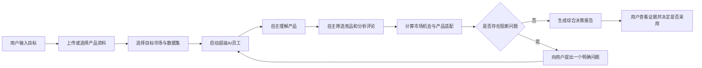

# FurniScope 产品简化与文档调整方案 V1.0

## 1. 简化目标

FurniScope 的完整产品形态不是传统企业多人协作系统，而是面向一人公司、精简团队和岗位智能化后的“跨境家具超级 AI 员工”。一个 `user` 提出业务目标并提供必要资料，系统内部多个专业 Agent 自主协作完成市场研究、竞品分析、评论洞察、产品建议和报告输出。

简化后的核心关系：

```text
admin：管理账号、模型和系统运行
  └── user：提出目标、提供资料、确认关键事实、使用最终结果
        └── 超级 AI 员工
              ├── 产品理解能力
              ├── 市场与竞品能力
              ├── 评论洞察能力
              ├── 产品决策能力
              └── 报告生成能力
```

## 2. 产品设计原则

1. 系统角色只有 `user/admin`。
2. `user` 可以完成全部业务操作；`admin` 负责用户和系统治理。
3. 产品、研发、运营、销售等传统岗位只作为 AI 能力来源，不作为权限角色。
4. 多 Agent 是内部实现，不要求用户理解或逐个操作 Agent。
5. 默认自主执行，只在输入事实冲突、数据不足或高风险建议时请求用户确认。
6. 一个分析任务对应一个目标、一个主产品、一个目标市场和一份综合结果。
7. 页面围绕用户目标组织，不按传统部门或后端模块组织。
8. 保留证据链、状态恢复、成本记录和模型追溯；这些是可信 AI 的必要能力，不属于可删除复杂度。

## 3. 核心业务闭环



用户不再依次扮演产品经理、市场运营、研发和管理者，也不需要理解完整工作流节点。

## 4. 角色与权限简化

### 4.1 最终角色

| 角色 | 权限 |
|---|---|
| `user` | 产品、数据集、分析任务、人工确认、市场洞察、建议、报告等全部业务操作 |
| `admin` | 全部 user 权限，以及用户管理、账号状态、模型路由、Prompt、配额和系统审计 |

### 4.2 删除内容

- 删除 `owner/product_rd/market_ops/sales` 系统角色。
- 删除动态 RBAC 权限集。
- 删除 `roles` 和 `user_roles` 表。
- 删除跨部门审批链和“指定岗位才能确认”的规则。
- 所有人工节点统一由任务所属 `user` 处理。

### 4.3 保留的安全边界

- 保留 `tenant_id`，用于 SaaS 数据隔离；一人公司仍是一个独立工作空间。
- 保留资源所有权和管理员权限校验。
- 不提供管理员查看用户敏感原始数据的默认权限。

## 5. 功能范围简化

### 5.1 核心产品 P0

1. 用户登录和工作台。
2. 创建产品并上传图片、参数表、PDF和报价。
3. AI 生成产品画像；仅冲突或缺失时请求确认。
4. 选择目标市场与固定授权数据集。
5. 创建并启动分析任务。
6. AI 自主完成竞品、评论、市场、适配和建议分析。
7. 数据不足或低置信度时触发统一“需要你确认”卡片。
8. 输出一份带证据和置信度的综合机会报告。
9. 任务可查看进度、失败原因并从安全 Checkpoint 恢复。

### 5.2 从核心产品删除或延后

| 功能 | 处理 |
|---|---|
| Listing 生成 | 删除出核心产品；未来作为独立扩展能力 |
| PDF/DOCX/XLSX 导出 | 延后；核心产品先提供在线报告 |
| 多人评审和团队协作 | 删除 |
| 验证任务项目管理 | 删除；报告中只保留待验证事项 |
| 产品事件漏斗 | 延后到商业运营阶段 |
| 动态算力配额后台 | 简化为环境配置或管理员配置 |
| 用户可见的阶段重试/取消 | 默认由系统自动处理；管理员诊断能力后置 |

## 6. 页面简化

现有 13 个页面建议收缩为 6 个核心页面和 1 个管理页：

| 新页面 | 合并来源 | 页面目标 |
|---|---|---|
| S01 登录 | P01 | 登录系统 |
| S02 AI 工作台 | P02、P03 | 查看产品、最近任务和新建分析入口 |
| S03 新建分析 | P04、P05、P06 | 在一个向导内完成产品资料、目标市场和任务配置 |
| S04 AI 执行中 | P07、P08、P11 | 展示总体进度；出现阻断时显示统一确认卡片 |
| S05 市场洞察 | P09、P10 | 使用 Tab 展示结论、竞品、评论需求、价格与证据 |
| S06 决策报告 | P10、P11 | 展示建议、适配、风险和待验证事项 |
| A01 管理后台 | 新增但仅 admin 可见 | 用户、模型路由、Prompt和运行诊断 |

删除独立 Listing 页和报告导出页。页面不再按传统岗位显示不同入口。

## 7. Agent 工作流简化

### 7.1 对用户只暴露五个阶段

| 展示阶段 | 内部节点范围 |
|---|---|
| `understanding_product` | 产品资料解析、画像生成和能力上下文加载 |
| `researching_market` | 数据质量、竞品筛选、评论抽取和市场统计 |
| `evaluating_opportunity` | 需求聚类、机会评分和企业适配 |
| `generating_recommendation` | 产品建议和证据审计 |
| `completed` | 报告持久化完成 |

内部仍可保留 LangGraph 细粒度节点，但 API 和页面不再要求用户理解 N00—N19。

### 7.2 统一人工中断

将 `competitor_review` 和 `expert_review` 合并为统一 `user_confirmation`：

- Agent 输出一个具体问题、推荐选项、影响和证据；
- 用户确认后通过同一个恢复接口提交；
- Graph 使用 `Command(resume=...)` 从当前安全 Checkpoint 恢复；
- 默认不要求用户逐个审核全部竞品或全部产品建议。

## 8. API 简化

### 8.1 前端核心接口

| 能力 | 推荐接口 |
|---|---|
| 登录/当前用户 | 保留 API-USR-01/03 |
| 工作台 | 保留 API-DSH-01 |
| 产品 | 保留 API-PRD-01/02/03/05/07；画像修改和确认仅在需要时调用 |
| 数据集 | 保留 API-CMP-01/02/03；固定数据集时前端只需选择 |
| 分析任务 | 保留 API-INS-01/02/03 |
| 用户确认 | 新版统一确认接口替代页面直接编排 API-CMP-05/07 和 API-INS-06 |
| 综合洞察 | 将评论、机会、建议和报告作为一个任务结果聚合入口；原细分接口保留为下钻接口 |

### 8.2 内部接口

- Model Router 接口继续保持内部封装。
- 细粒度竞品、评论、证据接口保留给结果页下钻，不作为主流程入口。
- P1 Listing、导出、人工阶段重试和取消接口移出核心前端契约。

## 9. 数据模型简化

### 9.1 必须删除

- `roles`
- `user_roles`
- `report_reviews`
- `validation_tasks`
- `product_events`

### 9.2 建议合并

| 当前实体 | 合并目标 |
|---|---|
| `enterprise_constraints` | 合并进 `enterprise_profiles.constraints` JSONB |
| `dataset_field_mappings` | 合并进 `market_datasets.field_mapping` JSONB |
| `listing_attributes` | 合并进已有 `competitor_listings.normalized_attributes` JSONB |
| `opportunity_scores` | 合并回 `market_opportunities` 的评分字段 |
| `manufacturing_requirements`、`enterprise_fit_details` | 合并为 `market_opportunities.manufacturing_fit` JSONB |
| `report_sections` | 合并进 `analysis_reports` 的结构化章节 JSONB |
| `compute_quotas` | 首版改为管理员配置；商业计费阶段再独立建表 |

### 9.3 建议保留

- 用户、租户、产品、画像版本、文件资产和解析任务；
- 市场数据集、竞品商品和评论；
- 分析任务、阶段运行、Checkpoint、部分失败和控制事件；
- 模型运行、Prompt、模型路由；
- 竞品匹配、评论观点、需求聚类和市场指标；
- 市场机会、产品建议、证据链和分析报告。

数据库目标从 48 张业务表收缩到约 30—34 张；最终数量以数据字典简化后逐实体核对为准，不先为追求数量强行合并。

## 10. 七份项目文档调整方案

### 10.1 PRD/SRS

- 将产品定位改为“一名用户管理一个跨境家具超级 AI 员工”。
- 用户角色从五类改为 `user/admin`。
- 删除权限矩阵和跨岗位协作描述。
- 将用例改写为用户目标，而不是岗位任务。
- 将主流程收缩为“输入目标—AI执行—必要确认—综合结果”。
- 明确传统岗位能力由内部 Agent 提供。

### 10.2 数据字典

- 删除 `role/user_role` 实体，`users.role_code` 只允许 `user/admin`。
- 删除或合并第 9.1、9.2 节所列实体。
- 新增统一 `user_confirmation` 数据结构。
- 将外部任务展示阶段与内部 Agent 节点状态分开。

### 10.3 PostgreSQL 数据库设计

- 输出简化后的数据库 V3 和迁移脚本。
- 移除多角色、团队评审和反馈闭环表。
- 合并过度范式化且只用于单次报告读取的实体。
- 保留 Checkpoint、幂等、证据和模型运行数据。

### 10.4 Agent 工作流

- 保留专业 Agent 分工，但将其定义为一个超级 AI 员工的内部能力。
- 外部只展示五个阶段。
- 人工节点统一为 `user_confirmation`。
- 自动重试和降级默认由 Workflow Supervisor 处理。

### 10.5 RESTful API

- 统一 `user/admin` 权限说明。
- 新增统一确认接口和聚合结果接口前，先给出完整契约。
- 原细粒度 API 可作为内部或下钻接口保留，避免一次性破坏实现。
- P1 接口从核心 Demo/API 导航中移出。

### 10.6 页面交互原型

- 从 13 页收缩到 6+1 页。
- 删除按岗位区分的目标用户和按钮权限。
- 将竞品确认和专家复核合并成 AI 执行页的确认卡片。
- 报告页使用 Tab/证据抽屉承载细分结果。

### 10.7 测试用例

- 删除五角色权限组合测试。
- 增加 `user/admin` 两角色边界测试。
- 主验收改为一个 user 是否能独立完成端到端任务。
- 保留数据隔离、幂等、Checkpoint 恢复、证据和模型安全测试。

## 11. 推荐修改顺序

1. 先确认本方案中的产品边界和数据库合并项。
2. 输出 PRD V2，锁定角色、页面和核心流程。
3. 更新 Agent 工作流 V2，确定统一人工确认协议。
4. 更新数据字典 V3。
5. 更新 PostgreSQL 数据库设计 V3 和迁移 SQL。
6. 更新 API V3。
7. 更新页面交互原型 V3 和 Mermaid 图。
8. 更新测试用例 V2。
9. 执行最终一致性校验后再开始业务编码。

## 12. 需要确认的设计决策

在批量修改文档前，需要锁定三项决策：

1. 是否将竞品确认和专家复核统一为一个 `user_confirmation` 协议；
2. 是否按第 9.2 节合并七类过度范式化实体；
3. 是否将 Listing、报告文件导出、验证任务和产品事件完全移出核心产品，而不仅是标记 P1。

