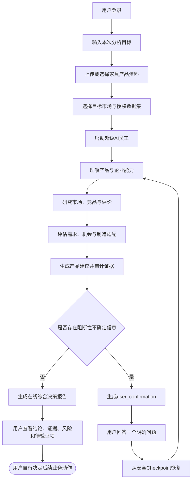

# FurniScope 产品简化决策基线 V1.0

## 1. 文档定位

| 项目 | 内容 |
|---|---|
| 产品名称 | FurniScope——跨境家具超级 AI 员工 |
| 文档性质 | 简化重构的产品级决策基线 |
| 适用范围 | 后续 PRD、Agent、数据字典、数据库、API、交互、测试和编码实现 |
| 决策状态 | 已锁定 |
| 上游依据 | 客户业务调研、PRD V1、产品简化与文档调整方案 V1 |
| 冲突优先级 | 本文档高于简化前的岗位、权限、页面、流程和数据结构设计 |
| 编制日期 | 2026-08-09 |

本文档只锁定产品边界、角色、业务闭环和简化原则，不替代后续各专业设计文档。旧文档中的家具业务事实、产品画像、市场分析、证据、评分和制造适配规则继续有效；与本文档冲突的组织和交互设计必须在新版文档中修订。

---

## 2. 一句话产品定位

**FurniScope 是由一个用户直接管理的跨境家具超级 AI 员工：用户提供产品与目标，AI 自主完成海外市场研究、竞品分析、评论洞察、机会判断、产品建议和证据化报告，只在关键事实无法可靠判断时请求用户确认。**

### 2.1 “超级 AI 员工”的核心价值

传统家具出海决策通常需要产品、研发、市场、运营和外贸等多个岗位协作。FurniScope 不复制这套组织结构，而是将这些岗位中可标准化、可计算、可追溯的专业能力封装为一个 AI 员工：

- 将分散的图片、参数、PDF和报价转化为产品画像；
- 从授权竞品和评论数据中识别真实需求、场景和证据；
- 将市场需求转换为产品、材料、结构、包装和验证建议；
- 联合工厂能力、成本、MOQ、认证和交付约束判断可行性；
- 输出“值不值得做、为什么、怎么改、还需验证什么”的综合决策结果；
- 保存数据范围、算法版本、模型运行和证据链，使结论可复核、可恢复。

### 2.2 产品不是什么

FurniScope 不是：

- 按传统岗位销售多个模块的企业协作软件；
- 需要用户逐个指挥多个 Agent 的 Agent 控制台；
- 自动替用户承担打样、采购、备货、财务或合规责任的决策主体；
- 无证据预测销量或保证爆款的黑箱工具；
- 未经授权自动抓取平台数据的爬虫系统；
- Listing、营销文案、广告投放或客户开发工具的功能集合。

---

## 3. 目标用户与组织形态

### 3.1 核心目标用户

核心用户是需要独立承担产品出海判断的一人公司经营者、精简跨境团队成员或被授权对产品方向负责的单一业务负责人。用户可能具有老板、产品、运营、研发或外贸背景，但这些背景只影响其知识和关注点，不影响系统权限。

### 3.2 目标企业

- 中国家具制造或产品型出海企业；
- 拥有可分析的产品图片、参数、报价或能力资料；
- 具备产品改造、打样、OEM/ODM或供应链协调能力；
- 有权使用固定市场、竞品和评论数据；
- 希望以更少岗位完成市场研究和产品决策准备。

### 3.3 组织模型

```text
平台
├── admin：管理用户与系统运行
└── user：管理自己的跨境家具超级 AI 员工
      └── 超级 AI 员工内部专业能力
            ├── 产品理解
            ├── 市场研究
            ├── 竞品判断
            ├── 评论洞察
            ├── 产品决策
            └── 证据与报告
```

平台可以服务多个租户，但每个租户内部不建立传统部门权限体系。一人公司仍作为独立租户或工作空间存在，以保证数据隔离。

---

## 4. 唯一角色与权限边界

### 4.1 角色定义

| 角色 | 定位 | 允许操作 | 禁止或受限操作 |
|---|---|---|---|
| `user` | 超级 AI 员工的业务使用者 | 管理企业和制造能力资料；管理产品；选择或导入授权市场数据；创建和启动分析；回答 `user_confirmation`；查看竞品、评论、机会、建议、证据和在线报告 | 不管理其他用户；不修改全局模型、Prompt和运行配置；不得跨租户访问数据 |
| `admin` | 平台用户与运行管理员 | 管理 user 账号和状态；管理模型路由、Prompt、运行参数和系统诊断；处理平台级故障 | 默认不代替 user 作出产品业务判断；不因管理员身份绕过租户和敏感数据访问边界 |

### 4.2 权限实现原则

1. 系统鉴权枚举只允许 `user/admin`。
2. 一个账号只需要一个角色，不支持动态多角色分配。
3. 不建立动态 RBAC 权限集、部门权限或岗位权限矩阵。
4. 所有核心业务接口允许资源所属租户内的 `user` 使用。
5. admin 接口与业务接口分离；admin 的系统治理权限不自动等于查看客户原始商业数据的权限。
6. 所有资源查询同时校验 `tenant_id` 和资源所有权。
7. 人工确认由任务所属 `user` 完成，不要求特定传统岗位。

### 4.3 传统岗位的处理方式

`owner/product_rd/market_ops/sales` 不再是系统角色。它们只能用于：

- 描述客户调研中的传统工作方式；
- 说明某项内部 Agent 能力来源于哪个专业领域；
- 解释报告内容可能服务的业务决策；
- 作为非鉴权性质的用户背景或职位信息。

不得将传统岗位用于 API 权限、数据库角色枚举、页面入口、人工节点分配或审批流程。

---

## 5. 传统岗位与内部 Agent 能力映射

| 传统岗位能力 | 超级 AI 员工内部能力 | 主要输入 | 主要输出 | user 的责任 |
|---|---|---|---|---|
| 企业负责人/老板 | 目标理解与决策摘要 | 分析目标、目标市场、企业约束 | 综合机会判断、风险和优先级 | 决定是否采用结果或投入外部资源 |
| 产品经理 | 产品理解与机会定义 | 图片、参数、报价、产品说明 | 结构化产品画像、需求差距、产品方向 | 补充无法可靠推断的产品事实 |
| 研发/工程人员 | 制造适配与工程建议 | 材料、工艺、设备、认证、成本、MOQ | 能力匹配、缺口、产品建议、验证方法 | 确认高风险或缺乏工厂事实的建议 |
| 市场运营/分析人员 | 竞品、评论和市场研究 | 授权商品、评论、价格和时间数据 | 竞品集合、需求聚类、价格带和市场指标 | 处理数据范围不足或明显异常 |
| 外贸业务员 | 人群、场景和价值表达理解 | 评论、市场证据、产品能力 | 目标人群、使用场景、关注点和反对因素 | 将洞察用于后续人工客户沟通 |
| 数据分析人员 | 确定性指标与评分 | 清洗后的样本和版本化规则 | 提及率、覆盖率、机会分和置信度 | 查看口径，不手工计算底层指标 |
| 报告分析人员 | 证据审计与报告生成 | 全部结构化结果和证据引用 | 在线综合决策报告 | 复核关键证据并决定是否采用 |

这些能力可以由多个内部 Agent、规则引擎和确定性程序共同实现，但对 user 始终呈现为同一个超级 AI 员工。

---

## 6. P0 核心产品业务闭环

### 6.1 完整流程



### 6.2 P0 必须保留的能力

| 环节 | 必须能力 | 关键输出 |
|---|---|---|
| 账号与工作空间 | 登录、租户隔离、资源所有权 | 当前 user、工作空间和最近任务 |
| 产品输入 | 图片、参数、PDF、报价上传和安全检查 | 文件资产和解析任务 |
| 产品理解 | 多模态解析、字段来源、冲突和完整度检查 | 可追溯产品画像 |
| 企业能力 | 材料、工艺、设备、包装、MOQ、交付和认证 | 制造能力与约束上下文 |
| 市场数据 | 选择或导入授权数据、字段映射、质量检查 | 固定版本数据集和限制说明 |
| 竞品研究 | 硬过滤、Embedding、Rerank和解释 | 直接、标杆、替代竞品及匹配理由 |
| 评论洞察 | 清洗、观点抽取、人群、场景、情感、严重度和证据 Span | 需求聚类和代表证据 |
| 市场分析 | 价格带、覆盖率、提及率、竞争指标和时间可用性判断 | 确定性市场指标 |
| 机会评估 | 需求热度、未满足程度、竞争空间、利润空间、企业适配 | 分项评分、基础分和独立置信度 |
| 产品建议 | 将需求映射至尺寸、材料、结构、包装、成本和验证方法 | 工程化建议与能力缺口 |
| 人工确认 | 只在阻断性不确定信息出现时提问 | `user_confirmation` 和恢复命令 |
| 可信报告 | 结论、置信度、数据范围、风险、待验证项和证据下钻 | 在线综合决策报告 |
| 任务可靠性 | 异步执行、幂等、自动重试、部分失败和安全恢复 | 可持续轮询的任务状态 |

### 6.3 user 的最少必需操作

正常链路中，user 只需要：

1. 输入分析目标；
2. 提供或选择产品资料；
3. 选择目标市场和数据集；
4. 启动超级 AI 员工；
5. 在确有阻断问题时回答确认；
6. 查看最终在线报告和证据。

系统不得要求 user 为了推进流程而逐个审核全部竞品、全部观点、全部评分或全部建议。

---

## 7. 功能删除、合并与移出范围

### 7.1 从产品设计中删除

| 内容 | 决策 | 原因 |
|---|---|---|
| `owner/product_rd/market_ops/sales` 鉴权角色 | 删除 | 与一个 user 驾驭超级 AI 员工冲突 |
| 动态 RBAC、角色表和用户角色关联 | 删除 | 两角色不需要动态权限系统 |
| 跨部门审批链 | 删除 | 产品不模拟传统组织流程 |
| 多人报告评审 | 删除 | 核心结果由任务所属 user 使用 |
| 独立验证任务管理 | 删除 | FurniScope 输出待验证事项，但不承担项目管理 |
| 产品运营事件漏斗 | 删除出核心设计 | 属于平台运营分析，不是用户市场洞察闭环 |
| 按部门拆分的页面和入口 | 删除 | 页面必须围绕用户目标组织 |

### 7.2 合并

| 旧设计 | 合并方向 | 保留的信息 |
|---|---|---|
| 产品画像确认页、数据导入页、任务创建页 | “新建分析”统一向导 | 文件、画像冲突、市场和任务配置 |
| 任务详情、竞品确认、建议复核 | “AI 执行中”页面及确认卡片 | 五阶段进度、确认问题、技术详情 |
| 评论分析、市场机会和部分报告 | “市场洞察”页面的多个 Tab | 评论、竞品、价格、机会和证据 |
| 产品建议与报告 | “决策报告”页面 | 产品建议、制造适配、风险和待验证项 |
| 竞品确认和专家复核 | `user_confirmation` | 问题、推荐选项、证据、影响和恢复点 |
| 用户可见的 N00—N19 | 五阶段投影 | 内部细粒度状态仍保留用于执行和诊断 |
| 机会分项实体 | 市场机会结果 | 六维分、基础分、置信度、权重和版本不得丢失 |
| 制造要求与适配明细 | 机会的制造适配结构 | 要求、能力证据、缺口、硬约束和置信度 |
| 报告章节 | 报告结构化章节 | 固定章节码、结构化内容和图表配置 |

### 7.3 移出核心产品

| 功能 | 处理方式 |
|---|---|
| Listing 生成和审核 | 从核心 PRD、页面、API和测试中移出；未来可作为独立扩展产品 |
| PDF/DOCX/XLSX/JSON 文件导出 | 核心产品只保留在线报告；文件导出后置 |
| 用户手动阶段重试和取消 | 不作为 user 核心操作；自动恢复由系统处理，admin 诊断能力后置 |
| 动态算力配额后台 | 首版使用 admin 配置和环境参数；商业计费阶段再独立设计 |
| 多产品、多国家和多平台比较 | 不属于首个核心闭环；后续基于单任务模型扩展 |
| 自动获客、营销、广告、调价和平台发布 | 不属于 FurniScope 市场洞察核心产品 |

“移出核心产品”不代表永不建设，但不得继续占用核心页面、P0 API、数据库主模型或核心测试范围。

---

## 8. 用户可见的五阶段任务模型

| 阶段码 | 中文展示 | 用户看到的工作 | 内部能力范围 | 可能触发确认 |
|---|---|---|---|---|
| `understanding_product` | 正在理解产品 | 解析资料、建立产品和制造能力上下文 | 文件安全、文本/视觉解析、Schema 映射、冲突检测、能力加载 | 产品必要事实冲突或缺失 |
| `researching_market` | 正在研究市场 | 检查数据、筛选竞品、分析评论和价格 | 数据质量、竞品召回/Rerank、评论抽取、市场统计 | 样本不足或竞品集合存在重大歧义 |
| `evaluating_opportunity` | 正在评估机会 | 识别需求并计算市场与企业适配 | 聚类、六维评分、置信度、制造适配 | 关键成本或工厂能力事实缺失 |
| `generating_recommendation` | 正在生成建议 | 形成产品动作并审计证据 | 产品建议、风险、验证方法、证据审计、报告组装 | 高风险建议需要 user 明确选择 |
| `completed` | 分析完成 | 展示综合洞察和决策报告 | 最终事务、报告和证据索引入库 | 不触发；报告保持待验证事项 |

### 8.1 内外状态分离

- 五阶段只用于 API 聚合状态、页面进度和用户理解。
- LangGraph 内部可以保留更细的节点码、阶段运行记录和尝试次数。
- `analysis_tasks.status`、阶段运行状态、部分失败和 Checkpoint 生命周期不得被五阶段替代。
- 外部阶段由后端根据内部当前节点确定性映射，前端不得自行推断。

### 8.2 进度原则

- user 主要看到当前阶段、总体进度、正在做什么和预计影响；
- 内部节点、attempt、错误码和 Checkpoint 默认收起至“技术详情”；
- 自动重试不反复打断 user；
- 部分失败未阻断核心结论时继续执行，并在报告中明确数据限制；
- 任务完成必须以报告和必需证据成功持久化为准。

---

## 9. user_confirmation 决策基线

### 9.1 定义

`user_confirmation` 是超级 AI 员工在无法安全、自主地继续执行时，向任务所属 user 提出的单一、明确、可回答的问题。它是唯一面向 user 的人工中断协议。

### 9.2 允许触发的条件

仅以下情况允许触发：

1. **输入事实冲突：**结构化参数、文档、图片或用户输入对关键属性给出互斥结果；
2. **必要信息缺失：**缺失信息会改变竞品范围、机会评分或产品建议，且不能安全降级；
3. **数据范围不足：**样本不足以支持继续生成当前强度的结论，需要 user 选择补数据、接受限制或停止；
4. **竞品重大歧义：**候选集合存在会显著污染后续评论和价格分析的商业可比性问题；
5. **高风险建议：**建议涉及材料、结构、安全、认证、成本或产线能力，现有证据不足以自动确定；
6. **恢复冲突：**任务输入版本或安全 Checkpoint 已变化，需要 user 刷新并重新确认。

### 9.3 禁止触发的情况

- 普通可重试的模型超时、限流或短暂基础设施错误；
- 系统可以按既定规则自动选择的低风险分支；
- 仅为了复刻传统审批流程；
- 要求 user 逐项审核全部竞品、观点、聚类或建议；
- Agent 无法组织清晰问题时将内部错误转嫁给 user；
- 结论可以通过降低置信度和明确限制安全输出的情况。

### 9.4 最小信息结构

后续数据字典、Agent、API和页面必须为 `user_confirmation` 定义同一组最小业务字段：

| 信息 | 含义 |
|---|---|
| 唯一标识 | 标识本次确认，防止重复回答 |
| 确认类型 | 产品事实、数据范围、竞品歧义、高风险建议或恢复冲突 |
| 明确问题 | user 一次能够理解和回答的问题 |
| 推荐选项 | AI 基于现有证据推荐的选择，可为空但不得伪造 |
| 可选项 | 有限且互斥的选择；必要时允许补充结构化信息 |
| 证据引用 | 支持提出问题和推荐选项的证据 |
| 影响说明 | 不同选择将如何影响样本、置信度、建议或流程 |
| 当前恢复阶段 | 与安全 Checkpoint 一致的内部阶段 |
| 有效期与版本 | 防止回答过期确认或过期输入版本 |

具体字段名、类型和状态值由数据字典 V3定义；其他文档不得自行产生不同版本。

### 9.5 恢复原则

1. user 提交回答时必须携带确认标识、版本和幂等键；
2. 服务端校验任务所有权、确认状态、输入版本和安全 Checkpoint；
3. 回答与恢复控制事件在同一业务事务中持久化；
4. 通过 LangGraph `Command(resume=...)` 恢复；
5. API 返回“恢复命令已受理”，不得提前宣称 Worker 已执行；
6. 前端恢复任务状态轮询，以任务状态作为最终事实；
7. 重复提交相同回答返回相同受理结果；不同回答复用同一幂等键必须拒绝。

---

## 10. 必须保留的可信 AI 能力

产品简化不得删除以下能力：

### 10.1 数据与证据

- 授权数据来源、数据集版本、国家、平台、时间和样本范围；
- 原始产品字段和评论原文不可被 AI 结果覆盖；
- 产品属性记录来源、位置、置信度和确认状态；
- 评论观点保留原文证据 Span；
- 关键结论必须关联主证据、限制或反证；
- 观察事实、程序计算、AI 推断、建议和待验证事项明确区分。

### 10.2 评分与报告

- 市场指标由确定性程序计算，不由 LLM 主观生成；
- 机会分与置信度分离；
- 评分公式、权重和版本可复现；
- 缺失数据不得当作 0；
- 无可靠成本、销量或增长数据时不伪造；
- 报告必须包含数据限制、能力缺口、风险和待验证事项。

### 10.3 模型追溯

- 保存实际模型 ID、任务类型、Prompt 版本和输出 Schema 版本；
- 保存脱敏输入哈希、Token、延迟、估算成本、重试次数和错误码；
- 结构化输出通过 JSON Schema 和业务范围校验后才能进入结果表；
- API Key、密钥、完整敏感输入和模型内部推理不得落库。

### 10.4 任务可靠性

- 创建、启动、确认和恢复操作具备幂等性；
- 保留细粒度阶段运行、attempt和错误分类；
- 自动重试必须有上限并区分可重试与不可重试错误；
- 并行分支允许记录部分失败，不因单个非关键批次失败丢弃全部结果；
- 业务结果先持久化，再推进安全 Checkpoint；
- Worker 重启后从最近安全点恢复，不重复执行成功节点或重复计费；
- Checkpoint、部分失败、控制事件和报告入口有长期事实来源。

### 10.5 人类责任边界

- AI 输出产品建议和验证方法，不自动修改 CAD、下单、打样、备货或发布平台内容；
- user 对采用建议和产生外部成本的动作负责；
- admin 不替代 user 作出产品业务决定。

---

## 11. 数据安全与系统边界

1. 保留 `tenant_id` 作为所有企业业务数据的隔离边界。
2. 所有查询默认带租户过滤；跨租户访问返回无权或不存在，不泄露资源存在性。
3. 出厂价、成本、供应商资料和未授权原始文件按敏感数据处理。
4. 文件必须经过类型、大小、哈希和安全扫描，再进入解析流程。
5. 对象存储使用受控存储键和短效地址，不在数据库保存永久公开链接。
6. Demo 和赛事材料使用脱敏、授权或合成数据。
7. admin 的诊断日志默认只包含 ID、状态、错误码和脱敏摘要。
8. 删除用户或租户数据必须遵循保留策略和审计要求，不能通过级联误删证据与报告。

---

## 12. 后续文档统一命名规则

### 12.1 系统角色

| 类型 | 允许值 |
|---|---|
| 系统角色 | `user/admin` |
| 传统岗位 | 仅出现在调研背景、用户画像或 Agent 能力来源中 |

### 12.2 产品主体

- 对用户统一称“超级 AI 员工”或“FurniScope AI 员工”；
- “Agent”用于内部架构和技术文档；
- 不在页面上要求 user 选择或管理多个 Agent；
- Workflow Supervisor 是内部编排组件，不是系统角色。

### 12.3 核心业务对象

后续文档统一使用：

- 产品资料与产品画像；
- 企业制造能力与约束；
- 目标市场与市场数据集；
- 分析任务；
- 用户确认 `user_confirmation`；
- 市场洞察；
- 市场机会与产品建议；
- 在线决策报告；
- 证据引用、模型运行和安全 Checkpoint。

### 12.4 用户可见阶段

仅允许：

```text
understanding_product
researching_market
evaluating_opportunity
generating_recommendation
completed
```

内部任务状态和节点状态由 Agent 工作流 V2定义，不得将上述展示阶段直接当作数据库任务状态。

### 12.5 页面范围

后续页面文档以以下 6+1 页面为边界：

```text
S01 登录
S02 AI 工作台
S03 新建分析
S04 AI 执行中
S05 市场洞察
S06 决策报告
A01 管理后台
```

不得重新为竞品、评论、建议复核、Listing或报告导出拆出核心一级页面；复杂结果通过 Tab、抽屉和确认卡片承载。

### 12.6 范围词语

- “核心产品/P0”：完整单用户业务闭环；
- “内部能力”：支持 P0 但不直接暴露为用户功能；
- “移出核心产品”：不进入核心 PRD、页面、API主导航和 P0 测试；
- “未来扩展”：需重新立项，不能借 P1 名义继续占用当前设计。

---

## 13. 禁止重新引入的复杂度

后续文档和代码不得重新引入：

1. `owner/product_rd/market_ops/sales` 等系统角色或鉴权枚举；
2. 动态 RBAC、角色权限表和多角色分配；
3. 按部门或岗位拆分的审批链；
4. 只有特定传统岗位才能操作的按钮或 API；
5. 将内部 Agent 设计成多个用户需要分别指挥的产品入口；
6. 为每个内部 Agent 建立独立一级页面；
7. 要求 user 逐个确认全部竞品、观点、聚类或建议；
8. 将普通自动重试、模型超时或内部异常转化为人工审批；
9. 为展示技术复杂度而暴露 N00—N19 给普通 user；
10. 将 Listing、文件导出、验证任务、多人评审和产品事件重新放入核心 P0；
11. 为尚未发生的商业计费、复杂团队协作和多层组织预建过度数据模型；
12. 以合并数据表为理由丢失证据、版本、置信度、恢复或审计信息；
13. 使用“AI 自主”作为绕过高风险人工责任边界的理由；
14. 为追求功能数量扩展到获客、CRM、广告、调价或平台自动发布。

---

## 14. 核心产品验收口径

简化后的完整产品必须满足：

1. 一个 `user` 不切换角色即可完成一次端到端分析；
2. 正常任务只需输入目标、资料、市场并启动，不需要多岗位接力；
3. 只有阻断性不确定信息触发 `user_confirmation`；
4. user 回答后任务能从安全 Checkpoint 恢复；
5. 最终报告包含数据范围、机会、置信度、制造适配、建议、风险、待验证事项和证据；
6. 所有高优先级结论可以下钻到证据；
7. 自动重试、部分失败和 Worker 重启不破坏已提交结果；
8. `user/admin` 权限和租户隔离通过测试；
9. 核心页面数量不超过 6 个业务页面和 1 个管理页面；
10. 核心文档、API、数据库和测试中不再出现旧岗位鉴权。

---

## 15. 旧设计→简化设计决策映射表

| 旧设计 | 简化设计 | 决策类型 | 后续处理文档 |
|---|---|---|---|
| 管理者、产品研发、市场运营、外贸、管理员五角色 | `user/admin` | 删除与替换 | PRD、数据字典、数据库、API、页面、测试 |
| 多岗位权限矩阵 | user 全业务权限、admin 系统治理 | 删除与替换 | PRD、API、测试 |
| 动态 `roles/user_roles` | `users.role_code=user/admin` | 删除 | 数据字典、数据库 |
| 产品、研发、运营、销售协作 | 超级 AI 员工的内部专业能力 | 重构 | PRD、Agent、页面 |
| 用户管理多个 Agent | 一个超级 AI 员工内部编排多个 Agent | 重构 | PRD、Agent、架构图 |
| 14 步多人业务流程 | 输入目标—自主执行—必要确认—综合报告 | 合并 | PRD、页面、测试 |
| 产品画像每次人工确认 | 仅关键冲突或缺失时确认 | 条件化 | PRD、Agent、API、页面 |
| 独立竞品复核 | 默认自主筛选；重大歧义进入统一确认 | 合并 | Agent、API、页面 |
| 独立专家建议复核 | 高风险建议进入统一确认 | 合并 | Agent、API、页面 |
| `competitor_review/expert_review` | `user_confirmation` | 统一协议 | Agent、数据字典、数据库、API、页面、测试 |
| 用户查看 N00—N19 | 五个展示阶段，内部节点收进技术详情 | 抽象 | Agent、API、页面 |
| 13 个页面 | 6 个业务页 + 1 个 admin 页 | 合并与删除 | 页面、Mermaid、测试 |
| 独立竞品、评论、机会页面 | 市场洞察页多个 Tab | 合并 | 页面、API |
| 独立产品建议复核页 | AI执行确认卡片 + 决策报告 | 合并 | 页面、API |
| Listing 编辑预览 | 移出核心产品 | 移除 | PRD、数据字典、数据库、API、页面、测试 |
| 报告文件导出页 | 核心只保留在线报告 | 移除 | PRD、数据字典、数据库、API、页面、测试 |
| 多人报告评审 | user 查看并自行采用 | 删除 | 数据字典、数据库、API、测试 |
| 验证任务项目管理 | 报告只保留待验证事项 | 删除与合并 | PRD、数据字典、数据库 |
| 产品运营事件 | 移出核心产品 | 移除 | 数据字典、数据库 |
| 用户手动阶段重试与取消 | 系统自动处理；admin诊断后置 | 移出核心交互 | PRD、Agent、API、页面、测试 |
| 动态算力配额后台 | 首版 admin 配置或环境参数 | 简化 | PRD、数据字典、数据库、API |
| 多个评分和适配结果表 | 可合并但保留完整字段、版本和证据 | 数据结构简化 | 数据字典、数据库 |
| 报告章节独立实体 | 可合并为报告结构化章节 | 数据结构简化 | 数据字典、数据库 |
| Redis/内存可能承载长期状态 | PostgreSQL长期事实 + Redis短状态 | 保留并强化 | Agent、数据库、架构 |
| 多人审批体现“专业” | 证据、置信度、规则和Agent能力体现专业 | 产品原则替换 | 全部文档 |

---

## 16. 后续文档处理依赖

必须按以下顺序重构，避免字段和接口反复变更：

1. **PRD/SRS V2：**依据本文档锁定产品定位、两角色、单用户闭环、五阶段、6+1页面和移除范围；
2. **Agent 工作流 V2：**定义内部节点到五阶段的映射，并完整定义 `user_confirmation` 和恢复协议；
3. **数据字典 V3：**以 Agent V2 的确认结构为准，删除多角色和非核心实体，定义合并后的 JSON Schema；
4. **PostgreSQL 设计 V3：**依据数据字典 V3生成精简表结构和 V2.1→V3 安全迁移；
5. **RESTful API V3：**依据数据字典和 Agent 定义统一确认、聚合状态和综合结果接口；
6. **页面交互原型 V3：**依据 API V3形成 6+1 页面，不先于 API自行发明交互字段；
7. **Mermaid V3：**同步业务流程、系统架构、ER、恢复时序和页面跳转；
8. **测试用例 V2：**建立一个 user 完成全链路的验收和 user/admin 权限边界；
9. **最终一致性校验：**确认页面→API→字段→数据库→Agent→测试闭环后，才能归档旧版并开始正式业务编码。

### 16.1 当前仍待后续文档定义的内容

本文档有意不提前定义以下技术细节：

- `user_confirmation` 的最终字段名、状态枚举和数据库表结构；
- 内部 Agent 节点的新编号和条件边；
- 五阶段的 API 聚合字段和进度区间；
- 数据实体合并后的 JSON Schema；
- API V3 的编号、路径和兼容策略；
- PostgreSQL V2.1→V3 的数据迁移顺序；
- 6+1页面的具体组件和交互状态。

这些内容必须由对应专业文档在本文决策边界内定义，不得在其他文档中各自形成不同版本。

---

## 17. 版本记录

| 版本 | 日期 | 说明 |
|---|---|---|
| V1.0 | 2026-08-09 | 锁定“跨境家具超级 AI 员工”产品形态；确定 user/admin 两角色、单用户自主闭环、五阶段任务模型、统一 user_confirmation、可信 AI 保留项和禁止重新引入的复杂度 |

## 18. 本次变更摘要

- 将产品组织模型从传统多人岗位协作改为一个 user 驾驭一个超级 AI 员工；
- 将系统角色统一为 `user/admin`；
- 将传统岗位映射为内部 Agent 专业能力；
- 锁定 P0 单用户端到端业务闭环；
- 确定五个用户可见阶段并保留内部细粒度工作流；
- 将竞品确认和专家复核统一为 `user_confirmation`；
- 明确删除、合并和移出核心产品的功能；
- 保留证据、评分、模型追溯、租户隔离、幂等、部分失败、Checkpoint和安全恢复；
- 建立旧设计到简化设计的决策映射；
- 明确后续八类设计文档的修改顺序和跨文档依赖。

