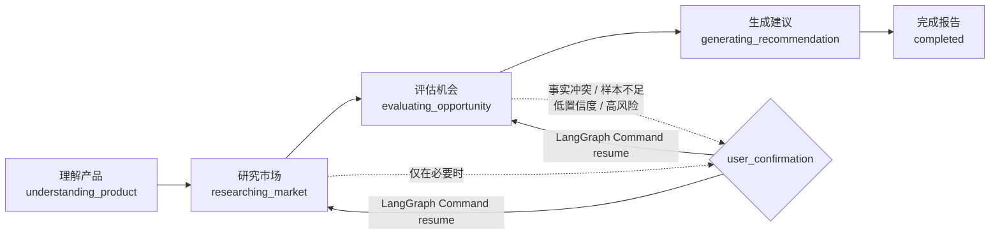
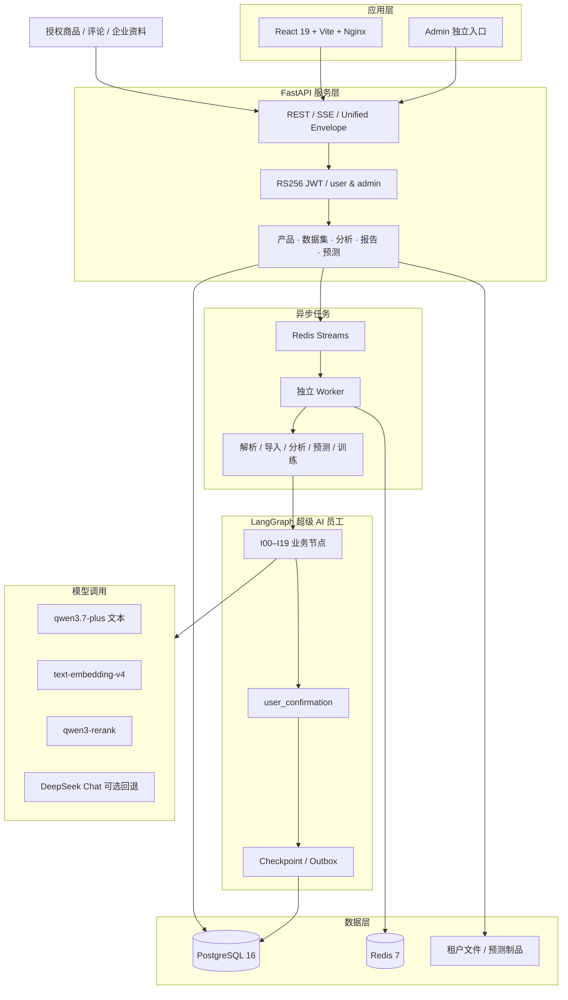

<div align="center">

# FurniScope

### 跨境家具超级 AI 员工

**把市场声音、竞品证据与工厂制造能力，变成可执行的产品决策。**

[](https://www.python.org/)
[](https://fastapi.tiangolo.com/)
[](https://langchain-ai.github.io/langgraph/)
[](https://www.postgresql.org/)
[](https://react.dev/)
[](https://www.aliyun.com/product/bailian)

[在线体验](#-在线体验) · [产品定位](#-产品定位) · [核心能力](#-核心能力) · [系统架构](#-系统架构) · [快速开始](#-快速开始) · [实现状态](#-当前实现状态) · [文档](#-文档)

</div>


> **产品名称：** FurniScope——跨境家具超级 AI 员工  
> **适用版本：** 赛事演示版（2026-09-15）  
> **公网体验：** <http://1.15.68.127:42817>  
> **本地默认：** <http://127.0.0.1:8083>  
> **赛道：** AI 跨境黑客松 · 赛道三：AI 市场洞察

FurniScope 不是只会生成市场摘要的聊天机器人。它是一名由企业用户直接驾驭的跨境家具超级 AI 员工：理解产品与工厂能力，研究授权市场数据、筛选竞品、挖掘评论、判断机会，并给出带证据、置信度和制造适配结论的决策报告。

## 🌐 在线体验

| 项目 | 内容 |
|---|---|
| 公网地址 | <http://1.15.68.127:42817> |
| 企业邮箱 | `hefeng@furniscope.local` |
| 企业密码 | `hefeng123456` |
| 管理员邮箱 | `admin@furniscope.local` |
| 管理员密码 | `admin123456` |
| 租户 | HeFeng 演示企业 |
| 演示视频 | [在线观看 / 下载](https://github.com/qzh666qbb/Furniscope/raw/main/assets/demo/FurniScope-产品演示.mp4) |

企业账号从登录页进入，填写完整企业邮箱，不要只填 `hefeng`。管理员从登录页底部「平台管理员入口」进入，不能走企业登录。以上为评审体验账号，请勿修改密码或删除演示数据。

演示视频与代码在同一仓库，本地路径为 `assets/demo/FurniScope-产品演示.mp4`。GitHub 文件页无法在线预览大视频，请用原始文件地址打开或下载：

https://github.com/qzh666qbb/Furniscope/raw/main/assets/demo/FurniScope-产品演示.mp4

操作细节见 [系统使用说明书](Docs/参赛提交/05_FurniScope系统使用说明书.md)。

## ✨ 产品定位

传统跨境家具企业通常已经拥有图片、规格、报价、样品和客户反馈，却缺少把这些碎片持续转化为产品决策的数据团队。通用 AI 能总结文字，但很难回答制造企业真正关心的问题：

- 这个市场机会是否真实，证据来自哪里？
- 评论里的痛点是偶发现象，还是稳定需求？
- 市场想要的尺寸、材料和结构，我们能不能做？
- 即使能做，成本、包装、认证和利润是否匹配？
- 哪些结论可以行动，哪些仍需打样或补充数据？

FurniScope 将市场、产品、数据和工程分析封装成一个自主工作流。一个用户即可完成从资料输入到决策报告的闭环；仅在事实冲突、样本不足、低置信度或高风险建议时，AI 才请求确认。

## 🚀 核心能力

企业用户走六块工作台：**首页 → 产品中心 → AI 工作台 → 销量预测 → 市场洞察 → 决策报告**。平台管理员走独立入口，看不到企业工作台。

| 模块 | FurniScope 做什么 | 产出 |
|---|---|---|
| 产品中心 | 解析家具图片、规格、尺寸、材料、结构、成本及包装约束 | 版本化产品画像与企业能力边界 |
| 市场洞察 | 导入授权竞品与评论，清洗后用于分析、监测和舆情 | 可用数据集、Listing 快照、原文证据 |
| 可比竞品 | 按品类、价格带、尺寸、材质、场景计算可比性 | 可解释竞品集合与匹配证据 |
| 评论挖掘 | 提取舒适度、耐用性、安装、气味、尺寸、包装等痛点 | 需求簇、情绪、原文 Evidence Span |
| 机会判断 | 融合需求热度、竞争缺口、利润、趋势、证据质量与制造适配 | 五维/六维机会评分、置信度和推荐级别 |
| 工程建议 | 将市场机会映射到材料、尺寸、结构、包装和认证动作 | 可执行建议、风险与待验证事项 |
| 决策报告 | 审计结论、反证、数据范围、模型和 Prompt 版本 | 在线综合报告与完整证据索引 |
| 销量预测 | 按 SKU / 站点输出区间、安全库存和建议产量；支持追加订单重训 | 预测任务结果与本环境回测指标 |

### 五阶段用户体验



工作台可把运行终点停在产品 / 市场 / 评分 / 方案 / 完整报告。停点走 `target_complete`，不会伪造未跑节点的报告。

## 🧠 一个 AI 员工，多个内部专业能力

用户不会选择 Agent，也不会把任务分配给“市场岗”或“产品岗”。LangGraph 在系统内部编排产品理解、数据质量、竞品发现、评论分析、机会评分、工程建议、证据审计和报告生成，并提供：

- 细粒度节点幂等，成功结果可复用，避免重复调用和重复计费；
- 并行 Map/Reduce，缩短竞品和评论批处理耗时；
- 自动重试、降级与部分失败，不用把运维复杂度暴露给用户；
- `user_confirmation` 统一人工中断；
- LangGraph Checkpoint + Outbox 安全恢复；
- 模型、Prompt、Token、耗时、Schema 和证据全链路追溯。

价格、比例、样本量、机会评分和预测数字由确定性程序或预测引擎计算，生成模型不得改写。报告叙述走赛事 Token Plan（默认 `qwen3.7-plus`）；额度不足时对话可回退 DeepSeek。向量与重排仍走阿里云，不跨供应商。

## 🏗 系统架构



分析输入必须是企业授权市场数据（`authorized_market_data`）。接口拒绝再创建 `demo_synthetic`。HeFeng 演示租户使用授权编号 `HeFeng-AUTH-AMZ-US-SOFA-2026Q3` 的北美沙发市场包。

## 🧩 技术栈

- **Frontend:** React 19, Vite 6, Nginx 静态托管
- **Backend:** Python 3.12, FastAPI, Pydantic, SQLAlchemy Async
- **Agent:** LangGraph, PostgreSQL Checkpointer, `Command(resume=...)`
- **Queue:** Redis Streams（租约、重试、死信、数据库补投）
- **Database:** PostgreSQL 16, asyncpg, psycopg
- **AI:** 菜鸟黑客松 Token Plan OpenAI 兼容网关；默认文本模型 `qwen3.7-plus`；Embedding `text-embedding-v4`；Rerank `qwen3-rerank`
- **Forecast:** Sales Forecast V4（XGBoost + LightGBM 集成）
- **Security:** RS256 JWT、Refresh Token 轮换、租户隔离、日志脱敏、持久化幂等
- **Testing:** Pytest, Playwright 无 Mock 金路径

## 🗂 项目目录

```text
frontend/         现役 React + Vite 前端
backend/          FastAPI、Agent 与销量预测引擎
tests/            Python 自动化测试
migrations/       PostgreSQL 增量迁移
forecast_assets/  预测模型、训练数据与回测报告
demo_data/        演示授权包与预测追加测试表
Docs/             产品、技术、运维与参赛文档
assets/           README 等项目级静态资源
archive/          历史 UI 与旧原型，不参与当前运行
```

## ⚡ 快速开始

评审复现优先用 Docker Compose。本地 Python 拆分启动见后文。

### 1. 克隆项目

```bash
git clone https://github.com/qzh666qbb/Furniscope.git
cd Furniscope
```

### 2. Docker Compose（推荐）

```bash
cp .env.example .env
# 修改 .env 中的 POSTGRES_PASSWORD
# 赛事密钥只通过环境变量注入，不要写入代码或提交 Git
docker compose up --build
```

打开 <http://127.0.0.1:8083>。页面操作见 [系统使用说明书](Docs/参赛提交/05_FurniScope系统使用说明书.md)。

首次空库会执行 V3 基线 DDL（已含预测域）。`migrations/` 只用于已有旧库升级，不能对新库重复执行。Compose 同时启动 frontend / backend / worker / postgres / redis。分析、预测、数据导入和产品解析由 Worker 消费，不占用 FastAPI 请求进程。

如需在演示链路中真实调用赛事模型，在 `.env` 中配置：

```dotenv
ALIYUN_MODEL_ROUTER_API_KEY=赛事分配的专属密钥
DEEPSEEK_API_KEY=可选；Token Plan 额度不足时对话回退
ANALYSIS_WORKER_MODE=external
PRODUCT_PARSE_MODE=model
```

未配置模型密钥时，工作台对话会走本地规则答复，不会伪造销量或机会分。密钥只能放在本地环境变量或密钥管理服务中，不得提交。

开发容器会把 JWT 密钥落在 `var/runtime/dev-jwt.json`，重启后已登录会话仍可刷新；生产必须显式注入固定的私钥和公钥集。

可选运维组件（赛事演示默认不启用）：

```bash
GRAFANA_ADMIN_PASSWORD='使用独立高熵密码' docker compose --profile monitoring up -d
docker compose --profile operations up -d backup
```

生产部署见 [`生产部署指南`](Docs/开发文档/FurniScope_生产部署指南.md) 和 [`运维手册`](Docs/开发文档/FurniScope_运维手册.md)。

### 3. 本地 Python 启动（可选）

```bash
python3.12 -m venv .venv
source .venv/bin/activate
pip install -r requirements.txt
cp .env.example .env
createdb furniscope
psql -d furniscope -v ON_ERROR_STOP=1 -f furniscope_postgresql_v3.sql
```

将 `.env` 中的连接串调整为你的本地账号：

```dotenv
DATABASE_URL=postgresql+asyncpg://postgres@127.0.0.1:5432/furniscope
LANGGRAPH_DATABASE_URL=postgresql://postgres@127.0.0.1:5432/furniscope
JOB_QUEUE_MODE=redis
REDIS_URL=redis://127.0.0.1:6379/0
```

补全 HeFeng 产品中心、分析中心、市场洞察、决策报告与销量预测体验数据：

```bash
PYTHONPATH=.:backend python scripts/seed_hf_catalog.py
PYTHONPATH=.:backend python scripts/seed_platform_experience.py --tasks 3
```

产品目录、历史销量、库存、预测模型，以及 Amazon 美国站沙发市场商品和评论，均为 HeFeng 企业授权数据包。重复执行不会重复创建数据。运行前建议先备份当前数据库。

```bash
# API
PYTHONPATH=backend uvicorn furniscope_api.app:app --host 127.0.0.1 --port 8000 --reload

# Worker
PYTHONPATH=.:backend python -m furniscope_api.worker

# 前端
cd frontend && npm install && npm run dev
```

- 前端：<http://127.0.0.1:8083>
- OpenAPI：<http://127.0.0.1:8000/docs>
- Liveness：<http://127.0.0.1:8000/health/live>
- Readiness：<http://127.0.0.1:8000/health/ready>

### 4. 运行测试

```bash
source .venv/bin/activate
PYTHONPATH=.:backend pytest -q
```

数据库集成测试必须连接真实 PostgreSQL，项目不以 skipped 测试作为“已完成”证明。

```bash
FURNISCOPE_TEST_DATABASE_URL=postgresql://postgres@127.0.0.1:5432/furniscope_test \
  PYTHONPATH=.:backend pytest -q
```

### 5. 销量预测追加训练（演示）

HeFeng 现网模型数据默认到 **2026-06-30**。可用 `demo_data/forecast_append/` 追加 2026-07-01 至 2026-07-07：

1. **订单数据（必选）：** `append_orders_20260701_20260707.xlsx`
2. **库存数据（可选）：** `append_inventory_20260701_20260707.xlsx`

两个文件不要放反。把库存文件丢进订单框会被拒绝。

## ✅ 当前实现状态

| 模块 | 状态 | 说明 |
|---|---:|---|
| PostgreSQL V3 DDL 与迁移 | ✅ | 主外键、CHECK、索引、JSONB 约束 |
| LangGraph 核心工作流 | ✅ | 正常链路、部分失败、降级、中断、Outbox 与恢复 |
| FastAPI 基础设施 | ✅ | Envelope、错误码、请求 ID、日志脱敏与健康检查 |
| 认证与通用幂等 | ✅ | RS256、Refresh 轮换/重放检测、持久化幂等 |
| 产品与市场数据集 API | ✅ | 租户隔离、解析任务、授权数据包、拒绝合成演示源 |
| 分析任务与 Agent API | ✅ | 创建、启动、五阶段状态、工作台对话与结果聚合 |
| 赛事 Token Plan 接入 | ✅ | `qwen3.7-plus`、结构化输出、调用审计；Chat 可回退 DeepSeek |
| React 企业工作台 | ✅ | 六块用户页面 + 独立 Admin 入口，无 Mock 联调 |
| XGBoost 销量预测 | ✅ | V4 引擎、任务结果、生产建议、追加训练与文件类型校验 |
| `user_confirmation` HTTP API | ✅ | 查询、回答、租户校验、Outbox 和安全恢复 |
| 独立 Worker 与恢复 | ✅ | Redis Streams、租约、重试、死信、补投 |
| 全目录回测 | ⚠️ | 约 401/1204 有标签 SKU 完成精度回测；其余无标签 SKU 明确不可评分 |
| 监控与自动备份 | ⚪ | Compose 提供 monitoring / operations profile；赛事演示默认不启用 |
| 政策源与通知渠道 | ⚪ | 明确未交付，不写入已完成能力 |
| 生产对象存储 / HTTPS | ⚪ | 演示用本地文件挂载；生产需外部 TLS 与对象存储 |

最近一次真实 PostgreSQL/Redis 全量验证记录：**52 passed，0 skipped**；无 Mock 浏览器金路径已贯通。回测报告见 [`FurniScope_V4_Backtest_Report.html`](forecast_assets/backtest/full_catalog_v4/FurniScope_V4_Backtest_Report.html)。模型卡展示本环境 holdout（约 401/1204 SKU，WAPE 约 58.1%，与四周移动平均接近），不以文档抄录指标代替现网结果。

> HeFeng 市场商品与评论按企业授权数据包使用，分析结论绑定该授权范围。Listing 编号（如 `SYN-HF-*`）是授权包内商品键，不是本企业 SKU。

## 🔐 可信 AI 与安全边界

1. 数值、比例、价格、机会评分和预测数字由确定性程序或预测引擎计算，不允许生成模型编造。
2. 报告结论关联原始 Evidence Span、反证、数据范围和置信度。
3. 所有业务查询由服务端注入 `tenant_id`，客户端不能提交或覆盖租户范围。
4. API Key、密码、Token、私钥和评论全文不得进入日志或代码常量。
5. Checkpoint 只负责工作流恢复，不能覆盖已提交业务事实。
6. FurniScope 提供决策支持，不替代用户作出开模、认证、备料或备货决定。

## 📚 文档

按「先会用、再看设计、再看实现」阅读：

| 文档 | 作用 |
|---|---|
| [演示视频](https://github.com/qzh666qbb/Furniscope/raw/main/assets/demo/FurniScope-产品演示.mp4) | 产品演示录像（GitHub 请用原始文件地址，文件页无法预览） |
| [系统使用说明书](Docs/参赛提交/05_FurniScope系统使用说明书.md) | 安装、启动、登录与六块工作台操作（含截图） |
| [项目开发及阶段成果](Docs/参赛提交/03_项目开发及阶段成果说明.md) | 已完成能力、挑战与后续计划 |
| [市场洞察测试指南](Docs/参赛提交/04_市场洞察四项功能测试指南.md) | 竞品、舆情、导入与分析联调步骤 |
| [技术架构及调用模型](Docs/技术架构及调用模型说明.md) | 架构、调用链、模型与已实现/未实现边界 |
| [PRD / SRS V2](Docs/项目设计文档/01_产品需求规格说明书SRS_PRD_V2.md) | 产品范围、用户角色、核心闭环与验收标准 |
| [数据字典 V3](Docs/项目设计文档/02_FurniScope产品数据字典V3.md) | 实体、字段、类型、枚举和约束 |
| [PostgreSQL V3](Docs/项目设计文档/03_FurniScope_PostgreSQL数据库设计V3.md) | 表结构、主外键、CHECK 与索引 |
| [Agent 工作流 V2](Docs/项目设计文档/04_FurniScope_Agent工作流设计V2.md) | State、节点、重试、中断和恢复语义 |
| [RESTful API V3](Docs/项目设计文档/05_FurniScope_RESTful_API接口设计V3.md) | HTTP 契约、权限和业务错误码 |
| [系统 Mermaid 图 V3](Docs/项目设计文档/06_FurniScope_Mermaid图V3.md) | 业务、架构、ER、页面与节点映射 |
| [页面原型 V3](Docs/项目设计文档/07_FurniScope页面交互原型说明V3.md) | 6+1 页面交互与 API 绑定 |
| [测试用例 V2](Docs/项目设计文档/09_FurniScope测试用例V2.md) | P0 验收、异常分支与数据库断言 |
| [生产部署指南](Docs/开发文档/FurniScope_生产部署指南.md) | Compose 生产部署与验收 |
| [客户接入指南](Docs/开发文档/FurniScope_客户接入指南.md) | 数据准备与质量要求 |

完整设计索引见 [`Docs/项目设计文档/00_项目设计文档索引.md`](Docs/项目设计文档/00_项目设计文档索引.md)。

## 🗺 Roadmap

- [x] 数据库 V3 与 LangGraph Agent 核心引擎
- [x] FastAPI 基础设施、认证、幂等、产品、数据集与任务接口
- [x] React 19 企业工作台与独立 Admin
- [x] `user_confirmation` 查询、回答与恢复
- [x] 洞察下钻、报告详情及工作台对话
- [x] 前后端真实 API 联调与无 Mock 端到端演示
- [x] 接入赛事 Token Plan，完成网关连通性、结构化输出与模型审计
- [x] 授权市场数据包进分析；拒绝合成演示源
- [x] 销量预测任务、本环境回测展示与追加训练
- [ ] 浏览器采集 Worker、分页与失败页留样
- [ ] 在售状态 / 品类主数据与原始订单因果重建后的正式多折评测
- [ ] 政策源、通知渠道、生产 HTTPS 与对象存储

## 🤝 参与项目

欢迎通过 Issue 提交家具业务场景、数据质量问题、模型评测建议或工程改进。提交代码前请确保：

- 没有引入新的用户角色或跨部门审批语义；
- 没有提交密钥、企业原始敏感数据或未授权平台数据；
- 新增字段、状态和 API 已与当前有效设计文档对齐；
- PostgreSQL 集成测试真实执行且无 skipped。

---

<div align="center">

**FurniScope — From market signals to manufacturable decisions.**

Built for the AI Cross-border Hackathon · Track 3: AI Market Intelligence

</div>
