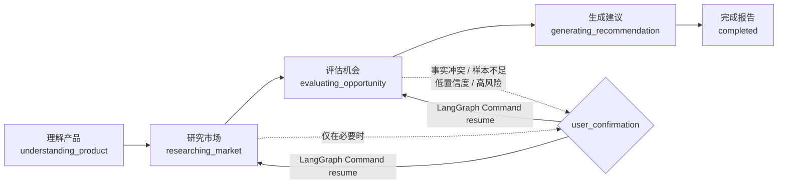
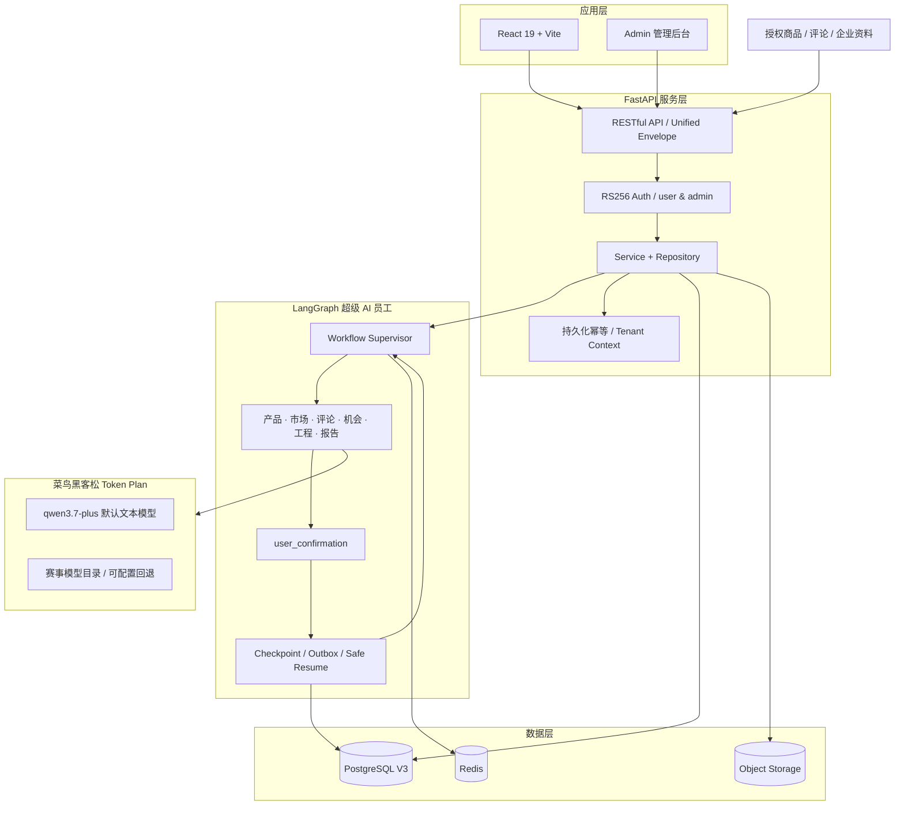

<div align="center">

# FurniScope

### 跨境家具超级 AI 员工

**把市场声音、竞品证据与工厂制造能力，变成可执行的产品决策。**

[](https://www.python.org/)
[](https://fastapi.tiangolo.com/)
[](https://langchain-ai.github.io/langgraph/)
[](https://www.postgresql.org/)
[](https://react.dev/)
[](https://www.aliyun.com/product/bailian)

[产品概览](#-为什么是-furniscope) · [核心能力](#-核心能力) · [系统架构](#-系统架构) · [快速开始](#-快速开始) · [项目进度](#-当前实现状态) · [设计文档](#-设计与开发文档)

</div>


> FurniScope 不是一个只会生成市场摘要的聊天机器人。它是一名由 `user` 直接驾驭的跨境家具超级 AI 员工：理解产品与工厂能力，自主研究市场、筛选竞品、挖掘评论、判断机会，并给出带证据、置信度和制造适配结论的决策报告。

## ✨ 为什么是 FurniScope

传统跨境家具企业通常已经拥有图片、规格、报价、样品和客户反馈，却缺少把这些碎片持续转化为产品决策的数据团队。通用 AI 能总结文字，但很难回答制造企业真正关心的问题：

- 这个市场机会是否真实，证据来自哪里？
- 评论里的痛点是偶发现象，还是稳定需求？
- 市场想要的尺寸、材料和结构，我们能不能做？
- 即使能做，成本、包装、认证和利润是否匹配？
- 哪些结论可以行动，哪些仍需打样或补充数据？

FurniScope 将市场、产品、数据和工程分析封装成一个自主工作流。一个用户即可完成从资料输入到决策报告的闭环；仅在事实冲突、样本不足、低置信度或高风险建议时，AI 才请求用户确认。

## 🚀 核心能力

| 能力 | FurniScope 做什么 | 产出 |
|---|---|---|
| 产品与企业理解 | 解析家具图片、规格、尺寸、材料、结构、成本及包装约束 | 版本化产品画像与企业能力边界 |
| 可比竞品发现 | 按品类、价格带、尺寸、材质、场景计算可比性 | 可解释竞品集合与匹配证据 |
| 评论深度挖掘 | 提取舒适度、耐用性、安装、气味、尺寸、包装等需求与痛点 | 需求簇、情绪、原文 Evidence Span |
| 市场机会判断 | 融合需求热度、竞争缺口、利润、趋势、证据质量与制造适配 | 六维机会评分、置信度和推荐级别 |
| 工程化产品建议 | 将市场机会映射到材料、尺寸、结构、包装和认证动作 | 可执行建议、风险与待验证事项 |
| 可信决策报告 | 审计结论、反证、数据范围、模型和 Prompt 版本 | 在线综合报告与完整证据索引 |

### 五阶段用户体验



## 🧠 一个 AI 员工，多个内部专业能力

用户不会选择 Agent，也不会把任务分配给“市场岗”或“产品岗”。LangGraph 在系统内部编排产品理解、数据质量、竞品发现、评论分析、机会评分、工程建议、证据审计和报告生成能力，并提供：

- 细粒度节点幂等，成功结果可复用，避免重复调用和重复计费；
- 并行 Map/Reduce，缩短竞品和评论批处理耗时；
- 自动重试、降级与部分失败，不用把运维复杂度暴露给用户；
- `user_confirmation` 统一人工中断；
- LangGraph Checkpoint + Outbox 安全恢复；
- 模型、Prompt、Token、耗时、Schema 和证据全链路追溯。

## 🏗 系统架构



## 🧩 技术栈

- **Frontend:** React 19, Vite 6, Phosphor Icons
- **Backend:** Python 3.12, FastAPI, Pydantic, SQLAlchemy Async
- **Agent:** LangGraph, PostgreSQL Checkpointer, `Command(resume=...)`
- **Database:** PostgreSQL, asyncpg, psycopg
- **AI:** 菜鸟黑客松 Token Plan OpenAI 兼容网关，默认 `qwen3.7-plus`
- **Security:** RS256 JWT、Refresh Token 轮换、租户隔离、日志脱敏、持久化幂等
- **Testing:** Pytest, Pytest Asyncio, Node Test Runner

## 🗂 项目目录

```text
frontend/         现役 React + Vite 前端
backend/          FastAPI、Agent 与销量预测引擎
tests/            Python 自动化测试
migrations/       PostgreSQL 增量迁移
forecast_assets/  预测模型、训练数据与清单
Docs/             当前产品、技术和参赛文档
assets/           README 等项目级静态资源
archive/          历史 UI 与旧原型，不参与当前运行
```

## ⚡ 快速开始

### 1. 克隆项目

```bash
git clone https://github.com/qzh666qbb/Furniscope.git
cd Furniscope
```

### 2. 初始化 Python 环境

```bash
python3.12 -m venv .venv
source .venv/bin/activate
pip install -r requirements.txt
cp .env.example .env
```

编辑 `.env`，至少配置本地 PostgreSQL 连接。密钥只能放在本地环境变量或密钥管理服务中，不得提交。

如需在合成演示链路中启用赛事模型生成报告，另设置：

```dotenv
ALIYUN_MODEL_ROUTER_API_KEY=赛事分配的专属密钥
ANALYSIS_WORKER_MODE=token_plan_demo
```

此模式会真实调用赛事 Token Plan，并将模型、Token、耗时、重试和 Schema
校验结果写入审计表；市场输入仍标记为 `synthetic_demo`。真实授权数据分析需使用
`ANALYSIS_WORKER_MODE=external` 并部署真实数据 Worker。

产品资料解析通过 `PRODUCT_PARSE_MODE=demo|model` 独立切换。`model` 模式会执行文件签名校验、
PDF 文本/OCR、XLSX 或图片 OCR，再调用模型输出严格 Schema 并自动建立待确认画像；没有可识别
文字且未配置视觉理解能力的图片会失败为 `IMAGE_VISION_REQUIRED`，不会伪造视觉属性。

### 3. 初始化 PostgreSQL V3

```bash
createdb furniscope
psql -d furniscope -v ON_ERROR_STOP=1 -f furniscope_postgresql_v3.sql
```

将 `.env` 中的连接串调整为你的本地账号：

```dotenv
DATABASE_URL=postgresql+asyncpg://postgres@127.0.0.1:5432/furniscope
LANGGRAPH_DATABASE_URL=postgresql://postgres@127.0.0.1:5432/furniscope
```

如需补全本地产品中心、分析中心、市场洞察、决策报告与销量预测的操作体验，先导入
HF 企业目录，再运行幂等的混合体验数据脚本：

```bash
PYTHONPATH=.:backend python scripts/seed_hf_catalog.py
PYTHONPATH=.:backend python scripts/seed_platform_experience.py --tasks 3
```

其中产品目录、历史销量、库存、预测模型，以及 Amazon 美国站沙发市场商品和评论，均为
HeFeng 企业授权数据包。重复执行不会重复创建数据。运行前建议先备份当前数据库。

数据库不会创建默认密码或硬编码密钥。完整初始化和迁移说明见 [`Docs/项目设计文档`](Docs/项目设计文档)。

### 4. 启动 FastAPI

```bash
PYTHONPATH=backend uvicorn furniscope_api.app:app --host 127.0.0.1 --port 8000 --reload
```

打开：

- OpenAPI：<http://127.0.0.1:8000/docs>
- Liveness：<http://127.0.0.1:8000/health/live>
- Readiness：<http://127.0.0.1:8000/health/ready>

### 5. 启动 React 前端

```bash
cd frontend
npm install
npm run dev
```

前端固定地址：<http://127.0.0.1:8083>

### 6. 运行测试

```bash
source .venv/bin/activate
PYTHONPATH=.:backend pytest -q
```

数据库集成测试必须连接真实 PostgreSQL，项目不以 skipped 测试作为“已完成”证明。

如需运行完整数据库集成测试，请提供隔离的测试库连接：

```bash
FURNISCOPE_TEST_DATABASE_URL=postgresql://postgres@127.0.0.1:5432/furniscope_test \
  PYTHONPATH=.:backend pytest -q
```

### 7. Docker Compose 启动

```bash
cp .env.example .env
# 修改 .env 中的 POSTGRES_PASSWORD；赛事密钥只通过环境变量注入
docker compose up --build
```

打开 <http://localhost:8083>。首次建库会执行 V3 基线 DDL（其中已包含预测域）；
`migrations/` 中其余脚本用于已有旧库升级，不能对新库重复执行。开发容器会在内存中
在 `var/runtime/dev-jwt.json` 持久化开发用 JWT 密钥，重启后已登录会话仍可刷新；生产环境必须显式注入固定的私钥和公钥集。
Compose 会同时启动 Redis Streams Worker；分析、预测、数据导入和产品解析任务不再占用
FastAPI 请求进程。Worker 使用消费组租约、并发上限、最多三次重试、死信流以及每 30 秒
数据库补投，进程重启后可继续领取未完成任务。单任务默认 900 秒超时，可通过
`WORKER_JOB_TIMEOUT_SECONDS` 调整；格式损坏的队列消息会脱敏隔离到死信流，不会反复阻塞消费组。

可选运维组件：

```bash
GRAFANA_ADMIN_PASSWORD='使用独立高熵密码' docker compose --profile monitoring up -d
docker compose --profile operations up -d backup
```

监控包括 Prometheus、Alertmanager、Grafana 和数据库/Redis/主机/容器 exporter；每日备份默认保留 14 天。
详见[`生产部署指南`](Docs/开发文档/FurniScope_生产部署指南.md)和
[`运维手册`](Docs/开发文档/FurniScope_运维手册.md)。

非容器开发环境可显式启用同一队列：

```bash
# Web 进程
JOB_QUEUE_MODE=redis REDIS_URL=redis://127.0.0.1:6379/0 \
  PYTHONPATH=backend uvicorn furniscope_api.app:app --port 8000

# 独立 Worker 进程
JOB_QUEUE_MODE=redis REDIS_URL=redis://127.0.0.1:6379/0 \
  PYTHONPATH=.:backend python -m furniscope_api.worker
```

本轮 `update.md` 的逐项实施与遗留风险见
[`FurniScope_update实施状态.md`](Docs/开发文档/FurniScope_update实施状态.md)。

## ✅ 当前实现状态

| 模块 | 状态 | 说明 |
|---|---:|---|
| PostgreSQL V3 DDL 与迁移 | ✅ | 主外键、CHECK、索引、JSONB 约束与校验 SQL |
| LangGraph 核心工作流 | ✅ | 正常链路、部分失败、降级、中断、Outbox 与恢复 |
| FastAPI 基础设施 | ✅ | Envelope、错误码、请求 ID、日志脱敏与健康检查 |
| 认证与通用幂等 | ✅ | RS256、Refresh 轮换/重放检测、持久化幂等 |
| 产品与市场数据集 API | ✅ | 租户隔离、解析任务、数据集状态与版本控制 |
| 分析任务与 Agent API | ✅ | 创建、启动、五阶段状态和结果聚合 |
| 赛事 Token Plan 接入 | ✅ | 专属网关、`qwen3.7-plus`、结构化输出、调用审计与演示 Worker 已接通 |
| React 完整 UI 设计 | ✅ | 6 个用户页面 + 1 个 Admin 页面视觉与交互方案 |
| XGBoost 销量预测 | ✅ | 内置 Sales Forecast V4 引擎、模型权重与训练数据，任务、结果、生产建议与 UI 已接入 |
| `user_confirmation` HTTP API | ✅ | 查询、回答、租户校验、Outbox 和安全恢复已接通 |
| 洞察、报告详情联调 | ✅ | 报告、证据、竞品、观点、需求、机会和建议均接真实 API |
| 独立 Worker 与恢复 | ✅ | Redis Streams、租约、重试、死信、补投和管理员安全控制 |
| 全目录回测 | ⚠️ | 1204 SKU 完成覆盖审计；401 个有标签 SKU 完成精度回测，803 个无标签 SKU 明确不可评分 |
| 监控与备份 | ✅ | Prometheus/Grafana/告警配置、每日备份及真实恢复演练 |

最近一次真实 PostgreSQL/Redis 全量验证记录：**52 passed，0 skipped**；无 Mock 浏览器金路径已贯通。回测报告见
[`FurniScope_V4_Backtest_Report.html`](forecast_assets/backtest/full_catalog_v4/FurniScope_V4_Backtest_Report.html)。

> HeFeng 市场商品与评论按企业授权数据包使用，分析结论绑定该授权范围。

## 🔐 可信 AI 与安全边界

1. 数值、比例、价格和机会评分由确定性程序计算，不允许生成模型编造。
2. 报告结论关联原始 Evidence Span、反证、数据范围和置信度。
3. 所有业务查询由服务端注入 `tenant_id`，客户端不能提交或覆盖租户范围。
4. API Key、密码、Token、私钥和评论全文不得进入日志或代码常量。
5. Checkpoint 只负责工作流恢复，不能覆盖已提交业务事实。
6. FurniScope 提供决策支持，不替代用户作出开模、认证、备料或备货决定。

## 📚 设计与开发文档

项目不是“先写 Demo、后补文档”，而是由可追踪的业务契约驱动实现：

| 文档 | 作用 |
|---|---|
| [PRD / SRS V2](Docs/项目设计文档/01_产品需求规格说明书SRS_PRD_V2.md) | 产品范围、用户角色、核心闭环与验收标准 |
| [数据字典 V3](Docs/项目设计文档/02_FurniScope产品数据字典V3.md) | 实体、字段、类型、枚举和约束 |
| [PostgreSQL V3](Docs/项目设计文档/03_FurniScope_PostgreSQL数据库设计V3.md) | 表结构、主外键、CHECK 与索引 |
| [Agent 工作流 V2](Docs/项目设计文档/04_FurniScope_Agent工作流设计V2.md) | State、节点、重试、中断和恢复语义 |
| [RESTful API V3](Docs/项目设计文档/05_FurniScope_RESTful_API接口设计V3.md) | HTTP 契约、权限和业务错误码 |
| [系统 Mermaid 图 V3](Docs/项目设计文档/06_FurniScope_Mermaid图V3.md) | 业务、架构、ER、页面与节点映射 |
| [页面原型 V3](Docs/项目设计文档/07_FurniScope页面交互原型说明V3.md) | 6+1 页面交互与 API 绑定 |
| [测试用例 V2](Docs/项目设计文档/09_FurniScope测试用例V2.md) | P0 验收、异常分支与数据库断言 |

完整索引见 [`Docs/项目设计文档/00_项目设计文档索引.md`](Docs/项目设计文档/00_项目设计文档索引.md)。

## 🗺 Roadmap

- [x] 数据库 V3 与 LangGraph Agent 核心引擎
- [x] FastAPI 基础设施、认证、幂等、产品、数据集与任务接口
- [x] React 19 完整 UI 原型
- [x] 接入 `user_confirmation` 查询、回答与恢复 API
- [x] 完成洞察下钻、报告详情及 Dashboard API
- [x] 前后端真实 API 联调与无 Mock 端到端演示
- [x] 接入赛事 Token Plan，完成网关连通性与结构化输出契约验证
- [x] 完成 1204 SKU 目录覆盖审计、8 周回测与两类基线比较
- [ ] 补齐在售状态/品类主数据并从原始订单因果重建，完成正式多折评测

## 🤝 参与项目

欢迎通过 Issue 提交家具业务场景、数据质量问题、模型评测建议或工程改进。提交代码前请确保：

- 没有引入新的用户角色或跨部门审批语义；
- 没有提交密钥、企业原始敏感数据或未授权平台数据；
- 新增字段、状态和 API 已与当前有效设计文档对齐；
- PostgreSQL 集成测试真实执行且无 skipped。

---

<div align="center">

**FurniScope — From market signals to manufacturable decisions.**

Built for the AI Cross-border Hackathon · Track 3: AI Market Intelligence

</div>
